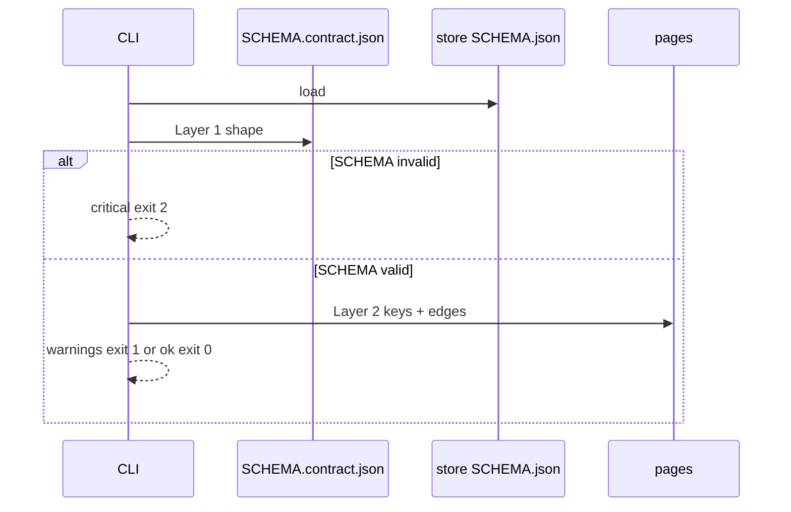

## Intent

Make `atlas compile` a two-layer graph gate: (1) the store SCHEMA is a valid instance of the skill contract, (2) pages obey frontmatter and link rules that SCHEMA actually defines. Add `atlas init` so every new store is born with that SCHEMA. Add type listing so “all protostars” is a command, not a grep accident.

Atlas orders the graph. It does not police essay structure.

## Change-class

`new-surface`

## Contradictions found and how this plan fixes them

1. **Pin C (every type gets a contract) vs annex (no body policing).**  
   C stays for *frontmatter + links*. `templates.by_type.sections.required` is **not** a compile rule. Sections stay recommended for authors only.

2. **Two-layer thesis “required sections” vs pin N.**  
   Layer 2 drops required headings. Layer 2 = required keys + required edges + traffic rules (`forming` ⇒ `protostar`).

3. **“Add a schema path” lean vs pin F (`atlas init` only).**  
   This work does **not** add path `schema`. Birth is the CLI. `leaves/p-schema-path.md` stays parked, not in scope.

4. **Open/Closed vs “hardcode protostar in validate.py”.**  
   Engine reads `templates.by_type` and a small `compile.page_contract` object in SCHEMA. New types are SCHEMA data. Do not add a Python `if type == protostar` forest.

5. **SCHEMA.contract lists `orphans`; live SCHEMA and validate.py do not.**  
   This work does **not** implement orphans. Align the contract file’s `core_checks` with what compile actually runs. Orphans stay out.

6. **Search-by-type (U) vs existing BM25 work.**  
   Grep-mode (and any later engine) filters on frontmatter `type`. Not BM25 ranking. Compile `--list-type` ships in the same work, first.

7. **Quality = think/dream vs compile “quality check”.**  
   Compile checks graph hygiene only. It does not judge whether a claim is true.

8. **Pin A vs today’s CLI.**  
   No change to meaning: warnings already `exit 1`, critical `exit 2`. New Layer-2 misses are warnings. Existing Phase 2 criticals stay critical.

## Scope (implement after approval)

- Layer 1: `validate_schema_shape` checks live SCHEMA against skill `references/SCHEMA.contract.json` (shape of SCHEMA, including `templates.by_type` entries well-formed). Recommended type with neither a `by_type` block nor an explicit `unconstrained` mark is a **warning**.
- Layer 2 generic walker: for each page whose `type` has a `by_type` block, require that block’s `frontmatter.required`. Do not require sections.
- `compile.page_contract` in live SCHEMA (and contract):  
  - `when_work_id`: require `relates_to` kind `implements` to `work/<work_id>.md` (or documented work-hub path). Warning.  
  - `when_type.protostar`: require `relates_to` kind `derived_from`. Warning.  
  - `forming_requires_type: protostar`. Warning.
- `atlas init --root <dir>`: create SCHEMA that passes Layer 1, copy skill templates (including protostar), write `index.md`. Refuse to overwrite a SCHEMA unless `--force`.
- `atlas compile --list-type <type>` (and JSON): print pages whose frontmatter type matches. Exit 0 if the listing ran.
- `atlas search` type filter: query token `type:<name>` matches frontmatter only, not body mentions.
- This store’s SCHEMA: add `by_type` for protostar, lesson, recipe with required FM only; add `page_contract`. Do not rewrite the 27 protostar bodies.
- Skill templates directory: add `protostar.md` (and lesson/recipe stubs if missing) so init has files to copy.
- Remember-path / SKILL one-liners: compile checks fields and links, not headings.
- Construct smokes listed below. Atlas version bump on implement.

## Non-goals

- Schema path module.
- Required markdown headings.
- Promoting warnings to critical in this work.
- Repairing the 27 pages (Stage 2 after this ships).
- BM25, landscape content, origin/sensitivity as required.
- Implementing `orphans`.
- Dream / think quality of claims.
- Other skills’ Atlas stores (no silent rewrite). They get the gate when they run compile / init.

## Genesis Artifacts

### Mermaid



### Interface sketch

```text
atlas init --root <dir> [--force]
atlas compile|validate --root <dir> [--json] [--list-type <type>]
atlas search "type:protostar …" --root <dir>
```

Exit codes unchanged: 0 clean, 1 warnings only, 2 critical.

`compile.page_contract` (store SCHEMA, also allowed by the contract file):

```json
"page_contract": {
  "when_work_id": { "require_kind": "implements" },
  "when_type": { "protostar": { "require_kind": "derived_from" } },
  "forming_requires_type": "protostar"
}
```

### Cost note

One extra JSON read of the skill contract per compile. Page walk already happens. Init is a copy. Type filter is frontmatter compare. Cheap.

### Acceptance

- Fixture store missing `by_type` for a recommended type → warning, not critical.
- Fixture SCHEMA that is not a valid contract instance → critical.
- Protostar without `derived_from` → warning; headings absent → no issue.
- Page with `work_id` and no `implements` → warning.
- `kva: forming` on `type: document` → warning.
- `atlas init` on empty dir → compile Layer 1 green on that dir.
- `atlas search "type:protostar"` does not rank a document that only mentions the word.
- `--list-type protostar` lists frontmatter matches only.
- This Atlas still compiles (warnings allowed) without renaming headings.

### Stop for approval

Do not implement until the operator approves this plan.

## Pinned decisions

- Two-stage: this work is Stage 1 only.
- A: new Layer-2 = warnings (`exit 1`).
- C: every recommended type has `by_type` **frontmatter** (and optional recommended sections).
- F: `atlas init` writes the first SCHEMA.
- Open/Closed: contract closed; store SCHEMA extends types; engine generic.
- N + annex: no heading compile rules.
- Q: forming ⇒ protostar warning.
- U: `--list-type` + search `type:` filter; list ships in this work.
- Schema path out of this work.
- Orphans out of this work; contract aligned to live checks.

## Challenge (design)

Counters used:

- Incremental lint adoption uses warn-then-error; do not fail the build on new rules on day one (ESLint warn severity / bulk suppressions). Accepted: pin A already matches. No per-file suppression file in this work — existing `atlas-ignore` comments stay.
- Config validators treat a **meta-schema** as the closed shape and instance files as extensions (JSON Schema / App Config). Accepted: SCHEMA.contract is meta; store SCHEMA is instance.
- Declared labels rot; infer from edges. Accepted: Layer 2 prefers missing links over heading stamps.

Rejected: “do not add type filter to search, compile list is enough.” Operator pinned U.

## Challenge-success

- C1: warn-then-error and meta-schema counters are non-trivial.
- C2: high-severity “red store on day one” accepted as A; “headings in Layer 2” rejected via annex.
- C3: pins listed.
- C4: Stage 2 repair and schema path out of scope.
- C5: no product implement in this path.
- change-class stated; mini-genesis present.

## Catalogue Review

- Genesis matches: gate + Enter/Exit discipline (uses). Not a multi-agent fan-out.
- Autogenesis extension: B17 activation card (this Run).
- Composition: LOCAL SIBLING (atlas CLI + SCHEMA files in the atlas package).
- Inherited anti-pattern: soft-only evaluation — avoided via file/exit smokes.
- Delta: new CLI `init` and `--list-type`; compile Layer 1/2; search type token.
- Admission: in-scope new-surface.

`catalogue_review: in-scope`

## Behavioural contract (agent-spec)

`deferred: specify after this plan is approved; Gherkin not authored in this design pass. Families to specify: b-compile-layer1-contract, b-compile-layer2-edges, b-init-writes-schema, b-search-type-filter, b-list-type, b-forbidden-heading-requirement.`

@forbidden (intent): compile must not warn or fail on missing `## Pending` / `## Growth path`.  
@critical (intent): missing SCHEMA or SCHEMA that fails the contract is exit 2.

## Evaluation plan

Deterministic primary:

- exit codes 0/1/2 on fixture stores
- SCHEMA.contract validation of a mutated SCHEMA
- init creates SCHEMA.json + templates/
- search `type:protostar` fixture with a mention-only decoy
- `--list-type` JSON paths
- page with wrong headings but good links → no heading issue id

Agent evaluations: not required for these claims.

## Adversarial scenario draft

File: `atlas/references/scenarios/compile-type-contract-adversarial-v1.yaml` (create on implement if not present this design). Smokes named in that file:

- `heading-not-required` source: pin N / annex
- `forming-on-document-warns` source: pin Q
- `recommended-type-missing-by_type-warns` source: pin C + Layer 1
- `init-refuses-overwrite` source: pin F safety
- `search-ignores-body-mention` source: pin U / original inventory failure

## Provenance

Discussion fabric `autogenesis/discuss/compile-type-contract/`. Operator: proceed with design; capture inconsistencies and fix them.
