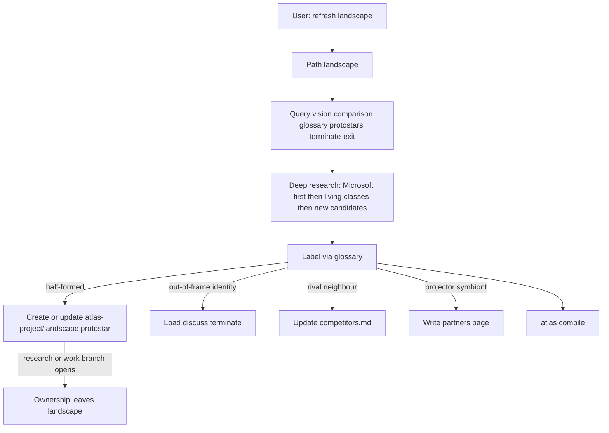

## Intent

Add Atlas path `landscape`: on demand, refresh the living competitor/neighbour catalogue and run a symbiosis pass (Microsoft first, not exclusive), writing back only to living pages and using glossary labels.

## Change-class

`new-surface`

## Scope (implement after approval)

- `atlas/references/paths/landscape.md` + SKILL registry + trigger phrases.
- Promote root `glossary.md` from protostar to alive document; labels become normative on write-back.
- `atlas-project/partners/` for symbiont/projector pages (one page per name, role in frontmatter).
- Rivals/neighbours stay on `atlas-project/competitors.md`.
- Query terminated branch + exit node before adding any row.
- Hand off to discuss `terminate` if the scan wants an out-of-frame product as identity.
- Dated scan note optional under `atlas-project/` when debris is useful.
- Deep research is the path’s job. The user does not supply a target list.
- Landscape owns forming landscape protostars until they promote, terminate, or a research/work branch takes them.

## Non-goals

- Cron / scheduled job.
- User-supplied target lists as a required input (optional extra names are allowed, not expected).
- Infinite crawl with no class structure (research is deep *per living class + Microsoft + new candidates*, then stop).
- Feature-matrix leaderboards as the output (positioning + job test, not checkbox rows).
- Re-implementing KVA inside landscape.
- Azure adapter implementation (Search/Cosmos/IQ).
- Auto-wiring Microsoft products.

## Pinned decisions (user-agreed defaults + challenge)

1. Path id `landscape`. Triggers: “refresh landscape”, “update competitors”, “who should we partner with”, “symbiosis”.
2. User does **not** name targets. Landscape performs structured deep research. Optional extra names are additive only.
3. Every run: query vision + comparison-correct + competitors + partners + glossary + landscape protostars + terminated exit; then research Microsoft first; then each living class; then new candidates the research surfaces.
4. Cite sources on living-page edits. Unverified names become protostars or explicit gaps — never invented living rows.
5. Partners folder for projector/symbiont. Competitors table for rival/neighbour. Out-of-frame stays off the identity table.
6. Glossary promoted in the same implement. Labels: rival | neighbour | projector | symbiont | out-of-frame. Realization annotates projector (Microsoft-class).
7. Landscape **writes** comparison memory (compile green).
8. Output is positioning against the mount-branch-PR-compile test, not a feature spreadsheet.
9. **Landscape protostars** live under `atlas-project/landscape/`. Landscape creates, updates, promotes, or KVA-terminates them. Ownership leaves only when a **research** or **work** branch starts on that name; the protostar then `follows` that work.
10. Promote: protostar → `competitors.md` or `partners/` when evidence + job test suffice. Kill: discuss `terminate`. Substrate for identity risk is terminate, not a second KVA inside landscape.

## Challenge counters and pins

| Counter | Source | Severity | Pin |
|---|---|---|---|
| AI CI invents facts; few programs have citation/HITL policy | Segment8 State of CI 2026 | High | Cite; gap if unverified; no silent row |
| Feature matrices go stale and miss the job | ORRJO / B2B CI mistakes | High | Job test + class label, not feature counts |
| Technology-first “shiny object” partners | RAND-style AI failure causes (via AI Primer) | Medium | Symbiosis must say what Atlas job they take and what they must not take |
| Leading the scan toward a preferred vendor | CI interview bias literature | Medium | Microsoft-first is a required subsection, not a conclusion that others lose |
| Waiting for the user to name vendors hides the market | User correction 2026-08-27 | High | Landscape researches; protostars hold what is not yet living |

C1–C5: counters above are non-trivial; high-severity pinned; pins visible; scope intact; **no implement in this path**.

## Genesis Artifacts

### Component



### Interface sketch

Activation:

```text
skill: atlas
path: landscape
path_module: references/paths/landscape.md
root: <atlas root>
intent: refresh catalogue and/or symbiosis
```

Write-back files:

- `glossary.md` — alive after implement
- `atlas-project/competitors.md`
- `atlas-project/partners/<kebab>.md` with role + glossary label
- `atlas-project/landscape/<kebab>.md` — forming protostars landscape owns
- `atlas-project/microsoft-as-realization.md` when Azure surfaces change
- optional dated scan page for debris

### Cost note

Structured deep research: one search cluster for Microsoft realization, one per living comparison class, plus follow-ups on new candidates. Stop when classes are covered and new names are either living, protostars, terminated, or explicit gaps. No “user will narrow the list” escape hatch.

### Acceptance

- Registry lists `landscape`.
- Glossary is alive and linked from root `index.md` without “forming”.
- A run can complete with no user target list.
- New uncertain names appear as landscape protostars, not silent living rows.
- Mem0-as-peer on `competitors.md` is refused and routes to terminate/out-of-frame.
- A protostar with an opened work/research hub is no longer mutated as if landscape still owned it.

### Composition

LOCAL SIBLING path under Atlas. EXTERNAL call only to discuss `terminate`. Glossary INLINE in the store.

## Catalogue Review

In scope (new path / Enter-Exit).

- Genesis: progressive disclosure path module; no new catalog skill.
- B17: Atlas activation card already on; landscape adds `path: landscape` to the allowed set.
- Composition: LOCAL SIBLING + optional EXTERNAL discuss terminate.
- Anti-patterns avoided: dual KVA; feature-matrix as SoR; partners rim-hub (index.md file list only).
- Admission: yes, new-surface on existing skill.

## Behavioural contract (agent-spec)

deferred: specify after plan approval, before or with implement. Protect in prose until then:

- `@forbidden` treat terminated memory-layer products as living peers on `competitors.md`
- `@forbidden` landscape invents a vendor capability without a cited source or explicit gap
- `@critical` every run queries vision + terminate exit before write-back
- `@critical` Microsoft subsection present on every run

## Evaluation plan

Deterministic (primary): path file exists; SKILL registry row; glossary `kva: alive` and not `growth: true`; partners folder has `index.md`; compile exit 0 after a fixture write-back; scenario `landscape-adversarial-v1.yaml` present.

Agent (secondary): trigger language dispatches to landscape not remember; Mem0 peer-row is refused.

## Adversarial draft

File to keep at implement: `atlas/references/scenarios/landscape-adversarial-v1.yaml` (draft emitted with this design).

Smokes: refuse Mem0-as-peer (source: terminated branch); require Microsoft subsection (source: pin 2); require citation or gap (source: Segment8 CI governance); no feature-count-only update (source: ORRJO).

## Stop for approval

This path **stops here**. Do not write `references/paths/landscape.md` or promote the glossary until the user explicitly approves this plan.
