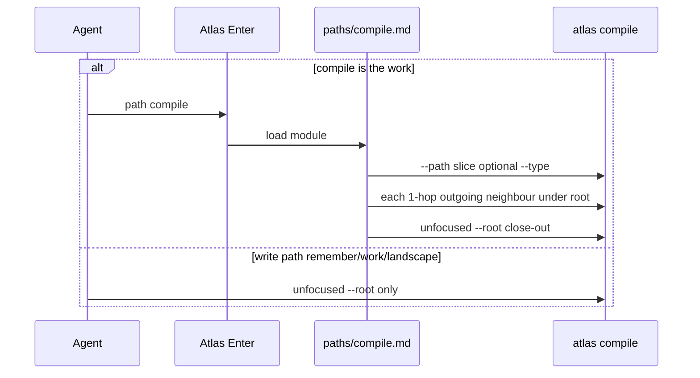

## Intent

Give agents a first-class Atlas **path** that says how to compile a project Atlas now that 0.7.6 lenses exist. Compile stays a gate. The path owns focused-vs-close-out and the 1-hop related-files procedure.

## Rebase (Atlas 0.7.8)

Other sessions shipped after the first draft of this plan:

- **0.7.7** `2026-08-27-atlas-query-harness-hubs` — query-path harness, glossary rewrite, spines. Explicit: compile = gate, search = ranked discovery; no inventory flags on compile.
- **0.7.8** `2026-08-27-atlas-search-nav-signals` — search traffic filters (`type:` `kva:` `status:` `work_id:` `path:`), `--include-exits`. Query path documents **layers**: card `path: query` vs CLI `atlas search`. Other paths may call search as a tool. Do not merge those names. Do not add a path named `search`.

Still true on disk: remember / landscape compile unfocused; compile CLI still only `--root` `--json` `--type` `--path`. No `paths/compile.md` yet.

Adjustments from that surface:

- Implement version target is **0.7.9** (not “next after 0.7.7”).
- `paths/compile.md` uses the same **Layers** table as `paths/query.md`: protocol path vs CLI tool.
- Keep **B1** `path_id: compile` (operator pin). Query refused a path named `search` because retrieval’s protocol name is already `query`. Compile’s protocol *is* the gate, so sharing the verb is the tight map, not a merge of discovery and gate.
- Do not treat search token `path:` as compile flag `--path`. Different layers.
- Query non-goals today say compiling belongs to remember/work. On implement, add compile to that list.
- Hard rule 1 stays query-specific. New hard-rule sentence for compile layers, parallel to query, without rewriting the 0.7.8 lookup rule.

## Change-class

`new-surface`

## Pinned decisions

From discuss fabric `compile-project-skill/` plus D1:

1. **B** — Atlas path, not a catalog skill, not recipe-only.
2. **B1** — `path_id: compile`. Module `references/paths/compile.md`.
3. **E2** — Activation card is `path: compile` only when compile is the work (focused repair, contract repair, session close-out). Other paths call the CLI as a tool.
4. **L1** — Write paths (remember / work / landscape / discuss persist) run only unfocused `atlas compile --root <atlas>`. They must not pass `--path` or `--type`.
5. **R3 + 1-hop, outgoing** — On `path: compile`, after the slice compile, compile each unique in-root `relates_to[].path` on pages in that slice. No second hop. No incoming scan.
6. **Close-out** — `path: compile` session close is always unfocused. A green focused or 1-hop set is not close-out.
7. Neighbour paths use the same 0.7.6 rule: resolve under `--root` or skip (do not walk outside). Missing neighbour is skip + note, not a new flag.
8. No new CLI flags. No globs. No repeatable `--path`/`--type`. No `--kva` / `--work-id` on compile. Search already filters `kva:` / `work_id:` / `path:` — those stay on **search**, not compile (0.7.7 pin: no compile-flag inventory).
9. Layers (0.7.8 rhyme): `path: compile` = B17 protocol; `atlas compile` = CLI tool. Do not add `atlas compile-path`. Do not add path `search`.
10. Search `path:` token ≠ compile `--path`.

## Scope (implement after approval)

- New file `atlas/references/paths/compile.md` — When / Layers / Enter (B17 card like query) / Procedure / Exit receipt / Non-goals.
- Atlas `SKILL.md`: registry row **compile**; card `path:` list adds `compile`; hard-rule one-liner for compile layers; do not weaken 0.7.8 rule 1 (formal lookup = path query + `atlas search`).
- `references/paths/query.md` non-goals: compiling the store → remember / work / **compile**.
- Remember / work / landscape: keep unfocused compile only (already true on 0.7.8 remember).
- `apm.yml` + `SKILL.md` version **0.7.9** on implement.
- Construct scenario file on implement: `references/scenarios/compile-path-discipline-adversarial-v1.yaml`.
- This store’s Atlas skill only. No silent rewrite of sibling stores. No edits to search.py.

## Non-goals

- Catalog skill `compile`.
- Changing 0.7.6 lens behaviour (store checks always global; page walk filtered).
- `atlas list` verb, `--kva`, `--work-id`, globs, repeatable flags (search already has field tokens in 0.7.8).
- Rewriting 0.7.8 query/search split or search hit-card schema.
- Incoming-edge scan.
- Auto-walking more than one `relates_to` hop.
- Implementing from this path.

## Challenge

Internal think-challenge. Grounded counters:

| Counter | Source | Severity | Pin |
|---------|--------|----------|-----|
| Agent-fed `--path` or a `relates_to` target escapes `--root` (`../`, absolute). CLI tools have shipped this. | OWASP Path Traversal; CWE-22; Orbis serve.mjs 2026 (argv root without boundary); CVE-2024-56198 path-sanitizer | high | Accept: reuse 0.7.6 resolve-under-root. Neighbour outside root or missing → skip, do not compile. |
| Incremental / partial compile is treated as the release gate. Partial VC++ builds miss deps; rustc incremental was not production-ready without a full check. | Stack Overflow 847092; Rust blog incremental 2016 | high | Accept: unfocused close-out required. Focused green ≠ session-close. |
| 1-hop outgoing misses pages that point *at* the slice. | This discuss R3 tension | medium | Accept v1. Incoming scan is a protostar. |
| Remember keeps calling focused compile out of habit (this discussion did). | This fabric + remember current prose | medium | Accept: L1. Remember text stays unfocused-only. Registry says lenses are `path: compile` only. |
| Naming a path after the CLI verb fights 0.7.8 “do not add a path named search.” | `paths/query.md` Layers | medium | Reject rename. Compile’s protocol is the gate; retrieval’s protocol is already named query. Document Layers so the names stay unmerged. |

## Genesis Artifacts

### Mermaid



### Interface sketch

```text
skill: atlas
skill_path: <atlas skill root>
mode: run
subject: atlas | <project>
path: compile
path_module: references/paths/compile.md
intent: <one line>
root: <atlas store root>

# focused (path compile only)
python3 scripts/atlas.py compile --root <atlas> --path <prefix-or-file> [--type <name>]
# then one compile per in-root outgoing relates_to target

# close-out (path compile, and every write path)
python3 scripts/atlas.py compile --root <atlas>
```

### Cost note

Same CLI as today. Extra process: parse frontmatter `relates_to` on the slice (already in memory if the agent wrote the pages) and N extra compiles for N unique neighbours. This Atlas ~0.3s unfocused. No new model calls required. Cap on N is a protostar, not v1.

### Acceptance

- Product version on implement is 0.7.9. Registry lists `compile`. Card `path: compile` is legal.
- `paths/compile.md` has a Layers table (protocol vs CLI) matching query.md shape.
- `paths/compile.md` states E2, L1, R3 1-hop outgoing, unfocused close-out.
- Remember / work / landscape still document unfocused compile only.
- No `--list-type`. No new compile flags.
- Neighbour `../` or absolute → skip, no walk outside `--root`.
- Construct smokes below exist on implement.
- Unfocused compile of this store still exit 0 after the doc change.

### Stop for approval

Do not implement until the operator approves this plan.

## Catalogue Review

`catalogue_review: in-scope` (new path / Enter discipline).

- genesis matches: none named (no new panel / fan-out). Sequence is a single agent thread.
- Autogenesis extension: **B17** already on Atlas (tightened by 0.7.8 query Enter). Registry grows the legal `path:` value. No new card schema keys. Query card shape is the template for compile Enter.
- composition: **INLINE** path module in the atlas package (peer of query/remember/work/landscape).
- inherited anti-pattern: hanging inventory on compile (0.7.5 `--list-type`). This path does not add list flags.
- admission: path only; no catalog skill.

## Behavioural contract (agent-spec)

`deferred: specify on implement after approval. Pins are path load, flag permission, 1-hop procedure, and exit codes already owned by 0.7.6 compile. Gherkin would restate those. Forbidden: write-path focused compile; green-lens-as-close; neighbour path escape.`

## Evaluation plan

Deterministic (primary):

- `SKILL.md` registry contains compile row and `paths/compile.md` exists.
- Remember path text has no `--path` / `--type` on its compile command.
- Help / CLI still has `--type` and `--path`, not `--list-type` (unchanged 0.7.6).
- Fixture: neighbour path `../` is not walked (skip).
- Fixture: unfocused compile remains the documented close-out command.

Agent evaluations: optional (did the agent load `paths/compile.md` when compile was the work). Not sole evidence.

## Adversarial scenario draft

File on implement: `atlas/references/scenarios/compile-path-discipline-adversarial-v1.yaml`

- smoke `write-path-no-lens` — source: L1 / this discuss
- smoke `close-out-unfocused` — source: Rust incremental + SO 847092
- smoke `neighbour-escape-skip` — source: OWASP / CWE-22 / Orbis serve.mjs
- smoke `one-hop-only` — source: R3 1-hop pin
- smoke `no-new-list-flag` — source: 0.7.5 defect / p-list-swallows-gate

## C1–C5

- C1: path-escape and partial-as-release counters are non-trivial.
- C2: both high-severity counters pinned into scope.
- C3: pins listed above.
- C4: no catalog skill; no new CLI flags; 0.7.6 lenses unchanged.
- C5: no implementation in this path.
