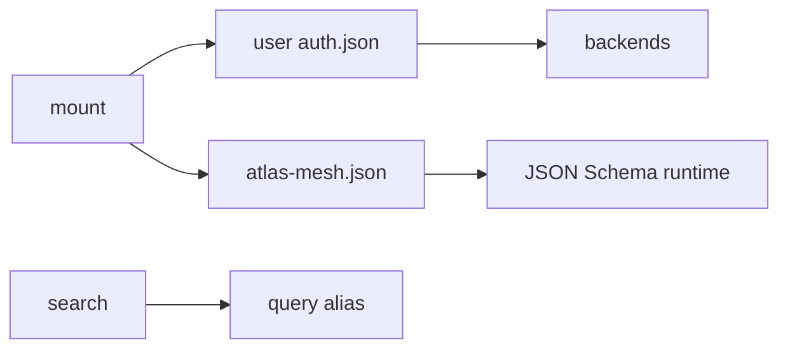

## Intent + scope

Make the shipped CLI match the **already pinned** discuss decisions. Do not add nested-group URIs, APM hooks, or `atlas sync`.

**Must close**

1. User-level `auth.json` (JSON + schema): host, optional org, backend (`gh`|`token`|`ssh`), no token values. Commands: `login` (probe + record host/backend), `list`, `logout`.
2. Runtime validate `atlas-mesh.json` against the checked-in schema (hand checks may remain as belt).
3. `atlas query` as an alias of `search`, so the six-verb list is true, or document a pin change — default: **alias**.
4. Smoke `atlas mount` on a **public** git repo in this environment; record pass/fail. Private remote stays “needs credentials,” not “done.”
5. Reopen false-exited tasks; only exit after the code and a smoke exist.

Already done (do not redo): normaliser/peel, nested mount path, submodule-if-parent, lifecycle refuse, mesh file location/writer, inferred subpath, Bearer on clone, compile warn.

## Non-goals

New identity rules. Cute aliases. `--target-skill`. Query engine rewrite.

## Genesis Artifacts

Hardening: intent, scope, acceptance, pins. Diagram optional.

## Acceptance

- `atlas auth login --host github.com` records a row without writing a PAT into any project file.
- `atlas auth list` / `logout --host` work.
- Invalid `atlas-mesh.json` fails mount/compile with a schema error.
- `atlas query --help` works as search.
- A public-repo mount smoke is recorded as an experience (pass or fail, not assumed).
- Task cards for this work_id are enter→exited only after the above.

## Pinned decisions (unchanged)

`decision-atlas-auth`, `decision-mount-auth-flow`, `decision-mesh-json-schema`, `decision-agent-verbs`, `decision-pointer-vs-auth`.

## Counters

- Marking leftovers as “docs only” — rejected; that is how the overclaim happened.
- Storing PATs in `atlas-mesh.json` — rejected; already forbidden.
- Skipping public mount smoke — rejected; “mount works” without a run is another lie.

## Catalogue Review

genesis: none. B17: this design/implement session uses Autogenesis cards; CLI verbs stay commands. composition: INLINE Atlas. anti-pattern: false-complete stamps. delta: auth persist + schema runtime + query alias + smoke.

## Behavioural contract (agent-spec)

deferred: specify after approval.

## Evaluation plan

Deterministic: auth.json exists after login probe; logout removes host; mesh with `token` field fails; `query` is a registered command. Smoke: public clone via `atlas mount`.

## C1–C5

C1 counters above. C2 high-severity: false-complete rejected. C3 pins listed. C4 no new product. C5 no further CLI in **this** path until approval.

## Stop

Stops for approval. Implement only after you accept this gap-close plan.
---
