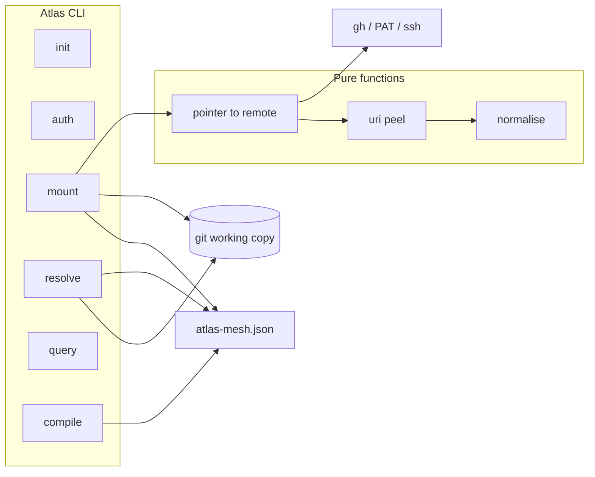
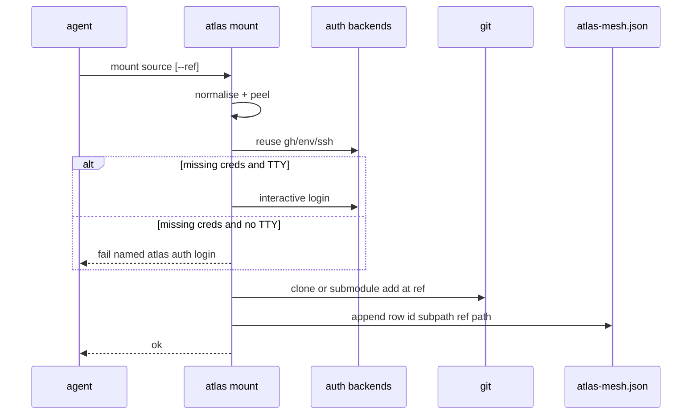

## Intent + scope

Turn the discuss constellation into Atlas product behaviour: a library of git-backed notebooks with a machine-written project catalogue.

**In:** scheme-free id; normaliser; `atlas://` two-segment peel; `auth`; `mount` (nested path, submodule-if-parent, lifecycle refuse, `--ref`, in-command auth); `atlas-mesh.json` + schema at project root; `resolve` root-or-file; mesh `subpath`; compile warn / resolve fail on unknown id; two package shapes; six verbs; git for history; capability matrix.

**Out:** query engine; `install`/`checkout`/`sync`/`--target-skill`; cute aliases; APM hooks; nested-group URI width; repo migration; auto-mount; `reset --hard`; manual mesh-edit as API.

## Non-goals

Same as out. Discussion work `2026-08-26-atlas-modular-graph-protocol` is lineage only.

## Genesis Artifacts

### Component diagram

### Sequence — first mount

### Interface sketch

`init` `auth` `mount [--ref] [--target]` `resolve` `query` `compile`  
Git in `resolve <id>` for fetch/commit/push.  
Config: `atlas-mesh.json` + JSON Schema. Auth state not in that file.

### Composition decision

INLINE in the Atlas skill (CLI + core functions). No new sibling skill. EXTERNAL: `gh`, `git` only.

### Cost note / projection

One implement slice per feature. No extra model routing. Token cost is discussion already spent; implement is code.

### Acceptance

Matches consolidate snapshot plus `decision-mesh-json-schema`, `decision-mesh-ref`, `decision-mount-auth-flow`.

## Pinned decisions

Discuss `decision-*` under `autogenesis/discuss/git-mesh/` including mesh JSON, `--ref`, mount auth flow. Implement does not reopen them.

## Counters

- One giant PR hides lifecycle refuse — rejected; sequence features.
- Mesh as YAML — rejected; JSON + schema.
- Fail-only auth on mount — rejected; option 3 with TTY split.
- Hunting regex for id — rejected; URI parse + two segments.

## Catalogue Review

- genesis matches: none (CLI/data path, not an agent primitive topology).
- Autogenesis extension: B17 cards on Atlas verbs at implement; no discuss-style graph in the CLI.
- composition: INLINE Atlas skill; EXTERNAL git + gh.
- inherited anti-patterns: do not embed tokens in pages or mesh JSON; do not add atlas sync.
- delta: new commands + `atlas-mesh.json` only.
- admission: in scope because it changes Atlas runtime surface.

## Behavioural contract (agent-spec)

deferred: agent-spec `specify` after plan approval. Autogenesis will not write `.feature` files.

## Evaluation plan

Deterministic (primary), mapped to adversarial smokes in `references/scenarios/storage-mesh-mvp-adversarial-v1.yaml`:

- no nickname id
- no `atlas sync` verb
- invalid `atlas-mesh.json` fails
- schema forbids tokens
- dirty mount refuses
- resolve unmounted id fails

Agent evaluations secondary.

## Challenge-success (C1–C5)

- C1: counters above are non-trivial.
- C2: YAML, hunting regex, atlas sync rejected with rationale.
- C3: pins listed and linked.
- C4: scope unchanged; new pins are inside “mesh file / mount / auth.”
- C5: no Atlas CLI implemented in this path.
- change-class: new-surface. Mini-genesis plus component and sequence diagrams added after the mesh-file discuss.

## As-built

See `autogenesis/discuss/git-mesh/implementation-as-built.md`. Extra verb `atlas id`. Auth does not persist aliases. Mount does not yet write `subpath`. `query` in the diagram is the skill path; CLI is `search`.

## Stop

Plan was approved and implemented. Residual gaps are listed on the as-built page, not silent.
---
