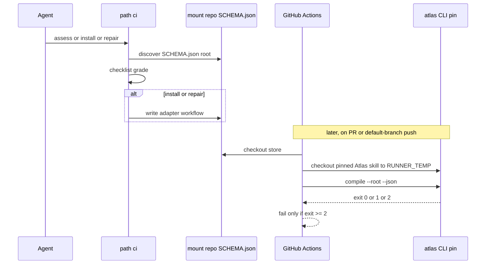

# Design — Atlas path `ci` (v1.1)

## Intent + scope

Give Atlas a first-class **activation path** that owns **institutional CI/CD for Atlas mounts**: any git repository whose tree contains a `SCHEMA.json` OKF root.

The path carries the whole standard:

1. **Canonical model** — platform-agnostic merge-gate contract.
2. **Default adapters** — GitHub Actions copy-into-mount workflow and a `workflow_call` reusable.
3. **Conformance checklist** — grade a new, partial, or incorrect setup.

Implement lives on the **Atlas skill package** (path module + templates). Runtime YAML lands on the **target mount repo**.

`path: compile` (work `2026-08-27-compile-project-skill`, settled B1) stays the **agent-session** compile protocol. This work does not replace it.

## Change-class

`new-surface`

## Pinned decisions

1. **`path_id: ci`.** Module `references/paths/ci.md`. Not `compile`. Not a catalog skill. Not recipe-only.
2. **Target = mount store, not this skill package.** Any repo with `SCHEMA.json`. Dedicated: git root = OKF root. Embedded: declared `--root` / card `root`. Atlas Python tests, skill release, PyPI, tag-based CD are out of scope.
3. **Canonical model is the SoT.** GitHub Actions is the default **adapter**, not the model.
4. **The gate is unfocused compile.** `atlas compile --root <schema-parent> --json` with no `--path` / `--type`.
5. **Merge gate fails only on compile exit 2 (critical).** Exit 1 (warnings) must appear in logs and the compile JSON artifact; the job succeeds. Exit 0 succeeds. Swallowing exit 2 is **incorrect**. Operator 2026-09-03 after think-challenge (atlas-atlas itself compiles exit 1 today). Absorbs GitLab [#29745](https://gitlab.com/gitlab-org/gitlab/-/issues/29745) and warning-vs-critical pin A.
6. **Remap 1→0 is canonical.** `continue-on-error` on the compile step is **incorrect**. Remap 2→0 is **incorrect**. Optional stricter `fail_on_warnings` is extra, not required for grade **correct**.
7. **CLI pin is immutable.** Tag or SHA of the Atlas skill that provides `scripts/atlas.py`. Floating `@main` / `@master` is **incorrect**.
8. **CLI acquire is adapter-specific.** Public CLI: `github.token`. Private CLI: `ATLAS_CLI_TOKEN`. Acquire failure **fails the job** (does not skip compile). PyPI out of scope.
9. **Ship both GitHub forms.** Reusable `workflow_call` on the Atlas skill plus a copy-into-mount template. Path `ci` prefers a thin caller of the reusable workflow when the mount can access it; otherwise copy. Grade **correct** either way if MUST clauses hold. [Reusable workflows](https://github.blog/developer-skills/github/using-reusable-workflows-github-actions/).
10. **Triggers:** `pull_request` + `push` to the default branch. `workflow_dispatch` optional. Unfocused on both (graph gate: staging, SCHEMA, mesh). Incremental `--path` as the merge gate remains **forbidden**.
11. **Least privilege.** `contents: read`. Only extra secret is `ATLAS_CLI_TOKEN` when the CLI source is private.
12. **Evidence.** Compile JSON in the log and as an artifact (`if: always()`).
13. **Root discovery fail-closed.** SCHEMA.json at git root → `.`. Else card/input `root`. Else exactly one SCHEMA.json in the **mount** tree (skip VCS noise and the CLI acquire tree) → that parent. Else stop. Missing SCHEMA is not success.
14. **CLI checkout is outside the mount tree.** Acquire under `$RUNNER_TEMP/atlas-cli` (not `$GITHUB_WORKSPACE/.atlas-cli`) so fixture `SCHEMA.json` files cannot pollute discovery. [Second checkout path](https://stackoverflow.com/questions/61889035/how-do-i-use-github-actions-to-checkout-a-different-public-repo-then-add-some-f).
15. **Path `ci` does not run the pipeline.** Assess / install / repair adapter files.
16. **Extra linters are not required.**
17. **SHA-pin GitHub Actions** used by the adapter (`actions/checkout`, `setup-python`, `upload-artifact`) to commit SHAs with a tag comment. Floating `@v4` / `@v5` = checklist **partial**. [GitHub SHA-pin policy](https://github.blog/changelog/2025-08-15-github-actions-policy-now-supports-blocking-and-sha-pinning-actions/).

## Non-goals

- Path `compile` (agent-session discipline).
- CI for the Atlas skill Python package (unit tests, packaging, tag release).
- Publishing Atlas CLI to PyPI / GHCR in this work.
- GitLab, Azure DevOps, Buildkite adapters.
- Changing compile CLI exit codes or promoting Layer-2 warnings to critical.
- Auto-merge, CODEOWNERS, OSS release.yml.
- Compiling every SCHEMA.json in a mesh in separate jobs.

## Challenge counters (v1.1 dispositions)

| Counter | Source | Severity | Disposition |
|---------|--------|----------|-------------|
| Fail-on-exit-1 red-gates living stores | GitLab [#29745](https://gitlab.com/gitlab-org/gitlab/-/issues/29745); this store compile exit 1; warning-vs-critical pin A | high | **Accept.** Pin 5–6. |
| Copy-into-mount default drifts | [GitHub reusable workflows](https://github.blog/developer-skills/github/using-reusable-workflows-github-actions/) | high | **Modify.** Pin 9: ship both; prefer reusable caller. |
| CLI checkout into workspace pollutes SCHEMA discovery | [SO 61889035](https://stackoverflow.com/questions/61889035/how-do-i-use-github-actions-to-checkout-a-different-public-repo-then-add-some-f); atlas fixtures SCHEMA.json | high | **Accept.** Pin 14. |
| Private CLI + PAT tax | [community #21068](https://github.com/orgs/community/discussions/21068) | high | **Modify.** Pin 8; no PyPI this work. |
| Incremental PR lint vs unfocused compile | [CodeQL incremental](https://docs.github.com/en/code-security/how-tos/find-and-fix-code-vulnerabilities/scan-from-the-command-line/incremental-analysis) | medium | **Reject** as merge-gate change. Pin 10. |
| Floating action tags vs M5 | [SHA-pin changelog](https://github.blog/changelog/2025-08-15-github-actions-policy-now-supports-blocking-and-sha-pinning-actions/) | medium | **Accept.** Pin 17. |
| Fold CI into `path: compile` | Settled B1 | high | **Reject.** Pin 1. |

## Canonical model (v1.1)

### Layers (do not merge)

| Name | Layer | Job |
|------|--------|-----|
| `path: ci` | B17 protocol | Card, discover root, assess/install/repair, receipt |
| platform adapter | GitHub Actions (default), others later | Triggers, runner, acquire CLI, invoke gate, retain evidence |
| `atlas compile` | CLI tool | Unfocused store gate (exit 0/1/2) |

### MUST clauses

| ID | Clause |
|----|--------|
| **M1 Identity** | Subject is a git repo containing `SCHEMA.json`. Dedicated: OKF root = git root. Embedded: OKF root = declared path. |
| **M2 Discover** | Root discovery per pins 13–14. Missing SCHEMA → fail closed. |
| **M3 Gate** | Unfocused `atlas compile --root <root> --json`. No `--path`. No `--type`. |
| **M4 Exit** | Pipeline fails iff compile exit ≥ 2. Exit 1 is success + evidence. |
| **M5 Pin** | Atlas CLI from an immutable ref (tag or SHA). |
| **M6 Acquire** | Adapter obtains and installs that CLI from an exact dependency lock shipped with the pinned source before the gate. Failure → job fail, not skip. |
| **M7 Triggers** | At least: pull requests and pushes to the default branch. |
| **M8 Privilege** | Compile job is read-only on the mount. |
| **M9 Evidence** | Compile JSON in logs and a retained artifact. |
| **M10 One root** | One compile root per job. |

### MAY clauses

| ID | Clause |
|----|--------|
| **O1** | `workflow_dispatch` / manual run. |
| **O2** | Stricter `fail_on_warnings` (fail on exit 1). Not required for **correct**. |
| **O3** | Extra linters / formatters. |
| **O4** | Scheduled compile. |
| **O5** | GitHub reusable workflow or copied YAML. |
| **O6** | CLI acquire token when CLI source is private. |

### MUST NOT

| ID | Forbidden |
|----|-----------|
| **X1** | Focused compile as the merge gate. |
| **X2** | Success when SCHEMA.json is missing. |
| **X3** | Atlas skill unit tests / package publish as this path’s job. |
| **X4** | Swallow exit 2 (`continue-on-error` or remap ≥2 to 0). |
| **X5** | Floating CLI branch pin (`main`/`master`). |
| **X6** | Secrets except CLI acquire. |
| **X7** | Tag-based product release as this path. |
| **X8** | CLI checkout into the mount working tree used as compile root. |

### Conformance grades

| Grade | Meaning |
|-------|---------|
| **missing** | No job invokes `atlas compile` on a SCHEMA.json root. |
| **partial** | Compile runs but a MUST is weak (floating action tags, missing artifact, missing one trigger). |
| **incorrect** | A MUST NOT holds, or compile is aimed at the skill package, or SCHEMA skip, or focused gate, or swallow exit 2. |
| **correct** | All MUST hold; no MUST NOT. MAY extras allowed. |

## Conformance checklist

### A. Identity

- [ ] A1. Repo (or declared subpath) contains `SCHEMA.json`.
- [ ] A2. Target is the mount store, not Atlas skill tests.
- [ ] A3. Dedicated → `--root .`. Embedded → `--root` equals SCHEMA parent.
- [ ] A4. Card/input `root` matches A3.

### B. Gate

- [ ] B1. Job runs `atlas compile` (or `validate`) with `--json`.
- [ ] B2. No `--path` / `--type` on the merge-gate job.
- [ ] B3. Exit 2 fails the job.
- [ ] B4. Exit 1 does **not** fail the job; JSON still written.
- [ ] B5. Exit 0 is success.
- [ ] B6. Staging-empty is not reimplemented; compile already critical-fails it.

### C. CLI

- [ ] C1. CLI source is the Atlas skill (`scripts/atlas.py`).
- [ ] C2. Ref is a tag or SHA (not `main`/`master`).
- [ ] C3. Dependencies installed from an exact lock shipped with the pinned CLI.
- [ ] C4. Acquire failure fails the job.
- [ ] C5. Private CLI source: token documented **or** CLI is public.
- [ ] C6. Acquire path is outside the compile root (GitHub: `$RUNNER_TEMP/atlas-cli`).

### D. Triggers and privilege

- [ ] D1. Runs on pull requests.
- [ ] D2. Runs on push to default branch.
- [ ] D3. Compile job does not request write contents for the gate.
- [ ] D4. No unrelated required secrets for the gate.

### E. Evidence and hygiene

- [ ] E1. JSON printed in the log.
- [ ] E2. JSON uploaded (`if: always()`).
- [ ] E3. Untrusted refs passed via `env:`, not interpolated into shell.
- [ ] E4. GitHub Actions pinned to commit SHAs (tag in comment). Floating `@v4` → partial.

### F. Anti-patterns (any fail → incorrect)

- [ ] F1. No `continue-on-error: true` on the compile step.
- [ ] F2. No remap of compile exit ≥ 2 to success.
- [ ] F3. No compile `--path` of the PR diff as the only gate.
- [ ] F4. No job named atlas-compile that actually runs pytest of the skill.
- [ ] F5. No success path when SCHEMA.json is absent.
- [ ] F6. CLI is not checked out into the compile root.

**Roll-up:** all A–E pass and no F fail → **correct**. Any F or A2/B2/X → **incorrect**. Else missing MUST → **partial** or **missing**.

## GitHub Actions adapters

Shipped on implement:

- Copy: `references/ci/github-actions.compile.yml` → mount `.github/workflows/atlas-compile.yml`
- Reusable: Atlas skill `.github/workflows/atlas-compile.yml` (`on: workflow_call` only)
- Thin caller: `references/ci/github-actions.caller.yml` when the mount can call the reusable workflow

CLI checkout path: `${{ runner.temp }}/atlas-cli`. Compile fail iff exit ≥ 2. Actions SHA-pinned.

## Path `ci` procedure

### Enter

```text
skill: atlas
path: ci
path_module: references/paths/ci.md
root: <SCHEMA.json parent>
intent: assess | install | repair
```

### Steps

1. Resolve git repo + SCHEMA root (M2). If the tree is the Atlas skill package without using a store root, **stop** (X3).
2. Detect adapter: GitHub else `adapter: unknown` (assess-only unless user names a platform).
3. Run the checklist; emit grade + failing IDs.
4. **assess** — stop after the report.
5. **install / repair** — write adapter files into the **mount**. Prefer thin caller of reusable; else copy template. Fill `ATLAS_ROOT` and `ATLAS_REF`. Do not vendor the CLI. Do not edit Atlas skill tests.
6. Re-run checklist. Grade must be **correct** or **partial** with named remaining IDs.
7. Receipt.

### Exit receipt

```text
skill: atlas
path: ci
root: …
grade: missing | partial | incorrect | correct
adapter: github-actions | github-actions-reusable | unknown | <id>
failing_ids: …
remember: no
compile: n/a
```

## Catalogue Review

- **genesis matches:** none loaded (skill `genesis` absent).
- **Autogenesis extension:** uses B17 ACTIVATION CARD.
- **composition mode:** INLINE path module + LOCAL SIBLING templates under `references/ci/` + skill `.github/workflows/` `workflow_call` only.
- **delta only:** path `ci` + model v1.1 + GitHub templates + checklist. No change to compile CLI semantics.
- **admission:** new-surface path; B17 already required on Atlas.

## Behavioural contract (agent-spec)

deferred: agent-spec is not in this harness catalog.

## Evaluation plan

Deterministic: path file, templates contain `compile --json` and no `--path`, no `continue-on-error`, CLI ref not main, SCHEMA.json required, fail on code ≥ 2, acquire uses RUNNER_TEMP, scenario YAML present.

## Adversarial scenario

Filename: `references/scenarios/ci-activation-adversarial-v1.yaml`

Smokes: not-path-compile; focused-compile-forbidden-in-ci; exit-2-fails-exit-1-does-not; missing-schema-not-success; floating-main-pin-forbidden; skill-pytest-not-mount-ci; cli-not-in-workspace-root.

## Acceptance

- Path registry + SKILL.md card `path:` list include `ci`.
- Default GitHub adapters realise M1–M10 (v1.1).
- Checklist distinguishes missing / partial / incorrect / correct.
- `path: compile` unchanged.
- Atlas skill package CI (pytest) is not this adapter.
- Version bump 0.8.13 (0.8.12 was occupied by active-repository mounts on rebase).

## Genesis Artifacts

### Intent + scope + non-goals

See sections above.

### Sequence



### Interface sketch

```text
path: ci
root: <SCHEMA parent>
intent: assess | install | repair

atlas compile --root <root> --json
# exit 0 pass · 1 pass + evidence · 2 fail

<mount>/.github/workflows/atlas-compile.yml
<atlas-skill>/references/paths/ci.md
<atlas-skill>/references/ci/github-actions.compile.yml
<atlas-skill>/references/ci/github-actions.caller.yml
<atlas-skill>/.github/workflows/atlas-compile.yml
```

### Cost note

One extra path module (rare). Mount CI: one Python compile per PR plus CLI checkout to temp. Token only when CLI repo is private.

### Acceptance

See above.

### Stop-for-approval

Approved 2026-09-03 (plan mode + fail-only-exit-2 choice). Implement in this Run.
