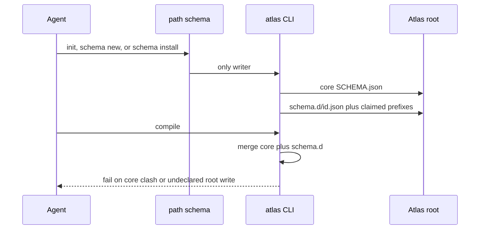

## Intent + scope

Give Atlas one governance surface so creating or installing schema is not a free edit of `SCHEMA.json` or a dump of files at the store root.

After approval, implement:

1. Path `schema` (`references/paths/schema.md`) on the Atlas skill. Registry row beside query / remember / work / landscape.
2. CLI writers only: `atlas init` (pin F, already shipped) remains the only writer of core `SCHEMA.json`. New verbs: `atlas schema new <id>`, `atlas schema install <source>`, `atlas schema uninstall <id>`.
3. Overlay files: skill ships `contributions/<id>/SCHEMA.overlay.json` (+ templates it owns). Install writes `<root>/schema.d/<id>.json`. Compile Layer 1 merges core + `schema.d/*.json`.
4. Claimed prefixes: overlay declares `claimed_folders`. Install/new may only write those prefixes plus `schema.d/<id>.json`. Undeclared root writes from those verbs fail compile (critical).
5. Project overlays: `schema new` creates a kebab `id` overlay on a project Atlas before any skill exists. Same merge and claimed-prefix gates. Later skill-isation is moving that overlay into the skill package.

## Change-class

`new-surface`

## Pinned decisions

From discuss (2026-09-03), current reality:

1. One surface: SCHEMA keys, templates, root layout, init, and a schema path.
2. Skill-owned stores may extend locally. Host install is explicit and compile-checked.
3. Core `SCHEMA.json` stays closed. Extras live in overlay files. Compile merges.
4. Knowledge pages keep free layout. Install/new only write claimed prefixes.
5. Schema path tells the agent when. CLI is the only writer. Pin F stands (`atlas init` writes the first SCHEMA).
6. Agents may `schema new` a bespoke overlay on a project Atlas. No sandbox that skips compile.

From this design challenge:

7. **Merge policy (accept).** Core-key clash is compile-critical. Two overlays claiming the same extra key is compile-critical. No silent last-writer-wins. Overlay file is the namespace; extras appear at merge root only if unique. Source: discussion pin 3; [fastify/merge-json-schemas](https://github.com/fastify/merge-json-schemas) `onConflict: throw`.
8. **Claimed-prefix detection (accept).** Compile fails only for paths the CLI actually wrote that are not claimed. Free-layout knowledge folders are not install writes. Pin 14: the receipt is evidence; `claimed_folders` is intent.
9. **Fail-closed without CLI (accept).** Path schema must call the CLI. If the CLI is missing, stop. Do not hand-edit `SCHEMA.json` or `schema.d/`.
10. **No overlay quota (reject count cap).** Sprawl is gated by kebab `id`, claimed prefixes, and compile, not a numeric limit.
11. **Uninstall in scope (pin).** `atlas schema uninstall <id>` deletes `schema.d/<id>.json` and receipt-listed CLI writes. It does not rewrite core SCHEMA. Pin 15: never delete pages authored after install.
12. **Init does not bake skill keys (pin).** `atlas init` still writes core SCHEMA only. Skill-owned birth is `init` then `schema install` of that skill’s contribution. Path schema says so.

From think-challenge sign-off (2026-09-03; operator confirmed 1-by-1):

13. **Overlays add types only.** They must not mutate core `templates.by_type` entries. Nested merge of `work` / `document` is forbidden. [allOf is composition, not override](https://swagger.io/docs/specification/v3_0/data-models/oneof-anyof-allof-not/). Absorbs counter “redefine base types”.
14. **Receipt, not declaration.** Compile and uninstall use the list of paths the CLI actually wrote. `claimed_folders` is intent; the receipt is evidence. [Kustomize patches miss the rendered tree](https://perun.au/insights/kustomize-production/).
15. **Uninstall does not delete later pages.** Removes `schema.d/<id>.json` and receipt writes only. Compile warns if pages still use types that lived only on that overlay. [IaC uninstall drift](https://spacelift.io/blog/drift-management).
16. **No Buf checker in this work.** Replacing an overlay that changes that overlay’s own required keys is compile-critical unless `--force`. Tightening core types is already forbidden by 13. [JSON Schema compatibility is immature](https://github.com/json-schema-org/community/issues/984); [Buf breaking](https://buf.build/docs/breaking/) is the contrast, not the implement.

## Non-goals

- Implement in this design path.
- Reopen pin F or two-layer compile.
- Migrate live store keys (`kva`, `autogenesis_space`) onto overlays (stays forming: `p-migrate-legacy-schema-keys.md`).
- Overlay semver upgrade protocol beyond clash-fail.
- Closing the OKF type enum or requiring origin/sensitivity.
- A sixth Atlas catalog skill named schema.
- Hand-edit of SCHEMA as a back door on project stores.

## Challenge counters

| Counter | Source | Severity | Disposition |
|---------|--------|----------|-------------|
| Deep-merge last-writer-wins hides plugin clashes | [fastify merge-json-schemas](https://github.com/fastify/merge-json-schemas); JSON merge-patch vs strategic merge | high | Pin 7: throw / compile-critical |
| Plugin config pollutes the host namespace | Plugin prefixing practice; operator root-dump complaint | high | Overlay file is namespace; claimed prefixes; pin 3–4 |
| Claimed-prefix compile false-fails knowledge folders | OKF free layout (okf rule 4) | high | Pin 8: only install/new writes |
| Agents cannot run CLI, so they will hand-edit | Operator reality; pin F history | medium | Pin 9: fail-closed |
| `schema new` unbounded sprawl | Operator project-overlay ask | medium | Pin 10: gates not quota |
| Schema path without CLI drifts per harness | compile-type-contract pin F vs G/H | high | Pin 5 + 9: path when, CLI writes |

## Genesis Artifacts

### Intent + scope + non-goals

See sections above.

### Sequence



### Interface sketch

```text
atlas init --root <dir> [--force]          # core SCHEMA only (existing)
atlas schema new <id> --root <dir> [--claim <folder>]
atlas schema install <path-or-skill> --root <dir>
atlas schema uninstall <id> --root <dir>
atlas compile --root <dir>                 # merge schema.d, claimed-prefix check
```

Overlay object (minimum):

```json
{
  "contribution_id": "discuss",
  "claimed_folders": ["protostars"],
  "templates": { "by_type": {} }
}
```

Forbidden in an overlay: replacing `schema_version`, `atlas_id`, `structure.reserved_names`, `compile.core_checks`.

Path `schema` procedures: init-then-install for skill stores; `schema new` for project-local; compile after every write; never author SCHEMA by hand.

### Cost note

One extra directory read (`schema.d/`) per compile. Merge is object-key union with clash fail — cheap versus page walk. Path schema adds one activation hop, not a catalog skill.

### Acceptance

- `atlas init` still refuses overwrite without `--force`; core SCHEMA has no skill namespaces.
- `schema new foo --claim experiments` writes `schema.d/foo.json` and may create `experiments/`; compile green.
- `schema new foo` that also writes `random.md` at root → compile critical.
- Overlay that sets `atlas_id` → compile critical.
- Two overlays with the same extra key → compile critical.
- `schema uninstall foo` removes `schema.d/foo.json`; compile no longer sees that overlay.
- Path registry lists `schema`. SKILL.md one-liner points at the path module.
- Overlay that mutates core `templates.by_type.work` (or other core type) → compile critical.
- `schema uninstall` leaves agent-authored pages in claimed folders; compile warns on orphan overlay types.
- Re-install that changes an overlay’s required keys without `--force` → compile critical.
- Existing compile-type-contract Layer 2 page checks unchanged.

### Stop-for-approval

This path **stops for approval**. Do not implement until the operator explicitly approves this persisted plan.

## Catalogue Review

In scope: new activation path, Enter/Exit discipline.

- Genesis matches: **none loaded** — catalog skill `genesis` is not available in this harness. Mini-genesis artifacts are taken from Autogenesis `workflow-discipline.md`.
- Autogenesis extension: **uses B17 ACTIVATION CARD**. Path `schema` must emit Enter card + path receipt. Atlas already has `activation_card: on`.
- Composition mode: **INLINE** — path module + CLI verbs inside the Atlas skill. Not a new catalog skill.
- Inherited anti-patterns: discussion→implement short-circuit (refused); silent SCHEMA hand-edit (pin 9); last-writer-wins merge (pin 7).
- Delta only: schema path + overlay merge + claimed-prefix compile. No change to query/remember/work/landscape.
- Admission note: B17 already active on Atlas; this work adds a path that must obey it.

## Behavioural contract (agent-spec)

deferred: agent-spec is not available in this harness. Autogenesis must not author `.feature` files. Implement must not invent Gherkin; invoke specify when the skill exists, or keep this deferral.

`@forbidden` intent (for later specify): hand-edit of `SCHEMA.json`; overlay overwrite of core keys; undeclared root files from install/new; sandbox compile skip.

## Evaluation plan

Deterministic smokes (primary), mapped to construct:

- `init-core-only` — init SCHEMA has no `schema.d` and no skill keys such as `kva`.
- `new-writes-schema-d` — `schema.d/<id>.json` exists after `schema new`.
- `undeclared-root-fails` — extra root file from install/new → compile exit 2.
- `core-key-clash-fails` — overlay with `atlas_id` → compile exit 2.
- `overlay-key-clash-fails` — two overlays same extra key → compile exit 2.
- `uninstall-removes-overlay` — file gone; compile no longer merges it.
- `knowledge-folder-ok` — free-layout folder not in claimed_folders and not written by CLI stays compile-ok.
- `path-registry-lists-schema` — SKILL.md / path file present.

Agent evaluations (secondary): path schema refuses to hand-edit SCHEMA when CLI is stubbed missing.

## Adversarial scenario draft

File: `references/scenarios/schema-governance-adversarial-v1.yaml` (subject skill). Keep prior compile-type-contract suite. Implement may add smokes; must not drop these without a new design.

## Residual risks

- Overlay filename inside the skill package (`contributions/<id>/` vs other) can still be bikeshed at implement if tests stay green.
- Live sibling stores keep illegal in-place SCHEMA keys until a later migrate work.
- `schema.d/` must be listed so OKF consumers tolerate it (not a reserved concept file).

## C1–C5

- C1 pass — six counters, two high-severity grounded.
- C2 pass — high-severity pinned (7, 8, 9) or rejected with rationale (10).
- C3 pass — Pinned decisions section.
- C4 pass — no implement; migrate-legacy out of scope.
- C5 pass — no product CLI/path files written in this Run except design artefacts (plan, work hub, scenario draft).
- change-class stated; mini-genesis complete; catalogue review present; behavioural deferred; evaluation plan present.
