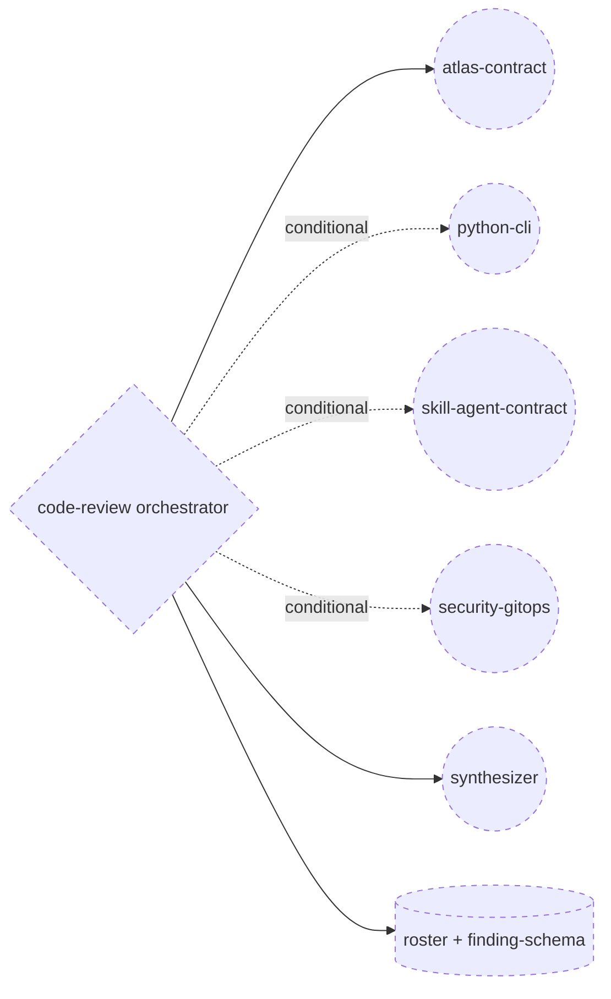

# Plan — Copilot PR panel-review skill

## Outcome addendum

This is the approved historical plan for the first implementation. It was implemented as `.github/skills/code-review/`, then exercised through GitHub Copilot Code Review. The Actions evidence showed that CCR discovered and invoked the skill, but retained its built-in review orchestration, overview, severity vocabulary, approval recommendation, and comment selection.

The operator rejected that result and directed a pivot to an APM-authored `panel-review` skill deployed to Copilot. The replacement decision is recorded at `decisions/panel-review-apm-over-copilot-code-review.md`; the implementation is recorded at `experiences/2026-09-03-pivot-panel-review-to-apm.md`.

Process note: the pivot had explicit operator authorization but did not return through a new formal design path and challenged persisted plan. The Autogenesis Change gate for the replacement scope is therefore recorded as incomplete rather than rewritten retroactively.

**change-class:** `new-surface` (project files in this repo, not a new APM package). Genesis depth elevated to **full** because the surface is a new agentic primitive (A1 PANEL).

**This path stops for approval. Do not implement.**

## Intent + scope

Give this repository a Copilot-native **advisory panel** for any pull request. One project skill (agentskills.io `SKILL.md`) that Copilot code review, Copilot CLI, cloud agent, and VS Code agent mode can load. Specialist **review lenses** fan out when child threads exist; a synthesizer emits **one** recommendation. Humans decide ship.

**Copilot dispatch name:** directory and frontmatter `name` must be `code-review`. GitHub’s CCR setup notes say: create a `code-review` or similarly named directory under `.github/skills` so Copilot code review will read the skill. `pr-panel-review` is not that name.

**Trigger description (MODULE ENTRYPOINT draft):** Use this skill when GitHub Copilot code review runs, when reviewing a pull request, or when asked to review code in this repository. Apply even if the user only says "review this PR" or "@copilot review". Do not use for implementing the PR, merging, or approving.

**Cost stance:** `balanced`. Cap: 4 specialist spawns + 1 synthesizer. Typical run 2–3 specialists via skip rules.

**Boundary:** this atlas repo only. Not a portable APM skill. Not a merge gate.

## Change-class

`new-surface`

## Project size and technologies (roster evidence)

| Fact | Value |
|------|--------|
| Product | Python CLI + markdown skill package (OKF knowledge substrate) |
| Python | ~25 files, ~2.7k LOC (`scripts/atlas_cli`, `scripts/atlas.py`) |
| Markdown | ~35 package files (SKILL, paths, templates, recipes, README) |
| Other | JSON Schema, git submodule mount, GitHub auth, fixtures, adversarial YAML |
| Absent | frontend, services, polyglot, product UX, growth/positioning |

Largest risk surfaces: `validate.py` (~482), `search.py` (~372), mesh/gitops/mount/auth, SCHEMA/compile contract, SKILL path-router.

**Roster size rule:** small specialized repo → 3 always-on max, 1 conditional, 1 synthesizer. Not the 5–7 lens genesis example (that was a product panel).

## Proposed review lenses (4 + synthesizer)

Naming: these are **review lenses**. Atlas compile `--path`/`--type` filters are **compile focus lenses** (`2026-08-27-atlas-compile-focus-lenses`). Do not collapse the words.

| id | Duty | When | Skip | Capability profile |
|----|------|------|------|--------------------|
| **atlas-contract** | SCHEMA, frontmatter, compile gates, staging never answers, `relates_to`/`work_id`, path-vs-CLI verbs, activation cards | **always** | never | cross-file, stakes-weighted (store corruption) → REVIEWER |
| **python-cli** | CLI correctness, exit codes, path escape, fixtures, adversarial YAML | any `.py`, `scripts/`, `fixtures/`, `references/scenarios/` | docs-only / SKILL-only diffs | multi-file correctness → REVIEWER |
| **skill-agent-contract** | SKILL router, progressive disclosure, substrate contract, description triggers | `SKILL.md`, `references/paths/`, recipes, templates, `apm.yml` | pure Python internals with no skill files | cross-file skill contract → REVIEWER |
| **security-gitops** | secrets, auth store, mount/gitops, path traversal, staging leakage | `auth*`, `gitops`, `mount`, credentials, staging, `--path` | otherwise | stakes-weighted security → REVIEWER+ |
| **synthesizer** | one ship recommendation, weights, dissent | always after specialists return | n/a | synthesis, not a specialist |

**Rejected lenses (this repo):** UX/visual, growth/positioning, generic OWASP-web, test-coverage-only, docs-nit persona, logging-UX. No surface to justify the token multiplier.

**Always-on count:** 1 (`atlas-contract`). Others are conditional. Worst case 4+synthesizer.

### Finding weights (advisory)

`must-address` | `should-address` | `optional-polish`

Ship recommendation: `ship now` | `ship with follow-ups` | `needs discussion` | `needs rework`. No APPROVE/REJECT. No merge labels.

## Pinned decisions

1. **Install path and skill `name`:** `.github/skills/code-review/` with frontmatter `name: code-review`. Official CCR getting-started: “create a `code-review` or similarly named directory”. Do not use `pr-panel-review` as the Copilot identifier. Panel is the internal architecture, not the dispatch name.
2. **No APM package.** No `apm.yml` for this skill. Not initialise-path.
3. **One skill, not N skills.** Copilot code review may invoke matching skills independently; N skills → N comment streams (PANEL-WITHOUT-SYNTHESIS).
4. **Lenses are lazy assets** (C1), not inlined in `SKILL.md`. Thin orchestrator body.
5. **No `.agent.md` in v1.** Skill frontmatter cannot bind `model`/`tools` on Copilot; same REVIEWER class is justified for this small repo except security-gitops (REVIEWER+). Custom agents deferred.
6. **Fan-out when spawn exists** (Copilot CLI Task / sub-agents). **Copilot code review degraded path:** sequential isolated evaluations that must not read other lenses' findings until synthesizer. Document residual PANEL-IN-ONE-CONTEXT risk; do not pretend CCR has undocumented spawn.
7. **One-emission:** orchestrator is the sole public writer. Specialists return structured findings only.
8. **Advisory regime.** Humans ship. Panel does not merge, approve, or gate.
9. **Do not put the panel in `.github/copilot-instructions.md`** (always-on bloat; CCR tutorial: keep instructions short; skills are task-triggered).
10. **Name collision:** "review lens" ≠ compile focus lens.
11. **activation_card: off** on the Copilot skill (CCR is not an Autogenesis Run).
12. **v1 files:** `SKILL.md`, `references/roster.md`, `references/finding-schema.md`, `references/synthesizer.md`, four lens files. No scripts.

## Non-goals

- APM package / initialise / version identity for a new skill package
- Custom agents, org/enterprise agents, MCP servers
- Automatic Copilot code review org policy
- Merge/approve/gate labels
- Generic multi-repo panel
- Re-admitting deprecated Autogenesis `panel-review` pattern as a catalogue entry
- Implementing in this design path

## Genesis Artifacts

### Component diagram



New: orchestrator SKILL, four PERSONA assets, synthesizer PERSONA, roster/schema ASSETs. Existing: none in `.github/skills`.

### Sequence diagram

```mermaid
sequenceDiagram
    participant Trigger as PR or review ask
    participant O as Orchestrator
    participant AC as atlas-contract
    participant PY as python-cli
    participant SK as skill-agent-contract
    participant SG as security-gitops
    participant SY as synthesizer
    Trigger->>O: load skill, gather diff read-only
    O->>O: roster: always-on plus conditional minus skip
    O->>AC: spawn isolated thread
    alt python paths
        O->>PY: spawn isolated thread
        PY-->>O: findings
    end
    alt skill paths
        O->>SK: spawn isolated thread
        SK-->>O: findings
    end
    alt auth gitops secrets staging path-escape
        O->>SG: spawn isolated thread
        SG-->>O: findings
    end
    AC-->>O: findings
    Note over O: completeness gate; CCR fallback is isolated sequential
    O->>SY: spawn with findings only not lens bodies
    SY-->>O: ship_recommendation plus dissent
    O->>Trigger: ONE public comment
```

### Composition decision

| Box | Mode | Why |
|-----|------|-----|
| Orchestrator | new MODULE ENTRYPOINT in this repo | Copilot project skill |
| Four review lenses + synthesizer | LOCAL SIBLING assets | C1 lazy load; not external APM |
| Roster / schema | INLINE files in skill folder | tiny, versioned with skill |
| genesis / autogenesis | EXTERNAL read-only at design | not shipped into the Copilot skill |

Portability: designed against runtime-affordances `common.md`. Copilot is a **declared target** (user ask) with CCR spawn residual. No harness syntax in persona reasoning.

### Cost stance

`balanced`. Qualitative: 4 isolated windows beat one contaminated window (genesis example 02) but cost  not 4× — closer to 5–15× if unmanaged ([multi-agent cost compounding](https://www.augmentcode.com/guides/multi-agent-cost-compounding)). Skip rules keep typical atlas PRs at 2–3 specialists. Output tax: structured findings, not essays.

### Interface sketch

```text
.github/skills/code-review/
  SKILL.md
  references/roster.md
  references/finding-schema.md
  references/synthesizer.md
  references/lenses/atlas-contract.md
  references/lenses/python-cli.md
  references/lenses/skill-agent-contract.md
  references/lenses/security-gitops.md
```

SKILL.md frontmatter: `name: code-review`, `description` ≤1024 chars (imperative; must name Copilot code review and pull requests so CCR matching stays on).

Finding object: `lens_id`, `title`, `rationale`, `weight`, `paths[]`, `follow_up`.

## Catalogue Review

**In scope** (panel topology, fan-out, advisory gate).

- **genesis matches:** uses A1 PANEL, B1 FAN-OUT+SYNTHESIZER, C1 LAZY ASSET, C2 PERSONA PRELOAD, B2 CONDITIONAL DISPATCH. S4-style completeness gate before synthesis. Does not conflict.
- **Autogenesis extension:** B17 not applied to the Copilot skill (`activation_card: off`). This Autogenesis Run uses B17.
- **composition mode:** LOCAL SIBLING
- **inherited anti-patterns:** PANEL-IN-ONE-CONTEXT, PANEL-WITHOUT-SYNTHESIS, IMBALANCED PANEL, UNDIFFERENTIATED LENS BINDING, EAGER BLOAT, ALL-BRANCHES-LOADED, FAN-OUT-IN-ONE-CONTEXT
- **delta only:** Copilot CCR degraded isolation protocol; project-level not APM; atlas-specific roster; compile-lens name disambiguation
- **admission:** compose genesis A1+B1; do not re-admit deprecated `patterns/deprecated/panel-review.md`

## Challenge (think-challenge)

| # | Counter | Source | Severity | Pin |
|---|---------|--------|----------|-----|
| 1 | Single-thread multi-lens contaminates specialists | genesis A1 anti-pattern PANEL-IN-ONE-CONTEXT; genesis examples/02-review-panel-architecture.md | high | Accept: fan-out when spawn exists. CCR: isolated sequential + no cross-lens peek. Residual documented, not denied. |
| 2 | 3 agents can cost 5–15× not 3× | [Augment Code cost compounding](https://www.augmentcode.com/guides/multi-agent-cost-compounding) | high | Accept: 4-lens cap, skip rules, structured short findings. |
| 3 | Long instruction files get overlooked | [CCR custom-instructions tutorial](https://docs.github.com/en/copilot/tutorials/customize-code-review) | high | Accept: thin SKILL.md + lazy lens files. |
| 4 | N skills → N CCR comments | Copilot skills matching; A1 PANEL-WITHOUT-SYNTHESIS | high | Accept: exactly one skill, one-emission. |
| 5 | Advisory "must-address" becomes a soft merge gate | deprecated panel-review pattern consequences | medium | Accept: no APPROVE/REJECT, no labels; weights inform humans. |

C1 non-trivial counters: yes. C2 high-severity pinned: yes (1–4). C3 pins visible above. C4 scope intact (still 4 lenses, project-level, no APM). C5 no implementation in this path.

## Behavioural contract (agent-spec)

**deferred:** `agent-spec` is not in this harness catalog. Autogenesis must not author `.feature` files. Implement Run will substrate-load `agent-spec` `specify` if available; otherwise keep this deferral and rely on construct smokes.

`@forbidden` families to protect: multi-comment emission; merge/approve labels; inlining all lenses into SKILL.md; creating `apm.yml` for this skill; always-on python-cli on docs-only diffs.

## Evaluation plan

**Deterministic (primary):**

| Probe | Expect |
|-------|--------|
| dir `.github/skills/code-review/` | exists |
| `SKILL.md` frontmatter `name` + `description` | present |
| four lens files + roster + schema + synthesizer | exist |
| no `.github/skills/code-review/apm.yml` | absent |
| SKILL.md does not contain full lens bodies | no copy-paste of lens files |
| roster.md names skip rules | python-cli skip on docs-only |
| SKILL.md forbids merge/approve | string present |
| one-emission rule | string present |

**Agent eval (secondary):** CCR or CLI review of a fixture PR produces one public recommendation comment. Never the sole evidence.

## Adversarial scenario draft

Filename on implement: `references/scenarios/code-review-adversarial-v1.yaml` (new file; keep priors).

```yaml
id: code-review-adversarial-v1
work_id: 2026-09-03-pr-panel-review
adversarial: true
packages: [atlas]
expect:
  one_skill_dir: true
  no_apm_package: true
  lazy_lenses: true
  skip_python_on_docs: true
  no_merge_gate_language: true
smokes:
  - id: no-apm-yml
    source: user constraint / pin 2
    expect: no apm.yml under .github/skills/code-review
  - id: dispatch-name-code-review
    source: GitHub CCR changelog 2026-06-02 / pin 1
    expect: directory and SKILL.md name are code-review, not pr-panel-review
  - id: one-skill-not-four
    source: A1 PANEL-WITHOUT-SYNTHESIS / pin 3
    expect: exactly one SKILL.md for the panel; no per-lens SKILL.md
  - id: lenses-not-inlined
    source: C1 EAGER BLOAT / CCR tutorial context limits
    expect: SKILL.md does not contain the full text of any lens file
  - id: docs-only-skips-python-cli
    source: B2 skip rules / pin roster
    expect: roster.md skip python-cli when diff is markdown-only under docs/README/recipes
  - id: no-approve-reject
    source: advisory regime / deprecated panel-review
    expect: SKILL.md and synthesizer.md contain no APPROVE/REJECT merge-gate instruction
```

Empty suite forbidden. Implement may add smokes; must not drop these without a new design.

## Acceptance

- Files exist at the interface sketch paths
- Roster is the four review lenses + synthesizer above
- Copilot skill frontmatter valid (`name`, `description`)
- Construct adversarial file present and green or waived per named smoke
- No APM package, no merge gate, no implement in design

## Stop for approval

**G7:** This design is pinned and challenged. Implement only after explicit approval of this plan (`work_id: 2026-09-03-pr-panel-review`). Approve as-is, or change the roster (drop/add a lens) before implement.
