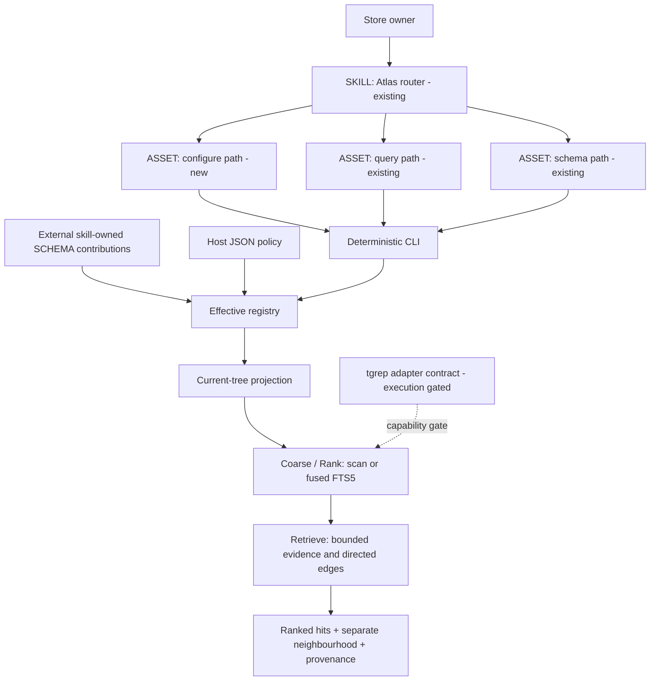
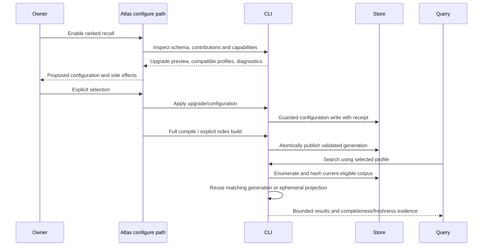
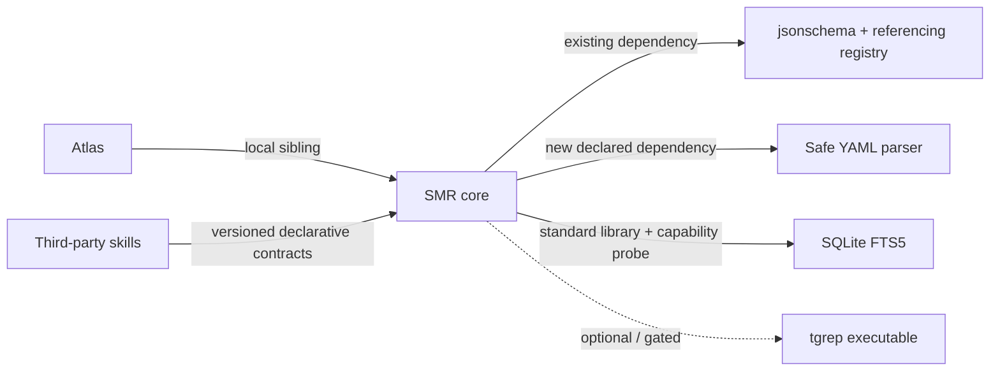

# Configurable Semantic Memory Recall

Work ID: `2026-09-09-atlas-smr-configurable-recall`

Change-class: **new-surface**. Subject: Atlas. Baseline: Atlas 0.9.1, commit `a1074e5`.

Status: **approved and implementing**. Session plan remains the originating copy; this Atlas page is canonical.

Session plan: `/Users/sergio_sisternes/.copilot/session-state/8da0da39-0521-4ceb-99d0-a9c3610fa98e/plan.md`.

Canonical destination after approval: `autogenesis/plans/2026-09-09-atlas-smr-configurable-recall.md` in the resolved subject store, `github.com/sergio-sisternes-epam/atlas-atlas`. Its current worktree root is `.atlas/github.com/sergio-sisternes-epam/atlas-atlas`.

The canonical work card remains `work/2026-09-09-atlas-smr-configurable-recall.md`; do not create a second work hub or rename the existing ID. User approved the plan on 2026-09-09 and asked to proceed with implementation. Atlas publication is packet P0.

## Problem and approach

Atlas currently combines substring discovery, fixed domain filters and hit presentation in one search implementation. Its BM25 branch is a fallback stub, and search does not consume the same merged schema as compile. Adding tgrep alone would preserve these limitations and introduce coverage/freshness hazards.

Introduce an explicitly enabled SMR pipeline: **Coarse -> Rank -> Retrieve**. Third-party skills own SMO (types, metadata meanings, lifecycle, relationships, templates and setup). Atlas owns declarative extension mechanics, validation, projections, driver capabilities, bounded execution and provenance. Ship current-tree scan and SQLite FTS5 recall plus directed graph context first. Deliver the tgrep adapter contract and an honest unsupported-capability diagnostic; accelerated execution is gated on clean upstream disk-only support and subsequent conformance evidence.

## Source memory and authority

All paths here are relative to the subject Atlas unless identified as product source.

| Memory | Design use |
|---|---|
| `work/2026-09-09-atlas-smr-configurable-recall.md` | Canonical scope, authority boundary and related work |
| `autogenesis/discuss/recall-architecture/hub.md` | Discussion provenance and user scope choices |
| `autogenesis/discuss/recall-architecture/contract-proposal.md` | Stage separation, coverage, freshness, graph direction |
| `autogenesis/discuss/recall-architecture/smr-smo-boundary.md` | Skill-owned semantics, bindings, explicit presets |
| `autogenesis/discuss/recall-architecture/decision-json-configuration.md` | Accepted JSON-only, closed extensible validation decision |
| `work/atlas-bm25-and-live-migration-v1.md` | Coordinate ranking work; do not rename, close or absorb its migration scope |

The independent advisor's handover is input, not authority. Unavailable advisor pages are not reconstructed or published. Its claim that no `atlas query` verb exists is contradicted by `scripts/atlas_cli/cli.py`: retain that existing search alias.

## Pinned decisions

Accepted by the user before this plan:

1. Scope is configurable SMR, not only a tgrep wrapper. Stage names are Coarse, Rank and Retrieve.
2. SMO stays third-party skill-owned through SCHEMA extensibility. No executable contribution hooks or universal domain ontology.
3. Skills may offer namespaced presets; only the store owner selects one. Install is not activation.
4. Configuration is JSON only, validated with versioned Draft 2020-12 schemas. Close core/driver objects and registered extension payloads, not authored OKF content.
5. Existing stores keep existing behaviour until explicit opt-in.
6. Guidance belongs in a new configuration path within the existing Atlas skill, not a companion skill.
7. Initial tgrep scope is local indexing, with no managed daemon/watch lifecycle.
8. Recall reflects the current working tree; correctness takes priority over indexed speed.
9. tgrep may run as argv subprocess against an Atlas-owned on-disk index rebuilt on projection digest mismatch. Never `serve`, never `--no-index`, never auto-install. Missing binary and detected `serve.json` fail closed. Do not claim daemon-class acceleration.
10. Introduce an explicit SCHEMA 1.0 -> 2.0 upgrade with compatibility preservation. Leave un-upgraded stores untouched.
11. Use safe, typed/nested YAML frontmatter parsing for 2.0, retaining the 1.0 parser.
12. Incomplete-corpus recall fails by default. Permit partial results only when the caller explicitly requests them; distinguish this from normal bounded output.

Proposed implementation pins, subject to approval of this plan:

- Version the schema envelope and recall contract independently. Store portable recall policy under `SCHEMA.json`'s `recall` object; never put local executable paths or credentials there.
- Use one validated effective registry for compile, schema operations, projection and advanced search.
- Freshness starts with full eligible-corpus enumeration and content digests, not mtime-only validation. Reuse a matching persistent generation; otherwise build an ephemeral current-view projection. Do not automatically persist/rebuild an index during search.
- FTS5 fuses Coarse and Rank. Do not require a trigram or literal prefilter before it.
- Keep ranked hits and graph neighbourhood separate. No implicit degree boosts or hidden cross-store traversal.
- Disable activation of unsupported drivers rather than silently substituting another algorithm. A stale FTS5 cache may use ephemeral FTS5; a missing FTS5 capability is an error, not a silent switch to substring scoring.
- Suggested output defaults: 20 hits, expansion off, requested expansion depth 1; host ceilings initially 100 hits, depth 3, 200 nodes, 1,000 edges and 64 KiB total evidence. Expose configurable lower limits and implementation safety maxima. A zero limit is documented explicitly, never interpreted as unlimited.

## Genesis Artifacts

### Intent, scope and non-goals

Enable a store owner to inspect, validate, select and disable recall profiles, using third-party semantic bindings without modifying authored pages when drivers change. A new Atlas `configure` path guides explicit operations through deterministic CLI commands. Query remains the path for finding evidence; schema remains the path for contribution installation and migration.

In scope: versioned configuration and contribution contracts; migration; 2.0 frontmatter handling; shared projection; scan/FTS5 drivers; typed directed graph retrieval; lifecycle and budgets; CLI diagnostics; configure/query/schema guidance; deterministic and agent evaluations.

Out of scope: embeddings, hosted search, remote executors, daemon/watch management, actual accelerated tgrep before its gate clears, automatic driver installation, automatic profile activation, Cartograph changes, live okf-wiki migration, external-store CI rollout, broad legacy cleanups, release publishing or peer-skill repository edits.

### Component diagram



### Thread and side-effect sequence



One writer owns configuration transactions and one writer publishes each index generation. Search readers use immutable generations. No runtime agent fan-out or model calls occur inside SMR.

### Composition and dependency graph

| Component | Composition / audience | Interface and responsibility |
|---|---|---|
| Atlas root router | Existing SKILL; external prose | BOTH invocation; route setup to configure without replacing query/schema |
| `references/paths/configure.md` | INLINE progressive asset; external prose | Inspect -> propose -> explicit selection -> deterministic apply -> report |
| Query/schema/init/remember/work paths | Existing local assets; external prose | Load effective contracts, preserve 1.0 guidance and avoid 2.0 domain assumptions |
| Contracts, registry, projector, stages | LOCAL SIBLING Python modules; internal structured data | Validate, project and execute; no LLM assertions of state |
| Third-party contributions | EXTERNAL data contracts, not runtime skill execution | Own semantic declarations and optional presets; not installed by this work |
| Compatibility contribution | Store-local migration artifact | Preserve existing domain declarations; not a new Atlas-owned ontology |
| Scenario descriptors | Existing `references/scenarios/` convention | Maintainer-facing references retained to avoid unrelated distribution changes |
| Test/benchmark implementations | `contributor/` or existing `scripts/test_*.py` convention | Maintainer-only; do not eagerly load into query context |
| tgrep | Optional external executable, unavailable for acceleration initially | Explicit capability/version probe only; no shell interpolation or server lifecycle |



No new runtime skill dependency. Python dependencies are declared in the existing requirements surface and pinned with their CI closure. Reuse `jsonschema` and `referencing`; choose a compatible `jsonschema` lower bound that supports the registry API actually used instead of retaining an insufficient `>=4.0`. Use PyYAML with a constrained safe loader for 2.0, selecting the supported version during implementation and pinning CI. `sqlite3` is standard library; FTS5 availability is probed. Future tgrep must be documented as an optional external prerequisite and probed at use-site; a prose recommendation alone cannot enable it.

Declared target: **common-only** skill behaviour, existing Python CLI platforms. Configuration guidance uses non-interactive commands, structured stdout and diagnostics on stderr.

### Cost note

Stance: balanced, no monetary cap supplied. Scan/projection/FTS5/graph add **zero runtime model calls**. Configure uses one existing assistant thread with small capability/status payloads and explicit approval, not a spawned planner.

S workload: small store, direct scan and bounded evidence. M: stable store, full digest pass plus reused SQLite generation. L: dirty or large store, full pass plus ephemeral projection; correctness can cost O(total eligible bytes), and graph work is bounded. Cold build, warm query, dirty query, index bytes, peak memory and evidence bytes must all be measured. No indexed-speed or tgrep-benefit claim is made in advance. Qualitative bands satisfy mini-genesis; fabricated token or dollar forecasts are not useful for the deterministic runtime.

### Human rationale

The complexity belongs at explicit ownership and correctness boundaries, not in hidden optimisations. The versioned upgrade avoids silently changing today's stores. A single registry lets a skill change its vocabulary without changing drivers. Full freshness checks are initially more expensive than trusting an index, but avoid false confidence about recently added pages. Deferring unsupported tgrep execution is preferable to shipping an apparently accelerated driver that scans everything or may connect to an unrequested server.

### Acceptance criteria

- SCHEMA 1.0 regression fixtures keep search/query, filter, compile, warning and init behaviour unchanged.
- SCHEMA 2.0 configuration rejects unknown keys, duplicate keys, invalid references, incompatible stage combinations and budget escalation before mutation.
- Two independent skill vocabularies work with the same scan/FTS5/graph implementation; no domain names or lifecycle values are added to 2.0 engine code.
- Installing a preset never activates it. Uninstall/replacement cannot leave a selected profile silently dangling.
- Unknown valid page types and metadata remain searchable and are not deleted or coerced by setup.
- Current-view results include eligible new, changed, hidden and gitignored pages; exclude staging/cache/template/control areas; never rely on tool-default corpus membership.
- Failed/focused compile never publishes a complete generation. Invalid/stale/corrupt generations are not represented as fresh.
- Ranked order, directed incoming/outgoing expansion, budgets and evidence provenance have deterministic assertions.
- Partial results require explicit request consent and are unmistakably incomplete; invalid configuration/trust boundaries cannot be bypassed by that consent.
- tgrep is visibly gated; no undocumented `serve.json` trick, daemon connection/start, or fake acceleration.
- Configure guidance is reachable from the existing router, observes explicit selection and produces accurate CLI-backed receipts.

**Stop for approval. This packet does not author or install the proposed modules.**

## Contract and interface design

### 1. Versioned ownership and configuration

Add real schemas under `scripts/atlas_cli/schemas/`, with runtime code loading those files as the single authority. Keep `references/SCHEMA.contract.json` labelled as legacy normative guidance; do not mistake its field list for a validator.

Proposed files: `store-v2.schema.json`, `contribution-v1.schema.json`, `recall-v1.schema.json`, plus driver-specific definitions. SCHEMA envelope version is `"2.0"`; recall/contribution protocol versions begin at `1`.

Contribution IDs and binding/profile references are namespace-qualified. A contribution has an ID, revision, owned schema resources, declarations and optional presets. Receipts record origin, installed files and digests; identity is provenance, not an assertion of trust. File order never decides ownership. Only an explicit upgrade/replacement operation can transfer ownership.

Close all fixed core objects. Compose registered extension payload schemas at the final boundary using `unevaluatedProperties: false` when appropriate. No unvalidated catch-all extension bucket. Resolve `$ref` from an explicit in-memory registry of installed, receipt-owned resources; unknown URIs, network refs and arbitrary filesystem refs fail closed. Bound schema resource size, depth and composition complexity; exclude executable hooks.

Strict JSON rejects duplicate keys and NaN/Infinity. Semantic validation follows structural validation: ownership collisions, profile/binding references, supported operators, matching versions/capabilities and host ceilings.

Illustrative **new interface**, not existing syntax (the actual shipped schemas/tests must agree with this design):

```json
{
  "schema_version": "2.0",
  "atlas_id": "example",
  "title": "Example store",
  "recall": {
    "version": 1,
    "enabled": true,
    "preset": "discuss:explore",
    "overrides": {
      "coarse": {"driver": "sqlite-fts5"},
      "rank": {"driver": "sqlite-fts5"},
      "retrieve": {"driver": "pages-graph", "max_hops": 0},
      "limits": {"max_hits": 20, "max_evidence_bytes": 32768}
    },
    "ceilings": {
      "max_hits": 100,
      "max_hops": 3,
      "max_nodes": 200,
      "max_edges": 1000,
      "max_evidence_bytes": 65536
    }
  }
}
```

This is the relevant envelope excerpt, not a replacement for all store fields. `discuss:explore` is an illustrative third-party contribution, not a promise to install or edit Discuss. Tests provide two fixture contributions. Also provide generic technical scan/ranked profiles requiring no domain contribution.

Effective policy precedence: generic technical defaults -> one explicitly selected preset -> host overrides -> allowlisted request overrides. Host ceilings always apply. Arrays replace, not concatenate; null is accepted only where the schema defines it. Explain reports the provenance of each effective setting.

Portable policy lives in SCHEMA; driver binary locations come only from local CLI/runtime settings. This release does not need endpoints or credential configuration.

### 2. Declarative semantic bindings

Initial generic vocabulary:

- Applicability: explicit page-type sets and safe store-relative path prefixes; no executable expressions.
- Text: JSON Pointer metadata selectors plus body source, mapped into generic primary/secondary/body slots. Preserve default title/description/body recall for unbound pages; deduplicate repeated contributions to a slot.
- Facets: contribution-qualified names, pointer, scalar/array cardinality and explicit string/boolean/integer/number/date-string type. Do not coerce `"false"` to false or guess lifecycle semantics.
- Predicates: bounded `all`/`any` groups over equality, membership and typed comparisons; no arbitrary regex or query-language execution in contributions.
- Lifecycle: optional named predicates such as a skill's exit selection; exclusion is profile policy, never access control.
- Edges: declared list pointer and target/kind pointers, with explicit direction during traversal. Retain original source field and contribution identity.
- Page contracts: generic required fields, conditional predicates and required-edge declarations sufficient to represent the existing work/protostar policies in migration data.

Presets reference bindings by qualified ID. Two contributions may bind the same page, but must not redefine the same qualified binding or disagree about its type. Combine independent additive bindings deterministically, with diagnostics for ambiguity. Unknown unbound content receives neutral text recall, not inferred domain constraints.

### 3. Upgrade and parser boundary

Add `atlas schema upgrade --to 2.0 --dry-run` and explicit `--apply`. Preview inventories every affected core rule, overlay, receipt and selected setting. Preserve all legacy data as a versioned store-local compatibility contribution with provenance, rather than retaining hardcoded 2.0 domain rules.

Re-express existing domain defaults in declarative data. Do not edit peer skill packages, silently claim their identity, or fabricate ownership. A future skill can adopt the compatibility declarations through an explicit transfer/replacement. New `init --schema-version 2.0` is neutral; default init remains 1.0.

Unknown legacy root keys or rules that cannot be mapped to validated registered schemas block upgrade with an actionable report. Never drop them or hide them in an opaque permissive bucket. Preview must detect behavioural differences from the new parser, not only schema shape. Preserve original files, digests and migration receipt; apply under a store write lock with a recoverable journal and publish the version switch last. On interrupted migration, detect/recover or fail closed; do not interpret a half-migrated store as valid.

For 2.0 use safe YAML parsing with JSON-compatible metadata: strings, booleans, finite numbers, null, lists and string-keyed maps. Use controlled scalar resolution (date-like values remain strings; legacy `yes`/`on` are not silently booleans). Reject duplicate mapping keys and unsafe tags; preflight bytes/events/nesting and detect aliases/cycles before conversion. Safely resolve supported aliases/merge keys under bounded expansion or produce a specific unsupported/limit diagnostic; do not discard unknown ordinary keys.

The raw page remains untouched. Parser-profile restrictions are Atlas 2.0 ingestion diagnostics, not a claim that all other YAML is invalid OKF. Page-level diagnostics can participate in explicitly requested partial recall; malformed config cannot.

Route every metadata consumer consistently: `validate`, `search`, schema install compatibility checks and `promote` template parsing. Preserve 1.0 `split_fm` behaviour and byte content outside the explicit upgrade boundary.

### 4. CLI and response contracts

Proposed new deterministic commands:

```text
atlas schema upgrade --to 2.0 --dry-run|--apply --root ROOT
atlas recall profiles --root ROOT --json
atlas recall show --root ROOT --json
atlas recall validate --config FILE --root ROOT --json
atlas recall activate --profile ID [--overrides FILE] --root ROOT
atlas recall disable --root ROOT
atlas recall status --root ROOT --json
atlas recall index build --root ROOT
atlas search TEXT --profile ID --root ROOT --json
atlas search TEXT --root ROOT --json [--allow-partial]
```

`--profile` is an explicit request-scoped opt-in on a 2.0 store, not persistent activation. A disabled/unconfigured store stays on the compatibility path unless that option is passed. Configuration write commands validate the entire effective registry, report changed fields and avoid unrelated rewrites. Missing capabilities fail activation. `disable` does not delete user content, contributions or caches.

Keep existing `search` and `query` aliases routed through the same dispatcher. Preserve `--engine` on legacy stores. For advanced requests, an explicit legacy `--engine` selects its documented compatibility mapping; conflicting `--engine` and `--profile` fail clearly. Never infer user intent from an unrecognised engine value in the new path.

Retain existing top-level response/hit keys where their meaning still applies. Advanced JSON adds a versioned `recall` block: effective profile and provenance, requested/used drivers, fallback reason, generation/digest, consistency mode, `complete`, diagnostics, returned limits and truncation flags. Add `neighbourhood` separately. Do not report `bm25` when a scan actually ran.

Proposed exits: 0 complete successful execution (including normal top-k/context truncation), 1 explicitly permitted partial execution, 2 invalid configuration/capability or failed execution. CLI help documents that `complete` refers to the eligible search corpus and stage execution, not exhaustive evidence emission.

Structured facet filters and graph requests use validated JSON files or arguments with a declared grammar. Keep existing shorthand field tokens under the compatibility contract; map their domain meaning through the migrated contribution for advanced operation, not engine constants. Reject unknown facet/filter names instead of treating them as silently ignored metadata constraints.

### 5. Projection, corpus and current-tree consistency

Implement one root-contained corpus walker for advanced operation: include authored Markdown regardless of gitignore/hidden status; exclude configured staging, templates, schema contributions, mesh/control data and `.atlas-index`. Reserved `index.md` is navigation content with a distinct role; `log.md` is not an answer page. Navigation may be discovered as such, but never acquires invented concept metadata.

Resolve symlinks and refuse escapes; internal aliases must not duplicate page identity. Use normalised store-relative identities while preserving original filenames. Do not allow a path filter or graph link to bypass root/staging boundaries. Cross-store/unmounted links are represented as unresolved/external references without network fetches.

Projection holds page ID/path, content digest, role, text slots, JSON metadata, typed facets, edges and source provenance. Schema/binding/projector/tokenizer/driver versions participate in validity; an output-only limit change does not require reindexing. Cache is gitignored, disposable and worktree-specific.

At request start enumerate and read eligible pages, verify file identity around reads and compute content digests. Reconcile the listing and relevant bytes before accepting the read view; bounded retry on detected races. This is an observed stable read view, **not an atomic filesystem snapshot guarantee**. Return its observation metadata. Continuous changes, unreadable files or scan/resource limits fail by default.

If the validated digest set matches a persistent generation, reuse it. Otherwise create an ephemeral projection with all current readable/valid pages; for ranked search build ephemeral FTS5 over that projection. Re-reading only old index hits is insufficient. Correctness takes precedence over warm-index speed; metadata-only fast paths are follow-up work.

With `--allow-partial`, return only verified evidence with `complete: false`, a nonzero exit, omitted-page/coverage diagnostics and unknown coverage explicitly distinguished from a known omission list. Never fall back to stale page bodies or claim the best hits over an unscanned corpus. A corrupt/invalid config, untrusted schema reference or root escape remains a hard error.

Split compile orchestration from validation without changing existing validation exit semantics. `validate` never builds a recall index; only explicit `recall index build` or a full successful compile for an enabled profile publishes a complete generation. Reuse validation; don't run it twice. Focused `--type`/`--path`, exit 1 warnings, staging failure or partial parsing cannot publish a full generation. Existing exit-0 unmounted-reference warnings remain nonblocking.

Build SQLite into a unique unpublished generation; transactionally populate/check counts, close it, then atomically replace the active-generation pointer. Readers retain old immutable generations safely. Use a build lock, manifests and conservative cleanup/reader leases; don't delete generations in use. Failed builds leave prior generations intact but never label them current without freshness checks. Search cannot mutate authored pages or persist a replacement index.

### 6. Stage execution

Coarse returns candidate identities, matching semantics and coverage evidence. Rank consumes compatible candidates and yields a stable ordering. Retrieve reads evidence and optionally graph context. A driver may implement multiple stages, but must declare the fused capability.

Scan provides a no-index path and deterministic legacy-like text ranking under an explicit contract. FTS5 provides lexical token search and BM25, not embeddings or general semantic understanding. Tokenize/escape user text into a documented query grammar; parameterize SQL and do not accidentally expose raw FTS operators. Preserve explicit OR/AND intent and distinguish lexical matching from substring matching.

FTS5 uses generic primary/secondary/body columns with nonnegative weights (5/2/1 initially, tunable, not claimed equivalent to legacy scoring). SQLite `bm25()` sorts **ascending** because lower values are better; expose score orientation explicitly and use page ID as a tie-breaker. Metadata/lifecycle eligibility must apply before top-k; post-filtering the first k would miss valid hits.

Ranked results and neighbourhood use the same eligible current-view corpus. Expansion is explicit and bounded by direction, edge kinds, depth, nodes, edges and evidence bytes. Incoming `implements` edges find children pointing to a work hub. Handle cycles/deduplication deterministically, preserve edge provenance/hop counts, and apply lifecycle/facet exclusions to expanded nodes and traversal. Hidden-by-policy nodes are not silently used as bridges. Budget truncation is visible.

Stage driver registration is built-in/code-reviewed only in this release. Third-party SCHEMA contributions select installed capabilities and own declarative semantics; they cannot register Python, shell commands, remote endpoints or executable code.

### 7. tgrep gate and future acceptance

Source reviewed at microsoft/tgrep commit `d55b022023518646c90742f4761488dc95633b73`.

Stock indexed search first checks `serve.json`; no supported disk-only indexed switch was found. `--no-index` is safe from server discovery but removes trigram acceleration. `--include-zero` and sentinel-file/lock tricks are not an acceptable production solution.

Ship a capability descriptor documenting required stages, corpus semantics, exact identity, supported query modes, cancellation/timeouts and driver-version compatibility. Selecting tgrep reports `unsupported_capability: disk_only_indexed_search` until an audited version supports it. Do not execute a tgrep search to probe this missing safety property.

Future execution requires a separately approved activation change after:

- Native disk-only indexed operation and version compatibility are demonstrated.
- Coverage parity is proven for the Atlas corpus, including special filenames, Unicode case behaviour, short queries, binary/encoding handling and files above upstream limits.
- Build readiness/completeness, root identity, stale index handling and read errors are verified.
- Argument arrays, NUL-delimited path parsing and process/resource limits are tested.
- End-to-end benefits are measured against shipped scan/FTS5, including index/update costs.

An immutable canonical text mirror with safe IDs is a possible later implementation, not part of this release. It would solve some ignore/path problems but not the current server-routing gate. Never force tgrep ahead of FTS5.

## Implementation packets and dependencies

Each packet is independently reviewable, not authority to open a PR or publish. Shared contracts land before dependent implementations; default execution is one coordinated implementation thread.

| ID | Todo / principal files | Dependency and completion evidence |
|---|---|---|
| P0 | Publishing approved design memory: canonical plan, existing work card, discussion pins, plan index and structural log | Approval; Atlas paths, navigation and compile success; no remote push |
| P1 | Establishing legacy baselines and SMR contracts: `schemas/*`, `core/schema.py`, proposed `core/recall_config.py`, baseline fixtures/tests | P0; strict closed validation and driver capability matrix executable |
| P2 | Implementing ownership, migration and typed parsing: `core/overlay.py`, `core/frontmatter.py`, `commands/schema_cmd.py`, `commands/init.py`, metadata consumers, requirements | P1; preview/apply/recovery, two vocabularies, unmappable keys fail, all 1.0 baselines preserved |
| P3 | Implementing profile operations and routing: `cli.py`, proposed `commands/recall.py`, `commands/search.py` dispatcher | P2; explicit activation, override provenance, alias/engine behaviour and uninstall dependency handling |
| P4 | Implementing projection and index lifecycle: proposed `core/projection.py`, `core/recall_index.py`, `core/paths.py`, compile orchestration, `commands/validate.py` | P2; current-tree corpus, full-only atomic publication, race/corruption/partial-result contracts |
| P5 | Implementing scan and FTS5 stages: proposed `core/recall.py`, `core/drivers/scan.py`, `core/drivers/fts5.py`, search integration | P3 + P4; ranking/filter correctness, cache parity, freshness and visible failure behaviour |
| P6 | Implementing bounded Retrieve: proposed `core/retrieve.py`, response schemas, graph fixtures | P5; directed traversal, limits, payload provenance and stage-consistent visibility |
| P7 | Delivering tgrep capability gate and conformance specification: driver registry, status/errors, focused tests | P3; no search process/server calls, no unsupported acceleration claim |
| P8 | Wiring skill guidance and evaluations: `SKILL.md`, new `references/paths/configure.md`, query/schema/init/remember/work guidance, README/CONTRIBUTING/CHANGELOG, scenarios and activation tests | P3 + P5 + P6 + P7; reachable setup path, accurate version-specific ownership guidance |
| P9 | Integrating, measuring and preparing release: deterministic suite, benchmarks, construct evaluations, release metadata and memory completion | P8; acceptance matrix satisfied and honest release scope, no tgrep-speed claim |

Parallel opportunity only after P2/P3 contracts are stable: P4's projector implementation and P7's gated capability surface have distinct files. Do not parallel-edit the registry, CLI or shared fixtures without assigned ownership. No runtime subagent spawning is designed; per-spawn runtime declarations are not applicable.

Important file coverage:

- `commands/validate.py` must route existing hardcoded work/protostar/KVA page contracts through contribution data for 2.0; leave 1.0 semantics untouched.
- `commands/promote.py` and schema-install content compatibility checks must use the same version-aware parser as search/compile.
- `SKILL.md` hard rules that currently imply universal work/relates_to conventions must be explicitly legacy/installed-contribution guidance for 2.0, not silently left as Atlas-wide SMO policy.
- Add configure to `scripts/test_activation_cards.py` PATHS and update the exact router expectations in `scripts/test_ci_activation.py` alongside the router change.
- Keep old scenario versions. New scenario IDs below have their own version.
- No `docs/` work is planned; if needed, load the mandated docs skill and use its generator rather than editing generated outputs.
- No marketplace change is planned. Do not create an unrelated `AGENTS.md` (absent in this checkout) or apply marketplace-wide edits speculatively.

## Challenge and dispositions

| Counter / source | Severity | Disposition and required probe |
|---|---|---|
| Closed base `additionalProperties` can defeat legitimate `allOf` extensions [S1] | High | Close composed boundary; nested typo rejection and valid third-party composition tests |
| Closed configuration could accidentally reject unknown OKF content | High | Separate schemas from open page metadata; unknown type/key fixtures |
| Existing overlay merge cannot merge multiple shared `smr` keys; core protects domain types | High | Namespaced registry and explicit 2.0 migration; collision and 1.0 regression tests |
| Current YAML-like reader loses nested/typed meaning | High | Version-aware safe parser and migration semantic-diff checks; duplicate/tag/alias/resource tests |
| Candidate rereads cannot discover new files; metadata timestamps can lie | High | Full enumeration/digests and ephemeral projection; add/edit/delete/same-stat/ignore fixtures |
| Focused compile or exit-1 warnings could publish an incomplete index | High | Separate validation/build and gate on final full success; no-generation-change assertions |
| tgrep auto-discovers servers and its default file set differs [S3] | High | Gate execution; never invent `--no-server`; no process/connect probes for unavailable driver |
| FTS5 and trigram/literal tokenisation differ; BM25 score direction is inverted [S2/S3] | High | Fused FTS5, no mandatory prefilter; lexical/Unicode and ascending-score tests |
| Installing/upgrading/removing a contribution can silently change policy | High | Explicit selection, digest/version provenance, guarded replacement and dependency errors |
| Graph traversal can leak staging/excluded evidence or follow the wrong direction | High | Shared eligibility, incoming-edge fixtures, root guards and cycle/budget tests |
| Concurrent reads do not create an atomic filesystem snapshot | High | Honest observed-read-view contract, bounded retry, explicit partial opt-in and diagnostics |
| Query skill language contradicts existing `query` CLI alias | Medium | Keep alias, update only related descriptions and test both routes |

Sources:

- S1: https://json-schema.org/understanding-json-schema/reference/object and https://python-jsonschema.readthedocs.io/en/stable/referencing/
- S2: https://www.sqlite.org/fts5.html#the_bm25_function (lower numeric score is better; ignore contrary search-result summaries).
- S3: https://github.com/microsoft/tgrep/tree/d55b022023518646c90742f4761488dc95633b73 ; `tgrep-cli/src/search.rs` lines 659-712 and 1097-1197; `output.rs` 610-637; `tgrep-core/src/query.rs` 48-55 and 377-384; `trigram.rs` 162-179; `builder.rs` 730-735.
- Local evidence: `commands/search.py`, `commands/validate.py`, `core/overlay.py`, `core/frontmatter.py`, `core/paths.py`, `cli.py` at the stated baseline.

C1: substantive counters recorded. C2: all high-severity counters have dispositions. C3: pins visible. C4: scope remains SMR + explicit compatibility boundary; tgrep execution gated and no peer migration. C5: no implementation. Genesis mini-packet complete. Atlas-persistence Exit pending P0; no false completed-design receipt.

## Catalogue Review

Genesis matches: **uses A2 PIPELINE**, **A9 SUPERVISED EXECUTION**, **S7 DETERMINISTIC TOOL BRIDGE**, **S4 validation**, **B4 PLAN MEMENTO**, **B8 ATTENTION ANCHOR**. R1/R3 inform extracting deterministic shared contracts/projection rather than enlarging search or the root skill. No new multi-agent architecture.

Autogenesis extension: **B17 ACTIVATION CARD** for configure entry and receipt, extending existing Atlas discipline.

Composition: INLINE progressive configure guidance; LOCAL SIBLING core modules; EXTERNAL parser dependency and future optional tgrep executable; no new skill or pattern catalogue.

Inherited anti-patterns: **STAGE COLLAPSE**, **INFINITE PLANNING**, **TASKS WITHOUT PLAN**, **TOOLLESS ASSERTION**, **PHANTOM DEPENDENCY**, **BUNDLE LEAKAGE**, **PREMATURE SPLIT**. Countermeasures: explicit stage contracts, approval packet, CLI-backed writes, declared/probed dependencies, maintainer-only test implementations and no companion skill.

Delta only: configurable typed stage contracts, declarative SMO boundary, current-view projection and configure path. Admission: compose existing patterns; no claim that a new architectural pattern has been proven.

## Behavioural contract (agent-spec)

**Deferred:** `agent-spec` is not available in the current skill catalogue. It owns writing and evolving all behavioural Gherkin specifications; Autogenesis supplies this packet and consumes resulting `b-` IDs or an explicit deferral. No `.feature` files are authored here.

Critical/forbidden families covered deterministically instead: implicit activation, unknown configuration accepted, unsafe schema resolution/parser execution, staging/root escape, false completeness/freshness, automatic daemon/index lifecycle, scope-changing migration and undisclosed partial results.

## Evaluation plan

### Deterministic smokes (primary)

Use the existing Python test-entrypoint convention and runner; no new testing framework. Proposed focused entrypoints:

| Test entrypoint | Main contract families |
|---|---|
| `scripts/test_recall_config.py` | JSON closure/composition, namespace ownership, offline refs, profiles, override ceilings, capabilities |
| `scripts/test_schema_upgrade.py` | 1.0 regression, upgrade preview/apply/recovery, unknown-key blockers, receipts, dependency removal |
| `scripts/test_frontmatter_v2.py` | Typed/nested metadata, scalar compatibility, unknown keys, unsafe input/expansion limits |
| `scripts/test_recall_projection.py` | Corpus parity, navigation roles, staging/escapes, complete/focused compile, generations, freshness, partial consent |
| `scripts/test_recall_search.py` | Alias/engine compatibility, scan/FTS5 ranking, filters before top-k, query escaping, deterministic scores |
| `scripts/test_recall_retrieve.py` | Incoming/outgoing edges, cycles, budgets, eligibility, evidence and unresolved links |
| `scripts/test_recall_tgrep_gate.py` | Unavailable capability diagnostics; no execution/connection; future conformance cases recorded |
| Existing schema/activation/release tests | Protected legacy behaviour, router/card coverage, dependency/version surfaces |

Run only affected entrypoints while implementing; group related selectors in one invocation where supported. The repository-wide `python3 scripts/run_tests.py` is the final integration gate after the cross-cutting work, not a substitute for focused assertions.

Extend `fixtures/search-nav-atlas` by adding dedicated SMR fixtures rather than changing legacy expected results. Include two independent skill vocabularies, an unknown type, nested typed metadata, incoming work edges, hidden/ignored files, same-size/same-mtime edits, non-ASCII and special filenames, custom staging, corrupt/partial caches, failed compiles, concurrent writers/readers and malformed pages.

Compare scan to its uncached scan oracle and FTS5 to full fresh FTS5, not to each other as if substring/token semantics were equal. Require exact eligible ID parity and deterministic order for each mode; add controlled title/description/body ranking cases. Assert no content/config mutation on read paths except pre-existing explicitly documented validation side effects; search itself must remain read-only.

Measure deterministic synthetic small/medium/large stores plus a representative local store with permission. Record corpus size, eligible counts, build/update cost, cold/warm/dirty latency distributions, peak memory, index bytes and evidence bytes. Benchmarks publish observations, not flaky wall-clock pass thresholds. tgrep benchmarking remains gated.

### Agent evaluations (secondary)

Configure path trigger description sketch: "Configure how Atlas recalls knowledge: inspect available profiles, enable or disable ranked recall, tune bounded evidence and graph context, and diagnose incompatible drivers. Use for slow or poorly scoped recall setup; use query for a one-off lookup and schema for authoring/installing contributions."

Keep the root description imperative and under 1,024 characters. Add only configure-related trigger nouns to the existing router; keep the path lazy. Root body remains within existing skill budget.

Content evaluations, each with and without skill loading:

1. "Enable ranked recall on this legacy store." Expected: inspect/preview upgrade, explicit profile choice, no activation from installation, real CLI receipts.
2. "Recall yesterday's decision; the index predates my edits." Expected: current-view search, new page coverage, no stale-success claim or unsolicited persistent rebuild.
3. "Use tgrep and include children of this work hub." Expected: honest tgrep gate, a supported explicitly selected alternative, incoming-edge expansion and bounded evidence.

Twenty routing cases, split deterministically 60/40 train/validation with positives and negatives in both:

- Positive: enable ranked recall; choose a recall preset; disable SMR; tune search weights; configure graph depth; explain effective profile; fix incompatible recall driver; configure slow recall; inspect available drivers; preview recall settings.
- Negative for configure: find a decision now (query); install a skill overlay (schema); write a lesson (remember); create a work hub (work); mount a store (mount); export OKF (format/export); repair CI (ci); draw Cartograph (separate surface); explain unrelated SQL; edit a presentation.

Validate routing at the path level: negative configure cases may still activate Atlas for the correct path. Validation target: at least 0.5 positive activation and below 0.5 near-miss activation, with deterministic safety contracts always passing. Inspect the actual trace on a real local setup task; no prose-only safety pass.

Construct availability must be probed during implementation. Scenario declarations alone are not execution evidence: wire each smoke to the existing harness or equivalent deterministic test and record which ran. If the external construct harness is unavailable, report that secondary gap rather than claim it passed; deterministic contracts remain mandatory.

### Full adversarial construct draft

Target new file: `references/scenarios/smr-configurable-recall-adversarial-v1.yaml`.

```yaml
id: smr-configurable-recall-adversarial-v1
work_id: 2026-09-09-atlas-smr-configurable-recall
adversarial: true
packages: [atlas]
expect:
  closed_configuration_open_content: true
  skill_owned_semantics: true
  explicit_activation_only: true
  legacy_unchanged_without_opt_in: true
  current_view_or_explicit_partial: true
  no_implicit_daemon_or_rebuild: true
  bounded_directed_retrieval: true
smokes:
  - id: composed-schema-closed-boundary
    source: JSON Schema object reference / additionalProperties and allOf
    expect: valid registered composition passes; unknown nested config keys fail
  - id: strict-json-offline-resources
    source: python-jsonschema referencing Registry / accepted JSON decision
    expect: duplicates and nonfinite numbers fail; unknown refs never fetch
  - id: unknown-okf-content-survives
    source: OKF v0.2 unknown-type and unknown-metadata tolerance
    expect: valid unknown pages remain searchable and unchanged
  - id: independent-contribution-ownership
    source: core/overlay.py merge collisions / SMO ownership pin
    expect: two vocabularies coexist without last-installed-wins semantics
  - id: migration-preserves-or-blocks
    source: explicit schema upgrade pin / legacy protected core types
    expect: unmappable state blocks; supported preview and apply preserve legacy intent
  - id: typed-parser-safe-boundary
    source: core/frontmatter.py minimal parser / safe YAML pin
    expect: nested types work; unsafe tags, duplicates and expansion excess are diagnosed
  - id: no-install-activation-or-dangling-profile
    source: explicit owner selection pin
    expect: install never activates; removal or replacement cannot silently break selection
  - id: current-tree-add-edit-delete
    source: stale candidate reread counter / tgrep disk-index behaviour
    expect: added and changed pages appear; deleted pages and stale bodies do not
  - id: atlas-corpus-not-tool-defaults
    source: core/paths.py corpus versus rg/tgrep ignore and size defaults
    expect: hidden and ignored eligible pages are covered; staging and escapes never answer
  - id: no-partial-generation-publication
    source: commands/validate.py focused compile and exit-1 semantics
    expect: failed or focused compile never replaces the complete generation
  - id: concurrent-view-honesty
    source: non-atomic filesystem reads / current-working-tree pin
    expect: bounded retry then failure or explicitly requested partial output
  - id: partial-results-require-consent
    source: user partial-results pin
    expect: default fails; allow-partial returns incomplete diagnostics and nonzero exit
  - id: fts5-score-and-candidate-safety
    source: SQLite FTS5 bm25 and tokenization / tgrep Unicode planner
    expect: lower scores sort first; no literal prefilter removes FTS matches
  - id: filters-before-top-k
    source: relational selection before ranking limit
    expect: excluded high-scoring pages do not hide eligible results
  - id: incoming-edges-and-visibility
    source: implements edge direction / graph eligibility counter
    expect: hub children use incoming traversal; excluded nodes cannot leak as context
  - id: cycles-and-host-ceilings
    source: bounded graph traversal / host safety ceilings
    expect: deterministic bounded context; request and preset cannot raise host limits
  - id: tgrep-native-capability-gate
    source: microsoft/tgrep d55b022 search.rs server-first indexed routing
    expect: unsupported activation fails; no process, TCP call or filesystem workaround
  - id: existing-query-alias-kept
    source: scripts/atlas_cli/cli.py existing alias
    expect: query and search preserve compatible dispatch and legacy behaviour
  - id: configure-card-and-side-effect-gate
    source: B17 ACTIVATION CARD / S7 DETERMINISTIC TOOL BRIDGE
    expect: configure path is loaded; selection and writes are backed by CLI evidence
```

Happy-path companion: `references/scenarios/smr-configurable-recall-happy-v1.yaml`.

```yaml
id: smr-configurable-recall-happy-v1
work_id: 2026-09-09-atlas-smr-configurable-recall
adversarial: false
packages: [atlas]
expect:
  explicit_upgrade_and_activation: true
  two_vocabularies_same_drivers: true
  current_ranked_evidence_and_context: true
smokes:
  - id: configure-preview-select-compile
    source: approved configure workflow
    expect: legacy store upgrades explicitly and activates the chosen supported profile
  - id: two-skills-scan-and-fts5
    source: SMR/SMO ownership contract
    expect: fixture vocabularies retain their metadata and work with both supported modes
  - id: edit-query-expand-disable
    source: current-view recall and explicit lifecycle
    expect: uncompiled edit is recalled; incoming context is bounded; disable preserves content
```

## Release, rollback and handoff

Ship as an opt-in feature release; choose the exact semver from the actual integration base, not by assuming the current 0.9.1 stays latest. Align version surfaces enforced by `scripts/release_readiness.py`: `apm.yml`, `SKILL.md`, `scripts/atlas_cli/__init__.py`, `.github/workflows/atlas-compile.yml`, `references/ci/github-actions.compile.yml`, and `references/ci/github-actions.caller.yml`. Updating package-version references does not authorise marketplace CI redesign or external-store CI changes.

User-visible changelog must call out opt-in SCHEMA 2.0, safe parsing compatibility checks, lexical BM25 semantics, O(corpus) freshness overhead, partial-result opt-in and **tgrep acceleration not yet enabled**. Document cache deletion/rebuild as derived-state operations, separate from schema rollback.

Rollback boundaries: disable recall to stop advanced execution; restore an exact migration snapshot only when its guard digests still match, otherwise require explicit reconciliation to avoid losing later changes. Never use a blanket git reset or remove authored pages. Downgrading the CLI against a 2.0 store must fail clearly, not parse it as 1.0.

Before each packet, reload this plan and its acceptance criteria. Track P0-P9 in session SQL, carrying the same work ID into implementation memory. At completion update the existing work card and record actual changed files, outcomes and remaining tgrep gate; do not auto-close the older BM25/migration work.

Approval requested for the pinned architecture, proposed interfaces/defaults and P0-P9 delivery sequence. No implementation, installation, migration application, commit, push or release has occurred in this design turn.
