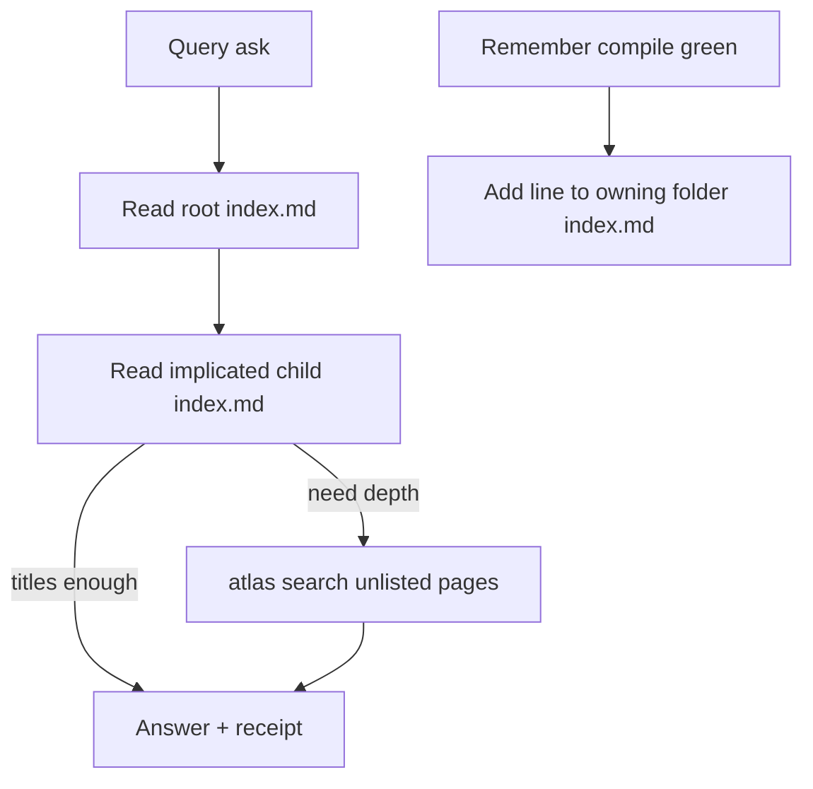

## Intent + scope

Change how agents recall Atlas memory so they behave like a person with a near notebook and a deeper archive.

**STM** is an ordered listing of fresh concept pages. Query reads it first. **LTM** is the rest of the store, reached only when STM is not enough, via `atlas search`.

This plan covers the organisation core and the instruction change. It does not implement forget, access telemetry, or product code in this discussion.

Pinned STM artefact: **every folder `index.md` is the short-term memory**. Root `index.md` is the nearest map of folders. Child folder indexes are the near maps of pages. There is no side working-memory file.

## Non-goals

- Forget, eviction, access counts, telemetry.
- Deleting concept pages when they leave STM.
- Turning SCHEMA 2.0 recall index (FTS5 under `.atlas-index`) into the human-readable STM list.
- Implementing Atlas CLI or skill files in this discuss turn.
- Filing the GitHub issue before the hub pins land (pins landed; issue is the next lineage step).

## Pins

| ID | Pin | Disposition |
|----|-----|-------------|
| P1 | Two-layer recall: STM listing first, then search | Accept (user) |
| P2 | New stored memories are added to the STM listing | Accept (user) |
| P3 | Atlas query, and any skill that says query-first, must name STM as the first focal point | Accept (user) |
| P4 | Every folder `index.md` is STM. Root index is the near folder map; child indexes are the near page maps. No side working-memory file | Accept (user, 2026-09-18) |
| P5 | Forget and access-count ranking are out of this plan | Accept (user) |
| P6 | Order means heat. Hottest at the top. Forget later drops from the bottom. Top-drop is not current reality | Accept (user, 2026-09-18) |
| P7 | Remember inserts new STM lines at the top of the owning folder index. Query is read-only. Heat in this slice is recency of write | Accept (user, 2026-09-18) |
| P8 | Layer 2 is `atlas search` over pages not listed in any folder `index.md`. Indexes are incomplete working sets. Compile completeness cannot stand | Accept (user, 2026-09-18) |
| P9 | Compile keeps `index_md_present`. Drops listing completeness. Fails on dangling STM links. Redefine or remove `index_md_listing` as “all children” | Accept (user, 2026-09-18) |

Rejected for this orbit: building forget because STM implies a bounded notebook. Parked on the protostar.

## Genesis Artifacts

### Intent + scope + non-goals

See sections above. Change-class **hardening** of path query and path remember instructions, not a new skill.

### Query algorithm (target)

```text
1. Path mount. Set --root.
2. Read root index.md (folder map). Cap.
3. Open the child folder index.md files that the ask implicates. Cap.
4. If listed titles/blurbs plus one hop answer the ask, stop.
5. If still a gap, atlas search restricted to concept pages not listed in those indexes (LTM).
6. Receipt records indexes_read and, if used, search_cmd.
```

Today path query skips the indexes and jumps to search. Discuss “query first” should mean this sequence.

### Remember algorithm (target)

```text
1. Write the concept page. Compile green.
2. Insert it at the top of the owning folder index.md. That write *is* the STM update.
3. If the folder is new, add it at the top of the parent index.md as well.
4. Query does not rewrite indexes.
```

### Diagram



### Cost note

STM is a short markdown read. It should be cheaper than a full-store search on the common path. Forget remains the bound that stops the listing growing without limit.

### Skills to change after approval

- Atlas path `query` and path `remember`
- Atlas compile: keep `index_md_present`, stop treating listing as completeness, fail dangling STM links
- Discuss process step “Query first”
- Any Autogenesis recall instruction that currently says search first

## Acceptance

- Path query names folder `index.md` files as the STM artefact. Root first, then the relevant child indexes.
- Path query’s procedure lists STM before `atlas search`.
- Path remember inserts new concept pages at the top of the owning folder `index.md` after compile green. Query does not rewrite indexes.
- Compile keeps `index_md_present`, drops completeness, fails on dangling STM links.
- Forget is absent from the implement slice. The protostar remains forming.
- A GitHub issue in `sergio-sisternes-epam/atlas` can link this plan path once pins P4, P6, P7 are answered.

## Residual risks

- Root `index.md` already has two jobs (human map and compile listing). A Fresh section may still confuse agents unless the skill text is blunt.
- Without forget, STM grows until it is just another full index. The protostar must be opened before that happens.
- SCHEMA 2.0 recall index might be mistaken for STM. Keep them distinct: one is markdown working memory, the other is a machine generation.

## Stop for approval

Approved 2026-09-18. File a GitHub issue on sergio-sisternes-epam/atlas that links this plan. Do not start Autogenesis implement from discuss.
