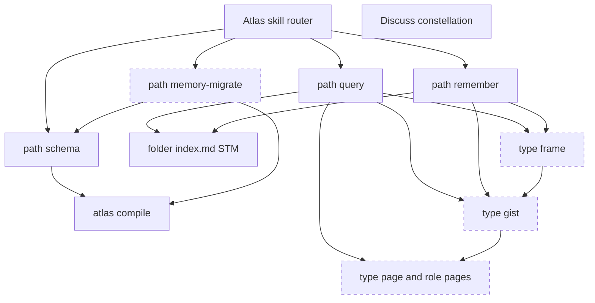
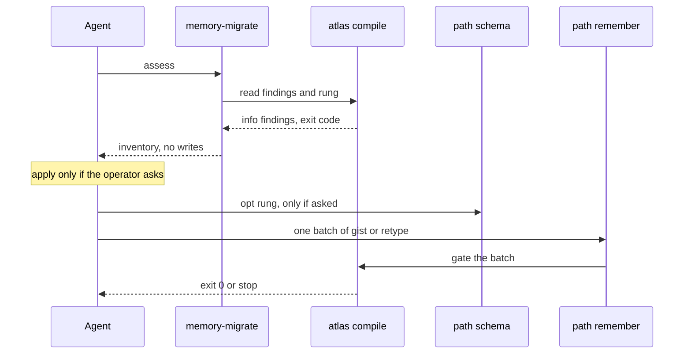
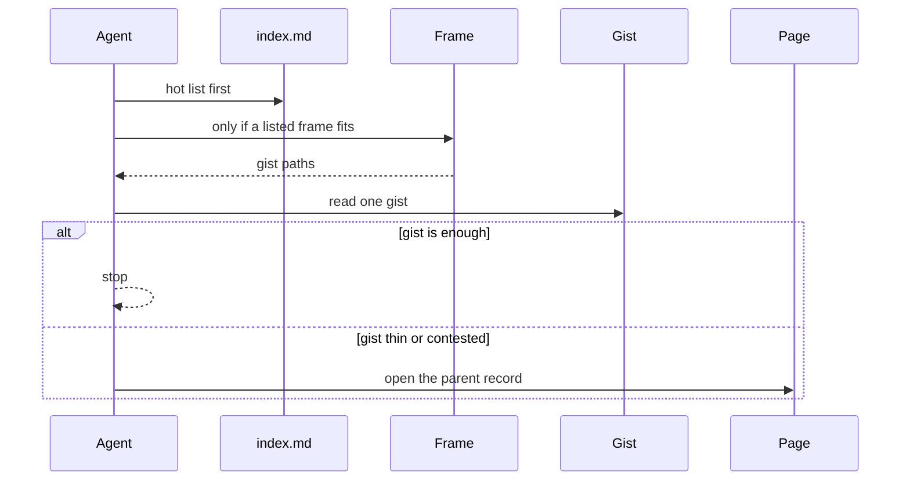

# Design — Atlas memory layers

Change-class: **new-surface**. Genesis depth: **full**, because Sergio required full Genesis on 2026-10-03 even though the class is not new-skill. This operation stops for approval. It does not implement product files and it does not commit or push.

## Intent

Agents should treat an Atlas as a memory, not as a document store. A recall walks frame, then gist, then page, and usually stops at the gist. The page stays, because a gist can be wrong or thin. Old document-era stores keep compiling. An agent can help migrate them instead of only printing compile noise.

## Scope

After an explicit approval, a later implement Run may:

- Name recommended SCHEMA types `gist`, `frame`, and `page` (role text: memory episode). Mark `document` legacy.
- Teach path query the abstraction walk without replacing the 2026-09-18 STM walk.
- Teach path remember where a gist and a frame are filed, and that a new gist enters the owning folder `index.md` as STM.
- Add compile findings on a strangler rung `info | warn | error`. Absent rung means `info`.
- Add Atlas path `memory-migrate` (assess, inventory, apply) as the migration assistant.
- Materialize the adversarial scenario file named below. Do not author Gherkin in Autogenesis.

## Non-goals

- This design Run writes no skill file, no SCHEMA.json, no scenario file, and no commit.
- Discuss constellation (the checkpoint) stays a Discuss path. It is not an Atlas type and not an Atlas path.
- Forget, eviction, and access counts stay parked on the STM protostar.
- No second Atlas, no `gists/` tree, no `frames/` tree, no RAPTOR rebuild.
- No gist of a gist. No frame whose members are pages rather than gists.
- Path `migrate` (storage relocate / rehost) is not this path. Path `configure` (recall index) is not this path. Path `schema` remains the only writer of SCHEMA.json.
- Experience, decision, lesson, recipe, work, and protostar stay recommended role types.
- CI merge-gate math stays as pinned on 2026-09-03: exit 2 fails the gate; exit 1 does not. This plan does not retune that.
- No unattended bulk rewrite of existing pages.

## Change-class

`new-surface`

## Pinned decisions

| ID | Pin | Disposition |
|----|-----|-------------|
| P1 | Three layers: page (episode), gist (one parent), frame (pattern across gists). Not "schema". Not "scaffold". | Accept. Sergio 2026-10-03. |
| P2 | Recall walk is frame, gist, page. Most recalls stop at the gist. Open the page when the gist is not enough. | Accept. |
| P3 | Folder `index.md` stays STM. Unlisted concept pages stay LTM. Do not collapse heat into the abstraction walk. | Accept. Follows approved plan `2026-09-18-index-md-semantic-memory`. |
| P4 | Gists and frames live in this Atlas. A gist is filed in the same folder as its one parent. A frame is filed in the nearest common folder of its gists. No sidecar tree. | Accept, with the cross-folder rule made explicit. |
| P5 | Discuss checkpoint (path constellation) stays in Discuss. | Accept. |
| P6 | Core concept is memory. `document` is legacy. | Accept. |
| P7 | SCHEMA names types `gist`, `frame`, and `page`. The `page` role text says memory episode. There is no second type id `memory`. | Modify. See rejected fragment below. |
| P8 | Enforcement is a strangler: `info`, then `warn`, then `error`. Missing key means `info`. Existing stores stay on `info` until they opt in. | Accept. |
| P9 | `type: document` is reported on that same rung, as an invitation to migrate, not as a silent rewrite. | Accept. |
| P10 | A missing gist is not a compile failure while pages are the record, until the store opts into `warn` or `error`. | Accept. |
| P11 | New path `memory-migrate` helps an agent migrate. It does not only emit compile noise. It does not apply writes unless the operator asks to apply. | Accept. Sergio 2026-10-03, this request. |
| P12 | Three axes stay distinct. Heat: STM `index.md` vs unlisted LTM. Abstraction: frame, gist, page. Write policy from `decisions/atlas-memory-layers.md`: episodic pages stay append-only; current-theory slots may supersede; compile may transform and demote. | Accept. Do not replace the 2026-09-03 write policy. |
| P13 | Gist parents are experience, decision, lesson, recipe, document, page, and protostar. Not work hubs, plans, indexes, gists, or frames. Missing-gist findings skip the excluded types. Protostar missing-gist is not reported. | Accept as scope control. |
| P14 | Rung storage is SCHEMA `memory.rung`, written only by path `schema`. Path `memory-migrate` reads it and never hand-edits SCHEMA.json. | Accept. Atlas hard rule 12. |
| P15 | Counts of documents, missing gists, and bad parents come from `atlas compile` (tool). Whether a repeated pattern deserves a frame is agent judgement and is not auto-written. | Accept. Tradeoff matrix section 9. |
| P16 | A new gist is inserted at the top of the owning folder `index.md` after compile green, per STM pin P7 of the 2026-09-18 plan. Query does not rewrite indexes. | Accept. |

### Pin fragment not taken as two type ids

Sergio asked the schema to name "page/memory". This plan names the type id `page` and puts "memory episode" in the role. It does **not** add a type id `memory`.

Why: the locked layer name is page. Decision `decisions/type-vocabulary.md` (2026-08-23, accepted) rejected `memory` as a grab-bag page type. Two ids for one layer would make agents guess. The word memory still appears in the role so agents see the core concept. If approval wants the id to be `memory` instead of `page`, that is a one-line change before implement. It is not implemented here.

No other locked pin was rejected.

## Challenge counters

Search-grounded. Catalog think-challenge was followed after the Autogenesis wrapper. Counters were not invented.

| Counter | Source | Severity | Disposition |
|---------|--------|----------|-------------|
| Gist is not a safe substitute for the record. Verbatim and gist are stored and retrieved apart. Gist supports false recognition when verbatim is not retrieved. False gist can outlast the true detail. | Brainerd and Reyna, Current Directions in Psychological Science, 2002, https://journals.sagepub.com/doi/10.1111/1467-8721.00192 ; Reyna, Brainerd et al., PMC4815269, https://pmc.ncbi.nlm.nih.gov/articles/PMC4815269/ | high | **Accept.** P2 and P10. Pages stay. Missing gist is not a failure at `info`. Query must open the page when the gist is thin or contested. |
| Abstractive summaries hallucinate. Multi-document summaries in one 2025 study contained about 20-45 percent hallucinated content on news and 52-75 percent on conversation, much of it off-topic rather than pure fabrication. | Ramprasad, Li, Ferracane, NAACL 2025 Findings, https://aclanthology.org/2025.findings-naacl.293.pdf | high | **Accept.** A gist is a derived page with `derived_from` to one parent. It is not the record. |
| Hierarchical summary trees drop detail and can chain errors. RAPTOR's own note found about 4 percent minor summary hallucinations and argued they did not propagate in that study. Later write-ups still warn that each summary can feed the next and that tree traversal is a rigid themes-to-details ratio. Collapsed search over every node is the paper's preferred, more expensive mode. | Sarthi et al., ICLR 2024, https://arxiv.org/abs/2401.18059 ; Meilisearch limitation note, https://www.meilisearch.com/blog/raptor-rag | high | **Reject** a generated summary tree. **Accept** a two-step walk only: frame to gist to page, one hop each. No gist-of-gist. Frames are authored when a pattern is already repeated, not built by clustering the store. |
| Schemas distort unfamiliar material toward what the reader already expects (Bartlett, War of the Ghosts; replicated by Bergman and Roediger, 1999). Later work (Ost and Costall tradition; urban-myth serial reproduction) says schema-compatible material is remembered more reliably, so frames are not automatically lies. | Bergman and Roediger, Memory and Cognition, 1999, http://psychnet.wustl.edu/memory/wp-content/uploads/2018/04/Bergman-Roediger-1999_MemCog.pdf ; Ost and Costall reading via https://www.tandfonline.com/doi/full/10.1080/09658211.2022.2059514 | high | **Modify.** Keep frames. A frame lists gists; it does not rewrite pages. The walk can still open the page. Do not treat the frame as current-theory truth. Write-policy P12 still requires a supersede, not a silent edit. |
| Stopping in a summary tier loses the archival record. MemGPT evicts by recursive summary, keeps full recall only if the agent pages it back, and has no strong correction semantics in the working summary. | Packer et al., arXiv:2310.08560, https://arxiv.org/abs/2310.08560 | high | **Accept** as a constraint on query. STM `index.md` is not deleted when a gist exists. Unlisted pages remain searchable LTM. |
| Warning noise is ignored or suppressed. Static-analysis suppressions hide real findings; CI studies list "ignore warning" as a fix pattern. A permanent info rung that nobody acts on is the compiler that cried wolf. | FSE 2025 suppressions study, https://software-lab.org/publications/fse2025_suppressions.pdf ; CI compilation warning fix patterns, https://cicompilation.github.io/ ; Kuiper, "The Compiler That Cried Wolf", https://research.rug.nl/en/publications/what-warnings-do-engineers-really-fix-the-compiler-that-cried-wol/ | high | **Accept** by adding path `memory-migrate`, not by forcing `error` on every old store. Info stays non-failing (P8, P10). The assistant is the action path. |
| Strangler migrations stall as a permanent hybrid, or they turn into a big-bang rewrite. Fowler's strangler grows the new path beside the live one and retires a slice only after it works. | Fowler, https://martinfowler.com/bliki/StranglerFigApplication.html ; hybrid-trap discussion, https://www.moonello.com/insights/the-strangler-that-never-strangles-preventing-the-permanent-hybrid-trap | high | **Accept.** Default rung `info`. Apply is operator-asked, batch-sized, and compile-gated. No bulk rewrite. Document pages keep resolving until migrated. |
| Fast writes into a slow overlapping store overwrite older knowledge (CLS). | O'Reilly review of McClelland, McNaughton, and O'Reilly, already stored at `lessons/complementary-learning-systems.md`, sources on that page. | medium | **Accept** via P12. Filing a gist beside a page is not a license to edit the page. The lesson's word "schema" is the cognitive term. The Atlas layer name remains frame. |

## Genesis Artifacts

Full depth, not mini-genesis. Design ends at the handoff packet. No natural-language skill body is drafted in this Run.

### Intent, scope, non-goals

See the sections above. One capability: recall and migrate Atlas memory across page, gist, and frame. The migration assistant is the activation surface of that capability, not a second product.

Dispatch description for the future path (implement materializes it; not written now). Imperative, under 1024 characters:

> Use this path when a store still treats documents as the core record, or when compile is only reporting legacy document and missing gist noise, and you need to migrate toward Atlas memory. Triggers include document-era store, old scheme, legacy type document, missing gist, memory rung, opt in from info to warn. Do not use it to relocate a store (path migrate), to install the recall index (path configure), to edit SCHEMA.json by hand, or to run a Discuss checkpoint.

Binding: DISCOVERY. The Atlas root stays FORCED for store operations; this path is selected when the intent is migration help.

Cost stance: **balanced**. No dollar cap was set. No task() spawns. Per-spawn declaration table: none.

### Component diagram



Existing: router, query, remember, schema, compile, index.md, Discuss constellation. New: path memory-migrate, types gist, frame, and page. Discuss has no edge into Atlas. That missing edge is the checkpoint pin.

Shapes: router, query, remember, schema, memory-migrate, and Discuss are SKILL path modules. Compile is a deterministic tool (S7). index.md, page, gist, and frame are ASSET pages. No new PERSONA. No ORCHESTRATOR skill.

### Sequence diagram

One thread. Shared store, so no fan-out. One writer.



Query sequence, same single thread:



### Tradeoff check

Two shapes fit migration: A2 PIPELINE versus RECONCILIATION LOOP.

Chosen: **A2 PIPELINE** (assess, inventory, optional apply, compile gate). Matrix: pattern-tradeoffs section 4, threading. The store is one shared sink, so the row is sequential, not parallel. Section 9, execution doctrine, row 1: apply is a side effect, tool-delegated through remember plus compile, and gated by an operator ask (B10 on the apply step only). Row 3: the inventory prose is LLM judgement. Row 2: document counts and missing-gist counts are facts from compile, not from memory.

Rejected for this slot: RECONCILIATION LOOP. That pattern drives a queue to a terminal state without a person. P11 forbids unattended apply. Anti-pattern inherited if someone later removes the ask: the loop would bulk-rewrite the store.

B4 PLAN MEMENTO and B8 ATTENTION ANCHOR both apply. Matrix section 7: this is multi-file implement work, so the combination is the default. The memento is this plan. The anchor, at implement time, is P1-P3, P5, P8, P10, and P11.

Refactor pass before the topology pick: R1 SPLIT does not fire. Atlas stays one skill. R2 FUSE does not fire. Path migrate and path memory-migrate have different trigger nouns (relocate versus document-era memory). R3 EXTRACT does fire for the procedure: a path module under `references/paths/`, which is the existing Atlas shape, not a new catalog skill.

### Composition decision

| Box | Mode | Why |
|-----|------|-----|
| Path memory-migrate | LOCAL SIBLING | Reused only inside Atlas. Same tree as path ci and path migrate. |
| Query and remember text | LOCAL SIBLING | Edits to existing path modules. |
| Type names and memory.rung | INLINE schema asset | Unique to this store contract. Written later by path schema, not by hand in this Run. |
| Compile findings | INLINE in the existing compile tool | Same validator. New severity `info` that does not change the exit code. |
| Discuss constellation | EXTERNAL, untouched | No dependency edge. Checkpoint stays there. |
| agent-spec | EXTERNAL, deferred | Not installed. Not called. |

No new distribution module. No manifest. Transitive closure adds nothing beyond Atlas itself. Version pin is the Atlas skill release that implement will cut; this plan does not pick a number.

Substrate contract: the future path does not invoke another skill. It must not load Discuss to "store the checkpoint". If a later change makes it call another skill, that change needs its own design and the multi-harness substrate contract.

### Cost check

Stance balanced.

| Module | Role class | Prefix | Output | Tools | Shape |
|--------|------------|--------|--------|-------|-------|
| Query, gist hit | trivial | S | S | read index, read gist | B2, stop early |
| Query, page open | implementer | M | S | one more read | rare branch |
| memory-migrate assess | implementer | S | S | atlas compile | A2 stage |
| memory-migrate inventory | planner | M | M | compile JSON plus reads | judgement, no writes |
| Frame mining of the whole store | not used | XL | L | would be many LLM calls | rejected, RAPTOR cost |

Section 10: the dominant bucket of the common recall is input tokens on pages the agent did not need. The cost pattern is B2 (open the page only on the thin-gist branch) plus B11 fold-by-default (do not load every gist). B12 model router is not added; recall stays on the agent already in the session. B15 is not added; no new tool catalog. No cache-invalidating timestamp in the path body.

### SoC pass

- Path migrate keeps storage relocate and rehost.
- Path configure keeps recall-index policy.
- Path schema keeps SCHEMA.json and schema.d.
- Path ci keeps the institutional merge gate.
- Path memory-migrate only assesses, drafts an inventory, and applies page batches when asked.
- Compile only reports. It does not migrate.
- The 2026-09-03 write-policy decision stays the rule for edits. This plan adds an axis; it does not supersede that decision.

### Compliance notes

- B8 and B4 are mandatory and recorded above.
- ASCII for the future path body. This plan keeps prose readable.
- Single responsibility: one migration path, one compile ladder, one recall walk.
- Anti-patterns named so implement can see them: A2 STAGE COLLAPSE (do not migrate inside this design), S4 WRAPPING WITHOUT BLOCKING (info is allowed only because the assistant exists; do not "fix" info by failing old stores), S5 PROXY SPRAWL (one hop, not an index of indexes), B2 ALL-BRANCHES-LOADED (do not paste the migration procedure into query).

### Interface sketch

SCHEMA block, absent means rung info:

```text
memory:
  rung: info
  layers: [frame, gist, page]
  legacy_types: [document]
```

Recommended type roles:

```text
page: memory episode. The record a gist may summarize. Not a format contract.
gist: short summary of exactly one parent. relates_to that parent, kind derived_from.
frame: repeated pattern across two or more gists. relates_to those gists, kind related. Not the word schema.
document: legacy durable object. Still valid to read. Reported on the rung.
```

Compile finding, new severity `info` (exit unchanged):

```text
id: legacy_document | missing_gist | gist_parent | frame_members
severity: info | warning | critical
path: <page>
msg: <one line that invites migration>
```

Rung map:

| Rung | legacy_document and missing_gist | Exit |
|------|----------------------------------|------|
| info (default) | severity info, not a failure | 0 if nothing else is wrong |
| warn | severity warning | 1 |
| error | severity critical | 2 |

`gist_parent` (not exactly one parent) and `frame_members` (fewer than two gists) use the same map. At info they are reported and do not fail.

Path card:

```text
skill: atlas
path: memory-migrate
path_module: references/paths/memory-migrate.md
intent: assess or migrate a document-era store
root: <resolved SCHEMA root>
rung: info | warn | error
mode: assess | inventory | apply
```

`assess` and `inventory` do not write. `apply` requires an operator request that names the batch. Apply uses path remember, then compile. A red compile stops the batch.

Query receipt gains `stopped_at: frame | gist | page` and, when a page is opened, `opened_page_reason`.

### Cost projection

Bands are the contract. A normal recall that stops at a gist: prefix S, output S, turns low, role trivial. An assess: one compile, output S. An inventory: output M, role planner, no writes. A refused RAPTOR rebuild is out of the cap by being out of the design. No spawn multiplier.

### Handoff todos (implement, after approval only)

1. Path schema: add types and optional `memory.rung`. Do not hand-edit SCHEMA in a store.
2. Compile: info severity, four finding ids, rung map, default info.
3. Path module `references/paths/memory-migrate.md` and one registry row. Description as sketched.
4. Path query: STM first, then frame, gist, page. Do not delete the LTM search step.
5. Path remember: gist placement, frame placement, STM insert, no in-place rewrite of the parent.
6. Write `references/scenarios/memory-layers-adversarial-v1.yaml` from the draft in this plan. Do not drop a smoke.
7. Ask agent-spec `specify` for the behavioural contract, or keep the deferral if it is still absent.
8. Tests for exit codes. Compile this store and expect exit 0 at rung info even with legacy documents.

### Stop for approval

Design stops here. Do not implement the skill, the schema, or the scenario file until this plan is explicitly approved.

## SOLID record

| Principle | Status | Rationale / design consequence |
|-----------|--------|--------------------------------|
| S | applicable | Path memory-migrate owns assisted migration. Compile owns the report. Query owns the walk. Schema owns the type names. A change to recall order must not require editing the migration procedure. |
| O | applicable | Stable names: page, gist, frame, and the walk order. The governed extension is `memory.rung` (info, warn, error), justified by real stores that cannot fail closed yet. New layers are a new design, not a plugin point. |
| L | trade-off | Gist must not substitute for its parent: it is lossy and can be false (Brainerd and Reyna). Document remains readable, so old callers do not break, but it is not interchangeable with page once the store opts into warn or error, because the failure semantics change. Experience, decision, lesson, and recipe are not substitutes for page; they stay more specific roles. |
| I | applicable | Assess does not load apply. Query does not load the migration procedure. The path card carries root, rung, and mode so a caller has the authority and the blocker (apply without an operator ask). |
| D | trade-off | The path depends on the Atlas compile contract and SCHEMA types, which are the stable capability. It does not depend on a harness chat format. No extra adapter is added. The concrete `atlas compile` CLI stays, because the skill already owns that tool and a wrapper would be speculative. |

## Catalogue Review

In scope: new activation path, recall topology, and an opt-in enforcement gate.

Genesis matches:

| Pattern | Relation | Id |
|---------|----------|----|
| PIPELINE | uses | A2 |
| CONDITIONAL DISPATCH | uses | B2, rung and thin-gist branch |
| PLAN MEMENTO | uses | B4, this plan |
| ATTENTION ANCHOR | uses | B8, locked pins |
| VALIDATION DECORATOR | uses | S4, compile between batches |
| DETERMINISTIC TOOL BRIDGE | uses | S7, compile counts |
| HUMAN CHECKPOINT | uses | B10, apply step only |
| FOLD-BY-DEFAULT | uses | B11, do not load every page |
| FAN-OUT + SYNTHESIZER | none | B1, one writer, one lens |
| PANEL | none | A1, lens count is one |
| RECONCILIATION LOOP | conflicts if unattended | not selected |
| ACTIVATION CARD | uses | B17, existing Atlas card |

Autogenesis extensions: B17 is the card the new path inherits. Atlas already renders path cards. This design does not invent a second card protocol.

Composition mode: LOCAL SIBLING for the path; INLINE for schema names and compile findings; EXTERNAL untouched for Discuss.

Inherited anti-patterns: A2 STAGE COLLAPSE, A2 INFINITE PLANNING, S4 WRAPPING WITHOUT BLOCKING, S5 PROXY SPRAWL, B2 ALL-BRANCHES-LOADED, RECONCILIATION without a stop. Delta only: info-level findings are non-blocking on purpose; the assistant is what keeps that from being "wrap without blocking".

Admission: `pattern_applicability: applicable` for B17 and the genesis patterns named above. `autogenesis:S8` applicability: **not-applicable**. Atlas path modules under `references/paths/` are already the parent-routed leaves. S8's `references/modules/<name>/SKILL.md` shape would add a second module system. `pattern_admission: not-selected` for S8. B17 stays **active** and is not re-admitted. S8 is not promoted.

## Behavioural contract (agent-spec)

deferred: agent-spec is not installed here and this design Run must not write product .feature files

Ownership sentence: agent-spec owns writing and evolving all behavioural Gherkin specifications. Autogenesis supplies this design packet and will consume the contract section and `b-` ids, or keep an explicit deferral.

No `.feature` file was written. `@forbidden` and `@critical` names are not invented as if specify had run. The adversarial smokes below are the stand-in until specify runs on an approved implement.

## Evaluation plan

Deterministic smokes are primary. Agent narrative is not evidence for a check a command can do.

| Contract family | Check | Command shape (implement) |
|-----------------|-------|---------------------------|
| Default rung info | Store with `type: document` and no gist exits 0 and prints info, not critical | `atlas compile --root <fixture>` |
| Opt-in warn | Same fixture with `memory.rung: warn` exits 1 | `atlas compile --root <fixture>` |
| Opt-in error | Same fixture with `memory.rung: error` exits 2 | `atlas compile --root <fixture>` |
| Absent rung | No `memory` block behaves as info | `atlas compile --root <fixture>` |
| Gist parent | Two parents or zero parents reported; not a failure at info | compile JSON id `gist_parent` |
| Frame members | Frame with one gist reported; not a failure at info | compile JSON id `frame_members` |
| Sidecar forbidden | No required `gists/` or `frames/` directory | file absence |
| Path identity | Registry row `memory-migrate` exists and path migrate's description does not gain document-migration triggers | file read |
| Checkpoint | Discuss path list still owns constellation; Atlas path registry does not gain checkpoint | file read |
| STM text | Path query still names folder `index.md` before search, and also names frame then gist then page | file read |
| Apply gate | Path text says assess and inventory do not write | file read |

Current Autogenesis `suite-index.json` families (catalogue-review, solid, specify-only, atlas-storage-semantics) check Autogenesis authoring, not this subject's compile. Implement records Atlas skill test output. It does not treat those suites as the product gate.

This design Run's only executed store check is `atlas compile` on the subject Atlas after the plan and work node exist. That shows the memory write is green. It does not show the future rung behaviour.

## Adversarial scenario draft

Not written to the skill tree in this Run. Implement creates:

`references/scenarios/memory-layers-adversarial-v1.yaml`

```yaml
id: memory-layers-adversarial-v1
packages: [atlas]
work_id: 2026-10-03-atlas-memory-layers
adversarial: true
smokes:
  - id: stop-at-gist
    source: "P2; Brainerd and Reyna 2002 fuzzy-trace"
    expect: "When the gist answers the ask, the procedure does not require opening the parent page."
  - id: open-page-when-gist-thin
    source: "PMC4815269; NAACL 2025 findings-naacl.293 summarization hallucination"
    expect: "When the gist is thin, contested, or the ask needs the record, the procedure opens the parent page."
  - id: stm-not-collapsed
    source: "approved plan 2026-09-18-index-md-semantic-memory; MemGPT arXiv:2310.08560"
    expect: "Folder index.md remains the hot list. Unlisted pages remain searchable. Frame and gist links are not a replacement index."
  - id: no-summary-tree
    source: "RAPTOR arXiv:2401.18059"
    expect: "A gist parent is a page, never a gist. A frame lists gists, never a stack of summaries."
  - id: default-rung-info-not-failure
    source: "P8; P10; FSE 2025 warning suppressions"
    expect: "With no memory.rung, legacy document and missing gist are info and compile exit is 0 aside from other faults."
  - id: warn-and-error-opt-in
    source: "P8; Fowler strangler fig"
    expect: "warn exits 1 and error exits 2 only when the store sets memory.rung. Existing stores are not flipped."
  - id: assistant-does-not-bulk-write
    source: "P11; Fowler strangler fig; permanent-hybrid risk"
    expect: "modes assess and inventory write nothing. apply writes only a named batch after an operator ask, then compile."
  - id: schema-not-hand-edited
    source: "P14; Atlas hard rule 12"
    expect: "memory-migrate does not write SCHEMA.json. Rung changes go through path schema."
  - id: checkpoint-stays-in-discuss
    source: "P5"
    expect: "No Atlas path or type named checkpoint or constellation is added. Discuss still owns constellation."
  - id: same-atlas-no-sidecar
    source: "P4"
    expect: "Gists and frames are ordinary pages in the store folders. No required gists or frames directory."
  - id: document-reported-not-rewritten
    source: "P6; P9"
    expect: "type document is reported on the rung and is not auto-retyped."
  - id: write-policy-intact
    source: "P12; CLS lesson complementary-learning-systems"
    expect: "The procedure does not rewrite an episodic page in place to match a gist or a frame."
```

Empty draft is forbidden. Implement may add smokes and may not drop these.

## C1-C5 and Genesis check

| Check | Result |
|-------|--------|
| C1 non-trivial counter | Yes. Gist false memory, summary hallucination, warning fatigue, strangler stall. |
| C2 high-severity pinned or rejected with rationale | Yes. Tree generation rejected. Dual type id modified. Others pinned. |
| C3 visible pins | Yes. P1-P16. |
| C4 scope intact | Yes. No forget, no checkpoint move, no product edits. |
| C5 no implementation in this operation | Yes. |
| change-class stated | new-surface. |
| Genesis Artifacts complete for full depth | Yes. Intent, scope, non-goals, component diagram, sequence diagram, composition, cost stance, acceptance, stop-for-approval. |

## Acceptance

- This plan exists at `autogenesis/plans/2026-10-03-atlas-memory-layers.md` with `type: plan`.
- Work node `work/2026-10-03-atlas-memory-layers.md` has `status: designed`.
- `atlas compile` on this store exits 0.
- No skill product file, scenario file, commit, or push comes from this Run.
- Approval is required before any implement Run.

## Stop for approval

Waiting for explicit approval of this pinned plan. Request implement only after that approval. Without approval, the plan is the only artifact.
