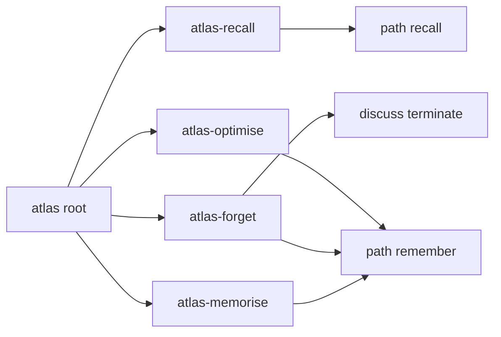

## Intent

Help agents use the locked four-layer Atlas model without a second memory model. Four thin operator paths live inside the atlas package. They do not add storage, a CLI, a schema, or a fifth layer.

## Scope

In: path modules `atlas-memorise`, `atlas-recall`, `atlas-forget`, and `atlas-optimise` under `references/paths/`; matching rows in the SKILL.md path registry and `references/help/index.md` catalog; root description triggers; a changelog section; a package prerelease bump one step past the base `apm.yml` version across the existing version surfaces; one adversarial scenario file; phrase tests. `atlas-recall` only points at existing path `recall`. `atlas-memorise` only checks layer choice and then loads path `remember`.

Out: separate APM packages; edits to branch `implement/2026-10-04-four-layer-migration`; fleet pin v0.12.0; schema 2.0; `atlas_release` stamp changes; install or compile hooks; new CLI verbs; rewriting path `recall` or path `remember` procedures; installing over the shared beta.5 skill tree.

## Non-goals

A dream theory, a new `kva` value set, automatic consolidation, and any push of the Master of Packages store.

## Change-class

`new-surface`. New path modules and registry rows. Not a new package (`new-skill` declined).

## Scope cut (accepted)

These must not be separate packages. A second package would copy the memory model and drift from paths `recall` and `remember`. Nielsen's progressive-disclosure write-up (NN/g, 2006) says designs past two disclosure levels lose users, and a duplicate surface would add another place to get lost. The four names are path ids inside atlas. `atlas-recall` is not a second read procedure.

## KVA for atlas-forget (short pin)

The atlas repo does not define keep / vary / abandon. Discuss uses KVA as Knowledge Variance Authority and the `kva` field as traffic (`alive`, `forming`, `terminated`). For this path only: keep means leave the page; vary means change it through path `remember` so the owning gist and schema cascade; abandon means mark it out of default recall with existing `kva: terminated` through discuss path `terminate`, without deleting the file. No new traffic values.

## Locked model (do not reopen)

Recall walks index, then schema, then gist, then memory, and stops when the level answers. `index.md` is a cue list, not a content layer. One gist forces one schema. A second schema is legal. Compile fails only on gist with no schema, schema missing from index, or stale upper page. Suffixes are search handles. `hub.md` is not a memory level.

## Genesis Artifacts

### Component sketch



Composition: INLINE paths. Not external packages. Not a sibling skill.

### Interface sketch

Each new path has frontmatter `name`, `description`, and `path_id` equal to the filename stem. Enter is an activation card with `path` and `path_module: references/paths/<id>.md`. No new CLI. Registry row shape, one module per row:

`| **<id>** | <when> | `references/paths/<id>.md` |`

`atlas-memorise` procedure: confirm the write is a layer choice under the locked model; do not write pages or compile here; load path `remember` and follow it. State that one gist forces one schema, a second schema is legal, suffixes are search handles, and `index.md` is only a cue list.

`atlas-recall` procedure: load `references/paths/recall.md` and follow that path. Do not restate the walk, the stop rule, or search. Say this path is not a memory layer.

`atlas-forget` procedure: operator names pages to drop; apply the short KVA pin above; keep writes nothing; vary returns to `remember`; abandon loads discuss `terminate` and does not delete. Do not run during compile or install.

`atlas-optimise` procedure: operator-chosen only. Not on install, not on compile, not on init, not on memory-migrate. Optional folder consolidation. Do not invent gist text. Do not create a memory claim that is not already in the derived page. Moves that would break schema coverage, index cues, or stale-upper-page checks stop and hand off to `remember`. Cost scales with the chosen scope, including the whole store when the operator names the root.

### Cost note

Hot path cost is four short instruction files. No extra model call and no index build. `atlas-optimise` is expensive and off the hot path; work grows with the named scope. Do not hide that cost inside compile.

### Acceptance

Registry and help catalog list the same ids, including the four new ones, and each file exists. Tests assert the scope-cut phrases: not a separate package, load path recall, keep/vary/abandon pin, not on compile, not a fifth layer. `python3 -m unittest discover -s scripts -p 'test_*.py'` passes. No new `atlas.py` command. `atlas_release` unchanged.

### Stop-for-approval

Operator instruction on 2026-10-04 already approved implement and test if this scope cut is accepted. It is accepted here. Implement may proceed. Merge of the product PR is also pre-approved with `require_copilot` off and `require_panel_review` off, no `--admin`, no `--auto`.

## SOLID

| Principle | Status | Rationale / design consequence |
|---|---|---|
| S | applicable | Each path owns one operator job: choose layers, navigate, drop, or consolidate. Storage stays on `remember`. |
| O | applicable | The locked four-layer contract stays closed. Extension is a new path, not a rewritten recall procedure. |
| L | not-applicable | No path claims to be interchangeable with `recall` or `remember`. `atlas-recall` delegates; it is not a substitute implementation. |
| I | applicable | Callers load one path. `atlas-recall` does not repeat the recall procedure. |
| D | trade-off | Paths depend on atlas path files and discuss `terminate` by name. No adapter. The dependency is the capability, not a harness. |

## Catalogue Review

Genesis catalogue matches: none required beyond the existing atlas B17 activation card, which these paths use. Autogenesis extension: B17 active, used. `autogenesis:S8` applicability: not-applicable for a new package split; the atlas path layout already is the module shape. Admission: not-selected. Composition: INLINE. Inherited anti-pattern avoided: a second catalogue skill that restates memory. Delta: four path files and registry rows only.

`pattern_applicability: applicable` for B17 cards. `pattern_admission: not-selected` for S8.

## Pinned decisions

1. Not separate packages. Accepted from the duplicate-surface counter (NN/g progressive disclosure; information hiding).
2. `atlas-recall` delegates to path `recall` and does not restate the walk. Accepted. Rejects a second stop rule that would fight "always run search" inside recall.
3. Forget uses the short keep/vary/abandon pin and existing `kva: terminated`. Rejects new traffic values and file deletion. Source: discuss SKILL.md Knowledge Variance Authority versus this request.
4. Optimise is operator-chosen, never on install or compile, and must not invent gist text. Accepted from gist-based false memory during consolidation (PLOS One DRM / fuzzy-trace note). Rejects an automatic dream pass.
5. These paths are not a fifth memory level. Accepted from Nielsen's warning on deep disclosure stacks. The locked four levels stay as they are.
6. Do not edit the migration work. Accepted so this PR cannot change `memory-migrate` into an optimise hook.

## Challenge summary

C1: non-trivial counters were the duplicate package, the KVA name clash, unattended consolidation, and a fifth layer. C2: the consolidation counter is high severity and is pinned as operator-only with no gist invention. C3: pins are this section. C4: four named operators remain; none were dropped. C5: this page does not implement product files.

## Behavioural contract (agent-spec)

deferred: instruction paths only; no new CLI; agent-spec specify not invoked; deterministic registry and phrase checks cover the contract. No `@forbidden` Gherkin is authored here. The phrase tests are the forbidden-behaviour checks.

## Evaluation plan

Deterministic, primary:

- `scripts/test_help_paths.py` catalog equals registry.
- New `scripts/test_operator_skills.py` asserts, by file read: no separate package; `atlas-recall.md` tells the agent to load `references/paths/recall.md` and does not contain a second copy of the walk heading; `atlas-forget.md` contains keep, vary, and abandon and `kva: terminated`; `atlas-optimise.md` contains not on install and not on compile; none of the four files calls itself a memory layer.
- `python3 -m unittest discover -s scripts -p 'test_*.py'`.
- Product `atlas.py` has no command named for these paths.

Agent narrative is not evidence.

Throwaway test after merge: clone `master-of-packages@atlas.sesispla.net:repos/atlas.git` branch `atlas` to a scratch directory and run the merged commit's `scripts/atlas.py` validate and compile against that copy. Do not push that store. Do not replace `/home/box/agent-data/workflows/atlas`.

## Adversarial scenario draft

Filename at implement: `references/scenarios/atlas-operator-skills-adversarial-v1.yaml`.

```yaml
id: atlas-operator-skills-adversarial-v1
packages: [atlas]
work_id: 2026-10-04-atlas-operator-skills
adversarial: true
smokes:
  - id: not-separate-packages
    source: "NN/g progressive disclosure (Nielsen 2006); skill-design-principles information hiding"
    expect: "The four operators are path modules in the atlas package. apm.yml name stays atlas. No packages/ tree and no sibling skill package."
  - id: recall-delegates
    source: "references/paths/recall.md; Nielsen wrong-split warning"
    expect: "atlas-recall loads references/paths/recall.md and does not restate the index, schema, gist, memory walk."
  - id: forget-short-kva
    source: "discuss SKILL.md Knowledge Variance Authority; this plan's short pin"
    expect: "keep leaves the page, vary uses path remember, abandon uses kva terminated and does not delete the file. No new traffic values."
  - id: optimise-operator-only
    source: "PLOS One DRM gist false memory during consolidation"
    expect: "atlas-optimise is operator-chosen, not on install, not on compile, and must not invent gist text."
  - id: no-fifth-layer
    source: "Nielsen 2006, designs beyond two disclosure levels lose users; locked four-layer model"
    expect: "The four paths are operators, not a memory rung. hub.md stays outside the walk."
  - id: migration-not-hooked
    source: "concurrent work_id 2026-10-04-four-layer-migration"
    expect: "This change does not make memory-migrate, install, init, or compile run atlas-optimise."
```

## Implement notes

Product edits via Copilot CLI only, branch off current `origin/main`, one PR. Do not use `--admin`. Do not request Copilot review. Do not push the Master of Packages atlas. Do not write `CONTRACT.json` into this store.
