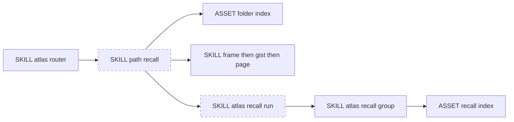

# Design — rename path query and the search step to recall

Change-class: **new-surface** (CLI and path rename). Genesis depth: **mini-genesis**. Catalogue review is **n/a**: this renames an existing path and CLI word. It does not add a topology, a gate, a fan-out, or an extension contract.

Read against product branch `implement/2026-10-03-atlas-memory-layers` at `c073bc3` (parent `7566b2b`), pull request https://github.com/sergio-sisternes-epam/atlas/pull/42. This operation does not edit that branch.

approval_ref: **t226u** (Sergio, 2026-10-04, chat, before this plan was shown). This operation does not implement. The parent may start implement only if this pinned plan matches the stated pins: path `query` becomes `recall`; search ceases to be a separate command; the walk is unchanged; hard cut in this beta.

## Change-class

`new-surface`

## Genesis Artifacts

### Intent

Agents should ask an Atlas to recall, not to query and then search. The path that walks frame, then gist, then page — and that usually stops at the gist — is named `recall`. The receipt step that must still run keeps the exit valid, under a recall field, not under a separate search command. The recall index that already exists stays the only index.

Dispatch description for the renamed path module (implement copies this into frontmatter, not this plan):

> Use this path when an agent needs an answer from an Atlas store: recall a frame, then a gist, then a page, and usually stop at the gist. Trigger on recall, find in the atlas, what does the store say, look up a decision or work hub, even when the user says query or search. Do not use it to write pages, compile, configure the recall index, or migrate memory layers. Invocation: FORCED when the Atlas router selects retrieval. Boundary: one path, one receipt field, no second index.

### Scope

After the parent starts implement because these pins match, that later run may, on the atlas product skill only:

- Rename path `query` to path `recall`. Replace `references/paths/query.md` with `references/paths/recall.md`. Delete the old path file. Do not leave a forwarding stub.
- Remove CLI commands `search` and `query`. They are not aliases.
- Invoke the same discovery tool as `atlas recall run "<text>"` with the flags `search` has today (`--root`, `--limit`, `--engine`, `--json`, `--include-exits`, `--profile`, `--allow-partial`). Same process, same exit codes, same hit payload.
- Rename the exit receipt field `search_cmd` to `recall_cmd`. Rename receipt value `stopped_at: search_hit` to `stopped_at: recall_hit`.
- Point the router, help, and getting-started at path `recall` and `atlas recall run`. The help and getting-started exception that may call the tool under its own card uses `atlas recall run --engine grep`, still not path recall, and still must not build a recall index.
- Update tests and the changelog. Under Removed, mention path `query` and commands `search` and `query` once.
- Materialize `references/scenarios/recall-rename-adversarial-v1.yaml` from the draft in this plan. Do not drop `memory-layers-adversarial-v1.yaml`.

### Non-goals

- No product edit in this design operation.
- No second recall index and no rename of `atlas recall status`, `profiles`, `show`, `validate`, `activate`, `disable`, or `index build`.
- No rename of the SCHEMA object key `query` (`query.search_engine` and the rest of that object stay).
- No change to the walk: hot-list `index.md` first, then frame, gist, page; stop at the gist when it answers; open the page only when the gist is thin, contested, or the ask needs the record.
- No drop of the receipt step. A gist answer does not skip `recall_cmd`.
- Do not reverse memory-layers pins: gists and frames live beside pages; `document` stays a legacy type; assess and inventory stay read-only via compile `--dry-run`; absent `memory.rung` means info and compile exit 0 aside from other faults.
- Do not retune CI merge gates. Do not merge. Do not tag.
- No compatibility alias for `query`, `search`, `search_cmd`, or `search_hit` in this beta.
- No `.feature` files. agent-spec is not installed.
- No edit to other skills that still say path `query`. That adoption is a later change.
- Glossary heading "Search aliases" stays. It is a token table, not a command.

### Diagram



Path `recall` and `atlas recall run` are the new names. The recall group and the recall index already exist. One writer of the index remains `atlas recall index build`. Retrieval does not build it.

### Interface sketch

| Surface | After this change | Notes |
|---|---|---|
| Path id | `recall` | Was `query`. Module `references/paths/recall.md`. |
| Card | `path: recall` | `path_module: references/paths/recall.md` |
| Tool | `atlas recall run "<text>" --root <root> --json` | Same flags and payload as `atlas search`. |
| Removed commands | `atlas search`, `atlas query` | Hard cut. Ordinary "no such command" usage error. |
| Receipt | `path: recall`, `recall_cmd: atlas recall run "…" --root …` | Missing `recall_cmd` means incomplete exit. |
| `stopped_at` | `frame \| gist \| page \| recall_hit \| gap` | `search_hit` is removed. |
| Unchanged group | `atlas recall status \| profiles \| show \| validate \| activate \| disable \| index build` | Not a second index. |
| SCHEMA | key `query` unchanged | Engine config is not the path name. |

Composition: the path body stays INLINE in the atlas skill. `atlas recall run` is INLINE on the existing Click group. No external module. Declared target: common-only. Invocation of the path: FORCED from the atlas router.

### Cost note

Stance: frugal. No new model class, no fan-out, no extra retrieval call. A recall still reads the hot list, usually one gist, and runs one discovery command. Runtime token cost is unchanged from path query. Implement cost is one mechanical edit of the skill, the CLI registration, tests, and the changelog on the existing pull request. Workload S (wording only) is too small because the CLI word must move. Workload M is this rename. Workload L, a sweep of every consumer skill, is out of scope and is not authorized by approval of this plan. No cost cap is set. L is not attempted, so no cap is exceeded.

### Acceptance

- `references/paths/query.md` is gone. `references/paths/recall.md` describes the same walk and requires `recall_cmd` on every exit.
- `atlas search` and `atlas query` are not commands. `atlas recall run` returns the same discovery result the old search command returned for the same store and text.
- `atlas recall index build` and `atlas recall status` still exist and still manage the one recall index.
- SCHEMA still has object key `query`. No store migration.
- Changelog Removed names `query` and `search` once.
- Memory-layers adversarial file still present. New adversarial file present with the smokes below.
- Compile rung behaviour and CI gate behaviour unchanged.

### Stop for approval

approval_ref is t226u, recorded here because Sergio approved on 2026-10-04 before this plan was shown. This design operation still stops. It does not implement, merge, or tag. The parent will start implement only if this pinned plan matches the stated pins: path `query` becomes `recall`; search ceases to be a separate command; the walk is unchanged; hard cut in this beta.

## SOLID

| Principle | Status | Rationale / design consequence |
|---|---|---|
| S | applicable | Path `recall` owns one user-facing job: answer from the store by the existing walk plus one receipt step. Index admin stays on the recall group. The walk and the receipt step are one retrieval, so they are not split into two paths. |
| O | trade-off | The competing property is a compatibility extension for old names. This beta closes that extension. The governed change is the versioned hard cut, not an alias point. Observed variation did not earn a shim. |
| L | applicable | `atlas recall run` must keep search's preconditions, flags, hit payload, and exit codes. Path `recall` must keep path query's walk and failure rule: no `recall_cmd` means the exit is incomplete. Group subcommands do not change authority or failure behaviour. |
| I | applicable | A caller loading path `recall` does not load index activation or memory-migrate. The receipt carries `recall_cmd`, hits, pages, and `stopped_at`, which is enough to see that the step ran. Help stays an explanation path and does not become retrieval. |
| D | trade-off | The essential dependency is discovery over a resolved store root, not the string `search`. No adapter is added for old command names. The concrete CLI stays Click. SCHEMA key `query` stays because it is stored config, and renaming it would be a second abstraction this change did not earn. |

## Pinned decisions

Think-challenge ran against this candidate after the subject Atlas was resolved. Counters are grounded. Alias decision: **hard cut**. `query` and `search` are not accepted aliases for one release. The changelog mentions them once as removed.

| ID | Counter | Source | Severity | Disposition |
|---|---|---|---|---|
| C-alias | A hard cut breaks scripts that call `atlas search` or `atlas query`. Hyrum's law says observable command names get depended on. SemVer's deprecation FAQ asks for one minor that deprecates before a major removes. | https://www.hyrumslaw.com/ ; https://semver.org/ ; https://github.com/semver/semver/blob/master/semver.md | high | Reject the alias window. SemVer 2.0.0 item 4: major version zero may change at any time and the public API should not be considered stable (https://semver.org/spec/v2.0.0.html). Atlas is 0.13.0, untagged, called a beta on this work. Pre-1.0 hard cuts without shims are an existing practice (https://abicheck.github.io/abicheck/contribute/adr/043-cli-pre-1-0-surface-reset/). Pin: hard cut in this beta. Changelog Removed mentions path `query` and commands `search` and `query` once. No alias, no deprecation warning that still runs the old command. |
| C-click | `atlas recall` is already a Click group (`status`, `profiles`, `show`, `validate`, `activate`, `disable`, `index`). A group and a positional query command cannot share that name. Replacing the group would move or duplicate the recall index. | Product `scripts/atlas_cli/cli.py` group `recall` at `c073bc3`; https://click.palletsprojects.com/en/stable/commands-and-groups/ | high | Accept the collision. Modify the naive spelling. Pin: do not register `atlas recall "<text>"`. Register `atlas recall run "<text>"` on the existing group. `search` and `query` commands are deleted, so search is not a separate command. The index commands stay. This does not invent a second index. |
| C-schema | Renaming SCHEMA key `query` would rewrite every store's engine config and is not the path rename. | This store's `SCHEMA.json` object `query`; CLI help "override SCHEMA query.search_engine" on `c073bc3` | high | Reject the schema rename. Pin: SCHEMA key `query` stays. Only the path and the CLI commands change. |
| C-metric | In information retrieval, recall is a metric (relevant retrieved divided by relevant total), not a command. Overloading the word can confuse evaluation talk. | https://cycode.com/blog/improving-precision-and-recall/ | medium | Reject a different command name. The decision page already uses recall for the walk and the index. The metric is an evaluation word, not a second Atlas index. Pin: do not invent another name and do not invent another index. |
| C-walk | A rename can tempt an implementer to drop the always-on search step or to retune memory-layers. | `references/paths/query.md` on `c073bc3` steps 3 and 5; decision `decisions/2026-10-04-recall-renames-query-path-and-search.md` | high | Accept as a constraint, not a redesign. Pin: the walk stays. `recall_cmd` still always runs. Memory-layers pins and CI gates stay. |

Challenge check: C1 a non-trivial counter was the Click collision and the alias window. C2 high-severity rows are pinned or rejected with rationale. C3 pins are this table. C4 scope is still the rename. C5 this operation does not implement. Change-class is new-surface. Genesis artifacts for mini-genesis are above.

## Behavioural contract (agent-spec)

deferred: agent-spec is not installed. Do not write .feature files.

agent-spec owns writing and evolving behavioural Gherkin. Autogenesis supplies this design packet and does not author `.feature` files. No `b-` ids. Forbidden and critical protections for the rename are the adversarial smokes `no-search-command`, `recall-cmd-required`, and `recall-group-intact` until specify exists.

## Evaluation plan

Deterministic checks are the primary evidence. Agent narrative is not enough.

| Contract family | Check, on the product tree, during implement |
|---|---|
| Path renamed | `test -f references/paths/recall.md` and `test ! -f references/paths/query.md`. File contains `recall_cmd` and does not contain `search_cmd`. |
| Walk unchanged | `references/paths/recall.md` still requires frame, then gist, then page, stop at the gist, and still says the receipt step runs even when the gist answered. |
| Commands | Python Click registry: root commands include `recall` and do not include `search` or `query`. `recall` subcommands include `run`, `status`, and `index`. `index` subcommand includes `build`. |
| Substitution | One fixture store: `atlas recall run` with `--json` matches the hit paths the old search function produced for the same text. Exit codes for `--allow-partial` and unknown engine stay as they are. |
| Schema key | A store `SCHEMA.json` written by current init still has key `query`. This change does not add a migration that renames it. |
| Group intact | `scripts/test_recall_config.py` and `scripts/test_recall_pipeline.py` still pass without a second index command. |
| Memory-layers held | `scripts/test_memory_layers.py` still passes. Assertions that required `search_cmd` in `query.md` are updated to `recall_cmd` in `recall.md`, not deleted. Absent `memory.rung` remains info, exit 0 aside from other faults. |
| Cards and help | `scripts/test_activation_cards.py` and `scripts/test_help_paths.py` and `scripts/test_ci_activation.py` expect path `recall` where they expected `query`. |
| Changelog | `CHANGELOG.md` Removed, or the unreleased 0.13.0 notes, contain one sentence that path `query` and commands `search` and `query` were removed. |
| Scenario file | `references/scenarios/recall-rename-adversarial-v1.yaml` exists and lists every smoke id in the draft below. |

No separate evaluator. Soft checks of whether an agent "felt like" recalling are optional and never the only evidence.

## Catalogue review

catalogue_review: n/a — rename of an existing path and CLI word, not a new topology.

## Adversarial scenario draft

Implement materializes this file at `references/scenarios/recall-rename-adversarial-v1.yaml` in the atlas skill repo. The same bytes are stored beside this plan as `autogenesis/plans/recall-rename-adversarial-v1.yaml`. Design does not commit the product repo.

```yaml
id: recall-rename-adversarial-v1
packages: [atlas]
work_id: 2026-10-04-atlas-recall-rename
adversarial: true
expect:
  hard_cut: true
  search_is_not_a_command: true
  one_recall_index: true
smokes:
  - id: no-search-command
    source: "C-alias rejected; SemVer 2.0.0 item 4 https://semver.org/spec/v2.0.0.html; Hyrum https://www.hyrumslaw.com/"
    expect: "Root CLI has no search command and no query command. Invoking either is the ordinary missing-command usage error. No alias runs the discovery tool under the old name."
  - id: recall-run-is-the-tool
    source: "C-click accepted; Click groups https://click.palletsprojects.com/en/stable/commands-and-groups/; cli.py recall group at c073bc3"
    expect: "Discovery is atlas recall run with the same flags as the old search command. atlas recall with a positional query is not registered."
  - id: recall-group-intact
    source: "C-click; pin do not invent a second index; existing recall group"
    expect: "atlas recall status and atlas recall index build still exist and still operate the one recall index. No second index command tree is added."
  - id: schema-query-key-unchanged
    source: "C-schema rejected; SCHEMA.json key query; CLI help query.search_engine"
    expect: "SCHEMA object key query remains the engine config. The rename does not migrate or rename that key."
  - id: recall-cmd-required
    source: "C-walk; references/paths/query.md step 5 at c073bc3; decision 2026-10-04-recall-renames-query-path-and-search"
    expect: "Path recall still walks frame then gist then page and usually stops at the gist. The exit is incomplete without recall_cmd even when the gist answered. stopped_at uses recall_hit, not search_hit."
  - id: memory-layers-not-retuned
    source: "memory-layers plan P2 P6 P8 P10; FSE 2025 warning suppressions as cited there"
    expect: "Gists and frames stay beside pages. document stays legacy. assess and inventory stay read-only. Absent memory.rung stays info with compile exit 0 aside from other faults. CI merge gates are not retuned."
```

## Implement boundary

Implement is not this operation. If the parent starts it, the subject branch is `implement/2026-10-03-atlas-memory-layers` on https://github.com/sergio-sisternes-epam/atlas/pull/42. Do not merge. Do not tag. Do not retune CI. Git identity for atlas-atlas store commits stays separate from product commits.
