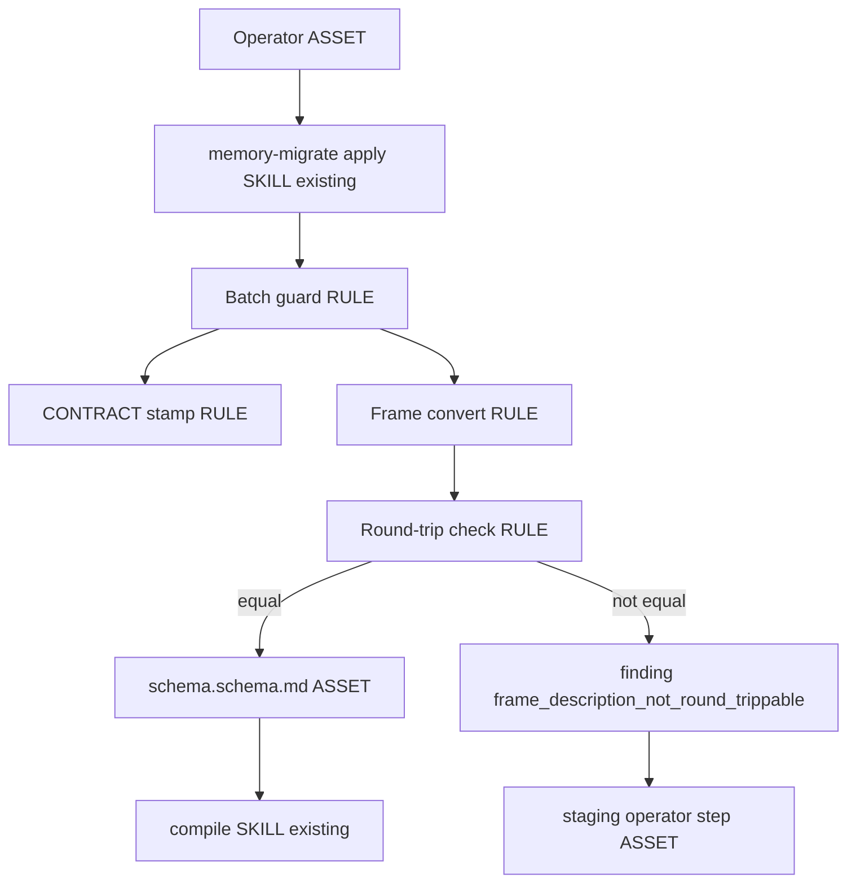

## Intent and authority

Change-class: **new-surface**. Subject: Atlas (`sergio-sisternes-epam/atlas`). One capability: an operator-chosen migration of a whole store onto the current four-layer contract shape, without running that migration from install, compile, or schema upgrade.

This operation designs that path and does not implement it. No product file is edited here.

## Genesis Artifacts

### Intent, scope, non-goals

The operator asks for one explicit migration of all content in a store, then a report of friction. The trigger is the operator naming the batch. The boundary is the existing `memory-migrate` command. It is not a new skill, not a fleet schema upgrade, and not a retype of every document into a memory page.

Cost stance: **balanced**. No cost cap was declared. Cost is not constant: it scales with store size (pages walked and description bytes compared). Say that in the path text. A small store such as the live Master of Packages branch (about 82 files at `888bcfd`) is a short run. A store with thousands of pages costs proportionally more time and a larger diff. That is why the migration is not hooked to install, compile, or schema upgrade.

In scope for a later implement:

- Keep migration operator-chosen. The only writer is `atlas memory-migrate --operation apply` with an explicit `--batch`. Install, compile, and schema upgrade do not migrate.
- The batch that visits the whole store is the existing token `contract-file`. Refuse a missing batch and refuse the unattested string `migrate everything`.
- That batch renames an eligible pre-beta `SCHEMA.json` to `CONTRACT.json`, stamps the current shape, adds a suffixed schema page where a folder has gists and no schema, cues that schema from `index.md`, and replaces an unsuffixed `frame.md` of type `frame` only when the converted frontmatter round-trips. Pages that are not that contract file, those new schema pages, those index cues, or those replaced frames stay byte-identical. Decision, document, work, recipe, and task pages are not retyped. `schema.d/` overlays are not rewritten.
- Four layers stay: `index.md` is a schema cue list; schema; gist; memory. One gist forces one schema. A second schema is legal. There is no two-gist rule. Hub stays outside the walk.
- Serialize converted frame frontmatter so a description that fits a plain scalar survives. Use a dump width that does not wrap the description, then accept the file only when the existing frontmatter reader returns the same mapping, including the description string. A wide dump round-trips the two live frame descriptions that the default width truncates (lengths 108 to 70, and 98 to 72). Do not print those strings into this plan.
- When a frame description still will not round-trip: do not rewrite that frame, do not delete it, and do not drop the description text. Emit finding id `frame_description_not_round_trippable`. Write an operator step under `staging/memory-migrate-operator-steps.md` that quotes the original description and states the next step: make the description a plain scalar the reader round-trips, then re-run the same command. Exit 2 only after that write. Do not rename `SCHEMA.json` on that attempt. This replaces an exit 2 with zero writes and no instruction.
- The cut that writes the current shape is package **0.13.0-beta.7**. It stamps `atlas_release` `0.13.0-beta.7`. Readers of that same shape (`CONTRACT.json`, `memory.layers` `["schema", "gist", "memory"]`) still accept `0.13.0-beta.3` and `0.13.0-beta.4`, and accept `0.13.0-beta.7`. `apply` on a store already stamped `0.13.0-beta.3` or `0.13.0-beta.4` stays a no-op and does not rewrite the stamp. Unknown stamps still fail closed. Do not treat `schema_version` 2.0 or the fleet pin `v0.12.0` as this stamp.
- Package surfaces (`apm.yml`, `SKILL.md` version, `scripts/atlas_cli/__init__.py`, help `package_version`) move to `0.13.0-beta.7`. Do not jump to a final `0.13.0`.
- The prior scenario sentence that freezes the write stamp at `0.13.0-beta.4` under package `0.13.0-beta.6` is superseded by this plan. Keep that scenario file. Change only that stamp expectation. Do not delete its other smokes.
- Deterministic checks named in the evaluation plan. No `.feature` files.

Out of scope:

- Fleet schema upgrade, SCHEMA 2.0, and the fleet pin `v0.12.0`.
- Running migration from install, from compile, or from schema upgrade.
- A two-gist minimum, a compile ban on a second schema, or a new page type.
- Retyping document-era pages into memory pages.
- Writing `CONTRACT.json` into this discussion store, or teaching this store a new type.
- Pushing the live Master of Packages store.
- Copilot review on the implement pull request.
- Product edits inside this design operation.

### Component diagram

Refactor pass: R1 does not fire. This is one operator command, not a second skill. R3 does not fire. No new persona.

Tier 3: **A2 PIPELINE** for assess, then the explicit apply batch, then compile. Not a panel. The store is shared state, so the migration is one writer.

Tier 2: **B4 PLAN MEMENTO** (this page), **B8 ATTENTION ANCHOR** (the pins), **S7 DETERMINISTIC TOOL BRIDGE** (the CLI), **S4 VALIDATION DECORATOR** (round-trip check before delete). **B17** stays the Autogenesis request gate and is not the migration.



### Interface sketch

Command, operator-chosen, whole store, one batch:

```bash
python3 <atlas-package>/scripts/atlas.py memory-migrate \
  --root <store> --operation apply --batch contract-file --json
```

Inputs: store root, operation `apply`, batch `contract-file`. Outputs: exit 0 and a current contract when every replaced frame round-trips; otherwise exit 2, finding id `frame_description_not_round_trippable`, the operator step file, and no contract rename. Assess and inventory still write nothing. Install, compile, and `atlas schema` do not call apply.

The path module `references/paths/memory-migrate.md` states that next step in prose, so the instruction exists even before a failing run. The staging file is the written step for the specific frame, and it contains the original description rather than a paraphrase that drops characters.

### Acceptance

- A pre-beta store with no batch is unchanged and exits 2 with finding `batch_required`.
- `--batch contract-file` on an eligible pre-beta store writes `atlas_release` `0.13.0-beta.7` and layers `schema` / `gist` / `memory`.
- A store already stamped `0.13.0-beta.3` or `0.13.0-beta.4` with those layers is not rewritten.
- A frame description that round-trips under a non-wrapping dump is present, exact, on the new schema page. The old `frame.md` is removed only after that check.
- A frame description that does not round-trip leaves `frame.md` byte-identical, writes the staging operator step containing that description, emits `frame_description_not_round_trippable`, does not rename the contract, and exits 2.
- Install, compile, and schema upgrade do not perform this migration.
- Readers accept stamps `0.13.0-beta.3`, `0.13.0-beta.4`, and `0.13.0-beta.7` on that shape, and reject an unknown stamp. Schema 2.0 and fleet `v0.12.0` are untouched.
- One gist still has one schema. A second schema file does not by itself fail compile.
- Package version is `0.13.0-beta.7`, not `0.13.0`.

### Cost note

Stance balanced. No cap. The dominant cost is the walk, which scales with the number of pages and with description size. Do not put the migration on install or compile, where a large store would make every routine run pay that cost. The agent does not need to read every page body to run the command. If the operator step is written, its size is the un-round-trippable description, not the whole store.

### Stop for approval

Design stops here. Implementation waits for explicit approval of this persisted plan.

## SOLID

| Principle | Status | Rationale / design consequence |
|---|---|---|
| S | applicable | `memory-migrate` owns the operator migration. Compile only judges. Schema upgrade does not migrate. Install does not migrate. |
| O | trade-off | The write stamp moves to the package version of this cut. That is a versioned behaviour change, not a plugin. Readers keep the two older stamps on the same shape so existing stores still open. |
| L | applicable | Stamps `0.13.0-beta.3`, `0.13.0-beta.4`, and `0.13.0-beta.7` are substitutes for the same layers shape. A reader must not demand a stronger stamp or weaken the closed fail set. An unknown stamp is not a substitute. |
| I | applicable | The operator passes root, operation, and batch. The command does not require a fleet pin, a schema 2.0 flag, or a page-body prompt. |
| D | trade-off | The path depends on the Atlas CLI contract, not on a harness. The YAML reader is the existing frontmatter splitter. A second parser is not added. The dump width is a concrete fix for that reader, not a new abstraction. |

## Catalogue Review

catalogue_review: in scope. The change is a write gate on migration and on which stamps count as the current shape. It is not a typo.

Genesis matches: uses A2 PIPELINE, B4, B8, S4, S7. Does not use A1 or fan-out. The store is one writer's shared state.

Autogenesis extension matches: B17 is already the request gate for this Run. This plan does not rewrite cards or receipts.

Composition mode: INLINE in the existing Atlas package. Not a new skill. Not S8.

Inherited anti-patterns to avoid: migration on install; silent truncation of a description; exit 2 with zero writes and no next step; deleting the source frame before the new page has the description; conflating the store stamp with schema 2.0 or fleet `v0.12.0`.

Delta only: operator batch stays explicit; lossless description dump; named finding plus staging operator step when round-trip fails; write stamp equals the new package cut.

pattern_applicability: not-applicable for autogenesis:S8. pattern_admission: not-selected. B17 stays active and unchanged.

## Pinned decisions

1. Accept operator-chosen migration. Reject hooks on install, compile, and schema upgrade. The cost scales with store size, so those hooks would tax every run. Ground for an explicit operator action rather than an install side effect: Frontmatter Operator runs as a visible action with a snapshot, not as an install rewrite (https://community.obsidian.md/plugins/frontmatter-operator).
2. Accept the four layers from `autogenesis/plans/2026-10-04-four-level-disclosure.md`. Index is a cue list. One gist forces one schema. A second schema is legal. No two-gist rule.
3. Accept a lossless dump before any claim that the description cannot round-trip. The default PyYAML width wraps a long plain description and the existing reader then returns a shorter string. That is the live failure on both `frame.md` files on Master of Packages `origin/atlas` (`888bcfd`): lengths 108 to 70 and 98 to 72. A non-wrapping dump compares equal. Ground for refusing a silent shorter string: Claude Code memory rewrite drops the tail of an unquoted description and does not warn (https://github.com/anthropics/claude-code/issues/74666).
4. Accept, when the lossless dump still does not compare equal: finding id `frame_description_not_round_trippable`, a written operator step that quotes the original description, the source `frame.md` left byte-identical, and no contract rename on that attempt. Reject exit 2 with zero writes and no instruction. Reject deleting the source before the new page holds the description. Ground: a load/dump of the whole frontmatter block drops text the edit did not target (https://github.com/cyanheads/obsidian-mcp-server/issues/89). Ground for keeping the source until the operator step exists: do not drop the source column, and write the runbook step, before any destructive rename (https://schemasmith.com/guides/database-rollback-strategies.html, https://stackpractices.com/docs/data-migration-runbook-template/).
5. Modify the parenthetical stamp `0.13.0-beta.6`. The rule that is kept: the stamp written for the current shape equals the package version of the cut that writes it. The cut cannot stay `0.13.0-beta.6`, because that version's changelog on `2078a7c` already froze the write stamp at `0.13.0-beta.4`, and `v0.13.0-beta.5` was the previous package bump that changed the write stamp. SemVer says to move the version number when the change matters to users (https://semver.org/spec/v2.0.0.html). Accepted consequence: new cut `0.13.0-beta.7`, not final `0.13.0`. The written stamp is `0.13.0-beta.7`. Readers still accept `0.13.0-beta.3` and `0.13.0-beta.4` on that same shape, and accept `0.13.0-beta.7`. They do not gain a `0.13.0-beta.6` store stamp, because beta.6 never wrote one. Do not conflate this with schema 2.0 or fleet pin `v0.12.0`.
6. Reject fleet schema upgrade. Out of scope.
7. Accept an explicit deferral of agent-spec. No `.feature` file.

## Challenge result

Search was required. Counters below are from those results, not from an ungrounded list. Internal model knowledge was not used as a counter. It was used only to read the live store shape.

C1. Non-trivial counters: silent description truncation; whole-block YAML reserialization damage; a published changelog that already froze the previous stamp; destructive rename before the source is preserved.
C2. High-severity items are pinned. Truncation is handled by a lossless dump first and a named finding second. The stamp parenthetical is modified, with the rule kept, because beta.6 already published the opposite stamp.
C3. Pins are visible above.
C4. Scope stayed on the operator migration and the write stamp. Document retyping and fleet schema upgrade stayed out.
C5. No product implementation was performed in this operation.
Change-class new-surface is stated. Genesis Artifacts for mini-genesis are present.

## Behavioural contract (agent-spec)

deferred: agent-spec is not installed in this session, so specify was not invoked and no .feature file was written.

## Evaluation plan

Deterministic smokes, primary. An approved implement runs them with the subject repository's tests. Agent narrative is not evidence.

- `scripts/test_schema_layer_contract.py` (or its successor) asserts `apply --batch contract-file` writes `atlas_release` `0.13.0-beta.7`.
- A fixture stamped `0.13.0-beta.3` and one stamped `0.13.0-beta.4`, both with layers `schema`/`gist`/`memory`, stay byte-identical on apply.
- A fixture whose frame description is a long plain scalar that the default dump would wrap is migrated, and the new schema page description equals the original string.
- A fixture whose description cannot round-trip exits 2, writes `staging/memory-migrate-operator-steps.md` containing that description, leaves `frame.md` and `SCHEMA.json` in place, and the JSON finding id is `frame_description_not_round_trippable`.
- `rg` over install, compile, and schema-upgrade entrypoints shows they do not call `memory-migrate` apply.
- Package version strings listed above equal `0.13.0-beta.7`.
- One gist, one schema, index cue, compile exit 0. A second schema file does not by itself fail compile.
- Unknown `atlas_release` still fails stamp shape. Schema 2.0 tests are unchanged.

## Adversarial scenario draft

Draft only in this operation. Implement materialises it as `references/scenarios/four-layer-migration-adversarial-v1.yaml` and does not delete `references/scenarios/four-level-disclosure-adversarial-v1.yaml`. The stamp sentence in that older file is updated because pin 5 supersedes it. Its other smokes stay.

```yaml
id: four-layer-migration-adversarial-v1
packages: [atlas]
work_id: 2026-10-04-four-layer-migration
adversarial: true
smokes:
  - id: migration-on-install
    source: "https://community.obsidian.md/plugins/frontmatter-operator"
    expect: install does not migrate a store
  - id: wrapped-description-truncated
    source: "https://github.com/anthropics/claude-code/issues/74666"
    expect: a long plain description survives apply equal to the source string
  - id: unroundtrippable-description-silent-drop
    source: "https://github.com/cyanheads/obsidian-mcp-server/issues/89"
    expect: finding frame_description_not_round_trippable, operator step contains the description, frame.md unchanged, SCHEMA.json not renamed, exit 2
  - id: stamp-frozen-on-published-beta
    source: "https://semver.org/spec/v2.0.0.html"
    expect: package and written stamp are 0.13.0-beta.7; readers still accept 0.13.0-beta.3 and 0.13.0-beta.4
  - id: destructive-rename-before-preserve
    source: "https://stackpractices.com/docs/data-migration-runbook-template/"
    expect: a failed description does not rename the contract and does not delete frame.md
expect: red if apply runs without an explicit batch, if a description is shorter after a successful apply, or if the written stamp is still 0.13.0-beta.4
```

## Non-goals

Implement, merge, or migrate the live Master of Packages store inside this design operation.
