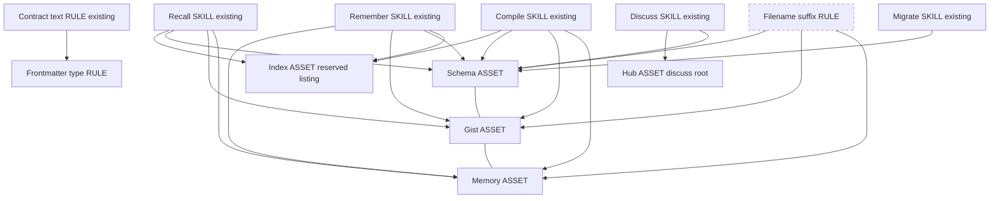
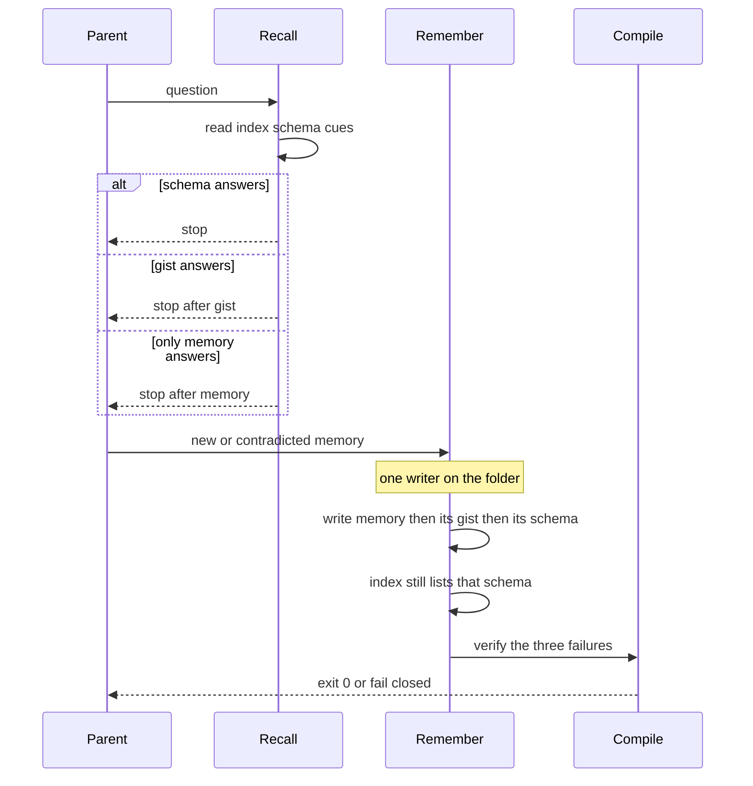
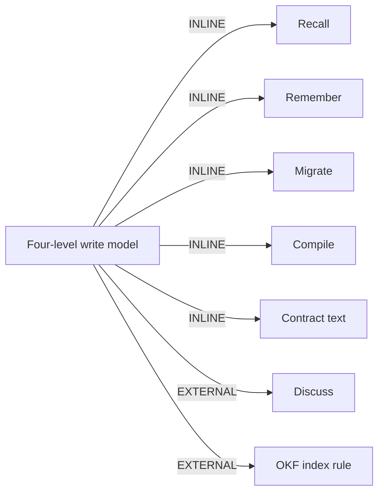

## Intent and authority

Change-class: **new-surface**. The operator required full Genesis steps 1 through 6, which is deeper than the mini-genesis minimum for this class. Subject: Atlas. Objective: capture the locked four-level write model so a later implement can follow one packet.

This operation designs that model and refuses to implement it. Discussion has zero implement authority. Design stops for explicit approval. No product skill file, compiler change, scenario file, or pull request is written here. Natural-language skill modules are not drafted. Genesis steps 7 and 8 do not run.

The schema page under test is `work/2026-10-04-four-level-disclosure/four-level-disclosure.schema.md`. It is type frame because this store's SCHEMA.json cannot express type schema. Legal types already used by that filing are frame, gist, and page. This packet does not invent another type.

## Genesis Artifacts

### Step 1 — intent, scope, cost stance

One capability: a four-level disclosure write model for an existing Atlas folder. Recall walks the levels and stops when one answers. Remember and migrate keep the levels consistent. Compile fails closed on the three named breaks. Discuss and contract text name the same model. That is one process with several existing surfaces, not two capabilities, so it stays one design.

Trigger conditions for a later implement: an agent must recall, remember, migrate, compile, or discuss Atlas memory, or must edit the contract or skill text that describes that memory. The agent does not need to say "four-level disclosure".

Boundary: this packet does not re-litigate stamp 0.13.0-beta.4, does not add a two-gist threshold, does not open a product pull request, and does not change the live compiler.

Cost stance: **balanced** (operator did not declare a stance). No cost cap was declared. Cap check is informational, not a halt.

No new module entrypoint is created. The existing Atlas entrypoint stays the dispatcher match. Invocation mode of the changed behaviour is FORCED inside the already-loaded path modules, not a new DISCOVERY skill. Declared target set: `common-only`.

### Scope and non-goals

In scope when an approved implement later runs, and only then:

- Recall walks index, schema, gist, memory and stops when the level answers.
- A new or contradicted memory cascades up to its gist and its schema. The index still lists that schema. It does not become a copy of the memory.
- Migrate builds that stack, allows more than one schema when the subject changes, and drops a leftover frame file that the stack replaced.
- Compile fails on a gist with no schema, a schema missing from the index, or an upper page describing a memory that no longer says that. Those three are the closed fail set.
- Contract and skill text name the write model, the suffixes, and the legal types.
- Discuss files another schema when the subject changes. Hub stays the discuss root.

Out of scope:

- Re-litigating stamp 0.13.0-beta.4 (package v0.13.0-beta.5, PR 46, merge 4e2da945).
- A two-gist minimum. One gist still forces one schema.
- Treating index.md as laboratory short-term memory or as a table of contents.
- Treating hub.md as a fifth memory level.
- A compile predicate that detects "subject change" or that rejects a second schema. That bullet in the earlier mini-genesis acceptance is withdrawn. Subject change is a remember, migrate, and discuss write rule, not a fourth compiler gate.
- A compile predicate that the filename suffix mismatches frontmatter. Suffix is the search handle. Frontmatter type remains the contract type. This store's compiler must not be taught a new type.
- Product code, scenario files under the skill package, and pull requests in this operation.
- Writing CONTRACT.json into this store.

### Locked model

- `index.md` is the hot cue list of schemas. It is the OKF reserved directory listing. It is not a concept file. It stays unsuffixed. It normally has no frontmatter.
- `hub.md` stays. It is the discuss root: subject, objective, live branch. It is not a memory layer. It stays unsuffixed. OKF does not reserve `hub.md`, so it remains an ordinary page with frontmatter. On this store that page is type work. Do not invent type hub.
- Schema files: `<name>.schema.md`. A folder may hold more than one when the subject changes. One gist still forces one schema. No two-gist rule.
- Gist files: `<name>.gist.md`.
- Memory files: `<name>.memory.md`.
- Suffixes are the search handle. Frontmatter `type` remains the contract type. On this unstamped SCHEMA.json store the legal stand-ins are frame for a schema page, gist for a gist page, and page for a memory page.
- Recall walks index, schema, gist, memory and stops when the level answers.
- A new or contradicted memory cascades up to its gist and schema. The index still lists that schema.
- Same-level links only: schema-schema, gist-gist, memory-memory, including across clusters. Hub is not in that set. Vertical grouping is the walk, not a same-level link.
- Compile fail set, closed: gist with no schema; schema missing from the index; upper page describing a memory that no longer says that.
- Areas: recall, remember, migrate, compile, contract/skill text, discuss.

### Step 2 — component diagram

Refactor pass first. R1 SPLIT does not fire: one write model, one change cadence, no second caller that wants only half of it. Splitting six skills would be a premature split. R2 FUSE does not fire: the six areas already exist as paths and must not be collapsed into one body. R3 EXTRACT does not fire: no persona or rule body is inlined as a new module. R4 INLINE does not fire: there is no new proxy primitive. R5 COST PRUNE fires as early stop, not as a new module.

Tier 3: **A2 PIPELINE** for the recall walk (ordered levels, verifiable hand-off, stop). **A9 SUPERVISED EXECUTION, weak form**, around remember: the agent plans the cascade, the existing compile CLI is the deterministic verify, the agent does not get a new runtime. Not A1 PANEL. Not A11. The six areas share one folder; they are not independent lenses.

Tier 2: **S5 LAZY PROXY** (index stands in for the folder), **B2 CONDITIONAL DISPATCH** (stop when the level answers), **B4 PLAN MEMENTO** (this packet), **B8 ATTENTION ANCHOR** (locked model re-read before implement), **B5 ACCEPTANCE OBSERVER** between remember and compile, **S4 VALIDATION DECORATOR** plus **S7 DETERMINISTIC TOOL BRIDGE** (compile CLI, preloaded terminal). **B17** stays the Autogenesis request gate and is not the memory model.

Existing boxes are the Atlas paths and the OKF index rule. The dashed box is the new suffix rule, which is instruction text inside those paths, not a new package.



### Step 3 — sequence diagram

One parent thread. No child spawn. Recall is a read pipeline with an early return. Remember is the single writer for the folder. Compile is the fan-in gate the parent waits on. Same-level links are read when the current level is open. They are not a second walk and they do not pull a lower level up.



### Step 3.1 — tradeoff

Two shapes fit the walk: parallel readers of every level, or one sequential reader. Matrix: pattern-tradeoffs section 4, row SHARED STATE plus SEQUENTIAL THREADS. Cell: B5 between stages, topology A2 PIPELINE. Parallel plus shared state is rejected because every level writes the same folder. Fan-out is the wrong default: the levels share state.

Second cut, cost-shape section 10. Predicted dominant bucket if recall dumps the folder is input prefix size, row "Multi-step plan against large corpus". The smallest fitting response is not to load the corpus: S5 plus B2 early stop. A second row also fits the read session: "Long-running session, mostly read-only" maps to B13, stable path text in front of the variable page. Apply B13 on the path prefix and S5/B2 on the walk. Do not also add A12. There is no fan-out width to gradient.

### Step 3.2 — cost check

Stance balanced. B13 is mandatory. No cap. No task() spawn, so no per-spawn audience table is filled. Role classes are design bands, not harness SKUs. Pricing used below is the substrate example in token-economics (Sonnet-class 3 dollars per million input tokens, 15 dollars per million output tokens), not a step-7 adapter binding. Design stops before the per-harness adapter loads.

| Module | Role class | Prefix | Output | Patterns | Matrix row |
|---|---|---|---|---|---|
| Recall | trivial when the index or schema answers; implementer if the memory must be read | S to M | S | S5, B2, B13 | multi-step corpus, then read-only session |
| Remember | implementer | M | S | A9 weak, B5 | read-only row does not apply; output stays short because the tool writes the files |
| Compile | trivial interpreter of an exit code | S | S | S7, S4 | single-turn extraction |
| Migrate | implementer | M | S | A9 weak, S7 | same as remember |
| Discuss | implementer | S | S | none new | no new cost shape |
| Contract text | reviewer at authoring time only | S | S | B14 at step 8, not now | verbose body row, deferred to implement |

### Step 3.5 — composition

| Box | Mode | Rationale |
|---|---|---|
| Recall, remember, migrate, compile, contract text | INLINE | Behaviour of the existing Atlas package. Not a new distribution. |
| Suffix rule and type rule | INLINE | Instruction inside those paths. Not a sibling skill. |
| Index, schema, gist, memory, hub pages | INLINE assets of the store | Content unique to a folder. Not shipped as a skill module. |
| Discuss | EXTERNAL, already declared | Subject-change schema filing is discuss behaviour. Companion-module recommendation already lives on Atlas. No new manifest entry. |
| OKF index rule | EXTERNAL, already declared | `index.md` is the reserved directory listing. Format authority stays OKF. Companion recommendation already stated. No new manifest entry. |

No new external module. Step 7b must not load a module-system adapter for this packet. Declaration mechanism for the two existing externals: companion-module recommendation already present. Do not add a phantom dependency.



Audience: this packet is INTERNAL design prose for the implementer. It is not a spawn brief. No SPAWN_BRIEF is copied from the human rationale below.

### Interface sketch

Recall. Trigger: the caller needs an answer from a folder and must not dump it. Inputs: folder path, question. Outputs: the first level that answers, plus the path read. Depends on index, then schema, gist, memory. Does not open a lower level after an answer. Does not treat hub as a level.

Remember. Trigger: a new memory or a memory that now contradicts its gist or schema. Inputs: memory body, owning gist, owning schema. Outputs: memory file, updated gist, updated schema, index listing unchanged unless the schema is new. Refuses to finish while those three disagree. One writer per folder. Does not rewrite sibling schemas.

Migrate. Trigger: a folder still on a single unsuffixed frame file, or a subject change that needs another schema. Inputs: folder. Outputs: suffixed schema, gist, and memory files; extra schema only with a recorded subject change; leftover replaced frame file removed. One gist still produces one schema.

Compile. Trigger: after a memory write, or any store check. Inputs: root. Outputs: exit 0, or fail on the closed set of three. Does not fail a legal second schema. Does not require type schema on this store. Tool: existing `atlas.py compile`. The agent reads the exit code. It does not re-implement the check in prose.

Contract and skill text. Trigger: the sentences that still say one frame per folder, or that pin every gist on the index. Inputs: this packet. Outputs: text that names suffixes as search handles and frontmatter as the type. No new type string.

Discuss. Trigger: the subject of the live branch changes. Inputs: hub subject, objective, current branch. Outputs: another `<name>.schema.md` in the same folder, linked same-level to the prior schema, and listed on the index. Hub stays put. Hub does not store the memory.

### Step 4 — SoC

Recall reads. Remember writes. Compile judges. Migrate reshapes. Discuss decides that the subject changed. Contract text names the rules. Hub points at the branch and is not a schema. Index lists schemas and is not a gist. No sibling path grows a second copy of the walk. Dispatch descriptions of recall and remember stay distinct. No new entrypoint, so no new collision. R1 does not fire. The compile CLI is the S7 bridge for the three facts that must be true. Extension path: preloaded terminal calling the installed CLI. No new MCP server.

### Step 5 — compliance

| Principle | Severity | Result |
|---|---|---|
| Separation of concerns | pass | Six existing surfaces, one model. |
| Single responsibility | pass | One write model. Areas are not extra skills. |
| Encapsulation | pass | Index is the only hot list. Lower pages load on demand. |
| Composition over inheritance | pass | Depends on Atlas paths, Discuss, and OKF. No copied format spec. |
| Dependency inversion | pass | Contract type is frontmatter. No harness type. |
| Process isolation | not applicable | Shared folder. Parallel lenses would be the violation. |
| Fan-out | not applicable | Fewer than three independent lenses. |
| Atomicity | pass | One writer per folder. |
| Open-closed | trade-off, not a blocker | The write model is a versioned behaviour change. No plugin API. Accidental drift is the three compile failures. |
| Cross-cutting | pass | Suffix rule is inline text, not a new rule skill. |
| Progressive disclosure | pass | The walk is the disclosure. |
| Reduced scope | pass | Closed compile set. No two-gist rule. Stamp left alone. |
| Orchestrated composition | pass | Existing paths. No new orchestrator. |
| Safety boundaries | pass | Design stops. Compile fail-closed is the later gate. |
| Explicit hierarchy | pass | Index, schema, gist, memory. Hub is outside the hierarchy. |
| Context is finite | pass | Early stop. |
| Facts that must be true use a tool | pass | Compile CLI. |
| Do not invent a rejected type | pass | frame, gist, page only on this store. |

No BLOCKER. Open, non-blocking: agent-spec is absent, so Gherkin is deferred. This store's current compiler does not enforce the three new failures. A green compile of this plan is not evidence that those gates exist.

Module entrypoint row: no new name. Existing `atlas` name matches its package directory. This operation does not edit that body, so the 500-line budget is untouched. Description cap is untouched.

### Step 6 — handoff packet

Diagrams, interface sketch, composition table, and dependency graph are above. They are the packet.

External modules required: none new. Existing Discuss and OKF stay companion-module recommendations. No module-system adapter at step 7b.

Declared targets: `common-only`.

Invocation mode: FORCED inside existing Atlas paths and Discuss. No new DISCOVERY description.

Open compliance: agent-spec deferral, medium. Live compiler does not yet implement the three failures, high for implement evidence, not a design blocker.

#### Todos

Implement is blocked until approval. Order after approval:

1. Contract and skill text names the locked model. Blocks 2, 3, and 4.
2. Remember cascade and one-writer rule. Blocks 5.
3. Recall early stop. Independent of 2 after 1.
4. Migrate: suffixes, one gist forces one schema, extra schema only on subject change, drop leftover frame file. Blocks 5.
5. Compile: the three failures, and no fourth failure. Depends on 2 and 4.
6. Discuss: second schema on subject change, hub unchanged. Depends on 1.
7. Deterministic checks for the evaluation plan. Depends on 5. Do not add them in design.
8. Validate emitted text against this packet. Depends on 1 through 7. Steps 7a and 8 of Genesis stay with that later caller.

#### Adversarial scenario draft

Not written to a product scenarios path. Draft only. The second-schema compile failure from the earlier draft is removed so the suite matches the closed compile set. Subject change stays a discuss and remember expectation, not a compile exit.

```yaml
id: four-level-disclosure-adversarial-v1
packages: [atlas]
work_id: 2026-10-04-four-level-disclosure
adversarial: true
smokes:
  - id: gist-without-schema
    source: "https://exa.ai/library/publication/1fyvnft1wn1"
    expect: compile fails
  - id: schema-missing-from-index
    source: "https://notes.sebastianauner.com/docs/03-resources/01-zettelkasten/public/index-notes-are-not-a-table-of-contents/"
    expect: compile fails when a schema is not an index cue
  - id: stale-upper-page
    source: "https://arxiv.org/html/2606.26511"
    expect: compile fails when an upper page states what the memory no longer states
  - id: index-named-as-cowan-stm
    source: "https://memory.psych.missouri.edu/assets/doc/articles/2001/cowan-bbs-2001.pdf"
    expect: skill text does not equate index.md with a four-chunk STM
  - id: early-stop-still-descends-when-needed
    source: "https://soumilchugh.github.io/hierarchical-memory.html"
    expect: recall stops on a hit and still opens memory when the upper level does not answer
  - id: one-schema-per-session
    source: "https://proceedings.iclr.cc/paper_files/paper/2025/file/e56f394bbd4f0ec81393d767caa5a31b-Paper-Conference.pdf"
    expect: a subject change files another schema
  - id: suffix-is-not-the-type
    source: "https://www.w3.org/2001/tag/doc/metaDataInURI-31-20061107.html"
    expect: skill text keeps frontmatter type as the contract and the suffix as the search handle
  - id: hub-holds-the-memory
    source: "https://qwxlea.org/notes/structure-note"
    expect: hub.md is not a memory level and does not replace the memory page
  - id: two-gist-minimum
    source: "locked model; one gist still forces one schema"
    expect: a folder with one gist still has one schema
expect: red if shipped behaviour still requires exactly one frame per folder with no subject-change write, or if type schema is required on this SCHEMA.json store, or if compile grows a gate outside the closed set of three
```

#### Behavioural contract (agent-spec)

deferred: agent-spec is not installed in this session, so specify was not invoked and no .feature file was written. Families a later specify would own: recall-stops-when-level-answers; remember-cascades-to-gist-and-schema; index-still-lists-schema; compile-fails-gist-without-schema; compile-fails-schema-missing-from-index; compile-fails-stale-upper-page; discuss-second-schema-on-subject-change; one-gist-still-counts; hub-is-not-a-level; suffix-is-search-handle. Forbidden until specify exists: hand-authored Gherkin. Critical intent: do not treat a green compile on this SCHEMA.json as evidence that the three new failures are enforced, and do not add a two-gist rule or a type the compiler rejects.

#### Evaluation plan

Deterministic smokes, primary, to be added only by an approved implement:

- `atlas compile` exit non-zero when a gist has no schema.
- `atlas compile` exit non-zero when a schema page is absent from that folder's index.md.
- `atlas compile` exit non-zero when an upper page's claim is absent from the linked memory.
- `atlas compile` exit 0 for one gist, one schema, and that schema listed on the index, using types frame, gist, and page on this store.
- A second schema file in the folder does not by itself fail compile.
- Remember procedure text refuses to finish before gist and schema agree, and does not require an index rewrite when the schema is already listed.
- Recall procedure text stops when the level answers.
- Skill text does not call index.md STM, does not call hub.md a memory level, and does not define a two-gist minimum.
- No new file under the Atlas skill package appears in this design's diff.

Agent evaluation is secondary and must not be the only evidence.

#### Cost projection

Stance: balanced. Cap: none. L does not halt.

Substrate price used for the prediction, not a harness binding: 3 dollars per million input tokens and 15 dollars per million output tokens, as stated in genesis token-economics for a Sonnet-class example. Bands are the contract. Dollars are the prediction.

| Scenario | What happens | Input tokens | Output tokens | Turns | Dollars |
|---|---|---|---|---|---|
| S | Index or schema answers. One or two short pages. | 1k to 3k | 150 to 400 | 1 to 2 | under 0.02 |
| M | Walk reaches the gist, then a short cascade write of that gist and schema. | 6k to 12k | 400 to 900 | 3 to 5 | about 0.03 to 0.06 |
| L | Question misses until memory, plus one contradiction cascade, plus compile. Still one folder, not the repo. | 20k to 40k | 800 to 1.5k | 6 to 10 | about 0.08 to 0.15 |

Cited rows: section 10 "Multi-step plan against large corpus" (do not load the folder; S5 and B2) and "Long-running session, mostly read-only" (B13 on the stable path prefix). Compile is the single-turn extraction row (S7). No A12.

Cache: path instructions stay in front of the page just read. Do not put today's date or the memory body into the stable prefix.

#### Evals plan

Content, to be run later with the skill text changed and unchanged. Not run in this operation.

1. Prompt: "Where do I look first in a folder, and when do I stop?" With the model, the answer is index, then schema, then gist, then memory, stop on a hit. Without it, a flat dump is acceptable to the agent. Delta required.
2. Prompt: "A memory changed. What else must move?" With the model, gist and schema move and the index still lists the schema. Without it, pinning the gist on the index is the old answer. Delta required.
3. Prompt: "What type do I write on this SCHEMA.json store?" With the model, frame, gist, and page, suffixes only as names. Without it, type schema is a likely invention. Delta required.

Trigger evals are for the existing Atlas and Discuss descriptions, not a new skill. Should trigger: recall a folder, remember a fact, migrate a frame folder, compile the store, discuss a subject change, "the index should list schemas". Should not: a product feature change, a stamp argument about 0.13.0-beta.4, a request to add a two-gist rule, ordinary application refactoring. Train and validation split is a later implement task. This design does not ship `evals/evals.json`.

#### Spawns

No task() spawn. Per-spawn declaration table: none. No SPAWN_BRIEF. No RECEIPT_SCHEMA. No external artifact spec beyond this plan page.

#### HUMAN_RATIONALE

Never copy this section into a spawn brief.

The operator locked the model on 2026-10-04 after the four-level discussion. The earlier page of this plan was mini-genesis and left hub, suffixes-versus-type, same-level links, and the closed compile set underspecified. This revision captures them without a second work id. The tempting extra gates (reject a second schema in compile, reject a suffix mismatch in compile, require two gists) are refused because they are not in the locked fail set and because this compiler would be taught behaviour it does not have. Write amplification is real, so the cascade stops at the owning gist and schema. The index is a cue list, not a third rewrite. Early stop can hide a fact that lives only in the memory; the mitigation is to descend when the level does not answer, and to fail compile when an upper page still claims the old fact. Hub stays a discuss pointer so the memory hierarchy does not gain a fifth rung.

### Acceptance

- A fixture with one gist has exactly one schema, that schema is an index cue, types are frame, gist, and page, and compile accepts it on this store.
- A second `<name>.schema.md` is a legal file when the subject changed. Compile does not invent a detector for that change.
- Compile fails for a gist with no schema, a schema missing from the index, and an upper page whose claim the memory no longer makes. It does not fail for any other new reason in this design.
- Remember is incomplete until the owning gist and schema match the memory. The index still lists the schema.
- Recall of a question answered by the schema does not open the memory pages. Recall of a question the schema does not answer does open the next level.
- Hub is present, unsuffixed, and outside the walk.
- Skill text does not require two gists and does not re-open stamp 0.13.0-beta.4.

### Stop for approval

Implementation authorised. Disposition: approved → implementing. Approved by operator on 2026-10-04: "Plan for four-level disclosure approved. Proceed".

## SOLID

| Principle | Status | Rationale / design consequence |
|---|---|---|
| S | applicable | Recall reads, remember writes, compile judges, migrate reshapes, discuss decides a subject change, contract text names the rules. Hub is not a memory. Index is not a schema. |
| O | trade-off | The write model is a versioned behaviour change, not a plugin. The closed compile set blocks accidental drift. A subject-change detector is not added just because it could be. |
| L | not-applicable | Frame on this store and a future schema type are not substitutes. No caller is told they interchange. |
| I | applicable | The index exposes schema cues only. Gists, memories, and the hub stay off that list. Callers do not load the folder to learn which schema is hot. |
| D | applicable | Paths depend on frontmatter type plus the OKF index rule, not on a harness. The suffix is a filename handle, not an adapter. Compile stays the existing CLI. |

## Catalogue Review

catalogue_review: in scope, because the change is a storage and gate protocol, not a typo.

Genesis matches: uses A2 PIPELINE, A9 weak form, S5, B2, B4, B5, B8, S4, S7. Uses the OKF reserved `index.md` directory listing. Conflicts with any reading of index.md as a concept or a table of contents. Refines none of those patterns into a new id. Does not use A1, A11, or A12.

Autogenesis extension matches: B17 ACTIVATION CARD is already active for Autogenesis requests. This plan does not rewrite cards, receipts, or the invocation contract. B17 remains the entry gate for a later implement. It is not the memory model.

Composition mode: INLINE for the Atlas paths. EXTERNAL only for Discuss and OKF, both already companions. Not a new skill.

Inherited anti-patterns to avoid: one schema file per folder regardless of subject; pinning every gist on the index; calling the index short-term memory; making hub a memory; discussion-to-implement; a compile gate outside the closed set; STAGE COLLAPSE of design into product text.

Delta only: subject-bounded schemas as a write rule, cascade limited to the owning gist and schema, early-stop recall, three compile failures, suffix as search handle, hub outside the walk. No S8 module split.

Admission: pattern_applicability not-applicable for autogenesis:S8. The six areas are existing paths, not a new parent-routed module. pattern_admission not-selected. B17 stays active and unchanged. A draft pattern is not promoted.

## Pinned decisions

1. Accept the four-level target: index (hot schema cues), schema (gist groups), gist (memory groups), memory (event sequence). Hub is not a fifth level. Reject the earlier label that the index is laboratory STM.
2. Accept more than one schema in a folder only when the subject changes. That is a remember, migrate, and discuss rule. Reject a compile gate that tries to detect the subject change. Ground for the split itself: overlapping schemas catastrophically interfere unless split on a large prediction error (Beukers et al., Communications Psychology, 2024, https://www.nature.com/articles/s44271-024-00079-4.pdf).
3. Accept the index as the OKF reserved directory listing of hot schemas, with a practical split around 25 cues. Reject index-as-table-of-contents (https://notes.sebastianauner.com/docs/03-resources/01-zettelkasten/public/index-notes-are-not-a-table-of-contents/).
4. Accept early stop, and accept descent when the level does not answer. Reject a mandatory four-hop read and reject collapsing the model to two levels. Ground for the hierarchy: HiGMem's two-level event-turn hierarchy beat flat retrieval on precision (https://arxiv.org/html/2604.18349v2). Ground for still descending: summaries are lossy and the original remains the source of truth (https://soumilchugh.github.io/hierarchical-memory.html). The engaged four-hop counter remains https://arxiv.org/pdf/2603.21564.
5. Accept Cowan (2001) as a reason not to name the index STM. Four chunks are a focus-of-attention limit when recoding is blocked (https://memory.psych.missouri.edu/assets/doc/articles/2001/cowan-bbs-2001.pdf), not a directory format.
6. Accept the engaged conflicting-schemas counter as a reason the cascade must rewrite the owning gist and schema (https://exa.ai/library/publication/1fyvnft1wn1). Do not delete the counter. Bound the cascade: do not rewrite every same-level peer. Write amplification is the reason (https://moltbook.com/post/329587b3-8901-4cc5-a1ad-5e5f0ab40b2c). The index still lists the schema and is not rewritten into a summary.
7. Accept the engaged session-schema counter: one schema per session fails when the subject changes (https://proceedings.iclr.cc/paper_files/paper/2025/file/e56f394bbd4f0ec81393d767caa5a31b-Paper-Conference.pdf). Discuss files another schema on that change.
8. Accept "one gist still counts". Reject a two-gist minimum.
9. Do not re-litigate stamp 0.13.0-beta.4.
10. Reject filing type schema on this store. SCHEMA.json has no atlas_release and no memory.layers. The live shape is unstamped SCHEMA.json. The filing uses frame, gist, and page. Type schema exists only on a stamped contract this design does not install.
11. Accept suffixes as the search handle and frontmatter type as the contract. Reject using the suffix as the authoritative type. Ground: a suffix is not authoritative metadata (W3C TAG, https://www.w3.org/2001/tag/doc/metaDataInURI-31-20061107.html) and a filename is not the metadata record (https://www.voyagersearch.com/newsroom/a-filename-is-not-metadata).
12. Accept hub.md as the discuss root (subject, objective, live branch), unsuffixed, outside the walk. Reject storing the memory in the hub. A structure note that holds the knowledge it should only point at stops being a map (https://qwxlea.org/notes/structure-note). OKF reserves index.md and log.md only, so hub.md keeps frontmatter.
13. Accept same-level links (schema-schema, gist-gist, memory-memory, across clusters). Reject fully connecting every page. A link that means everything means nothing (https://forum.zettelkasten.de/discussion/1729/identifying-patterns-in-different-types-of-notes-and-how-to-optimally-design-outline-notes).
14. Accept a deterministic compile check for a stale upper page. Similarity cannot be trusted to notice a contradiction (https://arxiv.org/html/2606.26511). The check is the third member of the closed fail set, not a new memory type.

## Challenge result

C1. Non-trivial counters were searched and pinned: catastrophic interference unless schemas split, index-as-entry-point rather than a contents list, suffix-is-not-type, summary lossiness if recall never descends, write amplification if every level rewrites, and hub-as-content rather than hub-as-map.
C2. High-severity items are pinned. The one-schema-per-folder rule is pinned as a write-time subject split, not as a new compile detector. The suffix-versus-type split is pinned, not left as "the filename is the type". The cascade is pinned and bounded.
C3. Pins are visible above.
C4. Scope stayed on the write model. No product surface was added in this operation.
C5. No implementation was performed. No skill module was drafted.
Change-class new-surface is stated. Genesis Artifacts for a full steps 1 through 6 packet are present, which satisfies and exceeds the mini-genesis bar for this class.

The stack is accepted as the target. The installed engine did not accept it. On this store a green compile does not mean the three new gates exist.

## Gaps

- This Atlas has SCHEMA.json, not CONTRACT.json. Type schema is not expressible. Closest legal types in the test filing: frame, gist, page.
- The live compiler does not fail the three new conditions. Compile exit 0 on this plan is lineage hygiene only.
- Installed remember still says pin the gist on the index and one frame per gist folder. Those sentences were not edited.
- agent-spec is absent, so the behavioural contract is deferred. No .feature file was written.
- approval_ref: operator message 2026-10-04 "Plan for four-level disclosure approved. Proceed". Implement in progress.
- Per-harness price adapter was not loaded, by the step-7 stop. Dollar figures are substrate examples.
- OKF does not reserve hub.md. Unsuffixed is a naming rule, not a reserved-file rule. Stripping hub frontmatter would be non-conformant.

## Non-goals

Implement, wire, migrate this store, open a pull request, draft skill bodies, or treat this plan as approval.
