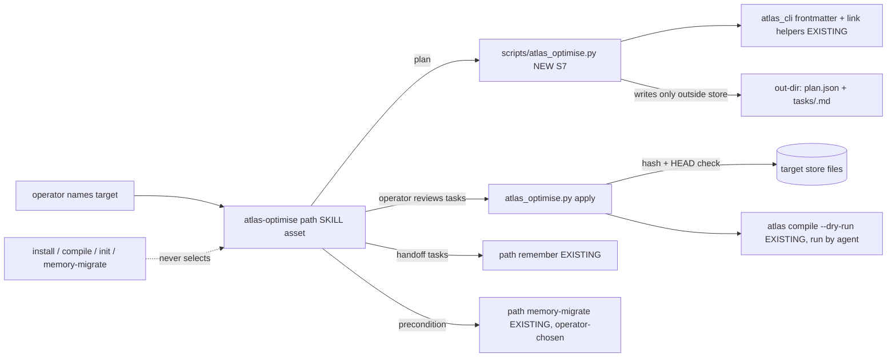
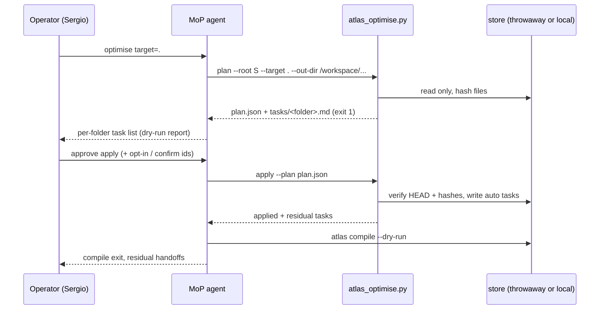

## Intent

Make `atlas-optimise` do the work Sergio asked for on his whole Master of Packages (MoP) atlas. The operator names a target (one folder or the store root). On that target the path repairs the locked four-layer discipline and clusters folders by subject naming. It produces a migration task list per top-level folder, dry-run first, that the agent (MoP) walks. It never runs on install or compile and never writes new claim text.

## Scope

In:

- Rewrite `references/paths/atlas-optimise.md` with a concrete procedure: required target, plan (dry-run) then apply, per-folder task list, four-layer repair steps, subject clustering, stale-plan guard.
- New standalone helper `scripts/atlas_optimise.py` (S7 deterministic tool bridge). Subcommands `plan` and `apply`. It imports the existing reader and link helpers. Nothing in `atlas_cli` imports it, and `atlas.py` gets no new command.
- New adversarial scenario `references/scenarios/atlas-optimise-target-layers-adversarial-v1.yaml`. Keep `atlas-operator-skills-adversarial-v1.yaml` as history.
- New tests `scripts/test_atlas_optimise.py`. Small phrase-test updates in `scripts/test_operator_skills.py`.
- SKILL.md registry row and description wording, `references/help/index.md` row, CHANGELOG, package version `0.13.0-beta.9` on every version surface.

Out: `CONTRACT.json` writes or stamp changes (write stamp stays `0.13.0-beta.7`). Changes to `memory-migrate`, compile, init, or install. New compile checks. A two-gist rule. Algorithmic subject-change detection. Fleet store moves. Replacing `/home/box/agent-data/workflows/atlas`. Pushing the live MoP atlas.

## Non-goals

- Automatic or scheduled optimise.
- Writing gist, schema, or memory text that does not already exist in a page.
- Editing memory pages to make a gist fit.
- Removing index cues that are alive without operator confirmation (the MoP `documents/index.md` says "STM. Anything not listed is LTM", so cue removal changes store meaning).
- Cross-store link repair. Inbound `atlas://` references cannot be checked from inside one store, so any rename or move they touch is blocked.

## Change-class

`new-surface`: changed behaviour of an existing path plus a new helper script and report shape. Not `new-skill`.

## Locked model (recall, do not reopen)

Recall walks index, then schema, then gist, then memory, and stops when a level answers. `index.md` is a cue list, not content. One gist forces one schema. A second schema is legal when the subject changes. A folder with zero gists needs no schema. `hub.md` is not a memory layer. Suffixes `.schema.md`, `.gist.md`, `.memory.md` are search handles. Frontmatter `type` is authoritative. Compile fails only on a gist with no schema, a schema missing from index, or a stale upper page.

## Evidence that drove this cut

Fresh MoP clone at `888bcfd` (live `atlas` branch, 2026-10-05): still `SCHEMA.json`, 2 `frame.md`, 4 gists, 4 memory pages. After an operator-chosen `memory-migrate apply --batch contract-file` on a scratch copy:

- compile exits 2 with 3 `stale_upper_page` (gist descriptions not present in their memory pages);
- both folder `index.md` files still cue the deleted `frame.md`, and compile does not notice because `index.md` is a reserved page outside `internal_links`;
- the 4 memory pages have no `.memory.md` suffix;
- the beta.8 path stopped because the pages already share a parent folder. That is the observed early stop this plan forbids.

## Genesis Artifacts

### Component sketch



Composition: INLINE path module plus a LOCAL SIBLING script inside the atlas package. The script runs at runtime for the operator, so it ships with the bundle (no bundle leakage). No external module.

Pattern: A11 RECONCILIATION LOOP in its smallest form. The per-folder task list is the persisted state table. MoP drives each task to a terminal state (applied, confirmed, handed off, blocked) and re-plans until only non-auto tasks remain. A9 SUPERVISED EXECUTION strong form: plan, deterministic apply, verify with compile. S7 DETERMINISTIC TOOL BRIDGE: substring checks, hashes, renames, and link rewrites are facts and side effects that must not be LLM prose.

### Interface sketch

```text
python3 <atlas-skill>/scripts/atlas_optimise.py plan  --root <store> --target <folder|.> [--out-dir <dir outside store>] [--subject-folder <folder>:<stem>]... [--json]
python3 <atlas-skill>/scripts/atlas_optimise.py apply --root <store> --target <folder|.> --plan <plan.json> [--include-opt-in] [--confirm <task-id>]... [--json]
```

- `--target` is required. `.` means the store root. It must be an existing non-symlink directory inside the root.
- `plan` writes nothing inside the store. `--out-dir` must resolve outside the store root, or plan exits 2. It writes `plan.json` and one `tasks/<top-level-folder>.md` checklist per top-level folder (`root.md` for root files).
- `plan.json`: `source {root, target, head, dirty, contract_file, atlas_release, package_version}`, `precondition`, `folders {<top>: [task...]}`, `counts`.
- Task: `id`, `folder`, `kind`, `class`, `paths`, `hashes {path: sha256}`, `action`, `evidence`.
- Classes: `auto` (apply does it), `opt-in` (only with `--include-opt-in`), `confirm` (only with `--confirm <id>`), `handoff` (names path `remember` or `memory-migrate`; optimise never does it), `report` (information), `blocked` (a safety gate failed; reason recorded).
- Exit codes. plan: 0 no tasks, 1 tasks listed, 2 refused. apply: 0 applied and no residual tasks, 1 applied with residual tasks, 2 refused (stale plan, precondition open, target differs from plan, contract write attempted).

Task kinds (four-layer repair, then clustering):

| kind | detection | class | apply action (existing text only) |
|---|---|---|---|
| `contract-precondition` | contract is `SCHEMA.json`, or any `type: frame` page | handoff + every other task blocked for apply | none; operator runs path memory-migrate `--batch contract-file`, then re-plans |
| `dead-index-cue` | `index.md` list line whose only local link target does not exist (for example `frame.md`) | auto; confirm when the line carries more than one link | remove that line |
| `schema-index-cue` | `type: schema` page not cued by its folder `index.md` | auto | append a markdown list-item link to the schema file, labelled with the schema's own title |
| `uncovered-gist` | gist not listed by a same-folder schema | auto with exactly one schema; handoff with zero (memory-migrate or remember); handoff with two or more (operator picks) | add `relates_to {path, kind: related}` to the single schema |
| `dead-schema-member` | schema `relates_to` gist entry whose target is missing | auto | remove that entry |
| `stale-gist-description` | gist description not a substring of its memory body or description | auto when the memory has a plain one-line description; handoff otherwise | set gist `description` to the memory `description` verbatim; re-read and assert the substring rule before keeping the write |
| `layer-skip-cue` | `index.md` cues a gist or memory page directly in a folder that has a schema | confirm | remove that cue line |
| `layer-suffix` | `type` gist, schema, or memory without the matching suffix | opt-in; blocked if any `atlas://` text names the path or the page is in an overlay-claimed folder | rename and rewrite every inbound `relates_to` path and relative link store-wide |
| `subject-cluster` | same filename stem in two or more folders, or an operator-named `--subject-folder` | report when no safe target exists; confirm when the target folder exists, the filename is free, and the page is not a layer page | move and rewrite inbound and outbound links |
| `work-cluster` | non-work page whose `work_id` names an existing `work/<work_id>/` folder outside which it lives | confirm (same gates) | move into that folder |

Layer pages (gist, schema, memory) are never moved by clustering. A move would change schema coverage, so those hand off to path remember.

### Sequence



### Cost note

Off the hot path. The helper is a single pass of file reads (about 76 pages for MoP) with no model call. Agent cost is reading one task list per folder. Cost scales with the named target, including the whole store when `.` is named. Install and compile pay nothing.

### Acceptance

1. Path file requires a target, has a dry-run plan step, a per-folder task list, the four-layer repair steps, subject clustering, and a stale-plan guard. It still says Not on install, Not on compile, Do not invent gist text.
2. Shared-parent fixture: pages already share one folder, index cues a deleted `frame.md`, gist description missing from the memory. `plan` lists `dead-index-cue` and `stale-gist-description` and exits 1 (no early stop). `apply` fixes both and focused compile has no `stale_upper_page`.
3. No-invention fixture: after apply, every gist description is an exact substring of its memory page. A memory without a plain description yields `handoff`, and apply leaves that gist unchanged.
4. `atlas.py --help` lists no optimise command. `atlas_cli` does not import `atlas_optimise`. `memory-migrate`, `init`, and `compile` sources do not mention `atlas_optimise`.
5. `plan` leaves the store byte-identical. `--out-dir` inside the store exits 2. Missing `--target` exits 2.
6. Stale plan: editing a planned file after `plan` makes `apply` exit 2 with nothing written.
7. No write to `CONTRACT.json` or `SCHEMA.json`. `CURRENT_RELEASE` stays `0.13.0-beta.7`. Every package surface reads `0.13.0-beta.9`.
8. `python3 scripts/run_tests.py` and `python3 scripts/release_readiness.py` pass. CI green on the PR.
9. MoP dry-run on a fresh clone with push disabled: per-folder task list produced, compile before and after reported, residual findings listed.

### Stop-for-approval

This design stops for approval by rule. Sergio's message of 2026-10-05 approved the full sequence (design, implement, dry-run) in advance. That approval is the implement gate for this plan as written. It is not a merge approval: merge proceeds only if CI is green and no review blocker needs a human; otherwise the PR stays open for Sergio.

## SOLID

| Principle | Status | Rationale / design consequence |
|---|---|---|
| S | applicable | The path owns one operator job: optimise a named target. The helper owns facts and edits. Content writes stay with path remember (handoff tasks). |
| O | applicable | The four-layer contract and compile gates stay closed. The change extends the optimise path and adds a helper; it adds no compile check and no stamp. |
| L | not-applicable | Nothing claims to replace remember, memory-migrate, or compile. The helper is not an alternative compile. |
| I | applicable | Callers load one path. The agent reads one checklist per folder rather than the whole plan. Task classes tell the caller exactly what authority each task needs. |
| D | trade-off | The helper imports concrete `atlas_cli` reader and link helpers instead of duplicating them. That couples it to package internals, accepted because both ship in the same package and version together. |

## Catalogue Review

- Genesis matches: uses A11 RECONCILIATION LOOP (task table plus re-plan until terminal), A9 SUPERVISED EXECUTION (strong form), S7 DETERMINISTIC TOOL BRIDGE (custom script). No conflict.
- Autogenesis extension: B17 ACTIVATION CARD active and used (path Enter card). `autogenesis:S8` not-applicable: no new module split.
- Composition: INLINE path, LOCAL SIBLING script.
- Inherited anti-patterns avoided: TOOLLESS ASSERTION (substring and hash facts come from the script), unbounded reconciliation (one plan and one apply per operator turn; no loop without the operator).
- Delta: helper script, path rewrite, scenario, tests.
- `pattern_applicability: applicable` (A11, A9, S7, B17). `pattern_admission: not-selected` (S8).

## Challenge (think-challenge, grounded)

1. **Abstractive gist text hallucinates.** Maynez et al., "On Faithfulness and Factuality in Abstractive Summarization", ACL 2020 (https://aclanthology.org/2020.acl-main.173/): human raters found hallucinated content in over 70% of single-sentence abstractive summaries. Severity high. Pin 1.
2. **A dry-run plan goes stale before apply.** Terraform refuses a saved plan when state changed after planning ("Saved plan is stale", https://discuss.hashicorp.com/t/question-on-error-saved-plan-is-stale/52912). Severity high for a store several agents write. Pin 4.
3. **Folder filing may not improve refinding.** Whittaker et al., "Am I wasting my time organizing email?", CHI 2011 (https://dl.acm.org/doi/10.1145/1978942.1979457): 345 users and 85,000 refinding actions; heavy folder users were no more successful than searchers. Severity medium. Pin 5.
4. **Moves break links.** Wiki moves leave relative links broken unless rewritten (XWiki XWIKI-12987, https://github.com/xwiki/xwiki-platform/commit/bd6d6fe44541704ac3f6d3efc70656b13e4f8771; Wiki.js discussion 7412, https://github.com/requarks/wiki/discussions/7412). Wikipedia keeps access with redirects (Hill and Shaw, "Consider the Redirect", https://mako.cc/academic/hill_shaw-consider_the_redirect.pdf). Atlas has no redirects. Severity high. Pin 6.
5. **Internal (observed, no external source):** the beta.8 run stopped because pages already shared a parent, while the real work was dead `frame.md` cues and stale gists. Severity high. Pin 3.
6. **Internal:** a helper script could become a compile or install hook. Severity high. Pin 2.

## Pinned decisions

1. Repairs copy existing text only. The stale-gist fix sets the gist description to the memory description verbatim (copy up). It never edits the memory page and never composes text. If the memory has no plain one-line description, the task is `handoff` to remember. Accepted from counter 1.
2. The helper is standalone. `atlas.py` gets no command. `atlas_cli`, init, compile, and memory-migrate do not import or call it. Accepted from counter 6 and the 2026-10-04 pin.
3. Layer repair runs whether or not clustering finds anything. "Already share a parent" never ends the run; it is at most a `report` line. Accepted from counter 5 and Sergio's pin 5.
4. `plan.json` records HEAD and a sha256 per touched file. `apply` refuses (exit 2, nothing written) when either differs. Accepted from counter 2.
5. Clustering is proposed, not automatic. Moves are `confirm`, need an existing target folder, a free filename, a non-layer page, and no `atlas://` mention. Stem overlaps without a safe target are `report`. Modified from counter 3: subject clustering stays (Sergio's pin 2b), but it carries a stated benefit and a confirm gate.
6. Every rename or move rewrites all inbound `relates_to` paths and relative links store-wide in the same apply. Any `atlas://` mention of the path blocks it. Suffix renames are `opt-in`. Accepted from counter 4.
7. Live `index.md` cues are removed only on `--confirm`. Dead cues are removed automatically. Accepted (store-local STM semantics).
8. Pre-four-layer stores get a `contract-precondition` handoff. Optimise never runs memory-migrate itself, and apply refuses while the precondition is open. Plan still lists every other finding.
9. Task lists are written outside the store (`--out-dir` must not be inside the root), so a dry-run cannot dirty compile or staging.
10. Stamp: no contract write. Write stamp stays `0.13.0-beta.7`; package moves to `0.13.0-beta.9`.

C1: non-trivial counters 1 to 6. C2: high-severity counters 1, 2, 4, 5, 6 pinned; counter 3 modified with rationale. C3: pins above. C4: scope intact (target, layers, clustering, task list, dry-run). C5: no product edits in this design step. Change-class stated. Genesis Artifacts complete for new-surface (intent, scope, non-goals, mermaid, interface, cost, acceptance, stop-for-approval).

## Behavioural contract (agent-spec)

deferred: agent-spec is not installed on this box. Deterministic helper tests and phrase tests cover each forbidden behaviour. `@forbidden` equivalents: invent-gist, shared-parent early stop, install/compile selection, writing inside the store during plan, applying a stale plan.

## Evaluation plan

Deterministic, primary:

- `scripts/test_atlas_optimise.py` fixtures: shared-parent store (acceptance 2), no-invention (3), plan read-only and out-dir guard (5), stale plan (6), missing target (5), pre-beta precondition blocks apply (pin 8), suffix rename rewrites links and blocks on `atlas://` (pin 6), cluster move only on confirm (pin 5), no contract write (7).
- `scripts/test_operator_skills.py`: path phrases (target required, dry-run, per-folder task list, Not on install, Not on compile, Do not invent gist text) and the CLI surface check (4).
- `python3 scripts/run_tests.py`; `python3 scripts/release_readiness.py`.
- MoP dry-run: `plan` exit and task counts; scratch `apply` then `atlas compile --dry-run` exit, with before and after finding counts.

Agent narrative is not evidence.

## Adversarial scenario draft

Filename at implement: `references/scenarios/atlas-optimise-target-layers-adversarial-v1.yaml`.

```yaml
id: atlas-optimise-target-layers-adversarial-v1
packages: [atlas]
work_id: 2026-10-05-atlas-optimise-target-layers
adversarial: true
smokes:
  - id: shared-parent-no-early-stop
    source: "observed beta.8 early stop on MoP; Sergio pin 5"
    expect: "With pages already in one folder, dead frame.md cues and stale gist descriptions are still listed and repaired."
  - id: invent-gist-forbidden
    source: "Maynez et al. ACL 2020, abstractive summary hallucination"
    expect: "Gist descriptions after apply are exact substrings of their memory page; no memory page is edited; missing source text hands off to remember."
  - id: install-compile-never-select
    source: "2026-10-04 operator-skills pin; helper-as-hook risk"
    expect: "atlas.py has no optimise command; atlas_cli, init, compile and memory-migrate never import or call atlas_optimise."
  - id: target-required
    source: "Sergio pin 1"
    expect: "plan and apply without --target exit 2 and write nothing."
  - id: dry-run-read-only
    source: "Sergio pin 6; dry-run first"
    expect: "plan leaves the store byte-identical and refuses an out-dir inside the store."
  - id: stale-plan-refused
    source: "Terraform saved plan is stale guard"
    expect: "apply exits 2 and writes nothing when HEAD or any planned file hash changed."
  - id: moves-rewrite-links
    source: "XWiki XWIKI-12987; Wiki.js discussion 7412; Hill and Shaw redirects"
    expect: "Renames and moves rewrite every inbound relates_to and relative link; atlas:// mentions block the move."
  - id: cluster-confirm-only
    source: "Whittaker et al. CHI 2011, folder filing does not improve refinding"
    expect: "Subject cluster moves happen only for ids passed with --confirm; overlaps without a safe target are report-only."
  - id: precondition-not-run
    source: "Sergio pin 3; memory-migrate stays operator-chosen"
    expect: "On a SCHEMA.json store optimise lists a contract-precondition handoff, apply refuses, and memory-migrate is not run."
  - id: no-stamp-change
    source: "Sergio pin 7"
    expect: "No CONTRACT.json or SCHEMA.json write; CURRENT_RELEASE stays 0.13.0-beta.7; package surfaces read 0.13.0-beta.9."
```

## Implement notes

Implementation by MoP directly with shell and editors, cited approval above. No Copilot CLI, no Cursor CloudAgent. Branch from `origin/main` at `58bf704` or newer. One PR on `sergio-sisternes-epam/atlas`. Dry-run on a fresh MoP clone with push disabled. Do not replace the shared beta.5 skill tree.

## Invocation record

```text
schema: autogenesis.invocation-request/v1
request_id: ag-2026-10-05-optimise-root
parent_request_id: null
target: {skill: autogenesis, module: null, role: root}
operation: design
arguments: objective="atlas-optimise explicit target + four-layer repair + subject clustering + per-folder task list"
context: subject=atlas, mode=run, work_id=2026-10-05-atlas-optimise-target-layers
resolved entrypoint: /home/box/agent-data/workflows/autogenesis/SKILL.md
atlas_id: github.com/sergio-sisternes-epam/atlas-atlas
atlas_root: /workspace/atlas-operator-subject/.atlas/github.com/sergio-sisternes-epam/atlas-atlas
approval_ref: null
state: requested
```

```text
schema: autogenesis.invocation-request/v1
request_id: ag-2026-10-05-optimise-design
parent_request_id: ag-2026-10-05-optimise-root
target: {skill: autogenesis, module: design, role: operation}
operation: design
arguments: objective (as root); behavioural_contract: deferred:agent-spec not installed
resolved entrypoint: /home/box/agent-data/workflows/autogenesis/references/modules/design/SKILL.md
atlas_id / atlas_root: as root
approval_ref: null
state: requested
```

Support cards (compact): think-challenge (`references/modules/think-challenge/SKILL.md`, nest-loaded catalog think-challenge), patterns (`references/modules/patterns/SKILL.md`, intent load), workflow-discipline (bootstrap).

Loaded entrypoints: autogenesis `SKILL.md`; `references/modules/workflow-discipline/SKILL.md` and `references/invocation-contract.md`; `references/modules/design/SKILL.md`; `references/modules/think-challenge/SKILL.md`; catalog `think-challenge/SKILL.md`; `references/modules/patterns/SKILL.md`; `references/skill-design-principles.md`; `references/modules/implement/SKILL.md`; genesis `SKILL.md` plus A11, A9 and S7 catalogue entries.
