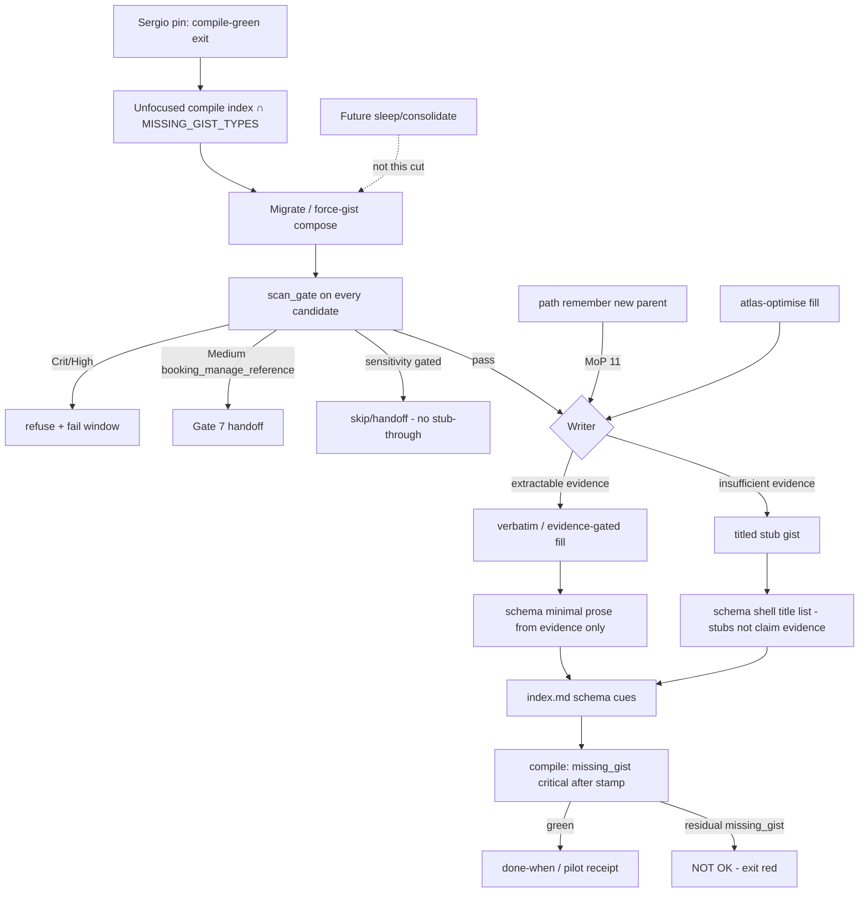

# atlas force-gist / compile-green (design packet)

**work_id:** `2026-10-06-atlas-force-gist-compile-green`  
**change-class:** `new-surface` (mini-genesis depth)  
**Subject skill:** atlas (`github.com/sergio-sisternes-epam/atlas`)  
**Subject atlas:** `github.com/sergio-sisternes-epam/atlas-atlas`  
**Baseline pin (read-only):** atlas package `0.13.0-beta.11` (PR #53)  
**Follow-on of:** `2026-10-06-atlas-optimise-vnext` (evidence-gated fill; residual `missing_gist` allowed)  
**Disposition:** **STOP FOR APPROVAL** — design only; no package implement, no apply, no fleet.

## Autogenesis activation card (design operation)

```text
schema: autogenesis.invocation-request/v1
request_id: 2026-10-06-atlas-force-gist-compile-green-design
parent_request_id: null
target:
  skill: autogenesis
  module: design
  role: operation
arguments:
  objective: >-
    Force gist for all memories indexed at compile; migration creates the
    gists; compile green = exit criteria (residual missing_gist not OK).
    Overrides beta.11 evidence-only handoff skip for indexed pages.
  change_evidence: >-
    Sergio pin 2026-10-06 via Hand; MoN light pilot residual missing_gist;
    BotOps Grand Maester + MoP + King's Guard challenges.
  behavioural_contract: "deferred: agent-spec not invoked; deterministic smokes cover forbidden behaviours"
context:
  subject: atlas
  mode: run
  operation: design
  work_id: 2026-10-06-atlas-force-gist-compile-green
  atlas_id: github.com/sergio-sisternes-epam/atlas-atlas
  atlas_root: /workspace/atlas-optimise-vnext-design/atlas-atlas
  approval_ref: null
resolved:
  skill_root: /home/box/agent-data/workflows/autogenesis
  module_root: /home/box/agent-data/workflows/autogenesis/references/modules/design
  entrypoint: /home/box/agent-data/workflows/autogenesis/references/modules/design/SKILL.md
```

**Must announce:** this operation **stops for approval**. Request **implement** only after explicit Hand/Sergio unlock of this pinned plan. Design completion ≠ implement authority. Heavy pilot and fleet remain blocked until the new done-when + receipt verdict rules ship and Sergio GO is recorded.

---

## Intent

beta.11 closed the invent-gist gap with evidence-gated fill, but left **residual `missing_gist` expected** when evidence is insufficient (confirm-only / handoff). Sergio’s pin (2026-10-06 via Hand) **overrides** that residual-OK and the evidence handoff skip for pages **indexed at compile**: every in-scope parent must get a compile-accepted gist. **Compile green is the exit.** Migration creates the gists; force-gist may compose migrate+optimise. Never invent episodic claim text. Never edit parent memory text.

## Scope

In (product design for a later implement on the atlas package, after separate unlock):

1. **Force-gist writer** (named before implement): verbatim/evidence-gated fill when extractable; otherwise **titled stub** only.
2. **Day-one scope:** all pages of types in compile `MISSING_GIST_TYPES` that are reachable from an **unfocused** compile page index (definition pinned below from beta.11 source).
3. **Migration path** that creates missing gists (+ required same-folder schema pages per one-gist→one-schema) before/with optimise; migration ≠ free invention.
4. **CONTRACT / compile delta:** after store opts in / completes migration + stamp bump, `missing_gist` for in-scope indexed types is **critical** (fail compile). Grandfather: older stamp keeps warning/info until migrate+stamp.
5. **scan_gate binding** on migrate, optimise fill, and remember-created gists; Crit/High refuse+fail; Medium `booking_manage_reference` handoff (Gate 7); receipt hits `{path,type,severity}` only.
6. **Optimise interaction:** force-gist may be migrate+optimise compose; confirm/auto must not auto-promote scan_gate hits; stubs are not claimful evidence for schema/gist promotion.
7. **Cost:** Path/Custom first; Full needs explicit ceiling (max tasks or operator confirm); serial Full only.
8. **Pilot bar:** receipt exit = compile green on pilot store after migrate+fill; N=10 still required; Guard receipt rows; heavy waits Sergio GO under new bar.
9. **Remember-time (MoP 11):** creating an in-scope indexed parent without a gist is fail-closed unless remember also creates verbatim or stub gist (and required schema shell).

Out:

- Implementing sleep/consolidate.
- Free invention of episodic claims; editing parent claim text.
- Fleet apply / multi-store Full in this design or its first implement unlock.
- Expanding this plan into full detector-family / scanner↔vocab implement (note as post-pilot follow-up; only Gate 7 medium rule needed for scan_gate on stubs/promotions).
- Private topology, private hosts, or ops-only URLs in atlas-atlas pages.
- Package product-code implement on this design commit.

## Non-goals

- Replacing path `remember` as the awake writer of new episodic claims (remember gains a fail-closed gist obligation; it does not become the dreamer).
- Making optimise the long-term sleep/consolidate dreamer.
- Retyping every legacy `document` (memory-migrate ownership remains).
- Treating titled stubs as evidence that claimful schema/gist enrichment is safe.
- Silent Full on large stores.

## Change-class

`new-surface` (mini-genesis): new stub writer + compile severity raise + migrate compose + remember fail-closed + receipt/exit bar change. Not `new-skill`. Not a rewrite of vNext — a **follow-on** that overrides residual-OK for indexed pages.

## Baseline (beta.11 facts — source truth)

From pin `0.13.0-beta.11` (`scripts/atlas_cli/commands/validate.py`, `scripts/atlas_optimise.py`, `references/paths/atlas-optimise.md`):

- `GIST_PARENT_TYPES = {experience, decision, lesson, recipe, document, memory, page, protostar}`
- `MISSING_GIST_TYPES = GIST_PARENT_TYPES - {protostar}`
- Compile emits `missing_gist` for every concept page of those types with no valid single-parent `derived_from` gist.
- Default memory rung keeps `missing_gist` as **info** (warn/error rungs escalate); residual after evidence handoff **does not fail** optimise (`missing_gist_fails_run: false`).
- Fill: verbatim parent description or first claim line; insufficient → handoff; security scan blocks Crit/High and `sensitivity: restricted`; never invent; never edit parent.
- `stale_upper_page` applies when a gist has a non-empty `description` and parent type is **`memory`**: description must be a substring of parent body or parent description. Omitting description skips that check.
- One gist forces one same-folder schema listing; schema must be cued from folder `index.md`.
- Store write stamp stays `0.13.0-beta.7` on beta.11; sleep still unimplemented.

**Source contradiction note:** beta.11 path text and receipt treat residual `missing_gist` as done. This follow-on **intentionally overrides** that for stores that opt into the force-gist migrate+stamp. Prefer source truth for type sets, scan behaviour, and stale rules; prefer Sergio pin for exit criteria.

### “Indexed at compile” (day-one definition)

From beta.11 compile enumeration: an **unfocused** `atlas compile` builds its page index from every concept `.md` under the store root (non-reserved, non-staging) that yields readable frontmatter. A page is **in force-gist scope** when:

1. its frontmatter `type` ∈ `MISSING_GIST_TYPES`, and  
2. it appears in that unfocused page index.

Focused `--path` / `--type` compile may omit findings for operator batching; it **does not** shrink the migration obligation for an opted-in store. Protostar remains out of `MISSING_GIST_TYPES`.

---

## Genesis Artifacts

### Component / flow (one mermaid)



### Interface sketch

**New / extended surfaces (design intent for later implement):**

1. **Migrate / force-gist batch** (compose with existing memory-migrate and/or optimise Enter): creates missing gists for in-scope parents; creates required schema pages (shell vs minimal prose per writer branch); bumps store stamp / opt-in flag so compile treats `missing_gist` as critical.
2. **Stub frontmatter marker** (proposed name at implement: `gist_kind: stub` or equivalent package-owned key): title + single `derived_from` parent; **description omitted**; body = fixed non-claim stub template that uses **only** parent `title` (no episodic invention); compile accepts stub for `missing_gist` clearance and waives thin-body / stale_upper for marked stubs with empty description.
3. **Compile / CONTRACT:** post-migrate stamp → `missing_gist` severity **critical** for in-scope types; grandfather on older stamp (info/warn per rung as today).
4. **Remember Enter:** fail-closed if it would leave an in-scope indexed parent without a gist; must create verbatim or stub (+ schema obligation) in the same remember turn, or refuse the remember write.
5. **Receipt fields (additive):** `scan_gate_refuse_count`, `shell_fills`, `body_fills`, `zero_crit_high_promoted`, compile exit, residual `missing_gist` count (must be 0 for opted-in green), hits as `{path, type, severity}` only.

**CLI sketch (additive; exact flags at implement):**

```bash
# Path/Custom first; Full only with ceiling + operator confirm
python3 <atlas-skill>/scripts/atlas_optimise.py plan \
  --root <root> --target <folder|.> --out-dir <dir outside store> \
  --optimise-mode path|custom|full|incremental \
  --force-gist \          # NEW: stubs allowed; residual missing_gist fails exit for opted-in
  --cost-ceiling <N> \
  [--pilot]

# Migrate opt-in / stamp bump (name at implement; may be memory-migrate batch or sibling)
python3 <atlas-skill>/scripts/atlas.py memory-migrate ... --batch force-gist-compile-green
```

### Cost note

Stance: **frugal / Path-first**. Cost scales with in-scope parent count × (gist create + schema + index + scan).

- **Path / Custom first** — required default operator path before Full.
- **Full:** explicit ceiling (`max tasks` or operator confirm); **serial only**; no silent Full on large stores; plan refuses when projected pages/tasks exceed ceiling without confirm.
- **Noise budget:** prefer Path batches over whole-store Full when residual noise would drown review (GM 10).
- Install / compile hot path: severity raise only after stamp; no auto-migrate on compile.

### Acceptance criteria

1. **Compile-green exit:** On an opted-in / post-migrate stamped fixture, every in-scope indexed parent has a valid gist; unfocused compile has **zero** `missing_gist`; residual is **not** OK.
2. **Writer fidelity:** Extractable parents get verbatim/evidence-gated gists under beta.11 rules; insufficient-evidence parents get **titled stubs only** — no invented claim lines.
3. **Stub acceptance:** Marked stubs clear `missing_gist`, omit description (no stale_upper invention), do not launder restricted/confidential/booking/secret-shaped text into indexes/schemas, and are **not** treated as claimful evidence for schema body fill.
4. **scan_gate binds** migrate, optimise fill, and remember-created gists: Crit/High → refuse + fail window; Medium `booking_manage_reference` → handoff (Gate 7); receipts list `{path,type,severity}` only.
5. **Grandfather:** pre-stamp stores keep today’s rung behaviour for `missing_gist`; no silent critical raise.
6. **Remember fail-closed (MoP 11):** new in-scope parent without gist create (verbatim or stub) refuses.
7. **Pilot:** receipt exit = compile green; N=10 spot-check; Guard rows present; MoN light under old bar is **not** a pass under the new bar; heavy/fleet blocked until cut ships + Sergio GO.
8. **Non-goals held:** no sleep implement; no fleet apply; no private topology in atlas-atlas.
9. **Stop-for-implement:** this design writes no atlas package product files.

### Stop-for-approval

This operation **stops for Hand/Sergio approval**. Do not implement, merge package code, tag/release, or fleet-apply from this packet. Unlock must name: writer, stub acceptance, scan_gate binding, compile severity + grandfather, cost ceiling, and pilot done-when.

---

## SOLID record (full five-row)

| Principle | Status | Rationale / design consequence |
|---|---|---|
| S | applicable | Force-gist owns one job: every compile-indexed `MISSING_GIST_TYPES` page has a compile-accepted gist (verbatim or stub) so compile can be green. Sleep, fleet, and detector-vocab expansion stay outside. |
| O | applicable | Four-layer model stays; extension is stub writer + severity/stamp opt-in + remember fail-closed. Intentional override of beta.11 residual-OK is versioned and evaluated, not silent drift. |
| L | not-applicable | Force-gist does not claim to substitute sleep, remember’s claim authorship, or memory-migrate’s document retyping. Stubs are not interchangeable with evidence-backed gist bodies for promotion. |
| I | applicable | Path/Custom Enter remains the cheap surface; Full fields + ceiling only when chosen. Receipt exposes scan/shell/body counts without dumping secret spans. |
| D | trade-off | Continue depending on package compile type sets and helper scan primitives (essential). Do not invent a parallel “indexed memories” ontology. Gate 7 medium rule may extend the scanner; full vocab coverage is a separate follow-up. |

---

## Catalogue Review

- **Genesis matches:** uses A9 SUPERVISED EXECUTION (plan → approve → apply → compile verify), A11 RECONCILIATION LOOP (drive missing_gist to terminal green), S7 DETERMINISTIC TOOL BRIDGE (type sets, stamp, scan_gate, substring/stub marker checks). Refines vNext; conflicts with beta.11 “residual OK” by **explicit pin override**, not accidental drift.
- **Autogenesis extension:** B17 ACTIVATION CARD — Enter gains force-gist / stub / ceiling fields. `autogenesis:S8` not-selected (still INLINE path + LOCAL SIBLING helper; no new skill package).
- **Composition:** INLINE path updates, LOCAL SIBLING helper/compile changes at implement.
- **Inherited anti-patterns avoided:** TOOLLESS ASSERTION; soft-only evaluation; silent Full; promotion-as-invention; sensitivity laundering via shells.
- **Delta only:** stub writer, compile critical after stamp, migrate compose, remember fail-closed, Guard receipt rows, Gate 7 medium handoff, pilot bar raise.
- `pattern_applicability: applicable` (A9, A11, S7, B17). `pattern_admission: not-selected` (S8).

---

## Challenge fold (BotOps + King's Guard)

Treat the following as design-challenge inputs. Each is pinned, rejected, or modified below. (Autogenesis think-challenge wrapper; grounded counters supplied by BotOps/King's Guard rather than fresh web search.)

### Grand Maester

| # | Counter | Disposition |
|---|---|---|
| GM1 | Contradiction with E1 / insufficient_evidence: forcing gists must name writer and what compile accepts (no invented claim text). | **Pin W1–W3, Stub1–Stub3.** Writer = verbatim when extractable; else titled stub. Compile accepts marked stubs without claim invention. |
| GM2 | Compile-green hard contract: which findings critical; grandfather; cost ceiling before Full. | **Pin CCrit1–CCrit2, Cost2.** `missing_gist` critical post-stamp; grandfather older stamp; Path/Custom first; Full needs ceiling + confirm. |
| GM3 | Scope ambiguity: every `type: memory`, every `MISSING_GIST_TYPES`, or only schema-folder pages? | **Pin Scope1.** Day one = unfocused compile index ∩ `MISSING_GIST_TYPES` (source set). Not memory-only. |
| GM4 | Promotion risk: force-fill still runs scan_gate; refuse Crit/High and Medium booking_manage_reference; stubs must not launder restricted spans. | **Pin Sec2–Sec4, KG1–KG3.** |
| GM5 | Pilot bar: MoN light would fail under new exit; heavy blocked until new done-when + receipt. | **Pin Pilot1–Pilot3.** |
| GM6 | Ops: Full cost cap / Path-first; no silent Full. | **Pin Cost2, Cost3.** |
| GM7 | Shell→schema rollup: stubs must not become claimful schema evidence. | **Pin Rollup1.** Schema from stubs = shell / title list only. |
| GM8 | Pilot path under new exit. | **Pin Pilot1, Pilot2.** Light pilot must redefine pass = compile green; old residual-OK pilots do not carry forward. |
| GM9 | Public hygiene. | **Pin Hyg1.** Scrub private hosts/paths/mesh/1P/BotOps tips from atlas-atlas before push. |
| GM10 | Noise budget / Path batches. | **Pin Cost3.** Prefer Path batches; Full only with ceiling. |

### MoP

| # | Counter | Disposition |
|---|---|---|
| MoP1 | Writer named before implement. | **Pin W1.** |
| MoP2 | CONTRACT delta: missing_gist critical vs warning + grandfather. | **Pin CCrit1–CCrit2.** |
| MoP3 | Scope type set explicit. | **Pin Scope1.** |
| MoP4 | Receipt/exit: compile-green done-when; heavy/fleet blocked until cut + Sergio GO. | **Pin Pilot1–Pilot3, Stop1.** |
| MoP5 | Scanner↔vocab gap = separate post-pilot follow-up. | **Pin Vocab1.** Note only; do not expand this plan into full detector-family implement. |
| MoP11 | Remember-time gist create or fail-closed. | **Pin Rem1.** |

### King's Guard

| # | Counter | Disposition |
|---|---|---|
| KG1 | Promotion≠invention: force-gist = verbatim or titled stub only; stubs are NOT evidence for schema/gist promotion; scan_gate still binds. | **Pin W1, Rollup1, Sec2.** |
| KG2 | scan_gate on migrate AND remember-created gists; Crit/High refuse+fail window; Medium booking_manage_reference handoff (Gate 7); receipts `{path,type,severity}` only. | **Pin Sec2–Sec3, Rec1.** Note: `booking_manage_reference` is **not** present in beta.11 `SECRET_RULES`/`PII_RULES` today — this design **adds** Gate 7 as a required scan rule for the force-gist cut (source gap named, not papered over). |
| KG3 | Shells must not launder sensitivity — skip/handoff sensitivity-gated parents; never stub-through restricted/confidential/booking/secret-shaped into indexes/schemas. | **Pin Sec4.** |
| KG4 | Pilot Guard receipt rows: scan_gate refuse count, shell vs body fills, zero Crit/High promoted; empty hits ≠ full vocab coverage. | **Pin Rec1, Vocab1.** |
| KG5 | Public atlas-atlas scrub before push. | **Pin Hyg1.** |
| KG6 | No implement/heavy/fleet until design names writer + stub acceptance + scan_gate binding and Hand/Sergio unlock. | **Pin Stop1** (this packet satisfies the naming; unlock still required). |

---

## Locked pins

### Writer and stubs

| ID | Pin |
|---|---|
| W1 | **Writer (named):** (a) if extractable lower-layer evidence per beta.11 rules → **verbatim / evidence-gated fill**; (b) if insufficient evidence → **titled stub only**. Never invent episodic claims. Never edit parent memory/claim text. |
| W2 | Verbatim branch keeps beta.11 extract rules (plain description or first claim line), confirm default, `--auto-verbatim` opt-in for auto class. |
| W3 | Stub branch writes: parent `title` (required), single `derived_from` parent, **description omitted**, body = fixed non-claim stub template using only parent title, frontmatter stub marker. |
| Stub1 | **Compile acceptance:** marked stubs clear `missing_gist`; empty description skips `stale_upper_page`; thin-body waived for marked stubs (or body is the fixed template). Implement must add these compile/contract rules with the stamp opt-in. |
| Stub2 | Stubs are **not** evidence for claimful schema or gist-body promotion (Rollup1). |
| Stub3 | Substring / stale rules must not be satisfied by inventing description text to “look green.” |

### Scope, compile, grandfather

| ID | Pin |
|---|---|
| Scope1 | Day-one scope = pages in unfocused compile page index whose `type` ∈ compile `MISSING_GIST_TYPES` (`experience`, `decision`, `lesson`, `recipe`, `document`, `memory`, `page`). Not memory-only. Not protostar. |
| CCrit1 | After store **opts in / completes force-gist migration + stamp bump**, `missing_gist` for in-scope types is **critical** (fail compile). |
| CCrit2 | **Grandfather:** stores on older stamp keep today’s rung behaviour (`info`/`warn`/`error`) until migrate+stamp. No silent critical raise. |
| Mig1 | Migration creates missing gists (and required schema pages per one-gist→one-schema + index cues). Migration ≠ free invention (uses W1). |
| Rem1 | **Remember-time:** creating an in-scope indexed parent must also create verbatim or stub gist (and satisfy schema obligation) in the same turn, or **fail closed**. |

### Security / scan_gate / sensitivity

| ID | Pin |
|---|---|
| Sec2 | **scan_gate binds** optimise fill, **migrate** force-gist creates, and **remember-created** gists. |
| Sec3 | Crit/High → **refuse + fail window** (nothing promoted). Medium **`booking_manage_reference`** → **handoff** (Gate 7). Receipt hits are `{path, type, severity}` only — no secret spans in receipts. |
| Sec4 | Sensitivity-gated parents (`restricted`, and confidential/booking/secret-shaped per scan rules) → **skip/handoff**; **never stub-through** into indexes/schemas. Shells must not launder. |
| Vocab1 | Scanner↔vocab gap remains a **post-pilot follow-up**. Empty hits ≠ full vocab coverage. Do not expand this plan into full detector-family implement beyond Gate 7 need. |

### Optimise, cost, pilot, hygiene, stop

| ID | Pin |
|---|---|
| Opt1 | Force-gist may compose migrate+optimise. Confirm/auto **must not** auto-promote scan_gate hits. |
| Rollup1 | **Shell→schema:** evidence-backed gists may feed minimal-prose schema (beta.11). Stub-only folders get **schema shell** (titles + relates_to member list), not claimful prose derived from stubs. |
| Cost2 | Require **Path/Custom first**. Full needs explicit ceiling (max tasks or operator confirm). **Serial Full only.** |
| Cost3 | Prefer Path batches when noise budget would drown review; no silent Full on large stores. |
| Pilot1 | Redefine receipt exit = **compile green** on pilot store after migrate+fill (residual `missing_gist` count 0 for opted-in). N=10 spot-check still required. |
| Pilot2 | MoN light under beta.11 residual-OK is **not** a pass under the new bar. Heavy pilot and fleet **blocked** until this cut ships and **Sergio GO**. |
| Pilot3 / Rec1 | Guard receipt rows required: `scan_gate_refuse_count`, `shell_fills`, `body_fills`, `zero_crit_high_promoted`, compile exit, residual missing_gist. |
| Hyg1 | Public atlas-atlas scrub before push: no private hosts, private mesh hostnames, private checkout paths, 1Password item ids, or BotOps-only tips. Public github.com/sergio-sisternes-epam/atlas and atlas-atlas links OK. Hand/Sergio names OK for pin provenance. |
| Stop1 | No package implement, heavy pilot apply, or fleet until this design names writer + stub acceptance + scan_gate binding (**done in this packet**) **and** Hand/Sergio explicit unlock. |
| S1 | Sleep/consolidate remains unimplemented; optimise remains interim fill path unless a future design says otherwise. |

**C1–C5:** C1 counters above are non-trivial. C2 high-severity items pinned (W1, CCrit1, Sec2–Sec4, Pilot1–2, Rem1). C3 pins visible. C4 scope intact (follow-on force-gist/compile-green only). C5 no package implement in this operation. Change-class stated. Genesis Artifacts complete for new-surface.

---

## Behavioural contract (agent-spec)

`deferred: agent-spec was not invoked in this design session; deterministic helper/compile tests and adversarial smokes will cover each forbidden behaviour (invention, stub-as-claim-evidence, scan_gate bypass, sensitivity laundering, silent Full, residual-OK on opted-in stamp, remember without gist).`

`@forbidden` families to protect at implement: invent episodic gist body; treat stub as schema evidence; promote Crit/High; stub-through restricted; skip scan_gate on migrate/remember; claim fleet ready without compile-green receipt; raise missing_gist critical without stamp opt-in.

## Evaluation plan

**Deterministic smokes (primary):**

1. Opted-in fixture: N parents across `MISSING_GIST_TYPES`, mix of rich and empty bodies → after migrate+force-gist, unfocused compile exit 0 for `missing_gist`; stubs marked; verbatim only where extract existed.
2. Insufficient-evidence parent → stub created; no new claim sentences not present in parent; description omitted.
3. Restricted / secret-shaped parent → skip/handoff; no stub, no schema cue promotion of secret text; receipt hit `{path,type,severity}` only.
4. Medium `booking_manage_reference` → handoff class; not auto-applied.
5. Grandfather fixture on older stamp → `missing_gist` not critical; post-stamp twin → critical until gist exists.
6. Remember new in-scope parent without gist path → refuse; with stub/verbatim in same turn → accept; compile green for that path.
7. Stub-only folder → schema shell only; adversarial check fails if schema body contains invented claims.
8. Full without ceiling/confirm → refuse; Path batch under ceiling → plans.
9. Receipt rows present; `zero_crit_high_promoted` true on green pilot; residual missing_gist 0.

Map to package tests at implement (`scripts/test_atlas_optimise.py`, `scripts/test_memory_layers.py`, remember path tests, new adversarial YAML).

**Agent evaluations (secondary):** operator Enter refuses silent Full; pilot language does not claim fleet_ready.

## Adversarial scenario draft

```yaml
id: atlas-force-gist-compile-green-adversarial-v1
work_id: 2026-10-06-atlas-force-gist-compile-green
packages: [atlas]
adversarial: true
smokes:
  - id: invent-forbidden
    source: "GM1 / E1 override — Maynez-style hallucination risk"
    expect: "insufficient evidence yields titled stub or refuse; zero invented claim lines"
  - id: stub-not-schema-evidence
    source: "GM7 / KG1 Rollup1"
    expect: "schema body must not treat stub text as claimful evidence"
  - id: scan-gate-migrate-remember
    source: "KG2 Sec2"
    expect: "Crit/High on migrate or remember gist create refuses; Medium booking_manage_reference is handoff"
  - id: sensitivity-no-stub-through
    source: "KG3 Sec4"
    expect: "restricted/confidential/booking/secret-shaped parents never stub into index/schema"
  - id: residual-not-ok-post-stamp
    source: "Sergio pin / Pilot1"
    expect: "opted-in stamp with residual missing_gist fails compile / pilot exit"
  - id: grandfather-pre-stamp
    source: "GM2 CCrit2"
    expect: "older stamp does not hard-fail missing_gist as critical"
  - id: remember-fail-closed
    source: "MoP11 Rem1"
    expect: "remember without gist create refuses for in-scope types"
  - id: no-silent-full
    source: "GM6 / GM10 Cost2-3"
    expect: "Full without ceiling or operator confirm refuses"
  - id: receipt-guard-rows
    source: "KG4 Rec1"
    expect: "receipt includes scan_gate_refuse_count, shell_fills, body_fills, zero_crit_high_promoted"
  - id: empty-hits-not-vocab
    source: "MoP5 / KG4 Vocab1"
    expect: "empty scan hits do not claim full detector vocab coverage"
filename_contract: atlas/references/scenarios/atlas-force-gist-compile-green-adversarial-v1.yaml
```

Implement may **add** smokes; must not **drop** these without a new design.

---

## Open questions still needing Sergio lock (after pins)

Pins above are proposed locked for design approval. Remaining operator locks (if Sergio disagrees, say so on unlock):

1. **Stub marker name + exact compile waiver set** (thin-body waive vs fixed template) — implement may choose `gist_kind: stub` unless Sergio names another key.
2. **Stamp / opt-in mechanism** — new `atlas_release` bump vs dedicated force-gist stamp field (must be explicit and grandfather-safe).
3. **Gate 7 medium rule corpus** — confirm `booking_manage_reference` detector definition for the first ship (full vocab still post-pilot).
4. **Heavy pilot store + Sergio GO** — not part of design approval; required before heavy/fleet.

---

## Invocation receipt (design)

```text
disposition: awaiting-approval
work_id: 2026-10-06-atlas-force-gist-compile-green
operation: design
change_class: new-surface
loaded_entrypoints:
  - autogenesis/SKILL.md
  - autogenesis/references/modules/workflow-discipline/SKILL.md
  - autogenesis/references/modules/design/SKILL.md
  - genesis/SKILL.md (mini-genesis depth)
  - autogenesis/references/modules/think-challenge/SKILL.md
  - autogenesis/references/skill-design-principles.md
baseline_pin: atlas 0.13.0-beta.11 (read-only)
artifact: autogenesis/plans/2026-10-06-atlas-force-gist-compile-green.md
implement_authorised: false
