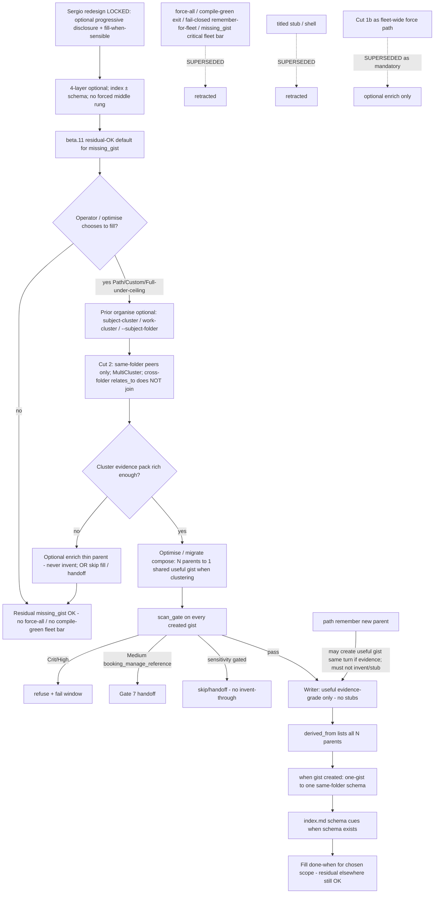

# atlas optional progressive disclosure + optimise fill-when-sensible (design packet)

**work_id:** `2026-10-06-atlas-force-gist-compile-green` *(unchanged; title/framing softened)*  
**change-class:** `new-surface` (mini-genesis depth)  
**Subject skill:** atlas (`github.com/sergio-sisternes-epam/atlas`)  
**Subject atlas:** `github.com/sergio-sisternes-epam/atlas-atlas`  
**Baseline pin (read-only):** atlas package `0.13.0-beta.11` (PR #53) — **evidence-gated residual-OK restored as the default posture** for `missing_gist` unless a future separate unlock hardens it.  
**Follow-on of:** `2026-10-06-atlas-optimise-vnext` (evidence-gated fill; residual `missing_gist` allowed)  
**Disposition:** **DESIGN APPROVED + IMPLEMENT UNLOCKED** (Hand deputy, Sergio delegated, 2026-10-06) against tip `720c6ed`. Implement authority = soft optional-4-layer / fill-when-sensible only. No fleet force. KG required before any atlas-atlas memory push. No package product code in atlas-atlas from this PR.

## Autogenesis activation card (design operation)

```text
schema: autogenesis.invocation-request/v1
request_id: 2026-10-06-atlas-force-gist-compile-green-design
parent_request_id: null
target:
  skill: autogenesis
  module: design
  role: operation
arguments:
  objective: >-
    Soft redesign: 4-layer optional progressive disclosure (not mandatory
    fleet completeness through all rungs); index may exist with or without
    schema; direct memory / other types allowed (no forced middle rung);
    optimise builds useful/evidence-grade gists when sensible — not force-all
    stubs, not fail-closed missing_gist for fleet completeness / compile-green
    exit. Shared cluster N→1 + MultiCluster + Cut 2 same-folder membership
    remain valid when optimise chooses to cluster/fill. Hard force-all /
    compile-green exit / fail-closed remember-for-fleet SUPERSEDED. Baseline
    beta.11 residual-OK restored as default.
  change_evidence: >-
    Sergio redesign pin 2026-10-06 via Hand (soft progressive disclosure +
    fill-when-sensible; supersedes hard force-all / compile-green exit);
    prior Cut 2 / MultiCluster / no-stubs / KG note / scan_gate / Hyg1 kept
    where still useful; BotOps MoP design amend.
  behavioural_contract: "deferred: agent-spec not invoked; deterministic smokes cover forbidden behaviours"
context:
  subject: atlas
  mode: run
  operation: design
  work_id: 2026-10-06-atlas-force-gist-compile-green
  atlas_id: github.com/sergio-sisternes-epam/atlas-atlas
  atlas_root: <atlas-atlas-root>
  approval_ref: "Hand-deputy-design-APPROVED+implement-UNLOCKED-2026-10-06-soft-tip-720c6ed (Sergio delegated; Soft1-4 CSoft1 Soft3 non-memory/index-first-class; force-all/compile-green SUPERSEDED; no fleet force; KG before atlas-atlas memory push)"
resolved:
  skill_root: <autogenesis-skill-root>
  module_root: <autogenesis-skill-root>/references/modules/design
  entrypoint: <autogenesis-skill-root>/references/modules/design/SKILL.md
```

**Must announce:** **Design APPROVED** by Hand (deputy, Sergio delegated) on 2026-10-06 against tip `720c6ed` (Soft1–4 + CSoft1 + Soft3 non-memory/index-first-class). **Implement UNLOCKED** same day for soft optional-4-layer / fill-when-sensible only — not force-all / not compile-green fleet bar. No fleet force. KG required before any atlas-atlas memory push. Heavy pilot / fleet still need separate GO. Hard force-all / compile-green exit framing remains **SUPERSEDED**. No package product code lands in atlas-atlas.

---

## Intent

beta.11 closed the invent-gist gap with evidence-gated fill and left **residual `missing_gist` expected / OK** when evidence is insufficient (confirm-only / handoff). Prior cuts of this work_id attempted to **override** that residual-OK with a hard force-all / compile-green exit. **Sergio redesign pin (2026-10-06 via Hand) SUPERSEDES that hard force.**

**New Sergio pins (LOCKED — supersede hard force-all):**

1. **4-layer is optional progressive disclosure** — not mandatory fleet completeness through all rungs.
2. **Index may exist with or without schema** — schema is not required for index membership.
3. **Direct memory / other types allowed** — **no forced middle rung**; **non-memory types: no forced typed extensions / middle layer**; stay **index-first-class** (a memory need not have a gist before a schema; types may skip layers).
4. **Optimise builds gists when sensible** (useful / evidence-grade only) — **not** force-all stubs, **not** fail-closed `missing_gist` for fleet completeness / compile-green exit for all indexed pages.

**What this means for exit / severity:**

- Default posture = **beta.11 residual-OK** for `missing_gist` (evidence-gated; residual allowed).
- Optimise / migrate may **optionally** fill useful gists when evidence is rich enough and the operator chooses Path/Custom (or Full under ceiling).
- Compile-green exit = `indexed_missing_gist_after=0` / residual `missing_gist` NOT OK after opt-in is **SUPERSEDED** as the fleet bar.
- `missing_gist` critical after migrate+stamp as a fleet-completeness bar is **SUPERSEDED** (grandfather/critical upgrade for force-all retracted).
- Fail-closed remember requiring a useful gist same turn for fleet completeness is **SUPERSEDED**.
- Cut 1b enrich-before-migrate / block-migrate-until-useful as a **fleet-wide force path** is **SUPERSEDED**; may remain as an **optional** enrich when an operator chooses to fill a thin parent (not a mandatory gate for every thin page).

**Still LOCKED (useful under soft model):**

- **No stubs** — every gist that *is* created must be useful (evidence-grade). No titled-stub writer; no invented bodies (KG note).
- **Shared cluster gist (N→1) + MultiCluster + Cut 2** — when optimise chooses to cluster/fill: same-folder membership only; cross-folder `relates_to` does not join; MultiCluster allows many clusters per folder.
- **scan_gate** binds migrate / remember / optimise creates (Crit/High refuse; Medium `booking_manage_reference` handoff).
- **Path/Custom first**; Full needs ceiling.
- **Design APPROVED + implement UNLOCKED** (Hand/Sergio, 2026-10-06, tip `720c6ed`) for soft fill-when-sensible only; no fleet force; KG before atlas-atlas memory push.
- **Hyg1** placeholders only.

Never invent episodic claim text. Never edit parent memory text.

## Scope

In (product design for a later implement on the atlas package, after separate unlock):

1. **Optional progressive disclosure** across the four-layer model — operators and optimise may deepen pages when useful; no mandate that every indexed page climb every rung.
2. **Index membership independent of schema** — a page may be indexed with or without a same-folder schema.
3. **No forced middle rung / index-first-class** — memory and **non-memory** types may sit without a gist or typed middle-layer extension; schema may relate without requiring a prior gist on that lineage when the type model allows skip; do not invent forced typed extensions for non-memory pages.
4. **Optimise fill-when-sensible writer:** verbatim / evidence-gated **useful gist only** when evidence is rich enough and the operator opts in (Path/Custom/Full-under-ceiling). No titled-stub branch. No invent-to-clear-`missing_gist`. No force-all for fleet completeness.
5. **Shared cluster gist (N→1) + Cut 2** — when optimise chooses to cluster/fill: only same-folder peers; MultiCluster; `derived_from` lists all N parents; one-gist→one-schema still holds **when a gist is created** (schema obligation attaches to the gist create, not to bare index membership).
6. **Optional enrich** for a thin parent the operator chooses to fill (remember/optimise evidence rules; never invent) — **not** a fleet-wide block-migrate gate.
7. **scan_gate binding** on migrate, optimise fill, and remember-created gists; Crit/High refuse+fail; Medium `booking_manage_reference` handoff (Gate 7); receipt hits `{path,type,severity}` only.
8. **Cost:** Path/Custom first; Full needs explicit ceiling (max tasks or operator confirm); serial Full only.
9. **Pilot bar (soft):** evidence-gated residual-OK remains acceptable; useful fills when sensible; N=10 still useful for quality spot-check; Guard receipt rows for fills that happen; heavy waits Sergio GO under a separate unlock — **not** compile-green-for-all-indexed as the exit.
10. **Remember-time:** may create a useful gist in the same turn when evidence supports it; **must not** invent or stub. Fail-closed “must wire useful gist same turn for fleet completeness” is **SUPERSEDED**.

Out:

- Implementing sleep/consolidate.
- Free invention of episodic claims; editing parent claim text.
- **Titled stubs, shell gists, title-only gist bodies** as a clearance path (still superseded).
- **Force-all indexed pages to have gists** (SUPERSEDED).
- **Compile-green exit** requiring `indexed_missing_gist_after=0` / residual NOT OK as fleet bar (SUPERSEDED).
- **Fail-closed remember** requiring useful gist same turn for fleet completeness (SUPERSEDED).
- **`missing_gist` critical after migrate+stamp** as fleet completeness bar / grandfather critical upgrade for force-all (SUPERSEDED).
- **Cut 1b as fleet-wide force path** (SUPERSEDED as mandatory; optional enrich when operator chooses to fill remains in scope).
- Exclude-from-index / de-index / skip tricks to fake a green bar (still rejected — and under soft model there is no force-green bar to fake).
- Fleet apply / multi-store Full in this design or its first implement unlock.
- Expanding this plan into full detector-family / scanner↔vocab implement (note as post-pilot follow-up; only Gate 7 medium rule needed for scan_gate on promotions).
- Private topology, private hosts, or ops-only URLs in atlas-atlas pages.
- Inventing a private clustering ontology beyond same-folder membership (Cut 2) plus prior organise signals.
- Joining clusters via cross-folder `relates_to` chains (Cut 2 REJECTED behaviour — still locked).
- Package product-code implement on this design commit.
- Framing that overrides beta.11 residual-OK with hard force (SUPERSEDED).

## Non-goals

- Replacing path `remember` as the awake writer of new episodic claims.
- Making optimise the long-term sleep/consolidate dreamer.
- Retyping every legacy `document` (memory-migrate ownership remains).
- Treating title-only or invented gist text as evidence that claimful schema/gist enrichment is safe.
- Silent Full on large stores.
- Inventing bodies solely to clear `missing_gist` or satisfy a former compile-green bar.
- Mandating that every indexed page have a gist, schema, or full four-layer stack.
- One-gist-per-page when same-folder peers already form a subject cluster under Cut 2 / MultiCluster **and** optimise chooses to fill (prefer shared cluster gist).
- Treating cross-folder `relates_to` as cluster membership.

## Change-class

`new-surface` (mini-genesis): soft progressive-disclosure posture + optional optimise fill-when-sensible (evidence-gated) + shared cluster gist (N→1) when chosen + MultiCluster + Cut 2 same-folder membership + scan_gate on creates + Path-first cost. Hard force-all / compile-green exit / fail-closed remember-for-fleet / missing_gist-critical-as-fleet-bar / Cut 1b-as-fleet-force **SUPERSEDED**. Stub writer remains **retracted**. Not `new-skill`. Not a rewrite of vNext — a **follow-on amend** that **restores** beta.11 residual-OK as default and reframes prior force pins as optional fill tools.

## Baseline (beta.11 facts — source truth)

From pin `0.13.0-beta.11` (`scripts/atlas_cli/commands/validate.py`, `scripts/atlas_optimise.py`, `references/paths/atlas-optimise.md`):

- `GIST_PARENT_TYPES = {experience, decision, lesson, recipe, document, memory, page, protostar}`
- `MISSING_GIST_TYPES = GIST_PARENT_TYPES - {protostar}`
- Compile emits `missing_gist` for every concept page of those types with no valid `derived_from` gist. beta.11 source today requires exactly one `derived_from` parent for a gist to count (`_valid_gist_parent`); when optimise chooses shared cluster fill, this follow-on **extends** that to **N≥1 parents** (DerivedN) — same-folder peers only.
- Default memory rung keeps `missing_gist` as **info** (warn/error rungs escalate); residual after evidence handoff **does not fail** optimise (`missing_gist_fails_run: false`). **This residual-OK posture is the restored default under the redesign pin.**
- Fill: verbatim parent description or first claim line; insufficient → handoff; security scan blocks Crit/High and `sensitivity: restricted`; never invent; never edit parent.
- `stale_upper_page` applies when a gist has a non-empty `description` and parent type is **`memory`**: description must be a substring of parent body or parent description. Omitting description skips that check.
- One gist forces one same-folder schema listing; schema must be cued from folder `index.md` — **when a gist is created**. Index membership itself does **not** require a schema (redesign pin 2).
- Store write stamp stays `0.13.0-beta.7` on beta.11; sleep still unimplemented.

**Source posture note:** Prefer source truth for type sets and scan behaviour. Prefer Sergio redesign pins for exit criteria (residual-OK default; optional progressive disclosure; fill-when-sensible). Prefer locked Cut 2 / MultiCluster / no-stubs / scan_gate / Hyg1 where still useful. Prefer optional enrich (not fleet-wide Cut 1b force) for insufficient-evidence handling when an operator chooses to fill. Single-parent `derived_from` in beta.11 validate is **extended** (not silently ignored) to multi-parent shared gists under DerivedN **when shared fill is chosen**.

### “Indexed at compile” (day-one definition — informational)

From beta.11 compile enumeration: an **unfocused** `atlas compile` builds its page index from every concept `.md` under the store root (non-reserved, non-staging) that yields readable frontmatter. Under the soft model, being in that index ∩ `MISSING_GIST_TYPES` **does not** create a force-gist obligation. Protostar remains out of `MISSING_GIST_TYPES`. Index membership does not require schema.

---

## Genesis Artifacts

### Component / flow (one mermaid)



### Interface sketch

**Surfaces (design intent for later implement):**

1. **Optimise fill-when-sensible** (compose with existing memory-migrate and/or optimise Enter): create **useful** gists when evidence is rich and operator opts in — prefer **one shared gist per same-folder cluster** (Cut 2; MultiCluster) when clustering. Create required schema pages **when a gist is created** (minimal prose from evidence only). Thin / insufficient → optional enrich or skip/handoff; do not invent; do not stub; do not force fleet completeness.
2. **Shared cluster gist (N→1) + Cut 2:** see **Shared cluster gist design** below. Extends beta.11 single-parent `derived_from` to N≥1 when shared fill is chosen; membership = same folder only.
3. **~~Stub frontmatter marker~~ SUPERSEDED:** `gist_kind: stub`, title-only shells, and compile waivers that accept title-only stubs remain **out of scope**.
4. **~~Force-all / compile-green exit / missing_gist critical as fleet bar~~ SUPERSEDED:** no stamp opt-in that raises `missing_gist` to critical for all indexed pages as a completeness mandate; residual-OK default restored.
5. **~~Fail-closed remember-for-fleet~~ SUPERSEDED:** remember may create/wire a useful gist when evidence supports it; must not invent/stub; must not refuse solely because a middle rung is absent.
6. **~~Exclude-from-index~~ still REJECTED** as a clearance trick (and under soft model there is no force-green bar to dodge).
7. **Receipt fields (additive, for fills that happen):** `scan_gate_refuse_count`, `body_fills` (useful/evidence-grade fills), `shared_gist_count`, `cluster_size_hist`, `enrich_optional_count`, `zero_crit_high_promoted`, hits as `{path, type, severity}` only. **`shell_fills` / force-green residual-must-be-0 / exclude_count retracted.**

### Shared cluster gist design (N parents → 1 gist) — when optimise chooses to fill

Align with **existing** optimise organise/move helpers (beta.11 path + helper) for **prior relocation**; do not invent private topology. **Cluster membership is Cut 2 (same folder only).** Applies when optimise elects to cluster/fill — not as a force-all pass.

**Cut 2 / FolderOnly (LOCKED — Sergio via Hand; kept):** **Cluster membership = same folder only.** Cross-folder `relates_to` chains do **not** join clusters. Subject-clustering / work-cluster / `--subject-folder` may still move pages into a folder first; membership evaluated **after** location.

**MultiCluster (LOCKED — kept):** A folder may hold **multiple** subject clusters. Each cluster that is filled gets its **own** shared useful gist. Gists sit under that folder’s schema layer when created (each gist still obeys one-gist→one-schema). Do **not** collapse all co-located parents into one gist solely because they share a folder.

**Signals (two phases — organise then membership):**

| Phase | Signal | Source | Role |
|---|---|---|---|
| Prior organise (optional) | Subject stem / `--subject-folder <folder>:<stem>` / `work_id` → `work/<work_id>/` | Existing optimise subject-cluster / work-cluster | May **move** pages into a destination folder before membership runs |
| Membership (Cut 2) | Same-folder co-location | After location | **Only** same-folder peers may share a cluster gist |
| Within-folder split | Same-folder subject key / same-folder `relates_to` | Kinds already on disk among co-located peers | MultiCluster split inside one folder; **never** pulls in parents from other folders |

**Choosing the shared gist (when filling):**

1. Optionally run prior organise/move so related parents land in the same folder.
2. Form clusters from **same-folder peers only** (Cut 2) for parents the operator chose to fill; use within-folder subject / `relates_to` only to split MultiCluster.
3. **One shared useful gist per filled cluster** (singleton N=1 allowed). MultiCluster: each filled cluster gets its own gist.
4. Place the gist in the members’ folder.
5. Build an **evidence pack = union** of extractable spans from cluster parents (beta.11 / vNext evidence rules). Optional enrich thin members before declaring the pack insufficient — or skip fill / handoff.
6. Writer emits one **useful** gist body from that pack (verbatim/evidence-gated). Never invent. Never edit parent claim text.
7. **`derived_from`:** the gist lists **all N parents**. Extends beta.11 `_valid_gist_parent` → **N≥1**. All N parents must be same-folder (Cut 2).
8. **`relates_to` among parents:** navigation edges stay; do not expand membership across folders.
9. **stale_upper_page / substring for N>1:** union pack membership (each description span substring of at least one derived_from parent).
10. **one-gist → one-schema when a gist is created:** shared gist still requires exactly one same-folder `type: schema` listing it; schema cued from folder `index.md`. **Index membership without schema remains legal** (redesign pin 2). Schema lists the **gist**, not each parent.

**CLI sketch (additive; exact flags at implement):**

```bash
# Path/Custom first; Full only with ceiling + operator confirm
python3 <atlas-skill>/scripts/atlas_optimise.py plan \
  --root <root> --target <folder|.> --out-dir <dir outside store> \
  --optimise-mode path|custom|full|incremental \
  --fill-sensible \   # NEW framing: useful gists when evidence supports; shared cluster N→1; no stubs; no force-all
  --cost-ceiling <N> \
  [--subject-folder <folder>:<stem>]... \
  [--pilot]
```

Prior `--force-gist` / `force-gist-compile-green` naming is **SUPERSEDED** in design language; implement may alias or rename — do not ship a force-all completeness mode under the soft pin.

### Cost note

Stance: **frugal / Path-first**. Cost scales with **chosen** fill scope × (gist create + schema + index cue + scan) — not with every indexed page.

- **Path / Custom first** — required default operator path before Full.
- **Full:** explicit ceiling (`max tasks` or operator confirm); **serial only**; no silent Full on large stores.
- **Noise budget:** prefer Path batches over whole-store Full (GM 10).
- Install / compile hot path: no auto-migrate on compile; no force-all on compile.

### Acceptance criteria

1. **Soft exit / residual-OK:** Default posture matches beta.11 — residual `missing_gist` after evidence handoff is **OK**. No mandate that every indexed in-scope page have a gist for compile green / fleet completeness.
2. **Progressive disclosure:** 4-layer climb is optional; index may exist with or without schema; types may skip middle rungs (no forced gist before schema / no forced gist for every memory).
3. **Writer fidelity (when filling):** Extractable parents / clusters get verbatim/evidence-gated **useful** gists; insufficient → optional enrich or skip/handoff — **no stub**, **no invented body**, **no force-all**.
4. **~~Stub acceptance~~ SUPERSEDED:** titled stubs do not clear `missing_gist` and are not a designed path.
5. **~~Force-all / compile-green fleet bar~~ SUPERSEDED:** design/smokes refuse any path that treats residual `missing_gist` as fail-closed fleet completeness after a force opt-in.
6. **Shared cluster (N→1) + MultiCluster + Cut 2 (when filling):** same-folder peers in a filled cluster share **one** useful gist; MultiCluster allowed; cross-folder `relates_to` does not join; no private clustering ontology.
7. **scan_gate binds** migrate, optimise fill, and remember-created gists: Crit/High → refuse + fail window; Medium `booking_manage_reference` → handoff (Gate 7); receipts list `{path,type,severity}` only.
8. **Remember (soft):** may create/wire useful gist same turn when evidence supports; must not invent/stub; must not refuse solely for missing middle rung / fleet completeness.
9. **Pilot (soft):** evidence-gated residual-OK acceptable; useful fills quality-checked (N=10 useful); Guard rows for fills that happen; heavy/fleet blocked until separate Sergio GO — **not** under a compile-green-for-all bar.
10. **Non-goals held:** no sleep implement; no fleet apply; no private topology in atlas-atlas; no stub clearance; no invent-to-clear; no cross-folder relates_to cluster join; no hard force framing.
11. **Approval/unlock:** design APPROVED + implement UNLOCKED for soft tip `720c6ed` (Hand/Sergio 2026-10-06); soft fill-when-sensible only; no fleet force; KG before atlas-atlas memory push; atlas-atlas stays design docs (no package product code here).
12. **Cut 1b reframed:** fleet-wide enrich-before-migrate / block-until-useful **SUPERSEDED** as mandatory; optional enrich when operator chooses to fill a thin parent **kept**.
13. **Cut 2 locked (kept):** cluster membership = same folder only when clustering.

### Approval / unlock record

**Design APPROVED** by Hand of the King (deputy; Sergio delegated) on **2026-10-06** against soft tip **`720c6ed`** (`720c6ed570a7be1838f4434461336a61847b7ec2`). Approved scope: Soft1–4 + CSoft1 + Soft3 non-memory/index-first-class. Hard force-all / compile-green / fail-closed remember-for-fleet / missing_gist-critical-as-fleet-bar remain **SUPERSEDED**.

**Implement UNLOCKED** (Hand/Sergio, 2026-10-06) for **soft optional-4-layer / fill-when-sensible only** (useful/evidence-grade writer; shared cluster N→1 when filling; Cut 2; MultiCluster; scan_gate; Path/Custom first). **No fleet force.** **KG required before any atlas-atlas memory push.** Heavy pilot / fleet still need a separate Sergio GO. Do not tag/release or fleet-apply from this packet alone. Package product-code implement belongs on the atlas package (not as product code in atlas-atlas).

---

## SOLID record (full five-row)

| Principle | Status | Rationale / design consequence |
|---|---|---|
| S | applicable | Soft fill owns one job: when an operator chooses to deepen, create compile-accepted **useful** gists (singleton or shared cluster) without inventing or stubbing. Force-all fleet completeness, sleep, stub clearance, and detector-vocab expansion stay outside. |
| O | applicable | Four-layer model stays as **optional** progressive disclosure; extension is fill-when-sensible writer + shared cluster N→1 when chosen + MultiCluster + Cut 2 + scan_gate on creates; hard force / compile-green fleet bar / fail-closed remember-for-fleet / Cut 1b-as-fleet-force superseded; stub writer retracted. Intentional restore of beta.11 residual-OK is versioned, not silent drift. |
| L | not-applicable | Soft fill does not claim to substitute sleep, remember’s claim authorship, or memory-migrate’s document retyping. Invented or title-only bodies are not interchangeable with evidence-backed useful gists. Shared cluster gist is not a license to invent private clustering topology or to join clusters across folders. |
| I | applicable | Path/Custom Enter remains the cheap surface; Full fields + ceiling only when chosen; `--subject-folder` remains the operator cluster pin. Receipt exposes scan/useful-fill/shared-gist counts without dumping secret spans. |
| D | trade-off | Continue depending on package compile type sets, helper scan primitives, and existing subject-cluster / work-cluster organise signals. Membership depends on same-folder co-location (Cut 2) when clustering. Do not invent a parallel force-all ontology. Gate 7 medium rule may extend the scanner; full vocab coverage is a separate follow-up. |

---

## Catalogue Review

- **Genesis matches:** uses A9 SUPERVISED EXECUTION (plan → approve → apply → compile verify), A11 RECONCILIATION LOOP (drive **chosen** gaps toward useful fills — not force-all residual-to-zero), S7 DETERMINISTIC TOOL BRIDGE (type sets, scan_gate, evidence/useful-gist checks, subject-cluster signals). Refines vNext; **restores** beta.11 residual-OK as default; rejects stub clearance; **supersedes** hard force-all / compile-green exit by **Sergio redesign pin**.
- **Autogenesis extension:** B17 ACTIVATION CARD — Enter gains fill-sensible / useful-gist / ceiling / optional-enrich / shared-cluster fields (force-gist / exclude / force-green fields retracted). `autogenesis:S8` not-selected.
- **Composition:** INLINE path updates, LOCAL SIBLING helper/compile changes at implement (DerivedN + union stale check when shared fill chosen).
- **Inherited anti-patterns avoided:** TOOLLESS ASSERTION; soft-only evaluation; silent Full; promotion-as-invention; sensitivity laundering; invent-to-clear-missing_gist; titled-stub clearance; private clustering ontology; hard-force override of residual-OK without a separate unlock.
- **Delta only:** soft progressive disclosure + fill-when-sensible (force-all / compile-green SUPERSEDED), Cut 1b reframed optional, shared cluster N→1, MultiCluster, Cut 2, scan_gate, Path-first, Guard receipt rows for fills, Gate 7 medium handoff.
- `pattern_applicability: applicable` (A9, A11, S7, B17). `pattern_admission: not-selected` (S8).

---

## Challenge fold (BotOps + King's Guard)

Treat the following as design-challenge inputs. Each is pinned, rejected, modified, superseded, or left open below.

### Grand Maester

| # | Counter | Disposition |
|---|---|---|
| GM1 | Contradiction with E1 / insufficient_evidence: filling gists must name writer and what compile accepts (no invented claim text). | **Pin W1–W2 (kept).** Writer = verbatim/evidence-gated **useful** gist only when filling. Insufficient → optional enrich or skip/handoff; no stub, no invent. |
| GM2 | Compile-green hard contract / grandfather / cost ceiling. | **SUPERSEDED as fleet bar.** Residual-OK default restored (CSoft1). Path/Custom first; Full needs ceiling + confirm (Cost2). No missing_gist-critical-as-fleet-completeness. |
| GM3 | Scope ambiguity. | **Pin Scope1 (soft).** Type set informational; no force-all obligation on unfocused index ∩ MISSING_GIST_TYPES. |
| GM4 | Promotion risk: fill still runs scan_gate. | **Pin Sec2–Sec4, KG1–KG3.** |
| GM5 | Pilot bar under new exit. | **Pin PilotSoft1–PilotSoft3.** Soft pilot; not compile-green-for-all. |
| GM6 | Ops: Full cost cap / Path-first. | **Pin Cost2, Cost3.** |
| GM7 | Shell→schema rollup. | **Pin Rollup1.** Shell/stub out of scope; schema prose only from evidence-backed useful gists when created. |
| GM8 | Pilot path. | **Pin PilotSoft1.** Old force-green pilots do not carry forward; residual-OK pilots align with redesign. |
| GM9 | Public hygiene. | **Pin Hyg1.** Placeholders `<atlas-atlas-root>` / `<autogenesis-skill-root>` only. |
| GM10 | Noise budget / Path batches. | **Pin Cost3.** |

### MoP

| # | Counter | Disposition |
|---|---|---|
| MoP1 | Writer named before implement. | **Pin W1 (useful only, when filling).** |
| MoP2 | CONTRACT delta: missing_gist critical vs warning. | **SUPERSEDED as fleet bar.** Residual-OK default; no critical-raise-for-force-all. |
| MoP3 | Scope type set explicit. | **Pin Scope1 (soft / informational).** |
| MoP4 | Receipt/exit; heavy/fleet blocked. | **Pin PilotSoft1–PilotSoft3, Stop1.** Soft done-when; separate unlock for heavy. |
| MoP5 | Scanner↔vocab gap = post-pilot follow-up. | **Pin Vocab1.** |
| MoP11 | Remember-time gist create or fail-closed. | **Pin RemSoft1** — may create useful gist when evidence supports; fail-closed-for-fleet SUPERSEDED; never invent/stub. |

### King's Guard

| # | Counter | Disposition |
|---|---|---|
| KG1 | Promotion≠invention: fill = useful gist only; no stubs; no invented bodies; scan_gate binds. | **Pin W1, Rollup1, Sec2.** |
| KG2 | scan_gate on migrate AND remember-created gists; Crit/High refuse; Medium booking_manage_reference handoff; receipts `{path,type,severity}` only. | **Pin Sec2–Sec3, Rec1.** Gate 7 still a required scan rule when fills create gists. |
| KG3 | Must not launder sensitivity. | **Pin Sec4.** |
| KG4 | Pilot Guard receipt rows for fills that happen. | **Pin Rec1, Vocab1.** Force-green residual-must-be-0 row SUPERSEDED. |
| KG5 | Public atlas-atlas scrub before push. | **Pin Hyg1.** |
| KG6 | Design APPROVED + soft implement UNLOCKED (Hand/Sergio tip `720c6ed`); no fleet force; KG before atlas-atlas memory push; heavy/fleet still separate GO. | **Pin Stop1 (updated).** |
| KG-note | No stubs AND no invented bodies; scan_gate binds every created gist. | **Folded into W1, Sec2, Cut2, Cluster1.** |

---

## Locked pins

### Writer (useful gists only — when filling; stub path superseded)

| ID | Pin |
|---|---|
| W1 | **Writer (named):** when optimise/migrate/remember **chooses to create** a gist and extractable lower-layer evidence exists → **verbatim / evidence-gated useful gist**. If insufficient → **optional enrich** or skip/handoff. **No titled stub**, **no invented body**, **no force-all**. Never invent episodic claims. Never edit parent memory/claim text. |
| W2 | Verbatim branch keeps beta.11 extract rules; confirm default; `--auto-verbatim` opt-in for auto class. Useful body = evidence-grade content — not title-only. |
| W3 | ~~Stub branch~~ **SUPERSEDED / RETRACTED.** |

### Progressive disclosure (NEW LOCKED — supersedes hard force)

| ID | Status | Decision |
|---|---|---|
| Soft1 | **LOCKED** | **4-layer is optional progressive disclosure** — not mandatory fleet completeness through all rungs. |
| Soft2 | **LOCKED** | **Index may exist with or without schema** — schema not required for index membership. |
| Soft3 | **LOCKED** | **Direct memory / other types allowed** — **no forced middle rung**; **non-memory types: no forced typed extensions / middle layer**; stay **index-first-class** (memory need not have gist before schema; types may skip layers). |
| Soft4 | **LOCKED** | **Optimise builds gists when sensible** (useful/evidence-grade only) — not force-all stubs; not fail-closed `missing_gist` for fleet completeness / compile-green exit. |
| CSoft1 | **LOCKED** | **Baseline residual-OK restored** as default posture for `missing_gist` (beta.11 evidence-gated). Hard override via force-all / compile-green exit **SUPERSEDED**. |
| ForceAll | **SUPERSEDED** | Force-all indexed pages to have gists — **out of scope**. |
| CompGreen | **SUPERSEDED** | Compile-green exit = residual `missing_gist` NOT OK / `indexed_missing_gist_after=0` as fleet bar — **out of scope**. |
| CCritForce | **SUPERSEDED** | `missing_gist` critical after migrate+stamp as fleet completeness bar — **out of scope**. |
| RemForce | **SUPERSEDED** | Fail-closed remember requiring useful gist same turn for fleet completeness — **out of scope**. |
| Cut1bForce | **SUPERSEDED as mandatory** | Enrich-before-migrate / block-migrate-until-useful as **fleet-wide force path** — **out of scope**. **Optional enrich** when operator chooses to fill a thin parent — **kept**. |

### Shared cluster gist (N→1) + Cut 2 — when optimise chooses to fill

| ID | Pin |
|---|---|
| Cut2 / FolderOnly | **LOCKED (kept):** cluster membership = same folder only. Cross-folder `relates_to` does not join. Organise/move may precede; membership after location. |
| Cluster1 | **Signals (two phases):** prior organise/move; membership = same-folder peers only; within-folder split for MultiCluster. No embedding / private topology. |
| Cluster2 | **One shared useful gist per filled cluster** (singleton N=1 allowed). |
| MultiCluster | **LOCKED (kept):** multiple clusters per folder allowed; each filled cluster gets its own shared useful gist (+ schema when gist created). |
| DerivedN | **`derived_from` lists all N parents** (same folder) when shared fill chosen. Extends beta.11 exactly-one → N≥1. |
| RelN | Parent↔parent `relates_to` for navigation; does not expand membership across folders; schema lists the shared gist when created. |
| StaleN | N=1 substring of one parent; N>1 union pack membership. |
| Schema1 | **one-gist → one-schema when a gist is created.** Index without schema remains legal (Soft2). |

### Scope, remember (soft), security, cost, pilot, hygiene, stop

| ID | Pin |
|---|---|
| Scope1 | Type set `MISSING_GIST_TYPES` remains the informational compile set. **No force-all obligation** on unfocused index ∩ that set. Protostar out. |
| RemSoft1 | **Remember-time (soft):** may create or wire a **useful** gist same turn when evidence supports; **must not** invent/stub; **must not** refuse solely because a middle rung / fleet-completeness gist is absent. |
| Sec2 | **scan_gate binds** optimise fill, migrate creates, and remember-created gists — every created gist. |
| Sec3 | Crit/High → refuse + fail window. Medium `booking_manage_reference` → handoff (Gate 7). Receipt hits `{path, type, severity}` only. |
| Sec4 | Sensitivity-gated parents → skip/handoff for promotion; never invent-through or stub-through. |
| Vocab1 | Scanner↔vocab gap remains post-pilot follow-up. |
| Opt1 | Fill-when-sensible may compose migrate+optimise (cluster + fill). Confirm/auto must not auto-promote scan_gate hits. |
| Rollup1 | Schema rollup only from evidence-backed useful gists when created. Shell/stub → schema SUPERSEDED. |
| Cost2 | Require **Path/Custom first**. Full needs explicit ceiling. **Serial Full only.** |
| Cost3 | Prefer Path batches; no silent Full on large stores. |
| PilotSoft1 | Soft receipt exit = evidence-gated residual-OK acceptable; useful fills quality-checked; **not** residual-must-be-0 for all indexed pages. N=10 spot-check still useful for fill quality. |
| PilotSoft2 | MoN / pilots under former force-green bar do not define this redesign. Heavy pilot and fleet **blocked** until **separate Sergio GO**. |
| PilotSoft3 / Rec1 | Guard receipt rows for fills that happen: `scan_gate_refuse_count`, `body_fills`, `shared_gist_count`, `cluster_size_hist`, `enrich_optional_count`, `zero_crit_high_promoted`. Force-green residual-must-be-0 / shell_fills SUPERSEDED. |
| Hyg1 | Public atlas-atlas scrub before push: no private hosts, private mesh hostnames, private checkout paths, secret manager item ids, or BotOps-only tips. Use placeholders `<atlas-atlas-root>` / `<autogenesis-skill-root>` (never box-local absolute roots). Public github.com/sergio-sisternes-epam/atlas and atlas-atlas links OK. Hand/Sergio names OK for pin provenance. |
| Stop1 | Soft pins + fill-when-sensible writer + Cut 2 / DerivedN / Cluster* / MultiCluster + scan_gate named (**done**). **Design APPROVED** + **implement UNLOCKED** (Hand/Sergio, 2026-10-06, tip `720c6ed`) for soft fill-when-sensible only. **No fleet force.** Heavy/fleet still need separate Sergio GO. **KG required before any atlas-atlas memory push.** No package product code in atlas-atlas. |
| S1 | Sleep/consolidate remains unimplemented; optimise remains interim fill path unless a future design says otherwise. |

**C1–C5:** C1 counters above are non-trivial. C2 high-severity items pinned (W1, Soft1–4, CSoft1, Cut2, Cluster*, MultiCluster, DerivedN, Sec2–Sec4, PilotSoft*, RemSoft1) or explicitly SUPERSEDED (ForceAll, CompGreen, CCritForce, RemForce, Cut1bForce). C3 pins visible. C4 scope intact (follow-on soft progressive disclosure / fill-when-sensible). C5 no package implement in this operation. Change-class stated. Genesis Artifacts complete for new-surface.

## Behavioural contract (agent-spec)

`deferred: agent-spec was not invoked in this design session; deterministic helper/compile tests and adversarial smokes will cover each forbidden behaviour (invention, invent-to-clear-missing_gist, titled-stub clearance, scan_gate bypass, sensitivity laundering, silent Full, reintroducing force-all / compile-green fleet bar without a separate unlock, private clustering ontology, cross-folder relates_to cluster join).`

`@forbidden` families to protect at implement: invent episodic gist body; clear findings via titled stub or invented body; promote Crit/High; invent-through/stub-through restricted; skip scan_gate on migrate/remember/optimise creates; claim fleet ready under a force-green bar; reintroduce force-all / missing_gist-critical-as-fleet-bar without a new design unlock; join clusters via cross-folder relates_to; invent clustering signals beyond Cut2/Cluster1; mandate schema for index membership; mandate middle rung for every memory.

## Evaluation plan

**Deterministic smokes (primary):**

1. Soft fixture: indexed parents without gists → residual `missing_gist` **OK** under default posture; compile does not hard-fail fleet completeness solely for residual missing_gist.
2. Fill-when-sensible: rich parent / cluster under Path → useful gist created; no stub; evidence-grade body.
3. Insufficient-evidence parent under optional fill → optional enrich or skip/handoff; **no stub**; **no invented claim sentences**; **no force-all**.
4. Same-folder peers when clustering chosen → **one shared useful gist** per cluster; `derived_from` lists all N; MultiCluster; cross-folder `relates_to` alone does not cluster.
5. Index without schema remains legal; creating a gist still requires one-gist→one-schema.
6. Direct memory without gist remains legal (no forced middle rung).
7. Restricted / secret-shaped parent → skip/handoff for promotion; no invent-through; receipt hit `{path,type,severity}` only.
8. Medium `booking_manage_reference` → handoff class; not auto-applied.
9. Remember new parent without gist → accept when otherwise valid (soft); with useful verbatim/evidence gist same turn → accept; invent/stub → refuse.
10. Adversarial: attempt titled-stub, invent-to-clear, or reintroduce force-all compile-green exit → refuse / fail smoke.
11. Full without ceiling/confirm → refuse; Path batch under ceiling → plans.
12. Receipt rows present for fills that happen; `zero_crit_high_promoted` true; no force-green residual-must-be-0 claim.

Map to package tests at implement.

**Agent evaluations (secondary):** operator Enter refuses silent Full; pilot language does not claim fleet_ready under force-green; operator does not treat hard force-all as available under this pin.

## Adversarial scenario draft

```yaml
id: atlas-force-gist-compile-green-adversarial-v1
work_id: 2026-10-06-atlas-force-gist-compile-green
packages: [atlas]
adversarial: true
smokes:
  - id: invent-forbidden
    source: "GM1 / E1 / KG-note"
    expect: "insufficient evidence yields optional enrich or skip/handoff — never titled stub, never invented claim lines, never force-all"
  - id: no-stub-clearance
    source: "W3 superseded"
    expect: "titled stub / gist_kind stub / title-only shell must not clear missing_gist"
  - id: residual-ok-default
    source: "Sergio redesign / CSoft1"
    expect: "default posture allows residual missing_gist (beta.11 evidence-gated); force-all compile-green exit not required"
  - id: no-force-all
    source: "ForceAll SUPERSEDED"
    expect: "indexed in-scope pages without gists must not hard-fail a fleet completeness bar under this pin"
  - id: progressive-disclosure
    source: "Soft1-Soft3 LOCKED"
    expect: "index without schema legal; memory without gist legal; no forced middle rung"
  - id: useful-gist-only-when-filling
    source: "Soft4 / W1"
    expect: "when optimise/migrate/remember creates a gist it has evidence-grade useful body"
  - id: shared-cluster-n-to-1
    source: "Cut2 / Cluster1-2 / MultiCluster / DerivedN"
    expect: "same-folder peers share one useful gist per filled cluster; MultiCluster allowed; cross-folder relates_to does not join"
  - id: cut2-same-folder-only
    source: "Cut2 LOCKED"
    expect: "cross-folder relates_to chains must not join a cluster; membership after location only"
  - id: no-private-cluster-ontology
    source: "Cluster1 / Cut2"
    expect: "membership = same-folder only; no embedding or private topology"
  - id: scan-gate-creates
    source: "KG2 Sec2"
    expect: "Crit/High on migrate/remember/optimise gist create refuses; Medium booking_manage_reference is handoff"
  - id: sensitivity-no-invent-through
    source: "KG3 Sec4"
    expect: "restricted/confidential/booking/secret-shaped parents never invent/stub into index/schema"
  - id: cut1b-optional-only
    source: "Cut1bForce SUPERSEDED"
    expect: "enrich-before-migrate is optional when operator chooses to fill — not a fleet-wide mandatory gate"
  - id: remember-soft
    source: "RemSoft1"
    expect: "remember without middle-rung gist may accept; invent/stub still refuses"
  - id: no-silent-full
    source: "GM6 / GM10 Cost2-3"
    expect: "Full without ceiling or operator confirm refuses"
  - id: receipt-guard-rows
    source: "KG4 Rec1"
    expect: "receipt includes scan_gate_refuse_count, body_fills, shared_gist_count when fills happen; force-green residual-must-be-0 not required"
  - id: empty-hits-not-vocab
    source: "MoP5 / KG4 Vocab1"
    expect: "empty scan hits do not claim full detector vocab coverage"
filename_contract: atlas/references/scenarios/atlas-force-gist-compile-green-adversarial-v1.yaml
```

Implement may **add** smokes; must not **drop** these without a new design.

## Open questions still needing Sergio lock (after pins)

Pins above are **design-APPROVED** (Hand deputy, Sergio delegated, 2026-10-06, tip `720c6ed`), including **Soft1–4 / CSoft1**, **Cut 2**, **MultiCluster**, **no stubs**, with hard force-all / compile-green **SUPERSEDED**. **Implement UNLOCKED** for soft fill-when-sensible only. Remaining operator locks during / before heavy:

1. **Fill CLI naming** — `--fill-sensible` vs alias of former `--force-gist` (design language soft; implement names the flag).
2. **Gate 7 medium rule corpus** — confirm `booking_manage_reference` detector definition for the first ship (full vocab still post-pilot).
3. **Heavy pilot store + Sergio GO** — implement unlock does **not** include fleet force; separate GO required before heavy/fleet.
4. **DerivedN / StaleN package delta detail** — exact validate.py + remember-path wording for N≥1 when shared fill is chosen.

~~Force-all / compile-green exit / missing_gist critical as fleet bar / fail-closed remember-for-fleet / Cut 1b as fleet-wide force~~ — **SUPERSEDED**.

~~Stub marker name + exact compile waiver set~~ — **SUPERSEDED** (stubs out of scope).

## Amendment log

- **2026-10-06 (prior amend):** Folded Sergio amend pin via Hand — **no gist stubs; every gist must be useful** (evidence-grade). Retracted titled-stub writer. Recorded Cut 1b OPEN (later superseded as fleet force). Folded KG note. Hyg1 placeholders retained. Design-only; no implement.
- **2026-10-06 (prior amend):** Folded Sergio pins via Hand as **LOCKED:** Cut 1b **CLOSED** then as fleet force (a enrich-before-migrate; b exclude REJECTED); shared cluster gist N→1; DerivedN / Schema1. Design-only.
- **2026-10-06 (prior amend):** **MultiCluster LOCKED** — many clusters per folder.
- **2026-10-06 (prior amend):** **Cut 2 / FolderOnly LOCKED** — cluster membership = same folder only; cross-folder `relates_to` does not join.
- **2026-10-06 (this amend — Sergio redesign pin via Hand):** **SUPERSEDES hard force-all / compile-green exit.** New locked Soft1–4 + CSoft1: optional progressive disclosure; index ± schema; no forced middle rung; optimise fill-when-sensible (evidence-gated). Retracted as mandatory: ForceAll, CompGreen, CCritForce, RemForce, Cut1bForce (Cut 1b kept only as optional enrich). Restored beta.11 residual-OK as default. Kept: no stubs, shared cluster N→1, MultiCluster, Cut 2, scan_gate, Path/Custom first, Hyg1, design-only STOP. work_id unchanged; title/framing softened.
- **2026-10-06 (approval record — Hand deputy, Sergio delegated):** **Design APPROVED** against soft tip `720c6ed` (Soft1–4 + CSoft1 + Soft3 non-memory/index-first-class). **Implement UNLOCKED** for soft optional-4-layer / fill-when-sensible only. Hard force-all / compile-green remain **SUPERSEDED**. No fleet force. KG required before any atlas-atlas memory push. No package product code in atlas-atlas.

## Invocation receipt (design)

```text
disposition: design-approved + implement-unlocked (soft only)
work_id: 2026-10-06-atlas-force-gist-compile-green
operation: design
change_class: new-surface
approved_tip: 720c6ed570a7be1838f4434461336a61847b7ec2
approved_tip_short: 720c6ed
design_approval: Hand-deputy (Sergio delegated) 2026-10-06
implement_unlock: Hand/Sergio 2026-10-06 soft optional-4-layer / fill-when-sensible only
fleet_force: false
kg_before_atlas_atlas_memory_push: required
loaded_entrypoints:
  - autogenesis/SKILL.md
  - autogenesis/references/modules/workflow-discipline/SKILL.md
  - autogenesis/references/modules/design/SKILL.md
  - genesis/SKILL.md (mini-genesis depth)
  - autogenesis/references/modules/think-challenge/SKILL.md
  - autogenesis/references/skill-design-principles.md
baseline_pin: atlas 0.13.0-beta.11 (read-only; residual-OK default restored)
artifact: autogenesis/plans/2026-10-06-atlas-force-gist-compile-green.md
amend: soft-progressive-disclosure + fill-when-sensible; ForceAll/CompGreen/CCritForce/RemForce/Cut1bForce SUPERSEDED; Soft1-4 CSoft1 Soft3 non-memory/index-first-class LOCKED; Cut2 MultiCluster no-stubs scan_gate Hyg1 kept
implement_authorised: true (soft fill-when-sensible only; no fleet force)
force_all_compile_green: SUPERSEDED
soft_progressive_disclosure: locked + design-approved (Soft1-4 CSoft1 Soft3 non-memory/index-first-class)
cut_2_folder_only: locked (membership = same folder only when clustering)
shared_cluster_gist: locked when filling (Cut2 Cluster1-2 MultiCluster DerivedN RelN StaleN Schema1)
```
