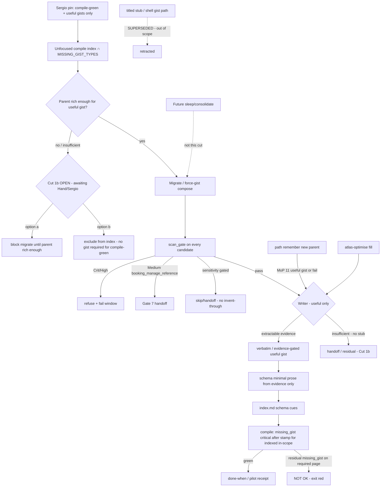

# atlas force-gist / compile-green (design packet)

**work_id:** `2026-10-06-atlas-force-gist-compile-green`  
**change-class:** `new-surface` (mini-genesis depth)  
**Subject skill:** atlas (`github.com/sergio-sisternes-epam/atlas`)  
**Subject atlas:** `github.com/sergio-sisternes-epam/atlas-atlas`  
**Baseline pin (read-only):** atlas package `0.13.0-beta.11` (PR #53)  
**Follow-on of:** `2026-10-06-atlas-optimise-vnext` (evidence-gated fill; residual `missing_gist` allowed)  
**Disposition:** **STOP FOR APPROVAL** — design only; no package implement, no apply, no fleet.

## Autogenesis activation card (design operation)

```text
schema: autogenesis.invocation-request/v1
request_id: 2026-10-06-atlas-force-gist-compile-green-design
parent_request_id: null
target:
  skill: autogenesis
  module: design
  role: operation
arguments:
  objective: >-
    Force useful gist for all memories indexed at compile; migration creates
    evidence-grade gists only (no titled stubs, no invented bodies); compile
    green = exit for indexed in-scope pages. Insufficient-evidence path awaits
    Cut 1b (block migrate vs exclude from index). Overrides beta.11
    evidence-only handoff skip for indexed pages when a useful gist is possible.
  change_evidence: >-
    Sergio pin 2026-10-06 via Hand (compile-green + force-gist); Sergio pin
    amend via Hand (no gist stubs — every gist useful); KG note (no invented
    bodies; Cut 1b open; scan_gate binds); BotOps Grand Maester + MoP +
    King's Guard challenges.
  behavioural_contract: "deferred: agent-spec not invoked; deterministic smokes cover forbidden behaviours"
context:
  subject: atlas
  mode: run
  operation: design
  work_id: 2026-10-06-atlas-force-gist-compile-green
  atlas_id: github.com/sergio-sisternes-epam/atlas-atlas
  atlas_root: <atlas-atlas-root>
  approval_ref: null
resolved:
  skill_root: <autogenesis-skill-root>
  module_root: <autogenesis-skill-root>/references/modules/design
  entrypoint: <autogenesis-skill-root>/references/modules/design/SKILL.md
```

**Must announce:** this operation **stops for approval**. Request **implement** only after explicit Hand/Sergio unlock of this pinned plan. Design completion ≠ implement authority. Heavy pilot and fleet remain blocked until the new done-when + receipt verdict rules ship and Sergio GO is recorded. **Cut 1b remains open** — do not implement as if either option were locked.

---

## Intent

beta.11 closed the invent-gist gap with evidence-gated fill, but left **residual `missing_gist` expected** when evidence is insufficient (confirm-only / handoff). Sergio’s pin (2026-10-06 via Hand) **overrides** that residual-OK and the evidence handoff skip for pages **indexed at compile**: every in-scope indexed parent must get a compile-accepted **useful** gist. **Compile green is the exit** for those indexed in-scope pages. Migration creates the gists; force-gist may compose migrate+optimise.

**Sergio amend pin (via Hand) — MUST fold:** **No gist stubs — every gist must be useful.** Gists created by migration / remember / optimise must have a **useful body (evidence-grade)**, not title-only shells. The titled-stub writer path is **retracted / superseded**.

**KG note (folded):** No stubs **and** no invented bodies to clear `missing_gist` — only verbatim / evidence-grade useful gist content; else handoff / residual per open Cut 1b. Compile-green vs residual for insufficient-evidence parents stays tied to **Cut 1b** (do not invent that pin). `scan_gate` still binds every created gist.

Never invent episodic claim text. Never edit parent memory text.

## Scope

In (product design for a later implement on the atlas package, after separate unlock):

1. **Force-gist writer** (named before implement): **verbatim / evidence-gated useful gist only**. No titled-stub branch. No invent-to-clear-`missing_gist`.
2. **Day-one scope:** all pages of types in compile `MISSING_GIST_TYPES` that are reachable from an **unfocused** compile page index (definition pinned below from beta.11 source) — subject to open **Cut 1b** for parents too thin for a useful gist.
3. **Migration path** that creates missing **useful** gists (+ required same-folder schema pages per one-gist→one-schema, from evidence only) before/with optimise; migration ≠ free invention; migration ≠ stub shells.
4. **CONTRACT / compile delta:** after store opts in / completes migration + stamp bump, `missing_gist` for in-scope **indexed** types is **critical** (fail compile) — when a useful gist is required. Grandfather: older stamp keeps warning/info until migrate+stamp. How thin parents leave the index or block migrate is **Cut 1b (open)**.
5. **scan_gate binding** on migrate, optimise fill, and remember-created gists; Crit/High refuse+fail; Medium `booking_manage_reference` handoff (Gate 7); receipt hits `{path,type,severity}` only.
6. **Optimise interaction:** force-gist may be migrate+optimise compose; confirm/auto must not auto-promote scan_gate hits; **no stub-as-evidence** path (stubs out of scope).
7. **Cost:** Path/Custom first; Full needs explicit ceiling (max tasks or operator confirm); serial Full only.
8. **Pilot bar:** receipt exit = compile green on pilot store after migrate+fill (for indexed in-scope pages under locked Cut 1b rules); N=10 still required; Guard receipt rows; heavy waits Sergio GO under new bar.
9. **Remember-time (MoP 11):** creating an in-scope indexed parent without a **useful** gist is fail-closed unless remember also creates a verbatim/evidence-grade useful gist (and required schema) in the same turn — **not** a stub.

Out:

- Implementing sleep/consolidate.
- Free invention of episodic claims; editing parent claim text.
- **Titled stubs, shell gists, title-only gist bodies** as a compile-green clearance path (superseded by Sergio amend pin).
- Fleet apply / multi-store Full in this design or its first implement unlock.
- Expanding this plan into full detector-family / scanner↔vocab implement (note as post-pilot follow-up; only Gate 7 medium rule needed for scan_gate on promotions).
- Private topology, private hosts, or ops-only URLs in atlas-atlas pages.
- Package product-code implement on this design commit.
- **Locking Cut 1b** without Hand/Sergio (both options recorded open).

## Non-goals

- Replacing path `remember` as the awake writer of new episodic claims (remember gains a fail-closed **useful-gist** obligation; it does not become the dreamer).
- Making optimise the long-term sleep/consolidate dreamer.
- Retyping every legacy `document` (memory-migrate ownership remains).
- Treating title-only or invented gist text as evidence that claimful schema/gist enrichment is safe.
- Silent Full on large stores.
- Inventing bodies solely to satisfy compile-green / clear `missing_gist`.

## Change-class

`new-surface` (mini-genesis): useful-gist writer obligation + compile severity raise + migrate compose + remember fail-closed + receipt/exit bar change; stub writer **retracted**. Not `new-skill`. Not a rewrite of vNext — a **follow-on** that overrides residual-OK for indexed pages and rejects stub clearance.

## Baseline (beta.11 facts — source truth)

From pin `0.13.0-beta.11` (`scripts/atlas_cli/commands/validate.py`, `scripts/atlas_optimise.py`, `references/paths/atlas-optimise.md`):

- `GIST_PARENT_TYPES = {experience, decision, lesson, recipe, document, memory, page, protostar}`
- `MISSING_GIST_TYPES = GIST_PARENT_TYPES - {protostar}`
- Compile emits `missing_gist` for every concept page of those types with no valid single-parent `derived_from` gist.
- Default memory rung keeps `missing_gist` as **info** (warn/error rungs escalate); residual after evidence handoff **does not fail** optimise (`missing_gist_fails_run: false`).
- Fill: verbatim parent description or first claim line; insufficient → handoff; security scan blocks Crit/High and `sensitivity: restricted`; never invent; never edit parent.
- `stale_upper_page` applies when a gist has a non-empty `description` and parent type is **`memory`**: description must be a substring of parent body or parent description. Omitting description skips that check.
- One gist forces one same-folder schema listing; schema must be cued from folder `index.md`.
- Store write stamp stays `0.13.0-beta.7` on beta.11; sleep still unimplemented.

**Source contradiction note:** beta.11 path text and receipt treat residual `missing_gist` as done. This follow-on **intentionally overrides** that for stores that opt into the force-gist migrate+stamp **when a useful gist is required for an indexed page**. Prefer source truth for type sets, scan behaviour, and stale rules; prefer Sergio pins for exit criteria and no-stub useful-gist rule. Prefer open Cut 1b for insufficient-evidence compile-green vs residual.

### “Indexed at compile” (day-one definition)

From beta.11 compile enumeration: an **unfocused** `atlas compile` builds its page index from every concept `.md` under the store root (non-reserved, non-staging) that yields readable frontmatter. A page is **in force-gist scope** when:

1. its frontmatter `type` ∈ `MISSING_GIST_TYPES`, and  
2. it appears in that unfocused page index.

Focused `--path` / `--type` compile may omit findings for operator batching; it **does not** shrink the migration obligation for an opted-in store (subject to Cut 1b if exclude-from-index is later locked). Protostar remains out of `MISSING_GIST_TYPES`.

---

## Genesis Artifacts

### Component / flow (one mermaid)



### Interface sketch

**New / extended surfaces (design intent for later implement):**

1. **Migrate / force-gist batch** (compose with existing memory-migrate and/or optimise Enter): creates missing **useful** gists for in-scope parents with extractable evidence; creates required schema pages (minimal prose from evidence only); bumps store stamp / opt-in flag so compile treats `missing_gist` as critical for indexed in-scope pages. Behaviour when parent is not rich enough is **Cut 1b (open)** — block migrate or exclude from index; do not invent; do not stub.
2. **~~Stub frontmatter marker~~ SUPERSEDED:** `gist_kind: stub`, title-only shells, `shell_gist_count` / shell-gist receipt members, and compile waivers that accept title-only stubs to clear `missing_gist` are **out of scope** under the Sergio amend pin. Do not implement stub acceptance.
3. **Compile / CONTRACT:** post-migrate stamp → `missing_gist` severity **critical** for in-scope **indexed** types that still require a useful gist; grandfather on older stamp (info/warn per rung as today). Interaction with thin parents = Cut 1b.
4. **Remember Enter:** fail-closed if it would leave an in-scope indexed parent without a **useful** gist; must create verbatim/evidence-grade gist (+ schema obligation) in the same remember turn, or refuse the remember write. **Not** stub.
5. **Receipt fields (additive):** `scan_gate_refuse_count`, `body_fills` (useful/evidence-grade fills), `zero_crit_high_promoted`, compile exit, residual `missing_gist` count (must be 0 for opted-in green on pages that still require a gist), hits as `{path, type, severity}` only. **`shell_fills` / shell_gist_count retracted** — shells out of scope; if a prior draft counted shells, supersede with useful-fill / handoff / exclude counts as implement names after Cut 1b locks.

**CLI sketch (additive; exact flags at implement):**

```bash
# Path/Custom first; Full only with ceiling + operator confirm
python3 <atlas-skill>/scripts/atlas_optimise.py plan \
  --root <root> --target <folder|.> --out-dir <dir outside store> \
  --optimise-mode path|custom|full|incremental \
  --force-gist \          # NEW: useful gists only; no stubs; residual missing_gist fails exit for opted-in indexed pages (Cut 1b governs thin parents)
  --cost-ceiling <N> \
  [--pilot]

# Migrate opt-in / stamp bump (name at implement; may be memory-migrate batch or sibling)
python3 <atlas-skill>/scripts/atlas.py memory-migrate ... --batch force-gist-compile-green
```

### Cost note

Stance: **frugal / Path-first**. Cost scales with in-scope parent count × (gist create + schema + index + scan).

- **Path / Custom first** — required default operator path before Full.
- **Full:** explicit ceiling (`max tasks` or operator confirm); **serial only**; no silent Full on large stores; plan refuses when projected pages/tasks exceed ceiling without confirm.
- **Noise budget:** prefer Path batches over whole-store Full when residual noise would drown review (GM 10).
- Install / compile hot path: severity raise only after stamp; no auto-migrate on compile.

### Acceptance criteria

1. **Compile-green exit:** On an opted-in / post-migrate stamped fixture, every in-scope **indexed** parent that still requires a gist has a valid **useful** (verbatim/evidence-grade) gist; unfocused compile has **zero** `missing_gist` for those pages; residual is **not** OK for required pages. Thin-parent outcome follows locked Cut 1b (when locked).
2. **Writer fidelity:** Extractable parents get verbatim/evidence-gated **useful** gists under beta.11 rules; insufficient-evidence parents get **no stub** and **no invented body** — handoff / residual / block / exclude per Cut 1b (open).
3. **~~Stub acceptance~~ SUPERSEDED:** titled stubs do not clear `missing_gist`. No thin-body waive for title-only shells. No `gist_kind: stub` clearance path.
4. **scan_gate binds** migrate, optimise fill, and remember-created gists: Crit/High → refuse + fail window; Medium `booking_manage_reference` → handoff (Gate 7); receipts list `{path,type,severity}` only.
5. **Grandfather:** pre-stamp stores keep today’s rung behaviour for `missing_gist`; no silent critical raise.
6. **Remember fail-closed (MoP 11):** new in-scope parent without **useful** gist create refuses (not stub).
7. **Pilot:** receipt exit = compile green under locked Cut 1b rules; N=10 spot-check; Guard rows present; MoN light under old bar is **not** a pass under the new bar; heavy/fleet blocked until cut ships + Sergio GO.
8. **Non-goals held:** no sleep implement; no fleet apply; no private topology in atlas-atlas; no stub clearance; no invent-to-clear.
9. **Stop-for-implement:** this design writes no atlas package product files.
10. **Cut 1b still open:** design must not treat either option (a) or (b) as locked.

### Stop-for-approval

This operation **stops for Hand/Sergio approval**. Do not implement, merge package code, tag/release, or fleet-apply from this packet. Unlock must name: useful-gist writer (no stub), scan_gate binding, compile severity + grandfather, cost ceiling, pilot done-when, and **Cut 1b choice** (block migrate vs exclude from index).

---

## SOLID record (full five-row)

| Principle | Status | Rationale / design consequence |
|---|---|---|
| S | applicable | Force-gist owns one job: every compile-indexed `MISSING_GIST_TYPES` page that remains in scope has a compile-accepted **useful** gist so compile can be green. Sleep, fleet, stub clearance, and detector-vocab expansion stay outside. |
| O | applicable | Four-layer model stays; extension is useful-gist writer obligation + severity/stamp opt-in + remember fail-closed; stub writer retracted. Intentional override of beta.11 residual-OK is versioned and evaluated, not silent drift. |
| L | not-applicable | Force-gist does not claim to substitute sleep, remember’s claim authorship, or memory-migrate’s document retyping. Invented or title-only bodies are not interchangeable with evidence-backed useful gists. |
| I | applicable | Path/Custom Enter remains the cheap surface; Full fields + ceiling only when chosen. Receipt exposes scan/useful-fill counts without dumping secret spans; shell counts superseded. |
| D | trade-off | Continue depending on package compile type sets and helper scan primitives (essential). Do not invent a parallel “indexed memories” ontology. Gate 7 medium rule may extend the scanner; full vocab coverage is a separate follow-up. Cut 1b remains an explicit operator lock, not a hidden default. |

---

## Catalogue Review

- **Genesis matches:** uses A9 SUPERVISED EXECUTION (plan → approve → apply → compile verify), A11 RECONCILIATION LOOP (drive missing_gist to terminal green for required indexed pages), S7 DETERMINISTIC TOOL BRIDGE (type sets, stamp, scan_gate, evidence/useful-gist checks). Refines vNext; conflicts with beta.11 “residual OK” by **explicit pin override**, not accidental drift; rejects stub clearance by **Sergio amend pin**.
- **Autogenesis extension:** B17 ACTIVATION CARD — Enter gains force-gist / useful-gist / ceiling fields (stub fields retracted). `autogenesis:S8` not-selected (still INLINE path + LOCAL SIBLING helper; no new skill package).
- **Composition:** INLINE path updates, LOCAL SIBLING helper/compile changes at implement.
- **Inherited anti-patterns avoided:** TOOLLESS ASSERTION; soft-only evaluation; silent Full; promotion-as-invention; sensitivity laundering; invent-to-clear-missing_gist; titled-stub clearance.
- **Delta only:** useful-gist-only writer (stub path superseded), compile critical after stamp, migrate compose, remember fail-closed useful gist, Guard receipt rows, Gate 7 medium handoff, pilot bar raise, Cut 1b open.
- `pattern_applicability: applicable` (A9, A11, S7, B17). `pattern_admission: not-selected` (S8).

---

## Challenge fold (BotOps + King's Guard)

Treat the following as design-challenge inputs. Each is pinned, rejected, modified, or left open below. (Autogenesis think-challenge wrapper; grounded counters supplied by BotOps/King's Guard rather than fresh web search.)

### Grand Maester

| # | Counter | Disposition |
|---|---|---|
| GM1 | Contradiction with E1 / insufficient_evidence: forcing gists must name writer and what compile accepts (no invented claim text). | **Pin W1–W2 (amended).** Writer = verbatim/evidence-gated **useful** gist only. Insufficient → no stub, no invent; Cut 1b open. Prior Stub1–Stub3 **superseded**. |
| GM2 | Compile-green hard contract: which findings critical; grandfather; cost ceiling before Full. | **Pin CCrit1–CCrit2, Cost2.** `missing_gist` critical post-stamp for required indexed pages; grandfather older stamp; Path/Custom first; Full needs ceiling + confirm. Thin-parent residual vs green tied to Cut 1b. |
| GM3 | Scope ambiguity: every `type: memory`, every `MISSING_GIST_TYPES`, or only schema-folder pages? | **Pin Scope1.** Day one = unfocused compile index ∩ `MISSING_GIST_TYPES` (source set). Not memory-only. |
| GM4 | Promotion risk: force-fill still runs scan_gate; refuse Crit/High and Medium booking_manage_reference; must not launder restricted spans. | **Pin Sec2–Sec4, KG1–KG3.** |
| GM5 | Pilot bar: MoN light would fail under new exit; heavy blocked until new done-when + receipt. | **Pin Pilot1–Pilot3.** |
| GM6 | Ops: Full cost cap / Path-first; no silent Full. | **Pin Cost2, Cost3.** |
| GM7 | Shell→schema rollup: title-only / shell gists must not become claimful schema evidence. | **Pin Rollup1 (amended).** Shell/stub gists out of scope; schema prose only from evidence-backed useful gists. |
| GM8 | Pilot path under new exit. | **Pin Pilot1, Pilot2.** Light pilot must redefine pass = compile green under Cut 1b rules; old residual-OK pilots do not carry forward. |
| GM9 | Public hygiene. | **Pin Hyg1.** Scrub private hosts/paths/mesh/1P/BotOps tips from atlas-atlas before push. Placeholders `<atlas-atlas-root>` / `<autogenesis-skill-root>` only — no box checkout paths in public pages. |
| GM10 | Noise budget / Path batches. | **Pin Cost3.** Prefer Path batches; Full only with ceiling. |

### MoP

| # | Counter | Disposition |
|---|---|---|
| MoP1 | Writer named before implement. | **Pin W1 (amended — useful only).** |
| MoP2 | CONTRACT delta: missing_gist critical vs warning + grandfather. | **Pin CCrit1–CCrit2.** |
| MoP3 | Scope type set explicit. | **Pin Scope1.** |
| MoP4 | Receipt/exit: compile-green done-when; heavy/fleet blocked until cut + Sergio GO. | **Pin Pilot1–Pilot3, Stop1.** |
| MoP5 | Scanner↔vocab gap = separate post-pilot follow-up. | **Pin Vocab1.** Note only; do not expand this plan into full detector-family implement. |
| MoP11 | Remember-time gist create or fail-closed. | **Pin Rem1 (amended — useful gist or fail; not stub).** |

### King's Guard

| # | Counter | Disposition |
|---|---|---|
| KG1 | Promotion≠invention: force-gist = verbatim/evidence-grade useful gist only; no stubs; no invented bodies to clear missing_gist; scan_gate still binds. | **Pin W1, Rollup1, Sec2.** KG note folded. |
| KG2 | scan_gate on migrate AND remember-created gists; Crit/High refuse+fail window; Medium booking_manage_reference handoff (Gate 7); receipts `{path,type,severity}` only. | **Pin Sec2–Sec3, Rec1.** Note: `booking_manage_reference` is **not** present in beta.11 `SECRET_RULES`/`PII_RULES` today — this design **adds** Gate 7 as a required scan rule for the force-gist cut (source gap named, not papered over). |
| KG3 | Must not launder sensitivity — skip/handoff sensitivity-gated parents; never invent-through or stub-through restricted/confidential/booking/secret-shaped into indexes/schemas. | **Pin Sec4.** |
| KG4 | Pilot Guard receipt rows: scan_gate refuse count, useful/body fills, zero Crit/High promoted; empty hits ≠ full vocab coverage. Shell fill counts superseded. | **Pin Rec1, Vocab1.** |
| KG5 | Public atlas-atlas scrub before push. | **Pin Hyg1.** |
| KG6 | No implement/heavy/fleet until design names useful-gist writer + scan_gate binding and Hand/Sergio unlock (including Cut 1b). | **Pin Stop1** (writer/scan named; Cut 1b still open; unlock still required). |
| KG-note | No stubs AND no invented bodies to clear missing_gist; compile-green vs residual for insufficient-evidence parents tied to open Cut 1b; scan_gate binds every created gist. | **Folded into W1, Cut1b, Sec2, Pilot1.** |

---

## Locked pins

### Writer (useful gists only — stub path superseded)

| ID | Pin |
|---|---|
| W1 | **Writer (named):** if extractable lower-layer evidence per beta.11 rules → **verbatim / evidence-gated useful gist**. If insufficient evidence → **no titled stub**, **no invented body** to clear `missing_gist`; handoff / residual / block / exclude per **Cut 1b (open)**. Never invent episodic claims. Never edit parent memory/claim text. |
| W2 | Verbatim branch keeps beta.11 extract rules (plain description or first claim line), confirm default, `--auto-verbatim` opt-in for auto class. Useful body = evidence-grade content derived from extractable parent evidence — not title-only. |
| W3 | ~~Stub branch~~ **SUPERSEDED / RETRACTED.** No stub template, no `gist_kind: stub` clearance, no title-only shell gist writer. |
| Stub1–Stub3 | **SUPERSEDED.** Compile must not accept titled stubs to clear `missing_gist`. Thin-body waive for marked stubs retracted. Stubs-as-non-evidence is moot — stubs are out of scope. |

### Cut 1b — OPEN (awaiting Hand/Sergio lock)

| ID | Status | Options (do NOT invent Sergio’s choice) |
|---|---|---|
| Cut1b | **OPEN** | When parent is **not rich enough** for a useful gist, either: **(a) block migrate** until the parent is rich enough, or **(b) exclude from index** (so compile-green does not require a gist for that page). Both options await Hand/Sergio lock. Design records both; implement must not assume either until unlock names one. Compile-green vs residual for insufficient-evidence parents **stays tied to this open cut**. |

### Scope, compile, grandfather

| ID | Pin |
|---|---|
| Scope1 | Day-one scope = pages in unfocused compile page index whose `type` ∈ compile `MISSING_GIST_TYPES` (`experience`, `decision`, `lesson`, `recipe`, `document`, `memory`, `page`). Not memory-only. Not protostar. Thin-parent membership vs exclusion = Cut 1b. |
| CCrit1 | After store **opts in / completes force-gist migration + stamp bump**, `missing_gist` for in-scope **indexed** types that still require a useful gist is **critical** (fail compile). |
| CCrit2 | **Grandfather:** stores on older stamp keep today’s rung behaviour (`info`/`warn`/`error`) until migrate+stamp. No silent critical raise. |
| Mig1 | Migration creates missing **useful** gists (and required schema pages per one-gist→one-schema + index cues from evidence). Migration ≠ free invention; ≠ stub shells (uses W1). Insufficient-evidence parents follow Cut 1b. |
| Rem1 | **Remember-time:** creating an in-scope indexed parent must also create a **useful** (verbatim/evidence-grade) gist (and satisfy schema obligation) in the same turn, or **fail closed**. Not stub. |

### Security / scan_gate / sensitivity

| ID | Pin |
|---|---|
| Sec2 | **scan_gate binds** optimise fill, **migrate** force-gist creates, and **remember-created** gists — every created gist. |
| Sec3 | Crit/High → **refuse + fail window** (nothing promoted). Medium **`booking_manage_reference`** → **handoff** (Gate 7). Receipt hits are `{path, type, severity}` only — no secret spans in receipts. |
| Sec4 | Sensitivity-gated parents (`restricted`, and confidential/booking/secret-shaped per scan rules) → **skip/handoff**; **never invent-through or stub-through** into indexes/schemas. |
| Vocab1 | Scanner↔vocab gap remains a **post-pilot follow-up**. Empty hits ≠ full vocab coverage. Do not expand this plan into full detector-family implement beyond Gate 7 need. |

### Optimise, cost, pilot, hygiene, stop

| ID | Pin |
|---|---|
| Opt1 | Force-gist may compose migrate+optimise. Confirm/auto **must not** auto-promote scan_gate hits. |
| Rollup1 | **Schema rollup:** evidence-backed useful gists may feed minimal-prose schema (beta.11). **Shell/stub gist → schema shell path SUPERSEDED** — no stub folders as a designed clearance mode; schema claimful prose only from evidence. |
| Cost2 | Require **Path/Custom first**. Full needs explicit ceiling (max tasks or operator confirm). **Serial Full only.** |
| Cost3 | Prefer Path batches when noise budget would drown review; no silent Full on large stores. |
| Pilot1 | Redefine receipt exit = **compile green** on pilot store after migrate+fill for pages that require a useful gist (residual `missing_gist` count 0 for those). Thin-parent residual vs exclude follows Cut 1b when locked. N=10 spot-check still required. |
| Pilot2 | MoN light under beta.11 residual-OK is **not** a pass under the new bar. Heavy pilot and fleet **blocked** until this cut ships and **Sergio GO**. |
| Pilot3 / Rec1 | Guard receipt rows required: `scan_gate_refuse_count`, `body_fills` (useful fills), `zero_crit_high_promoted`, compile exit, residual missing_gist. **`shell_fills` / shell_gist_count SUPERSEDED** (shells out of scope). |
| Hyg1 | Public atlas-atlas scrub before push: no private hosts, private mesh hostnames, private checkout paths, 1Password item ids, or BotOps-only tips. Use placeholders `<atlas-atlas-root>` / `<autogenesis-skill-root>` (never box-local absolute roots). Public github.com/sergio-sisternes-epam/atlas and atlas-atlas links OK. Hand/Sergio names OK for pin provenance. |
| Stop1 | No package implement, heavy pilot apply, or fleet until this design names useful-gist writer + scan_gate binding (**done**) **and** Hand/Sergio explicit unlock including **Cut 1b**. |
| S1 | Sleep/consolidate remains unimplemented; optimise remains interim fill path unless a future design says otherwise. |

**C1–C5:** C1 counters above are non-trivial. C2 high-severity items pinned (W1 amended, CCrit1, Sec2–Sec4, Pilot1–2, Rem1 amended; Cut1b open). C3 pins visible. C4 scope intact (follow-on force-gist/compile-green only). C5 no package implement in this operation. Change-class stated. Genesis Artifacts complete for new-surface.

---

## Behavioural contract (agent-spec)

`deferred: agent-spec was not invoked in this design session; deterministic helper/compile tests and adversarial smokes will cover each forbidden behaviour (invention, invent-to-clear-missing_gist, titled-stub clearance, scan_gate bypass, sensitivity laundering, silent Full, residual-OK on opted-in stamp for required indexed pages, remember without useful gist).`

`@forbidden` families to protect at implement: invent episodic gist body; clear missing_gist via titled stub or invented body; promote Crit/High; invent-through/stub-through restricted; skip scan_gate on migrate/remember; claim fleet ready without compile-green receipt; raise missing_gist critical without stamp opt-in; assume Cut 1b locked without Sergio unlock.

## Evaluation plan

**Deterministic smokes (primary):**

1. Opted-in fixture: N parents across `MISSING_GIST_TYPES`, mix of rich and empty bodies → after migrate+force-gist, unfocused compile exit 0 for `missing_gist` on pages that require a useful gist; **useful** gists only where extract existed; **no stubs**.
2. Insufficient-evidence parent → **no stub created**; **no invented claim sentences**; outcome = handoff/residual/block/exclude per Cut 1b (when locked; until then smokes assert “no stub / no invent”).
3. Restricted / secret-shaped parent → skip/handoff; no invent-through, no schema cue promotion of secret text; receipt hit `{path,type,severity}` only.
4. Medium `booking_manage_reference` → handoff class; not auto-applied.
5. Grandfather fixture on older stamp → `missing_gist` not critical; post-stamp twin → critical until useful gist exists (for required pages).
6. Remember new in-scope parent without useful gist path → refuse; with useful verbatim/evidence gist in same turn → accept; compile green for that path.
7. Adversarial: attempt titled-stub or invent-to-clear → refuse / fail smoke.
8. Full without ceiling/confirm → refuse; Path batch under ceiling → plans.
9. Receipt rows present; `zero_crit_high_promoted` true on green pilot; residual missing_gist 0 for required pages; no shell_fills claim.

Map to package tests at implement (`scripts/test_atlas_optimise.py`, `scripts/test_memory_layers.py`, remember path tests, new adversarial YAML).

**Agent evaluations (secondary):** operator Enter refuses silent Full; pilot language does not claim fleet_ready; operator does not treat Cut 1b as locked.

## Adversarial scenario draft

```yaml
id: atlas-force-gist-compile-green-adversarial-v1
work_id: 2026-10-06-atlas-force-gist-compile-green
packages: [atlas]
adversarial: true
smokes:
  - id: invent-forbidden
    source: "GM1 / E1 / KG-note — Maynez-style hallucination risk"
    expect: "insufficient evidence yields handoff/residual/block/exclude per Cut 1b — never titled stub, never invented claim lines"
  - id: no-stub-clearance
    source: "Sergio amend pin / W3 superseded"
    expect: "titled stub / gist_kind stub / title-only shell must not clear missing_gist"
  - id: useful-gist-only
    source: "Sergio amend pin / W1"
    expect: "migration/remember/optimise-created gists have evidence-grade useful body when created"
  - id: scan-gate-migrate-remember
    source: "KG2 Sec2"
    expect: "Crit/High on migrate or remember gist create refuses; Medium booking_manage_reference is handoff; scan_gate binds every created gist"
  - id: sensitivity-no-invent-through
    source: "KG3 Sec4"
    expect: "restricted/confidential/booking/secret-shaped parents never invent/stub into index/schema"
  - id: residual-not-ok-post-stamp
    source: "Sergio pin / Pilot1"
    expect: "opted-in stamp with residual missing_gist on a required indexed page fails compile / pilot exit"
  - id: cut1b-not-assumed
    source: "Cut1b OPEN"
    expect: "implement must not hard-code block-migrate or exclude-from-index until Sergio lock"
  - id: grandfather-pre-stamp
    source: "GM2 CCrit2"
    expect: "older stamp does not hard-fail missing_gist as critical"
  - id: remember-fail-closed
    source: "MoP11 Rem1"
    expect: "remember without useful gist create refuses for in-scope types"
  - id: no-silent-full
    source: "GM6 / GM10 Cost2-3"
    expect: "Full without ceiling or operator confirm refuses"
  - id: receipt-guard-rows
    source: "KG4 Rec1"
    expect: "receipt includes scan_gate_refuse_count, body_fills, zero_crit_high_promoted; shell_fills not required (superseded)"
  - id: empty-hits-not-vocab
    source: "MoP5 / KG4 Vocab1"
    expect: "empty scan hits do not claim full detector vocab coverage"
filename_contract: atlas/references/scenarios/atlas-force-gist-compile-green-adversarial-v1.yaml
```

Implement may **add** smokes; must not **drop** these without a new design.

---

## Open questions still needing Sergio lock (after pins)

Pins above are proposed locked for design approval **except Cut 1b**. Remaining operator locks:

1. **Cut 1b (OPEN — primary):** when parent is not rich enough for a useful gist, **(a) block migrate** until parent is rich enough, or **(b) exclude from index** so compile-green does not require a gist for that page. Await Hand/Sergio; do not invent.
2. **Stamp / opt-in mechanism** — new `atlas_release` bump vs dedicated force-gist stamp field (must be explicit and grandfather-safe).
3. **Gate 7 medium rule corpus** — confirm `booking_manage_reference` detector definition for the first ship (full vocab still post-pilot).
4. **Heavy pilot store + Sergio GO** — not part of design approval; required before heavy/fleet.

~~Stub marker name + exact compile waiver set~~ — **SUPERSEDED** (stubs out of scope).

---

## Amendment log

- **2026-10-06 (this amend):** Folded Sergio amend pin via Hand — **no gist stubs; every gist must be useful** (evidence-grade). Retracted titled-stub writer (W3, Stub1–Stub3), shell_gist / shell_fills / title-only schema clearance paths. Recorded **Cut 1b OPEN** (block migrate vs exclude from index). Folded KG note: no invented bodies to clear `missing_gist`; compile-green vs residual for thin parents tied to Cut 1b; scan_gate still binds every created gist. Hyg1 placeholders retained. Design-only; no implement.

---

## Invocation receipt (design)

```text
disposition: awaiting-approval
work_id: 2026-10-06-atlas-force-gist-compile-green
operation: design
change_class: new-surface
loaded_entrypoints:
  - autogenesis/SKILL.md
  - autogenesis/references/modules/workflow-discipline/SKILL.md
  - autogenesis/references/modules/design/SKILL.md
  - genesis/SKILL.md (mini-genesis depth)
  - autogenesis/references/modules/think-challenge/SKILL.md
  - autogenesis/references/skill-design-principles.md
baseline_pin: atlas 0.13.0-beta.11 (read-only)
artifact: autogenesis/plans/2026-10-06-atlas-force-gist-compile-green.md
amend: no-stub-useful-gist + Cut1b-open + KG-note
implement_authorised: false
cut_1b: open
