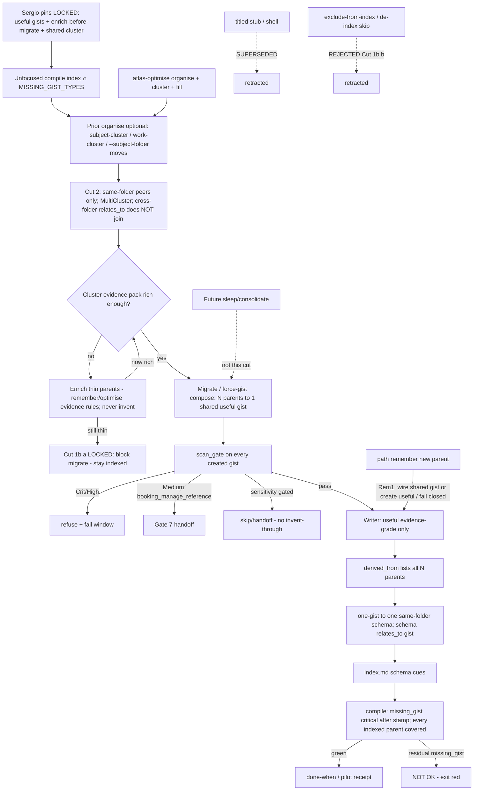

# atlas force-gist / compile-green (design packet)

**work_id:** `2026-10-06-atlas-force-gist-compile-green`  
**change-class:** `new-surface` (mini-genesis depth)  
**Subject skill:** atlas (`github.com/sergio-sisternes-epam/atlas`)  
**Subject atlas:** `github.com/sergio-sisternes-epam/atlas-atlas`  
**Baseline pin (read-only):** atlas package `0.13.0-beta.11` (PR #53)  
**Follow-on of:** `2026-10-06-atlas-optimise-vnext` (evidence-gated fill; residual `missing_gist` allowed)  
**Disposition:** **STOP FOR APPROVAL** — design only; no package implement, no apply, no fleet.

## Autogenesis activation card (design operation)

```text
schema: autogenesis.invocation-request/v1
request_id: 2026-10-06-atlas-force-gist-compile-green-design
parent_request_id: null
target:
  skill: autogenesis
  module: design
  role: operation
arguments:
  objective: >-
    Force useful gist for all memories indexed at compile; migration creates
    evidence-grade gists only (no titled stubs, no invented bodies); compile
    green = exit for indexed in-scope pages. Cut 1b LOCKED: enrich parent
    before migrate / block migrate until useful gist possible; exclude-from-index
    REJECTED. Shared cluster gist (N→1) + MultiCluster; Cut 2 LOCKED: cluster
    membership = same folder only (cross-folder relates_to does not join).
    Subject-clustering / work-cluster / --subject-folder may move pages first;
    membership evaluated after location. Overrides beta.11 residual-OK for
    opted-in indexed pages when a useful gist is required.
  change_evidence: >-
    Sergio pin 2026-10-06 via Hand (compile-green + force-gist); Sergio amend
    pins via Hand (no stubs; no de-index/skip; enrich-before-migrate LOCKED /
    exclude-from-index REJECTED; shared cluster N→1 + MultiCluster; Cut 2
    same-folder membership only — not cross-folder relates_to); KG note (no
    invented bodies; scan_gate binds); BotOps Grand Maester + MoP + King's Guard
    challenges.
  behavioural_contract: "deferred: agent-spec not invoked; deterministic smokes cover forbidden behaviours"
context:
  subject: atlas
  mode: run
  operation: design
  work_id: 2026-10-06-atlas-force-gist-compile-green
  atlas_id: github.com/sergio-sisternes-epam/atlas-atlas
  atlas_root: <atlas-atlas-root>
  approval_ref: null
resolved:
  skill_root: <autogenesis-skill-root>
  module_root: <autogenesis-skill-root>/references/modules/design
  entrypoint: <autogenesis-skill-root>/references/modules/design/SKILL.md
```

**Must announce:** this operation **stops for approval**. Request **implement** only after explicit Hand/Sergio unlock of this pinned plan. Design completion ≠ implement authority. Heavy pilot and fleet remain blocked until the new done-when + receipt verdict rules ship and Sergio GO is recorded. **Cut 1b is LOCKED CLOSED** (enrich-before-migrate / block until useful; exclude-from-index REJECTED) — implement must not reopen exclude-from-index. Shared cluster gist (N→1), MultiCluster, and **Cut 2 (same-folder membership only)** are locked pins of this amend.

---

## Intent

beta.11 closed the invent-gist gap with evidence-gated fill, but left **residual `missing_gist` expected** when evidence is insufficient (confirm-only / handoff). Sergio’s pin (2026-10-06 via Hand) **overrides** that residual-OK and the evidence handoff skip for pages **indexed at compile**: every in-scope indexed parent must get a compile-accepted **useful** gist. **Compile green is the exit** for those indexed in-scope pages. Migration creates the gists; force-gist may compose migrate+optimise.

**Sergio amend pins (via Hand) — ALL LOCKED (not open):**

1. **No stubs** — every gist must be useful (evidence-grade). Titled-stub writer path **retracted / superseded**.
2. **No de-index / skip trick** — every indexed memory covered. Cut 1b option **(b) exclude-from-index = REJECTED**.
3. **Thin parents: enrich before migrate** — block migrate until the parent (or cluster evidence pack) is rich enough for a useful gist. Cut 1b option **(a) = LOCKED** path. Enrich may use remember / optimise evidence rules; **never invent claims**.
4. **Shared cluster gist (N→1) + MultiCluster + Cut 2:** multiple same-folder peers → one shared useful gist per cluster (not one gist per page); a folder may hold many clusters. **Cut 2 LOCKED (Sergio via Hand): cluster membership = same folder only** — cross-folder `relates_to` chains do **not** join clusters for force-gist. Subject-clustering / work-cluster / `--subject-folder` may still **move** pages into a folder first (prior enrich/organise); membership for the shared-gist writer is evaluated **after** location. Same-folder `relates_to` / subject keys may still split MultiCluster within a folder. Do **not** invent private topology.

**KG note (folded):** No stubs **and** no invented bodies to clear `missing_gist` — only verbatim / evidence-grade useful gist content; else enrich / block migrate per locked Cut 1b (a). `scan_gate` still binds every created gist.

Never invent episodic claim text. Never edit parent memory text.

## Scope

In (product design for a later implement on the atlas package, after separate unlock):

1. **Force-gist writer** (named before implement): **verbatim / evidence-gated useful gist only**. No titled-stub branch. No invent-to-clear-`missing_gist`.
2. **Day-one scope:** all pages of types in compile `MISSING_GIST_TYPES` that are reachable from an **unfocused** compile page index (definition pinned below from beta.11 source). **Every indexed in-scope page covered** — no exclude-from-index. Thin parents → enrich then migrate, or **block migrate** (Cut 1b a LOCKED).
3. **Migration path** that creates missing **useful** gists (+ required same-folder schema pages per one-gist→one-schema, from evidence only) before/with optimise; migration ≠ free invention; migration ≠ stub shells. **Enrich-before-migrate** for thin parents (remember/optimise evidence rules; never invent).
4. **Shared cluster gist (N parents → 1 gist) + Cut 2:** only parents that already share the **same folder** may form a cluster for the shared-gist writer; one shared useful gist covers the cluster; MultiCluster allows many clusters per folder; `derived_from` lists all N parents; one-gist→one-schema still holds. Cross-folder `relates_to` does **not** join clusters.
5. **CONTRACT / compile delta:** after store opts in / completes migration + stamp bump, `missing_gist` for in-scope **indexed** types is **critical** (fail compile). Grandfather: older stamp keeps warning/info until migrate+stamp. Thin parents never leave the index to dodge the finding.
6. **scan_gate binding** on migrate, optimise fill, and remember-created gists; Crit/High refuse+fail; Medium `booking_manage_reference` handoff (Gate 7); receipt hits `{path,type,severity}` only.
7. **Optimise interaction:** force-gist may be migrate+optimise compose (cluster + fill); confirm/auto must not auto-promote scan_gate hits; **no stub-as-evidence** path (stubs out of scope).
8. **Cost:** Path/Custom first; Full needs explicit ceiling (max tasks or operator confirm); serial Full only.
9. **Pilot bar:** receipt exit = compile green on pilot store after enrich+migrate+fill for indexed in-scope pages; N=10 still required; Guard receipt rows; heavy waits Sergio GO under new bar.
10. **Remember-time (MoP 11):** creating an in-scope indexed parent without useful-gist coverage is fail-closed unless remember also creates or wires a verbatim/evidence-grade useful gist (shared cluster or singleton) and required schema in the same turn — **not** a stub.

Out:

- Implementing sleep/consolidate.
- Free invention of episodic claims; editing parent claim text.
- **Titled stubs, shell gists, title-only gist bodies** as a compile-green clearance path (superseded by Sergio amend pin).
- **Exclude-from-index / de-index / skip** to clear `missing_gist` without a useful gist (Cut 1b b REJECTED).
- Fleet apply / multi-store Full in this design or its first implement unlock.
- Expanding this plan into full detector-family / scanner↔vocab implement (note as post-pilot follow-up; only Gate 7 medium rule needed for scan_gate on promotions).
- Private topology, private hosts, or ops-only URLs in atlas-atlas pages.
- Inventing a private clustering ontology beyond same-folder membership (Cut 2) plus prior organise signals (subject-clustering / work-cluster / `--subject-folder`) that only relocate pages before membership is evaluated.
- Joining force-gist clusters via cross-folder `relates_to` chains (Cut 2 REJECTED behaviour).
- Package product-code implement on this design commit.

## Non-goals

- Replacing path `remember` as the awake writer of new episodic claims (remember gains a fail-closed **useful-gist** obligation; it does not become the dreamer).
- Making optimise the long-term sleep/consolidate dreamer.
- Retyping every legacy `document` (memory-migrate ownership remains).
- Treating title-only or invented gist text as evidence that claimful schema/gist enrichment is safe.
- Silent Full on large stores.
- Inventing bodies solely to satisfy compile-green / clear `missing_gist`.
- Skipping or de-indexing thin parents to fake compile-green.
- One-gist-per-page when same-folder peers already form a subject cluster under Cut 2 / MultiCluster (prefer shared cluster gist).
- Treating cross-folder `relates_to` as force-gist cluster membership.

## Change-class

`new-surface` (mini-genesis): useful-gist writer obligation + compile severity raise + migrate compose + enrich-before-migrate + shared cluster gist (N→1) + MultiCluster + Cut 2 same-folder membership + remember fail-closed + receipt/exit bar change; stub writer **retracted**; exclude-from-index **rejected**; cross-folder `relates_to` cluster join **rejected**. Not `new-skill`. Not a rewrite of vNext — a **follow-on** that overrides residual-OK for indexed pages, rejects stub/de-index clearance, and uses post-location same-folder peers for shared-gist coverage (organise/move may precede).

## Baseline (beta.11 facts — source truth)

From pin `0.13.0-beta.11` (`scripts/atlas_cli/commands/validate.py`, `scripts/atlas_optimise.py`, `references/paths/atlas-optimise.md`):

- `GIST_PARENT_TYPES = {experience, decision, lesson, recipe, document, memory, page, protostar}`
- `MISSING_GIST_TYPES = GIST_PARENT_TYPES - {protostar}`
- Compile emits `missing_gist` for every concept page of those types with no valid `derived_from` gist. **beta.11 source today requires exactly one `derived_from` parent** for a gist to count (`_valid_gist_parent`); this follow-on **extends** that to **N≥1 parents** so one shared gist can cover a cluster (see Cluster1 / DerivedN).
- Default memory rung keeps `missing_gist` as **info** (warn/error rungs escalate); residual after evidence handoff **does not fail** optimise (`missing_gist_fails_run: false`).
- Fill: verbatim parent description or first claim line; insufficient → handoff; security scan blocks Crit/High and `sensitivity: restricted`; never invent; never edit parent.
- `stale_upper_page` applies when a gist has a non-empty `description` and parent type is **`memory`**: description must be a substring of parent body or parent description. Omitting description skips that check.
- One gist forces one same-folder schema listing; schema must be cued from folder `index.md`.
- Store write stamp stays `0.13.0-beta.7` on beta.11; sleep still unimplemented.

**Source contradiction note:** beta.11 path text and receipt treat residual `missing_gist` as done. This follow-on **intentionally overrides** that for stores that opt into the force-gist migrate+stamp **when a useful gist is required for an indexed page**. Prefer source truth for type sets and scan behaviour; prefer Sergio pins for exit criteria, no-stub, enrich-before-migrate, shared cluster gist, MultiCluster, and Cut 2 same-folder membership. Prefer locked Cut 1b (a) for insufficient-evidence handling (enrich / block — never exclude). Single-parent `derived_from` in beta.11 validate is **extended** (not silently ignored) to multi-parent shared gists under DerivedN (same-folder peers only).

### “Indexed at compile” (day-one definition)

From beta.11 compile enumeration: an **unfocused** `atlas compile` builds its page index from every concept `.md` under the store root (non-reserved, non-staging) that yields readable frontmatter. A page is **in force-gist scope** when:

1. its frontmatter `type` ∈ `MISSING_GIST_TYPES`, and  
2. it appears in that unfocused page index.

Focused `--path` / `--type` compile may omit findings for operator batching; it **does not** shrink the migration obligation for an opted-in store. **No page may be dropped from the index to dodge `missing_gist`.** Protostar remains out of `MISSING_GIST_TYPES`.

---

## Genesis Artifacts

### Component / flow (one mermaid)



### Interface sketch

**New / extended surfaces (design intent for later implement):**

1. **Migrate / force-gist batch** (compose with existing memory-migrate and/or optimise Enter): **enrich thin parents first** (Cut 1b a); then create missing **useful** gists — prefer **one shared gist per same-folder cluster** (Cut 2; MultiCluster); create required schema pages (minimal prose from evidence only); bumps store stamp / opt-in flag so compile treats `missing_gist` as critical for indexed in-scope pages. Thin / insufficient after enrich → **block migrate** (stay indexed); do not invent; do not stub; do not exclude-from-index.
2. **Shared cluster gist (N→1) + Cut 2:** see **Shared cluster gist design** below. Extends beta.11 single-parent `derived_from` to N≥1; **membership = same folder only** after any prior organise/move; cross-folder `relates_to` does not join.
3. **~~Stub frontmatter marker~~ SUPERSEDED:** `gist_kind: stub`, title-only shells, `shell_gist_count` / shell-gist receipt members, and compile waivers that accept title-only stubs to clear `missing_gist` are **out of scope**. Do not implement stub acceptance.
4. **~~Exclude-from-index~~ REJECTED:** no compile waiver that drops a thin parent from the unfocused index to clear `missing_gist`.
5. **Compile / CONTRACT:** post-migrate stamp → `missing_gist` severity **critical** for in-scope **indexed** types; grandfather on older stamp (info/warn per rung as today). Coverage: a parent is covered when it appears in some gist's `derived_from` list (singleton or shared cluster).
6. **Remember Enter:** fail-closed if it would leave an in-scope indexed parent without useful-gist coverage; must create or **wire into** a verbatim/evidence-grade shared/singleton gist (+ schema obligation) in the same remember turn, or refuse. **Not** stub.
7. **Receipt fields (additive):** `scan_gate_refuse_count`, `body_fills` (useful/evidence-grade fills), `shared_gist_count`, `cluster_size_hist`, `enrich_blocked_count`, `zero_crit_high_promoted`, compile exit, residual `missing_gist` count (must be 0 for opted-in green), hits as `{path, type, severity}` only. **`shell_fills` / shell_gist_count / exclude_count retracted**.

### Shared cluster gist design (N parents → 1 gist)

Align with **existing** optimise organise/move helpers (beta.11 path + helper) for **prior relocation**; do not invent private topology. **Force-gist cluster membership is Cut 2 (same folder only).**

**Cut 2 / FolderOnly (LOCKED — Sergio via Hand):** **Cluster membership = same folder only.** Shared cluster gist (N→1) and MultiCluster only group parents that already share the **same folder**. Cross-folder `relates_to` chains do **not** join clusters for force-gist. Subject-clustering / work-cluster / `--subject-folder` may still move pages into a folder first (prior enrich/organise step); membership for the shared-gist writer is evaluated **after** location. ~~Prior plan text that said cross-folder `relates_to` chains join a cluster~~ — **RETRACTED**.

**MultiCluster (LOCKED — Sergio via Hand):** A folder may hold **multiple** subject clusters. Each cluster gets its **own** shared useful gist. Gists sit under that folder’s schema layer (each gist still obeys one-gist→one-schema; a folder may therefore contain several gist+schema pairs when subjects differ). Do **not** collapse all co-located parents into one gist solely because they share a folder.

**Signals (two phases — organise then membership):**

| Phase | Signal | Source | Role |
|---|---|---|---|
| Prior organise (optional) | Subject stem / `--subject-folder <folder>:<stem>` / `work_id` → `work/<work_id>/` | Existing optimise subject-cluster / work-cluster | May **move** pages into a destination folder before force-gist membership runs |
| Membership (Cut 2) | Same-folder co-location | After location (post-organise or already co-located) | **Only** same-folder peers may share a cluster gist |
| Within-folder split | Same-folder subject key / same-folder `relates_to` | Kinds already on disk among co-located peers | MultiCluster split inside one folder; **never** pulls in parents from other folders |

Do **not** detect subject change by embedding similarity, private hosts, or any ontology outside these signals (path text today: “Do not detect subject change any other way”). Do **not** treat cross-folder `relates_to` as membership.

**Choosing the shared gist:**

1. Optionally run prior organise/move (subject-cluster / work-cluster / `--subject-folder`) so related parents land in the same folder.
2. Form clusters from **same-folder peers only** (Cut 2) for in-scope indexed parents lacking gist coverage; use within-folder subject / `relates_to` only to split MultiCluster — never to bridge folders.
3. **One shared useful gist per cluster** (not one gist per page). **Multiple clusters per folder are allowed** (MultiCluster); each cluster gets its own gist. Singleton cluster (N=1) is the degenerate case of the same writer.
4. Place the gist in the members’ folder (already same-folder by Cut 2).
5. Build an **evidence pack = union** of extractable spans from all cluster parents (beta.11 / vNext evidence rules: parent `description`, claim body spans, prior upper text that already satisfies substring). Enrich thin members first (Cut 1b a) before declaring the pack insufficient.
6. Writer emits one **useful** gist body from that pack (verbatim/evidence-gated; confirm default; `--auto-verbatim` only for extractive single-span copy). Never invent. Never edit parent claim text.
7. **`derived_from`:** the gist lists **all N parents** as `derived_from` edges. Compile indexes coverage by parent path: each listed parent is covered. This **extends** beta.11 `_valid_gist_parent` (exactly-one) → **N≥1** valid parents, each `type` ∈ `GIST_PARENT_TYPES`, each resolving inside the store. Malformed (zero parents, gist-of-gist, outside store) still fails `gist_parent` and does not suppress `missing_gist`. All N parents must be same-folder (Cut 2).
8. **`relates_to` among parents:** existing chain edges stay (including cross-folder edges for navigation) but **do not** expand force-gist membership across folders; parents may also `relates_to` the shared gist with kind `related` if operators want upward visibility — optional, not required for compile coverage (coverage is `derived_from` on the gist).
9. **stale_upper_page / substring for N>1:** every sentence (or documented extractive span) of the gist `description` must be an exact substring of **at least one** derived_from parent's body or description (**union pack membership**). Singleton N=1 keeps today's “substring of the one parent” rule. This intentionally relaxes remember-path wording that required the whole description to appear in *each* parent (intersection), which cannot yield a useful multi-parent shared gist. Implement must update remember path + compile stale check together with DerivedN.
10. **one-gist → one-schema still holds:** the shared gist still requires exactly one same-folder `type: schema` listing it via `relates_to` kind `related`; schema cued from folder `index.md`; minimal prose from evidence only (vNext S8). A second schema is legal only when the subject changes (locked four-layer model). Schema lists the **gist**, not each parent. Conflicting claim clusters with no operator-chosen subject split remain **insufficient** (vNext evidence rule) → enrich / operator `--subject-folder` (prior organise) / block migrate — not invent a merge; `--subject-folder` may co-locate peers first, then Cut 2 membership applies.

**CLI sketch (additive; exact flags at implement):**

```bash
# Path/Custom first; Full only with ceiling + operator confirm
python3 <atlas-skill>/scripts/atlas_optimise.py plan \
  --root <root> --target <folder|.> --out-dir <dir outside store> \
  --optimise-mode path|custom|full|incremental \
  --force-gist \          # NEW: useful gists only; enrich-before-migrate; shared cluster N→1; no stubs; no exclude-from-index
  --cost-ceiling <N> \
  [--subject-folder <folder>:<stem>]... \
  [--pilot]

# Migrate opt-in / stamp bump (name at implement; may be memory-migrate batch or sibling)
python3 <atlas-skill>/scripts/atlas.py memory-migrate ... --batch force-gist-compile-green
```

### Cost note

Stance: **frugal / Path-first**. Cost scales with in-scope parent count × (gist create + schema + index + scan).

- **Path / Custom first** — required default operator path before Full.
- **Full:** explicit ceiling (`max tasks` or operator confirm); **serial only**; no silent Full on large stores; plan refuses when projected pages/tasks exceed ceiling without confirm.
- **Noise budget:** prefer Path batches over whole-store Full when residual noise would drown review (GM 10).
- Install / compile hot path: severity raise only after stamp; no auto-migrate on compile.

### Acceptance criteria

1. **Compile-green exit:** On an opted-in / post-migrate stamped fixture, every in-scope **indexed** parent has useful-gist coverage (singleton or shared cluster); unfocused compile has **zero** `missing_gist` for those pages; residual is **not** OK. No parent left uncovered via exclude-from-index.
2. **Writer fidelity:** Extractable parents / clusters get verbatim/evidence-gated **useful** gists under beta.11 / DerivedN rules; insufficient after enrich → **no stub**, **no invented body**, **block migrate** (Cut 1b a) — parent stays indexed.
3. **~~Stub acceptance~~ SUPERSEDED:** titled stubs do not clear `missing_gist`. No thin-body waive for title-only shells. No `gist_kind: stub` clearance path.
4. **~~Exclude-from-index~~ REJECTED:** design/smokes refuse any path that drops an indexed in-scope page to dodge `missing_gist`.
5. **Shared cluster (N→1) + MultiCluster + Cut 2:** same-folder peers in a cluster share **one** useful gist; **multiple clusters per folder are allowed**, each with its own shared useful gist (and its own schema under one-gist→one-schema); gist `derived_from` lists that cluster’s N parents (all same folder); each parent loses `missing_gist`; union pack for N>1 stale check; cross-folder `relates_to` does **not** join clusters; no private clustering ontology; do not force one gist per folder.
6. **scan_gate binds** migrate, optimise fill, and remember-created gists: Crit/High → refuse + fail window; Medium `booking_manage_reference` → handoff (Gate 7); receipts list `{path,type,severity}` only.
7. **Grandfather:** pre-stamp stores keep today’s rung behaviour for `missing_gist`; no silent critical raise.
8. **Remember fail-closed (MoP 11 / Rem1):** new in-scope parent without useful-gist coverage refuses; same-turn create or wire into shared/singleton useful gist accepts.
9. **Pilot:** receipt exit = compile green after enrich+migrate+fill; N=10 spot-check; Guard rows present; MoN light under old bar is **not** a pass under the new bar; heavy/fleet blocked until cut ships + Sergio GO.
10. **Non-goals held:** no sleep implement; no fleet apply; no private topology in atlas-atlas; no stub clearance; no invent-to-clear; no de-index skip; no cross-folder relates_to cluster join.
11. **Stop-for-implement:** this design writes no atlas package product files.
12. **Cut 1b locked closed:** option (a) enrich-before-migrate / block until useful is LOCKED; option (b) exclude-from-index is REJECTED — implement must not reopen (b).
13. **Cut 2 locked:** cluster membership = same folder only; cross-folder `relates_to` must not join force-gist clusters; organise/move may precede membership.

### Stop-for-approval

This operation **stops for Hand/Sergio approval**. Do not implement, merge package code, tag/release, or fleet-apply from this packet. Unlock must name: useful-gist writer (no stub), enrich-before-migrate (Cut 1b a), shared cluster gist (N→1 / DerivedN), Cut 2 same-folder membership, MultiCluster, scan_gate binding, compile severity + grandfather, cost ceiling, and pilot done-when. Cut 1b (b) exclude-from-index stays REJECTED; cross-folder `relates_to` cluster join stays REJECTED.

---

## SOLID record (full five-row)

| Principle | Status | Rationale / design consequence |
|---|---|---|
| S | applicable | Force-gist owns one job: every compile-indexed `MISSING_GIST_TYPES` page has compile-accepted **useful**-gist coverage (singleton or shared cluster) so compile can be green. Sleep, fleet, stub clearance, de-index skip, and detector-vocab expansion stay outside. |
| O | applicable | Four-layer model stays; extension is useful-gist writer + enrich-before-migrate + shared cluster N→1 (DerivedN) + MultiCluster + Cut 2 same-folder membership + severity/stamp opt-in + remember fail-closed; stub writer retracted; exclude-from-index rejected; cross-folder relates_to cluster join rejected. Intentional override of beta.11 residual-OK and single-parent-only `derived_from` is versioned, not silent drift. |
| L | not-applicable | Force-gist does not claim to substitute sleep, remember’s claim authorship, or memory-migrate’s document retyping. Invented or title-only bodies are not interchangeable with evidence-backed useful gists. Shared cluster gist is not a license to invent private clustering topology or to join clusters across folders via `relates_to`. |
| I | applicable | Path/Custom Enter remains the cheap surface; Full fields + ceiling only when chosen; `--subject-folder` remains the operator cluster pin. Receipt exposes scan/useful-fill/shared-gist/enrich-blocked counts without dumping secret spans; shell/exclude counts superseded. |
| D | trade-off | Continue depending on package compile type sets, helper scan primitives, and existing subject-cluster / work-cluster organise signals (essential for prior moves). Force-gist membership depends on same-folder co-location (Cut 2). Do not invent a parallel “indexed memories” or embedding-cluster ontology. Gate 7 medium rule may extend the scanner; full vocab coverage is a separate follow-up. Cut 1b (a) locked; (b) rejected; Cut 2 locked. |

---

## Catalogue Review

- **Genesis matches:** uses A9 SUPERVISED EXECUTION (plan → approve → apply → compile verify), A11 RECONCILIATION LOOP (drive missing_gist to terminal green for every indexed in-scope page), S7 DETERMINISTIC TOOL BRIDGE (type sets, stamp, scan_gate, evidence/useful-gist checks, subject-cluster signals). Refines vNext; conflicts with beta.11 “residual OK” and single-parent-only gist by **explicit pin override**; rejects stub and exclude-from-index clearance by **Sergio amend pins**.
- **Autogenesis extension:** B17 ACTIVATION CARD — Enter gains force-gist / useful-gist / ceiling / enrich-before-migrate / shared-cluster fields (stub and exclude fields retracted). `autogenesis:S8` not-selected (still INLINE path + LOCAL SIBLING helper; no new skill package).
- **Composition:** INLINE path updates, LOCAL SIBLING helper/compile changes at implement (DerivedN + union stale check + enrich gate).
- **Inherited anti-patterns avoided:** TOOLLESS ASSERTION; soft-only evaluation; silent Full; promotion-as-invention; sensitivity laundering; invent-to-clear-missing_gist; titled-stub clearance; de-index/skip clearance; private clustering ontology.
- **Delta only:** useful-gist-only writer (stub path superseded), Cut 1b a LOCKED / b REJECTED, shared cluster N→1, MultiCluster, Cut 2 same-folder membership (cross-folder relates_to join retracted), compile critical after stamp, enrich+migrate compose, remember fail-closed useful gist, Guard receipt rows, Gate 7 medium handoff, pilot bar raise.
- `pattern_applicability: applicable` (A9, A11, S7, B17). `pattern_admission: not-selected` (S8).

---

## Challenge fold (BotOps + King's Guard)

Treat the following as design-challenge inputs. Each is pinned, rejected, modified, or left open below. (Autogenesis think-challenge wrapper; grounded counters supplied by BotOps/King's Guard rather than fresh web search.)

### Grand Maester

| # | Counter | Disposition |
|---|---|---|
| GM1 | Contradiction with E1 / insufficient_evidence: forcing gists must name writer and what compile accepts (no invented claim text). | **Pin W1–W2 (amended).** Writer = verbatim/evidence-gated **useful** gist only. Insufficient → enrich / block migrate (Cut 1b a); no stub, no invent, no exclude. Prior Stub1–Stub3 **superseded**. |
| GM2 | Compile-green hard contract: which findings critical; grandfather; cost ceiling before Full. | **Pin CCrit1–CCrit2, Cost2, Cut1b.** `missing_gist` critical post-stamp for every indexed in-scope page; grandfather older stamp; Path/Custom first; Full needs ceiling + confirm. Thin parents → enrich / block migrate (stay indexed). |
| GM3 | Scope ambiguity: every `type: memory`, every `MISSING_GIST_TYPES`, or only schema-folder pages? | **Pin Scope1.** Day one = unfocused compile index ∩ `MISSING_GIST_TYPES` (source set). Not memory-only. |
| GM4 | Promotion risk: force-fill still runs scan_gate; refuse Crit/High and Medium booking_manage_reference; must not launder restricted spans. | **Pin Sec2–Sec4, KG1–KG3.** |
| GM5 | Pilot bar: MoN light would fail under new exit; heavy blocked until new done-when + receipt. | **Pin Pilot1–Pilot3.** |
| GM6 | Ops: Full cost cap / Path-first; no silent Full. | **Pin Cost2, Cost3.** |
| GM7 | Shell→schema rollup: title-only / shell gists must not become claimful schema evidence. | **Pin Rollup1 (amended).** Shell/stub gists out of scope; schema prose only from evidence-backed useful gists. |
| GM8 | Pilot path under new exit. | **Pin Pilot1, Pilot2.** Light pilot must redefine pass = compile green under locked Cut 1b a + shared-cluster rules; old residual-OK pilots do not carry forward. |
| GM9 | Public hygiene. | **Pin Hyg1.** Scrub private hosts/paths/mesh/1P/BotOps tips from atlas-atlas before push. Placeholders `<atlas-atlas-root>` / `<autogenesis-skill-root>` only — no box checkout paths in public pages. |
| GM10 | Noise budget / Path batches. | **Pin Cost3.** Prefer Path batches; Full only with ceiling. |

### MoP

| # | Counter | Disposition |
|---|---|---|
| MoP1 | Writer named before implement. | **Pin W1 (amended — useful only).** |
| MoP2 | CONTRACT delta: missing_gist critical vs warning + grandfather. | **Pin CCrit1–CCrit2.** |
| MoP3 | Scope type set explicit. | **Pin Scope1.** |
| MoP4 | Receipt/exit: compile-green done-when; heavy/fleet blocked until cut + Sergio GO. | **Pin Pilot1–Pilot3, Stop1.** |
| MoP5 | Scanner↔vocab gap = separate post-pilot follow-up. | **Pin Vocab1.** Note only; do not expand this plan into full detector-family implement. |
| MoP11 | Remember-time gist create or fail-closed. | **Pin Rem1 (amended — useful gist or fail; not stub).** |

### King's Guard

| # | Counter | Disposition |
|---|---|---|
| KG1 | Promotion≠invention: force-gist = verbatim/evidence-grade useful gist only; no stubs; no invented bodies to clear missing_gist; scan_gate still binds. | **Pin W1, Rollup1, Sec2.** KG note folded. |
| KG2 | scan_gate on migrate AND remember-created gists; Crit/High refuse+fail window; Medium booking_manage_reference handoff (Gate 7); receipts `{path,type,severity}` only. | **Pin Sec2–Sec3, Rec1.** Note: `booking_manage_reference` is **not** present in beta.11 `SECRET_RULES`/`PII_RULES` today — this design **adds** Gate 7 as a required scan rule for the force-gist cut (source gap named, not papered over). |
| KG3 | Must not launder sensitivity — skip/handoff sensitivity-gated parents; never invent-through or stub-through restricted/confidential/booking/secret-shaped into indexes/schemas. | **Pin Sec4.** |
| KG4 | Pilot Guard receipt rows: scan_gate refuse count, useful/body fills, zero Crit/High promoted; empty hits ≠ full vocab coverage. Shell fill counts superseded. | **Pin Rec1, Vocab1.** |
| KG5 | Public atlas-atlas scrub before push. | **Pin Hyg1.** |
| KG6 | No implement/heavy/fleet until design names useful-gist writer + scan_gate binding and Hand/Sergio unlock. | **Pin Stop1** (writer/scan/Cut1b a/DerivedN named; unlock still required for implement). |
| KG-note | No stubs AND no invented bodies to clear missing_gist; thin parents enrich/block (not exclude); scan_gate binds every created gist. | **Folded into W1, Cut1b, Sec2, Pilot1, Cut2, Cluster1.** |

---

## Locked pins

### Writer (useful gists only — stub path superseded)

| ID | Pin |
|---|---|
| W1 | **Writer (named):** if extractable lower-layer evidence per beta.11 / cluster union-pack rules → **verbatim / evidence-gated useful gist**. If insufficient evidence → **enrich parent(s) first**; if still insufficient → **block migrate** (Cut 1b a). **No titled stub**, **no invented body**, **no exclude-from-index**. Never invent episodic claims. Never edit parent memory/claim text. |
| W2 | Verbatim branch keeps beta.11 extract rules (plain description or first claim line), confirm default, `--auto-verbatim` opt-in for auto class. Useful body = evidence-grade content derived from extractable parent / cluster evidence — not title-only. |
| W3 | ~~Stub branch~~ **SUPERSEDED / RETRACTED.** No stub template, no `gist_kind: stub` clearance, no title-only shell gist writer. |
| Stub1–Stub3 | **SUPERSEDED.** Compile must not accept titled stubs to clear `missing_gist`. Thin-body waive for marked stubs retracted. Stubs-as-non-evidence is moot — stubs are out of scope. |

### Cut 1b — LOCKED CLOSED

| ID | Status | Decision |
|---|---|---|
| Cut1b | **LOCKED CLOSED** | **(a) LOCKED:** enrich parent (or cluster members) before migrate; **block migrate** until evidence is rich enough for a useful gist; parent **stays indexed**. Enrich may use remember / optimise evidence rules; **never invent claims**. **(b) REJECTED:** exclude-from-index / de-index / skip so compile-green does not require a gist — **out of scope**. Every indexed in-scope memory remains covered. |

### Shared cluster gist (N parents → 1) + Cut 2 same-folder membership

| ID | Pin |
|---|---|
| Cut2 / FolderOnly | **LOCKED (Sergio via Hand): cluster membership = same folder only.** Shared cluster gist (N→1) and MultiCluster only group parents that already share the **same folder**. Cross-folder `relates_to` chains do **not** join clusters for force-gist. Subject-clustering / work-cluster / `--subject-folder` may move pages into a folder first (prior enrich/organise); membership is evaluated **after** location. ~~Cross-folder relates_to joins cluster~~ **RETRACTED**. |
| Cluster1 | **Signals (two phases):** (1) prior organise/move via subject-stem / `--subject-folder` / `work_id` work-cluster (relocate only); (2) membership = same-folder peers only (Cut 2); within-folder subject / same-folder `relates_to` may split MultiCluster. No embedding / private-host / invented topology; no cross-folder membership. |
| Cluster2 | **One shared useful gist per cluster** (singleton N=1 allowed). Not one gist per page when same-folder peers form a cluster under Cut 2 / MultiCluster. |
| MultiCluster | **LOCKED:** multiple clusters per folder allowed; each gets its own shared useful gist (+ schema). Do not collapse all co-located parents into one gist solely for sharing a folder. |
| DerivedN | **`derived_from` lists all N parents** (all same folder per Cut 2). Compile coverage: parent covered iff listed on some valid gist. Extends beta.11 exactly-one → **N≥1** valid parents (`GIST_PARENT_TYPES`, in-store, not gist-of-gist). Malformed gists never suppress `missing_gist`. |
| RelN | Parent↔parent `relates_to` chains preserved for navigation (including cross-folder) but **do not** expand force-gist membership across folders; parent→gist `relates_to` optional; **schema `relates_to` lists the shared gist** (kind `related`), not each parent. |
| StaleN | **N=1:** gist description substring of the one parent (beta.11). **N>1:** each description sentence/span is substring of **at least one** derived_from parent (**union pack membership**). Update remember path + compile together at implement. |
| Schema1 | **one-gist → one-schema still holds** for shared gists. Second schema only when subject changes. Conflicting clusters without operator subject split → enrich / `--subject-folder` (prior organise to co-locate) / block migrate (vNext insufficient rule). |

### Scope, compile, grandfather

| ID | Pin |
|---|---|
| Scope1 | Day-one scope = pages in unfocused compile page index whose `type` ∈ compile `MISSING_GIST_TYPES` (`experience`, `decision`, `lesson`, `recipe`, `document`, `memory`, `page`). Not memory-only. Not protostar. **Every such page covered** — no exclude-from-index. |
| CCrit1 | After store **opts in / completes force-gist migration + stamp bump**, `missing_gist` for in-scope **indexed** types is **critical** (fail compile). |
| CCrit2 | **Grandfather:** stores on older stamp keep today’s rung behaviour (`info`/`warn`/`error`) until migrate+stamp. No silent critical raise. |
| Mig1 | Migration: enrich thin parents first; then create missing **useful** gists (prefer shared cluster per Cut2 / Cluster1–2 / MultiCluster — same-folder only) and required schema pages per Schema1 + index cues from evidence. Migration ≠ free invention; ≠ stub shells; ≠ de-index; ≠ cross-folder relates_to join (uses W1, Cut1b, Cut2, Cluster*). |
| Rem1 | **Remember-time:** creating an in-scope indexed parent must also create or **wire into** a **useful** (verbatim/evidence-grade) shared/singleton gist (and satisfy schema obligation) in the same turn, or **fail closed**. Not stub. |

### Security / scan_gate / sensitivity

| ID | Pin |
|---|---|
| Sec2 | **scan_gate binds** optimise fill, **migrate** force-gist creates, and **remember-created** gists — every created gist. |
| Sec3 | Crit/High → **refuse + fail window** (nothing promoted). Medium **`booking_manage_reference`** → **handoff** (Gate 7). Receipt hits are `{path, type, severity}` only — no secret spans in receipts. |
| Sec4 | Sensitivity-gated parents (`restricted`, and confidential/booking/secret-shaped per scan rules) → **skip/handoff**; **never invent-through or stub-through** into indexes/schemas. Skip here means “do not promote secret text,” **not** exclude-from-index for `missing_gist` — coverage obligation remains; operator must redact/enrich under gates or leave migrate blocked. |
| Vocab1 | Scanner↔vocab gap remains a **post-pilot follow-up**. Empty hits ≠ full vocab coverage. Do not expand this plan into full detector-family implement beyond Gate 7 need. |

### Optimise, cost, pilot, hygiene, stop

| ID | Pin |
|---|---|
| Opt1 | Force-gist may compose migrate+optimise (cluster + fill). Confirm/auto **must not** auto-promote scan_gate hits. |
| Rollup1 | **Schema rollup:** evidence-backed useful gists may feed minimal-prose schema (beta.11 / S8). **Shell/stub gist → schema shell path SUPERSEDED** — no stub folders as a designed clearance mode; schema claimful prose only from evidence. |
| Cost2 | Require **Path/Custom first**. Full needs explicit ceiling (max tasks or operator confirm). **Serial Full only.** |
| Cost3 | Prefer Path batches when noise budget would drown review; no silent Full on large stores. |
| Pilot1 | Redefine receipt exit = **compile green** on pilot store after enrich+migrate+fill (residual `missing_gist` count 0 for all indexed in-scope pages). N=10 spot-check still required. |
| Pilot2 | MoN light under beta.11 residual-OK is **not** a pass under the new bar. Heavy pilot and fleet **blocked** until this cut ships and **Sergio GO**. |
| Pilot3 / Rec1 | Guard receipt rows required: `scan_gate_refuse_count`, `body_fills` (useful fills), `shared_gist_count`, `cluster_size_hist`, `enrich_blocked_count`, `zero_crit_high_promoted`, compile exit, residual missing_gist. **`shell_fills` / exclude_count SUPERSEDED**. |
| Hyg1 | Public atlas-atlas scrub before push: no private hosts, private mesh hostnames, private checkout paths, 1Password item ids, or BotOps-only tips. Use placeholders `<atlas-atlas-root>` / `<autogenesis-skill-root>` (never box-local absolute roots). **Never** `/workspace`, `/home/box`, or `sesispla` in public pages. Public github.com/sergio-sisternes-epam/atlas and atlas-atlas links OK. Hand/Sergio names OK for pin provenance. |
| Stop1 | No package implement, heavy pilot apply, or fleet until this design names useful-gist writer + Cut 1b a + Cut 2 / DerivedN / Cluster* / MultiCluster + scan_gate binding (**done**) **and** Hand/Sergio explicit unlock for implement. |
| S1 | Sleep/consolidate remains unimplemented; optimise remains interim fill path unless a future design says otherwise. |

**C1–C5:** C1 counters above are non-trivial. C2 high-severity items pinned (W1 amended, Cut1b locked, Cut2/FolderOnly locked, Cluster1–2, MultiCluster, DerivedN, CCrit1, Sec2–Sec4, Pilot1–2, Rem1 amended). C3 pins visible. C4 scope intact (follow-on force-gist/compile-green only). C5 no package implement in this operation. Change-class stated. Genesis Artifacts complete for new-surface.

## Behavioural contract (agent-spec)

`deferred: agent-spec was not invoked in this design session; deterministic helper/compile tests and adversarial smokes will cover each forbidden behaviour (invention, invent-to-clear-missing_gist, titled-stub clearance, exclude-from-index clearance, scan_gate bypass, sensitivity laundering, silent Full, residual-OK on opted-in stamp for indexed pages, remember without useful gist, private clustering ontology, cross-folder relates_to cluster join, one-gist-per-page when Cut2/Cluster1 applies).`

`@forbidden` families to protect at implement: invent episodic gist body; clear missing_gist via titled stub, invented body, or exclude-from-index; promote Crit/High; invent-through/stub-through restricted; skip scan_gate on migrate/remember; claim fleet ready without compile-green receipt; raise missing_gist critical without stamp opt-in; reopen Cut 1b (b); join force-gist clusters via cross-folder relates_to; invent clustering signals beyond Cut2/Cluster1.

## Evaluation plan

**Deterministic smokes (primary):**

1. Opted-in fixture: N parents across `MISSING_GIST_TYPES`, mix of rich and empty bodies → after enrich+migrate+force-gist, unfocused compile exit 0 for `missing_gist`; **useful** gists only; **no stubs**; every indexed parent covered.
2. Insufficient-evidence parent → enrich attempted; if still thin → **block migrate**; **no stub**; **no invented claim sentences**; **page stays indexed** (Cut 1b a); never exclude-from-index.
3. Same-folder peers (after optional organise/move via subject stem / work_id / `--subject-folder`) → **one shared useful gist** per cluster; `derived_from` lists all N (same folder); each parent clears `missing_gist`; one same-folder schema lists the gist; union pack membership holds for N>1 description spans. Cross-folder `relates_to` alone does **not** produce a shared cluster.
4. Restricted / secret-shaped parent → skip/handoff for promotion; no invent-through, no schema cue promotion of secret text; receipt hit `{path,type,severity}` only; coverage obligation not cleared by de-index.
5. Medium `booking_manage_reference` → handoff class; not auto-applied.
6. Grandfather fixture on older stamp → `missing_gist` not critical; post-stamp twin → critical until useful gist coverage exists.
7. Remember new in-scope parent without useful gist path → refuse; with useful verbatim/evidence gist or wire-into-shared in same turn → accept; compile green for that path.
8. Adversarial: attempt titled-stub, invent-to-clear, or exclude-from-index → refuse / fail smoke.
9. Full without ceiling/confirm → refuse; Path batch under ceiling → plans.
10. Receipt rows present; `zero_crit_high_promoted` true on green pilot; residual missing_gist 0; shared_gist_count / enrich_blocked_count coherent; no shell_fills / exclude_count claim.

Map to package tests at implement (`scripts/test_atlas_optimise.py`, `scripts/test_memory_layers.py`, remember path tests, new adversarial YAML).

**Agent evaluations (secondary):** operator Enter refuses silent Full; pilot language does not claim fleet_ready; operator does not treat Cut 1b (b) as available.

## Adversarial scenario draft

```yaml
id: atlas-force-gist-compile-green-adversarial-v1
work_id: 2026-10-06-atlas-force-gist-compile-green
packages: [atlas]
adversarial: true
smokes:
  - id: invent-forbidden
    source: "GM1 / E1 / KG-note — Maynez-style hallucination risk"
    expect: "insufficient evidence yields enrich then block-migrate (Cut 1b a) — never titled stub, never invented claim lines, never exclude-from-index"
  - id: no-stub-clearance
    source: "Sergio amend pin / W3 superseded"
    expect: "titled stub / gist_kind stub / title-only shell must not clear missing_gist"
  - id: no-exclude-from-index
    source: "Sergio amend pin / Cut1b b REJECTED"
    expect: "dropping or skipping an indexed in-scope page must not clear missing_gist / fake compile-green"
  - id: useful-gist-only
    source: "Sergio amend pin / W1"
    expect: "migration/remember/optimise-created gists have evidence-grade useful body when created"
  - id: shared-cluster-n-to-1
    source: "Sergio amend pin / Cut2 / Cluster1-2 / MultiCluster / DerivedN"
    expect: "same-folder peers share one useful gist per cluster; derived_from lists all N (same folder); MultiCluster allows many clusters per folder; one-gist→one-schema holds"
  - id: cut2-same-folder-only
    source: "Cut2 / FolderOnly LOCKED"
    expect: "cross-folder relates_to chains must not join a force-gist cluster; membership evaluated after location only"
  - id: no-private-cluster-ontology
    source: "Cluster1 / Cut2"
    expect: "membership = same-folder only; organise uses stem / --subject-folder / work_id to relocate; no embedding or private topology; no cross-folder relates_to join"
  - id: scan-gate-migrate-remember
    source: "KG2 Sec2"
    expect: "Crit/High on migrate or remember gist create refuses; Medium booking_manage_reference is handoff; scan_gate binds every created gist"
  - id: sensitivity-no-invent-through
    source: "KG3 Sec4"
    expect: "restricted/confidential/booking/secret-shaped parents never invent/stub into index/schema"
  - id: residual-not-ok-post-stamp
    source: "Sergio pin / Pilot1"
    expect: "opted-in stamp with residual missing_gist on any indexed in-scope page fails compile / pilot exit"
  - id: cut1b-a-locked
    source: "Cut1b LOCKED"
    expect: "implement blocks migrate for thin parents after enrich; must not ship exclude-from-index"
  - id: grandfather-pre-stamp
    source: "GM2 CCrit2"
    expect: "older stamp does not hard-fail missing_gist as critical"
  - id: remember-fail-closed
    source: "MoP11 Rem1"
    expect: "remember without useful gist create/wire refuses for in-scope types"
  - id: no-silent-full
    source: "GM6 / GM10 Cost2-3"
    expect: "Full without ceiling or operator confirm refuses"
  - id: receipt-guard-rows
    source: "KG4 Rec1"
    expect: "receipt includes scan_gate_refuse_count, body_fills, shared_gist_count, enrich_blocked_count, zero_crit_high_promoted; shell_fills/exclude_count not required (superseded)"
  - id: empty-hits-not-vocab
    source: "MoP5 / KG4 Vocab1"
    expect: "empty scan hits do not claim full detector vocab coverage"
filename_contract: atlas/references/scenarios/atlas-force-gist-compile-green-adversarial-v1.yaml
```

Implement may **add** smokes; must not **drop** these without a new design.

## Open questions still needing Sergio lock (after pins)

Pins above are proposed locked for design approval, including **Cut 1b CLOSED**, **shared cluster gist**, **MultiCluster**, and **Cut 2 same-folder membership**. Remaining operator locks before / during implement unlock:

1. **Stamp / opt-in mechanism** — new `atlas_release` bump vs dedicated force-gist stamp field (must be explicit and grandfather-safe).
2. **Gate 7 medium rule corpus** — confirm `booking_manage_reference` detector definition for the first ship (full vocab still post-pilot).
3. **Heavy pilot store + Sergio GO** — not part of design approval; required before heavy/fleet.
4. **DerivedN / StaleN package delta detail** — exact validate.py + remember-path wording for N≥1 and union pack membership (design intent locked; implement names the code surfaces).

~~Cut 1b (a vs b)~~ — **LOCKED:** (a) enrich-before-migrate / block; (b) exclude-from-index **REJECTED**.

~~Stub marker name + exact compile waiver set~~ — **SUPERSEDED** (stubs out of scope).

## Amendment log

- **2026-10-06 (prior amend):** Folded Sergio amend pin via Hand — **no gist stubs; every gist must be useful** (evidence-grade). Retracted titled-stub writer (W3, Stub1–Stub3), shell_gist / shell_fills / title-only schema clearance paths. Recorded Cut 1b OPEN (block migrate vs exclude from index). Folded KG note. Hyg1 placeholders retained. Design-only; no implement.
- **2026-10-06 (prior amend):** Folded Sergio pins via Hand as **LOCKED (not open):** (1) no stubs kept locked; (2) **no de-index/skip** — every indexed memory covered; Cut 1b **(b) exclude-from-index REJECTED**; (3) Cut 1b **(a) LOCKED** — enrich parent before migrate / block migrate until useful gist possible (remember/optimise evidence rules; never invent); (4) **NEW shared cluster gist** — N→1 aligned with optimise subject-clustering; DerivedN / RelN / StaleN / Schema1 pinned; one-gist→one-schema holds. Compile-green exit, missing_gist critical after migrate+stamp, grandfather, Rem1, Hyg1, scan_gate, no invent-to-clear kept. Design-only; no package implement.
- **2026-10-06 (prior amend):** **MultiCluster LOCKED** (Sergio via Hand) — many clusters per folder; each cluster own shared useful gist + schema.
- **2026-10-06 (this amend):** **Cut 2 / FolderOnly LOCKED** (Sergio via Hand) — **cluster membership = same folder only**; cross-folder `relates_to` does **not** join force-gist clusters. Retracted prior plan text that let relates_to chains across folders join a cluster. Subject-clustering / work-cluster / `--subject-folder` remain prior organise/move steps; membership evaluated after location. MultiCluster, N→1, Cut 1b, no stubs, no de-index, one-gist→one-schema, Hyg1, scan_gate, design-only kept.

## Invocation receipt (design)

```text
disposition: awaiting-approval
work_id: 2026-10-06-atlas-force-gist-compile-green
operation: design
change_class: new-surface
loaded_entrypoints:
  - autogenesis/SKILL.md
  - autogenesis/references/modules/workflow-discipline/SKILL.md
  - autogenesis/references/modules/design/SKILL.md
  - genesis/SKILL.md (mini-genesis depth)
  - autogenesis/references/modules/think-challenge/SKILL.md
  - autogenesis/references/skill-design-principles.md
baseline_pin: atlas 0.13.0-beta.11 (read-only)
artifact: autogenesis/plans/2026-10-06-atlas-force-gist-compile-green.md
amend: no-stub + Cut1b-a-LOCKED + Cut1b-b-REJECTED + shared-cluster-N-to-1 + MultiCluster + Cut2-same-folder-only + KG-note
implement_authorised: false
cut_1b: locked-closed (a enrich-before-migrate / block; b exclude-from-index REJECTED)
cut_2_folder_only: locked (membership = same folder only; cross-folder relates_to does not join)
shared_cluster_gist: locked (Cut2 Cluster1-2 MultiCluster DerivedN RelN StaleN Schema1)
```
