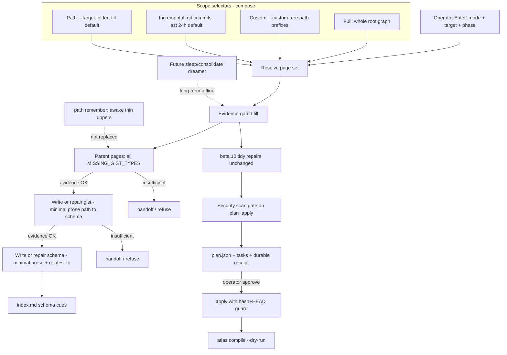

# atlas-optimise vNext (design packet)

**work_id:** `2026-10-06-atlas-optimise-vnext`  
**change-class:** `new-surface` (mini-genesis depth)  
**Subject skill:** atlas  
**Subject atlas:** `github.com/sergio-sisternes-epam/atlas-atlas`  
**Baseline pin (read-only):** atlas package `0.13.0-beta.10` path `atlas-optimise` + helper `scripts/atlas_optimise.py`  
**Disposition:** **STOP FOR IMPLEMENT** — design approved and pins locked; package implement waits for a separate explicit unlock after the folded tip is reviewed. Do not implement on this commit.

## Intent

Close the critical product gap left by beta.10 tidy optimise: many stores report **`missing_gist` still uncleared** because the helper refuses to invent gist bodies and only copies existing text (cue repair, uncovered-gist relate, stale-gist-description copy-up). vNext makes optimise the **near-term, operator-run content-fill wave** that writes **upper layers (gist → schema → index cue)** when and only when **evidence gates** pass — never free invention.

Operator-facing terms: **fill** (evidence-gated create/enrich of upper pages) and **tidy** (beta.10 repairs: dead cues, relate wiring, stale description copy-up). Drop cascade-fill / plumbing as primary terms.

Optimise remains operator-chosen (not install, not compile). It is **interim fill toward the future sleep/consolidate dreamer**. Standing sleep model stays: **remember = awake, thin upper layers**; **offline dreamer = evidence-gated fill**; sleep is **not** implemented in this cut.

## Scope

In (product design for a later implement on the atlas package, after separate implement unlock):

1. **Full mode** — whole-store (or whole-graph under root) fill so **memory → gist → schema → index** holds for eligible parents in scope.
2. **Custom mode** — same fill scoped to operator `--custom-tree` path prefixes (locked pin C1).
3. **Incremental mode** — default **last 24h** (override with `--since-hours` or an explicit date/window): only pages whose paths were touched by **git commit history** in that window (plus required fill neighbours). Committer clock; dirty/uncommitted parents excluded from fill (locked pins I1–I2, I6).
4. **Path-specific mode** — one folder/path target (extends today’s required `--target`). **Fill by default**; tidy-only via `--tidy-only` (locked pin P7).
5. **Pilot → quality eval → fleet** rollout: safety-first pilot, then heavy Path/Incremental pilot before any fleet Full; serial Full only (no concurrent Full across stores).
6. New **evidence-gated task kinds** that can **create or fill** gist/schema pages from lower-layer evidence, with explicit **refuse / handoff** when evidence is insufficient. Day one: create gists for **all** compile `MISSING_GIST_TYPES` (not memory-only). Schema day one = **minimal prose** (not title-only, not rich body).
7. Keep beta.10 **plan → apply**, stale-plan hash+HEAD guard, task classes (`auto` / `opt-in` / `confirm` / `handoff` / `report` / `blocked`), standalone helper (no `atlas.py` optimise command), and existing **tidy** repairs.
8. **Security scan gate** on plan+apply (no promotion of secrets/PII; sensitivity-aware; adversarial smokes). **Operator cost ceiling**. **Durable pilot receipt schema** (including fetch OK + tip recorded). Residual `missing_gist` ≠ fail when evidence is insufficient.

Out:

- Implementing sleep/consolidate / scheduled dreamer.
- Free abstractive invention of gist or schema prose without cited evidence from lower pages.
- Editing memory (or other parent) claim text to make an upper page fit.
- Hooking optimise into install, compile, init, or memory-migrate.
- New compile hard-fails beyond the locked four-layer model already shipped.
- Fleet-wide auto-apply without pilot gates.
- Parallel / concurrent Full across stores.
- Private remotes, private hostnames, or ops-only URLs in product docs.
- Package product-code implement on this design commit.

## Non-goals

- Replacing path `remember` as the awake writer of new episodic claims.
- Making optimise the long-term dreamer (that remains future sleep/consolidate).
- Retyping every legacy `document` into `memory` (memory-migrate / remember ownership).
- Cross-store link repair or push.
- Inventing answers past the locked pins below.

## Change-class

`new-surface`: new operator modes, new evidence-gated **fill** behaviour, new evidence rules and task kinds on an existing path+helper. Not `new-skill`. Depth = mini-genesis.

## Locked model (do not reopen)

Recall walks **index → schema → gist → memory** and stops when a level answers. `index.md` is a cue list, not content. One gist forces one schema; a second schema is legal when the subject changes. A folder with zero gists needs no schema. `hub.md` is not a memory layer. Suffixes are search handles; frontmatter `type` is authoritative. Compile fails on gist-with-no-schema, schema-missing-from-index, or stale upper page (substring rule). Optimise adds **no** new compile check in this design.

Standing human-memory guidance (fold, do not contradict):

- Complementary learning systems: awake `remember` is the fast store; promoting into schema/gist structure is slow and must not smash siblings.
- Consolidation **transforms**; it does not license unconstrained rewrite of episodic parents.
- Reconsolidation is gated; optimise must not silently edit parent claim text.
- Dream/offline pass coarsens and indexes; originals stay addressable.

## Baseline (beta.10) — build on, do not regress

From pin `references/paths/atlas-optimise.md` and `scripts/atlas_optimise.py`:

- Enter requires **target**; plan then apply; out-dir outside store.
- Auto tasks today (tidy): dead-index-cue, schema-index-cue, uncovered-gist (relate only), dead-schema-member, stale-gist-description (copy memory description up).
- **Do not invent gist text** — descriptions must be exact substrings of derived memory body/description; otherwise handoff.
- Residual from prior dry-runs: tidy can clear stale cues and compile-critical stale_upper_page while **`missing_gist` findings remain outside optimise**. That is the gap vNext closes under evidence gates.

Backward compatibility: vNext **keeps** `--target`, `plan`/`apply`, existing task kinds and classes. Modes **compose on top** (see Composition). Operator-facing rename: beta.10 repairs = **tidy**; new gated writes = **fill**.

---

## Hand deputy design approval

**Status:** design **APPROVED** under Hand criteria once the locked pins below are folded into this tip.  

**Implement remains blocked** until a separate Hand/Sergio unlock after they review the folded tip. This Autogenesis design commit / PR is **design-only** — it does **not** approve atlas package product-code implement.

Approval criteria that pass (this packet):

1. Closes the beta.10 `missing_gist` gap with evidence gates — no free invention.
2. Sergio’s eight cuts locked (C1, I1–I2, M3, P4–P5, I6, P7, S8 below).
3. Design challenges accepted in product language: security scan gate on plan+apply; operator cost ceiling; durable pilot receipt schema; residual `missing_gist` ≠ fail when evidence insufficient; safety-first pilot then heavy Path/Incremental before fleet; Gate 9 / done-when matches day-one scope; fetch OK + tip recorded on receipt; no parallel Full (serial Full only).
4. Sleep remains future; remember stays awake; plan → apply + stale-plan guard kept.
5. Terms **fill** / **tidy** replace cascade-fill / plumbing in operator-facing text.
6. Package implement / package PR is **not** approved by this cut — design commit only.

---

## Genesis Artifacts

### Modes + fill (one mermaid)



### Interface sketch (CLI + path Enter card)

**Path Enter card fields (additive; beta.10 fields remain):**

```text
skill: atlas
skill_path: <atlas skill root>
mode: run
subject: atlas | <project>
path: atlas-optimise
path_module: references/paths/atlas-optimise.md
intent: <one line>
root: <atlas store root>
target: <folder inside root> | .     # still required; Path mode = this alone
optimise_mode: full | custom | incremental | path   # NEW; default path for back-compat
since_hours: <positive int>          # NEW; Incremental default 24; override with explicit hours or date/window
custom_tree: <path>|…                # NEW; required when optimise_mode=custom (path prefixes)
tidy_only: true | false              # NEW; Path/default fill off — tidy repairs only
auto_verbatim: true | false          # NEW; opt-in: verbatim description-copy may become auto; confirm remains default
phase: plan | apply
pilot: true | false                  # NEW; when true, enforce pilot receipt + quality gates before any fleet claim
cost_ceiling: <operator budget token>|…  # NEW; operator cost ceiling (exact unit at implement)
```

**Helper CLI sketch (additive flags; existing flags kept):**

```bash
python3 <atlas-skill>/scripts/atlas_optimise.py plan \
  --root <root> --target <folder|.> --out-dir <dir outside store> \
  [--optimise-mode full|custom|incremental|path] \
  [--since-hours <N>]                # Incremental default 24 when omitted in that mode \
  [--custom-tree <path>]... \
  [--tidy-only]                      # Path: tidy repairs only; no fill kinds \
  [--auto-verbatim]                  # opt-in: verbatim description-copy as auto \
  [--subject-folder <folder>:<stem>]...

python3 <atlas-skill>/scripts/atlas_optimise.py apply \
  --root <root> --target <folder|.> --plan <out-dir>/plan.json \
  [--include-opt-in] [--confirm <task-id>]...
```

Notes:

- Missing `target` still means Enter incomplete (beta.10).
- `optimise_mode=path` (default): **fill by default** inside `--target`; `--tidy-only` restricts to tidy repairs (locked P7).
- `full` implies walking the whole root but still requires `target` `.` (or explicit root) so cost is never accidental. **Serial Full only** — no concurrent Full across stores.
- `incremental` defaults `since_hours=24`; always plans from **git commit history** (committer clock); dirty/uncommitted parents **excluded from fill**.
- `custom` refuses without at least one `--custom-tree` path prefix.

### New / extended task kinds (design intent)

| kind | detection | class (proposed) | apply / agent action |
|---|---|---|---|
| `missing-gist-fill` | eligible parent in scope (all compile `MISSING_GIST_TYPES`) has no valid `derived_from` gist | `confirm` by default; `auto` only when evidence pack is fully extractive **and** `--auto-verbatim` opted in | create gist page from **evidence pack**; set `derived_from`; never invent; schema day-one = minimal prose |
| `gist-body-enrich` | gist exists but description/body fails evidence or substring rule and parent has usable evidence | `confirm` / handoff | write gist text only from evidence pack; re-assert substring rule |
| `schema-fill` | folder has ≥1 gist and zero schema (or uncovered subject needing new schema) | `confirm` when creating schema prose; `auto` only for cue/relate when schema already exists | create/update schema with **minimal prose** + gist member list; cue from index |
| *(existing tidy kinds)* | unchanged | unchanged | unchanged |

Evidence pack (per parent → gist candidate) recorded on the task `evidence` object: listed source paths, quoted spans or frontmatter fields, hash of each source at plan time, and a machine-checkable **sufficiency** flag.

### Cost note

Off the hot path. Cost scales with **scope × fill depth**. **Operator cost ceiling** is required on Enter / CLI (exact unit at implement); plan must refuse or warn when projected work exceeds the ceiling.

- **Path**: single-pass read of the named folder (cheap–medium); fill by default unless `--tidy-only`.
- **Incremental**: git history walk for the window (default 24h) plus fill neighbours (usually cheaper than Full; cost rises with churn).
- **Custom**: bounded by named `--custom-tree` prefixes.
- **Full**: whole-store read plus potential agent passes for confirm-class fills — **expensive**; say so in path text. Serial only. Model tokens appear only for confirm/handoff synthesis **when evidence is sufficient for extractive draft but operator still wants review** — never for blank invention.
- Install / compile / remember hot path pay nothing.
- Pilot before fleet caps blast radius.

### Acceptance criteria

1. **Gap closed under gates:** On a fixture store with eligible parents lacking gists, `plan` lists `missing-gist-fill` (or explicit refuse/handoff with reason). After approved `apply`, those parents that had **sufficient evidence** no longer report `missing_gist`; parents with insufficient evidence are unchanged and residual handoff/refuse is reported. **Residual `missing_gist` ≠ fail** when evidence is insufficient (expected).
2. **Never invent:** Adversarial fixture with empty/too-thin parent body yields **refuse or handoff**, zero new gist/schema body bytes from the model. No task writes prose that is not grounded in the evidence pack.
3. **Substring / stale_upper_page:** Every written gist description remains an exact substring of its derived parent body or description after apply (compile dry-run clean for that finding on touched pages).
4. **Modes compose:** Documented matrix (below) holds in tests: Path ⊂ Full; Incremental filters by git commit window (default 24h, committer clock); Custom intersects `--custom-tree` prefixes; combining flags is fail-closed when contradictory.
5. **Backward compatible:** beta.10 Enter with only `target` + `phase` still plans tidy repairs; helper without new flags behaves as `optimise_mode=path` with **fill by default**; `atlas.py` still has no optimise command; install/compile/init/memory-migrate do not call optimise.
6. **Pilot gate:** Product docs and path text require durable pilot receipt + quality eval before any “fleet” wording; a dry-run that skips pilot cannot claim fleet readiness. Receipt records fetch OK + tip SHA.
7. **Sleep boundary:** Path text states optimise is interim content-fill; sleep/consolidate remains the future offline dreamer; remember stays awake thin-upper writer.
8. **No private surface leak:** Path/help/CHANGELOG examples use public placeholder roots only (no private hostnames, no private remotes).
9. **Gate 9 / done-when:** Day-one scope matches locked pins (all `MISSING_GIST_TYPES`; schema minimal prose; fill default on Path; Incremental 24h committer; security scan gate; cost ceiling; durable receipt). Tests: new adversarial scenario file (bump, keep prior); helper unit tests per mode filter + evidence refuse; `run_tests` / release readiness green on implement PR.
10. **Stop-for-implement satisfied:** This design writes no atlas package product files; implement waits for separate explicit unlock after the folded tip is reviewed.

### Stop-for-implement

This operation **stops for implement**. Design is approved and pins are locked. Request **package implement** only after a separate Hand/Sergio unlock that cites this folded tip. Design completion + design approval ≠ implement authority.

---

## How Full / Custom / Incremental / Path compose

| Mode | Scope resolution | Fill | Notes |
|---|---|---|---|
| **Path** | Pages under `--target` (`.` = root) | **Fill by default**; `--tidy-only` = tidy repairs only | Default mode; beta.10 compatible for tidy |
| **Full** | All eligible parents under root (requires `target=.`) | Whole-graph memory→gist→schema→index | Expensive; serial only; operator must name root |
| **Custom** | Intersection with operator `--custom-tree` **path prefixes** | Same fill inside trees | Locked C1 |
| **Incremental** | Paths touched by **git commit history** in window (default last **24h**, override via `--since-hours` / date window), expanded to fill neighbours; **committer** clock; dirty/uncommitted **excluded from fill** | Same fill on that set | Locked I1, I2, I6 |

Composition rules (locked):

1. Exactly one primary `optimise_mode` per Enter (not a free product of flags).
2. `--target` always required; Full requires `target=.`.
3. Incremental may be combined with a Path target as a **filter** (touches ∩ target).
4. Custom + Incremental = touches ∩ custom-tree prefixes; otherwise fail closed.
5. Tidy repairs always run for the resolved scope unless a future pin says otherwise; `--tidy-only` suppresses fill kinds.
6. No concurrent Full across stores.

---

## Evidence rules for writing gist / schema text

**Eligible parents (day one):** all compile `MISSING_GIST_TYPES` (`experience`, `decision`, `lesson`, `recipe`, `document`, `memory`, `page`, and any other type compile lists for missing_gist) — **not** memory-only (locked M3).

**What counts as evidence (sufficient):**

1. **Parent frontmatter `description`** — non-empty plain one-line string.
2. **Parent body spans** — contiguous plain-text sentences or bullets that state claims; recorded as quoted excerpts with byte/line offsets in the task evidence pack.
3. **Existing same-folder gist/schema titles** — only for **cue labels** and relate wiring, not for inventing new claim sentences.
4. **Prior upper page text being repaired** — may be kept when it already satisfies the substring rule against the current parent.

**Sufficient for auto (strict, opt-in only):** evidence pack contains at least one plain parent `description`, or a single extractive excerpt explicitly selected by a deterministic rule (e.g. first non-empty paragraph under a required section), and the written gist description is **verbatim** that string (or a documented extractive subset). No paraphrase. Verbatim description-copy may become `auto` **only via `--auto-verbatim`**; **confirm remains default** (locked P5).

**Sufficient for confirm (agent-assisted, still gated):** evidence pack lists ≥1 quoted parent spans totaling enough claim text for a short gist; agent may **arrange and lightly compress** only using words present in the pack; every sentence of the draft must be traceable to a pack span; apply re-checks substring / pack membership and refuses on failure.

**Insufficient → refuse / handoff (never invent):**

- Empty or whitespace-only parent description and body.
- Body is only links, headings, or boilerplate with no claim sentences.
- Parent type not in compile `MISSING_GIST_TYPES`.
- Multiple conflicting claim clusters with no operator-chosen subject schema split.
- Evidence pack hashes stale vs files at apply time (stale plan).

**Schema text (day one = minimal prose — locked S8):**

- Creating a new schema page requires at least one in-folder gist with a non-empty title or description usable as a member label.
- Schema body = **minimal prose** (short evidence-gated blurb) + `relates_to` member list — **not** title-only, **not** rich body. Confirm-class; must cite gist titles/descriptions already on disk; otherwise handoff to remember.
- Index cue lines use the schema’s own title (beta.10 behaviour).

**Hard bans:**

- No blank “TODO gist”.
- No model call whose prompt allows “write a gist for this page” without injecting the evidence pack and a refuse instruction.
- No edit of parent memory/document/experience claim text inside optimise.
- No writing `CONTRACT.json` / `SCHEMA.json`.
- No promotion of secrets/PII into upper layers (security scan gate).

---

## Pilot + quality eval gates before fleet

**Pilot (required before any multi-store / fleet claim) — safety-first, then heavy Path/Incremental before fleet:**

1. Operator names **one** subject atlas and runs Path or Incremental first (not Full fleet). Serial Full only later.
2. Capture **durable pilot receipt**: plan counts by kind/class, apply applied ids, compile dry-run before/after, residual `missing_gist` / `stale_upper_page` / handoff counts, **fetch OK + tip SHA**, security-scan summary, cost vs ceiling.
3. **Quality eval gates (locked P4):**
   - **Fidelity:** 100% of auto-written gist descriptions are exact substrings of parents (verbatim); zero parent edits.
   - **Harm:** no critical regress on untouched paths; zero unexpected parent file diffs; zero contract writes.
   - **Coverage:** `missing_gist` drop only via evidence-passing applies (never invention). Residual missing_gist with insufficient evidence is **expected**, not a fail.
   - **Spot-check:** operator samples **N=10** filled gists for faithfulness.
   - **Security scan:** zero new Crit/High secret-class findings on touched paths.
   - **Disagreement rate:** confirm-class disagreement rate is **informational** (not an automatic fail gate).
4. Pass safety-first pilot → heavy Path/Incremental pilot on broader churn → only then allow Full on additional stores (serial).
5. Fail pilot → patch evidence rules / mode defaults; no fleet language in release notes.

---

## Security scan gate + operator cost ceiling + durable receipt

- **Security scan gate:** run on plan and on apply over touched paths. Block promotion of secrets/PII; sensitivity-aware; cover with adversarial smokes. Fail closed on new Crit/High secret-class findings on touched paths.
- **Operator cost ceiling:** Enter/CLI carries a ceiling; plan refuses or warns when projected scope exceeds it; receipt records actual vs ceiling.
- **Durable pilot receipt schema:** machine-readable receipt next to plan/apply artifacts: counts, residual findings, fetch OK, tip SHA, security-scan summary, cost, gate pass/fail flags. Residual missing_gist with insufficient evidence does not mark the run failed.

---

## Relationship to future sleep / consolidate

| Phase | Role |
|---|---|
| **remember (awake)** | Writes episodic / thin upper layers when the agent has live task context. Not replaced. |
| **atlas-optimise (this design)** | Operator-chosen **interim** evidence-gated fill + tidy. Operator-run wave toward dreamer behaviour. |
| **sleep / consolidate (future)** | Offline dreamer: scheduled or explicit consolidation, uncluttering, coarsening under stronger gates. **Not in this cut.** |

Optimise must not claim to be sleep. Path description may keep “like a dream phase” only as analogy, with an explicit sentence that sleep remains unimplemented.

Fold prior lessons: consolidation transforms; CLS forbids fast cortical overwrite; reconsolidation is gated — hence confirm-class defaults for new gist bodies.

---

## Backward compatibility with beta.10

- Keep required `--target`, `plan`/`apply`, out-dir outside store, hash+HEAD stale guard, task list shape, standalone script.
- Keep all existing tidy task kinds and “Do not invent gist text” as the floor; vNext **raises** the ceiling only behind evidence gates and new fill kinds.
- Default `optimise_mode=path` with **fill by default**; `--tidy-only` recovers tidy-only behaviour.
- Package bump for implement is after separate unlock (version number not pinned here).
- Prior adversarial scenario `atlas-optimise-target-layers-adversarial-v1.yaml` stays; add `…-vnext-adversarial-v1.yaml` at implement.

---

## SOLID record (full five-row)

| Principle | Status | Rationale / design consequence |
|---|---|---|
| S | applicable | Path owns one operator job: optimise a named scope. Helper owns deterministic facts, hashes, extractive copies, wiring, security-scan hook, and receipt. Claimful synthesis stays confirm/handoff to remember. Sleep stays a future separate surface. |
| O | applicable | Four-layer contract and compile gates stay closed. Extension is new modes + evidence-gated fill kinds on the existing path/helper; no new compile hard-fail in this design. |
| L | not-applicable | Optimise does not claim to substitute remember, memory-migrate, compile, or future sleep. Callers must not treat apply as a dreamer API. |
| I | applicable | Enter progressive disclosure: Path-only card remains valid; Full/Custom/Incremental fields appear when those modes are chosen. Task classes still advertise authority. Pilot flag segregates fleet claims. `--tidy-only` and `--auto-verbatim` are explicit opt-ins. |
| D | trade-off | Helper continues to import concrete package reader/link helpers (same trade-off as 2026-10-05). Git for Incremental is an essential capability of a git-backed store — accept `git` committer history as the window source; do not add a second history abstraction without pressure. |

---

## Catalogue Review

- **Genesis matches:** uses A11 RECONCILIATION LOOP (task table + re-plan), A9 SUPERVISED EXECUTION (plan → approve → apply → compile verify), S7 DETERMINISTIC TOOL BRIDGE (hashes, git window, extractive copy, substring asserts, security scan). Refines prior optimise plans; no conflict with locked four-layer model.
- **Autogenesis extension:** B17 ACTIVATION CARD — extend Enter fields for modes. `autogenesis:S8` not-selected (no new module split; still INLINE path + LOCAL SIBLING script).
- **Composition:** INLINE path module, LOCAL SIBLING helper script.
- **Inherited anti-patterns avoided:** TOOLLESS ASSERTION (evidence pack + substring checks in helper); unbounded reconciliation (one plan/apply per operator turn); soft-only evaluation (deterministic smokes primary).
- **Delta:** modes, evidence-gated fill kinds, fill/tidy terms, pilot gates + durable receipt, security scan gate, cost ceiling, sleep-boundary prose, adversarial vNext scenario.
- `pattern_applicability: applicable` (A11, A9, S7, B17). `pattern_admission: not-selected` (S8).

---

## Challenge (think-challenge, grounded)

1. **Abstractive gist text hallucinates.** Maynez et al., ACL 2020 (https://aclanthology.org/2020.acl-main.173/): human raters found hallucinated content in a large share of abstractive single-sentence summaries. Severity **high**. → Pin E1.
2. **False memories from gist-based consolidation.** Fuzzy-trace / DRM tradition: gist extraction raises false-memory risk when detail is dropped (classic Deese–Roediger–McDermott paradigm literature). Severity **high** for auto-fill. → Pin E1, E2 (confirm default), P5.
3. **CLS: fast cortical writes overwrite.** O’Reilly / McClelland CLS: neocortex must integrate slowly with interleaving (https://onlinelibrary.wiley.com/doi/10.1111/j.1551-6709.2011.01214.x). Full-mode auto across a fleet is a fast overwrite risk. Severity **high**. → Pin P1 (pilot-before-fleet), E3 (no parent rewrite), no parallel Full.
4. **Stale plan before apply.** Same class as Terraform “saved plan is stale”. Severity **high**. → Keep beta.10 hash+HEAD; extend hashes to evidence-pack sources (Pin B1).
5. **Incremental git window misses uncommitted or wrong-zone clocks.** Git author dates vs committer dates; dirty worktree; squash merges. Severity **medium**. → Locked I6: committer clock; dirty/uncommitted excluded from fill.
6. **Internal (observed):** beta.10 dry-runs cleared tidy while **`missing_gist` remained outside optimise**. Closing that gap without gates recreates invention. Severity **high**. → This plan’s core gap statement + Pin E1.
7. **Secret / PII promotion into upper layers.** Severity **high**. → Security scan gate on plan+apply; adversarial smokes.
8. **Unbounded operator cost on Full.** Severity **medium–high**. → Operator cost ceiling; serial Full only.

## Locked pins

### Sergio cuts (2026-10-06)

| ID | Pin |
|---|---|
| C1 | **Custom** = operator `--custom-tree` **path prefixes**. |
| I1 | **Incremental** default window = **last 24h**; custom date/window override via `--since-hours` (or equivalent). |
| I2 | Incremental always plans from **git commit history** (not working-tree churn alone). |
| M3 | Day one: create gists for **all** compile `MISSING_GIST_TYPES` (not memory-only). |
| P4 | Pilot gates: 100% auto = verbatim substring; zero parent edits; no critical regress on untouched paths; `missing_gist` drop only via evidence-passing applies; spot-check **N=10**; security scan zero new Crit/High secret-class on touched paths; confirm disagreement rate **informational**. |
| P5 | Verbatim description-copy may become `auto` **only via opt-in flag** (`--auto-verbatim`); **confirm remains default**. |
| I6 | Incremental clock = **committer**; dirty/uncommitted parents **excluded from fill**. |
| P7 | Path **fill by default**; tidy-only optional (`--tidy-only`). Operator terms: **fill** / **tidy** (beta.10 repairs = tidy). |
| S8 | Schema day one = **minimal prose** (not title-only, not rich body). |

### Design / product pins (general)

| ID | Pin |
|---|---|
| E1 | Upper-layer prose is **evidence-gated**. Auto may only **verbatim-copy** parent description (or documented extractive subset) when `--auto-verbatim` is set. Paraphrase/compression is **confirm** and must pass pack-membership checks. Insufficient evidence → refuse/handoff; never invent. |
| E2 | New gist **creation** defaults to **confirm** (or handoff), not silent auto. |
| E3 | Optimise **never edits** parent claim text (memory/document/experience/…). |
| E4 | Substring / stale_upper_page rule remains the floor for every written gist description. |
| B1 | Stale-plan guard extends to every evidence-pack source path; apply exit 2 writes nothing. |
| B2 | Helper stays standalone; no optimise command on `atlas.py`; install/compile/init/memory-migrate do not call it. |
| M1 | Modes are explicit Enter fields; default `optimise_mode=path` for beta.10 compatibility. |
| M2 | Full requires `target=.` so whole-store cost is never accidental. |
| M4 | **No parallel Full** — serial Full only; no concurrent Full across stores. |
| P1 | Safety-first pilot → heavy Path/Incremental pilot → only then fleet language or multi-store Full. |
| P2 | **Durable pilot receipt schema** including fetch OK + tip SHA, counts, residuals, security-scan summary, cost vs ceiling, gate flags. |
| P3 | Residual `missing_gist` with insufficient evidence is **expected**, not a run failure. |
| Sec1 | **Security scan gate** on plan+apply: no promotion of secrets/PII; sensitivity-aware; adversarial smokes; zero new Crit/High secret-class on touched paths to pass pilot. |
| Cost1 | **Operator cost ceiling** required; plan refuses or warns when projected work exceeds it. |
| S1 | Sleep/consolidate remains unimplemented; optimise is interim content-fill toward the dreamer; remember stays awake. |
| C1pin | Tidy task kinds from beta.10 remain; no early stop on “already share a parent”. |
| G9 | Gate 9 / done-when matches day-one locked scope (all `MISSING_GIST_TYPES`, minimal-prose schema, fill default, Incremental 24h committer, security scan, cost ceiling, durable receipt). |

**C1–C5:** C1 counters 1–8 non-trivial. C2 high-severity items pinned. C3 pins tables visible. C4 scope = modes + evidence fill + pilot + security/cost/receipt; no package implement. C5 no product package edits in this operation. Change-class stated. Genesis Artifacts complete for new-surface. X0 removed — former blockers are locked pin IDs above.

---

## Behavioural contract (agent-spec)

`deferred: agent-spec was not invoked in this design session; deterministic helper tests and adversarial smokes will cover each forbidden behaviour (invention, parent edit, install/compile hook, stale apply, mode refuse, secret promotion, parallel Full).`

`@forbidden` families to protect at implement (via scenarios, not hand-authored `.feature` here): invent gist; apply without evidence; run from compile/install; skip pilot claim; edit parent memory; promote secrets/PII; concurrent Full.

## Evaluation plan

**Deterministic smokes (primary):**

- Fixture: parent with plain description, no gist → plan lists fill task; apply with confirm → gist description == parent description; `missing_gist` cleared for that path.
- Fixture: empty parent → refuse/handoff; store byte-identical for that path; residual missing_gist does not fail the run.
- Fixture: paraphrase attempt that introduces words outside pack → apply refuses.
- Mode filters: Incremental with controlled git commits (committer clock, default 24h) only lists touched fill set; dirty paths excluded from fill; Custom only listed `--custom-tree` prefixes; Full with `target!=.` exits 2.
- Path fill default: without `--tidy-only`, fill kinds appear under `--target`; with `--tidy-only`, only tidy kinds.
- Opt-in auto: without `--auto-verbatim`, verbatim copy stays confirm; with flag, auto allowed for verbatim-only.
- Security scan smoke: planted secret-class string in touched path → plan/apply blocked or gated; zero promotion into new gist/schema.
- Regression: beta.10 tidy fixtures still pass; `atlas.py --help` has no optimise; no import from install/compile/memory-migrate.
- Stale evidence hash → apply exit 2, nothing written.
- Receipt: durable schema includes fetch OK + tip, residuals, security summary, cost vs ceiling.

**Agent evaluations (secondary):** optional trajectory check that the agent shows the task list before apply and does not claim fleet readiness without pilot receipt — never sole evidence.

## Adversarial scenario draft (portable)

```yaml
id: atlas-optimise-vnext-adversarial-v1
packages: [atlas]
work_id: 2026-10-06-atlas-optimise-vnext
adversarial: true
smokes:
  - id: no-invent-empty-parent
    source: "Maynez et al. 2020 faithfulness; DRM/gist false memory"
    expect: "empty/thin parent yields refuse or handoff; no new gist/schema body bytes"
  - id: verbatim-auto-only-opt-in
    source: "Pin E1 / P5"
    expect: "auto fill copies parent description verbatim only with --auto-verbatim; confirm remains default; paraphrase is confirm and pack-checked"
  - id: no-parent-rewrite
    source: "reconsolidation gated; Pin E3"
    expect: "parent page bytes unchanged by optimise apply"
  - id: stale-evidence-refuse
    source: "Terraform stale plan analogy; Pin B1"
    expect: "changed evidence source after plan => apply exit 2, nothing written"
  - id: mode-full-requires-root-target
    source: "Pin M2"
    expect: "optimise_mode=full with target not . refuses"
  - id: incremental-committer-24h
    source: "Pin I1 / I2 / I6"
    expect: "default last 24h committer commits; dirty/uncommitted parents excluded from fill; only git-touched fill neighbours appear"
  - id: path-fill-default-tidy-only
    source: "Pin P7"
    expect: "path mode plans fill kinds by default; --tidy-only suppresses fill kinds"
  - id: all-missing-gist-types
    source: "Pin M3"
    expect: "fill candidates include all compile MISSING_GIST_TYPES, not memory-only"
  - id: schema-minimal-prose
    source: "Pin S8"
    expect: "day-one schema-fill writes minimal prose + relates_to, not title-only and not rich body"
  - id: security-scan-gate
    source: "Pin Sec1"
    expect: "planted Crit/High secret-class on touched path blocks promotion; plan+apply gated"
  - id: residual-missing-gist-not-fail
    source: "Pin P3"
    expect: "insufficient-evidence residual missing_gist does not mark run failed"
  - id: no-install-compile-hook
    source: "baseline non-goal; Pin B2"
    expect: "install/compile/init/memory-migrate sources do not call atlas_optimise"
  - id: pilot-before-fleet-language
    source: "Pin P1 / CLS overwrite risk"
    expect: "path/help text requires pilot+eval before fleet claims; receipt requires fetch OK + tip"
  - id: sleep-boundary-stated
    source: "Pin S1"
    expect: "path states optimise is interim; sleep/consolidate not implemented"
  - id: tidy-regression
    source: "2026-10-05 baseline"
    expect: "dead-index-cue and stale-gist-description still plan/apply as before"
```

Filename at implement: `references/scenarios/atlas-optimise-vnext-adversarial-v1.yaml` (keep prior optimise scenarios).

---

## Git lineage (this store)

- Plan: `autogenesis/plans/2026-10-06-atlas-optimise-vnext.md` (this file)
- Work: `autogenesis/work/2026-10-06-atlas-optimise-vnext.md`
- Design experience: `autogenesis/experiences/2026-10-06-atlas-optimise-vnext-design.md`
- Plans index: `autogenesis/plans/index.md`

**Git:** design-only commit on branch `autogenesis/2026-10-06-atlas-optimise-vnext` — pins locked; implement still blocked pending separate unlock.
